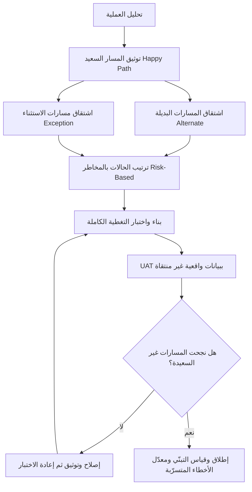

# المسار السعيد (Happy Path)

> [!info] تعريف مختصر
> المسار السعيد (Happy Path) هو السيناريو المثالي الذي تسير فيه العملية من بدايتها إلى نهايتها دون أي خطأ أو حالة استثنائية: المستخدم يدخل بيانات صحيحة، والنظام متاح، والتكاملات تستجيب، والنتيجة تُنجَز من المحاولة الأولى. هو مسار مشروع ونافع بوصفه **أول ما يُبنى ويُختبَر**، لكنه يتحوّل إلى خطر حقيقي حين يصبح **آخر** ما يُختبَر أيضًا — أي حين يُقدَّم بوصفه دليلًا على جاهزية النظام.

## الشرح العلمي والاحترافي

- **الأصل المفاهيمي**: في هندسة البرمجيات، أي عملية (Use Case) تتفرّع إلى ثلاثة أنواع من المسارات: المسار الأساسي أو السعيد (Happy / Primary Path)، والمسارات البديلة (Alternate Paths) وهي طرق مشروعة أخرى للوصول إلى النتيجة نفسها، ومسارات الاستثناء (Exception Paths) وهي ما يحدث حين يفشل شيء ما. المسار السعيد يمثّل في المتوسط ٢٠–٣٠٪ فقط من إجمالي تعقيد النظام الحقيقي، بينما تستهلك المسارات الأخرى الجزء الأكبر من الجهد الهندسي.
- **لماذا نبدأه أولًا**: بناء المسار السعيد أولًا ممارسة سليمة — فهو يُثبت أن السلسلة التقنية بكاملها متصلة (Walking Skeleton)، ويعطي الفريق شيئًا ملموسًا يعرضه مبكرًا، ويوضّح المتطلبات بشكل عملي. الخطأ ليس في البدء به، بل في **التوقف عنده**.
- **الخطر الحقيقي — تحوّله إلى معيار قبول**: حين يُصمَّم العرض التوضيحي (Demo) والاختبار وقبول المستخدم ([[UAT]]) كلها حول المسار السعيد نفسه، ينشأ وهم جاهزية. النظام يعمل تمامًا في الظروف التي أعددناها له، ويفشل في الظروف التي لم نعدّها — وهي بالضبط ما ستواجهه العمليات اليومية.
- **الحالات الحدّية ([[Edge Cases]])** هي ما يقع خارج المسار السعيد: موظف انضم في منتصف الشهر، عقد انتهى ولم يُجدَّد، مبلغ سالب، اسم بحروف غير عربية، خصم يتجاوز الراتب الأساسي، انقطاع في خدمة البنك أثناء الإرسال. هذه ليست حالات نادرة بالمعنى الإحصائي؛ في الأنظمة المؤسسية تشكّل غالبًا ١٠–٢٥٪ من المعاملات الفعلية.
- **الفخّ الإداري لا التقني**: المشكلة الأخطر ليست أن المطوّر بنى المسار السعيد فقط، بل أن **الإدارة قبلت المسار السعيد بوصفه دليل نجاح**. أول معاملة ناجحة أمام الإدارة العليا تُنتج إعلان نجاح مبكرًا، وهذا الإعلان يصبح لاحقًا سجنًا: لا أحد يستطيع التراجع عنه دون كلفة سياسية.
- **العلاقة بقياس النجاح**: أول معاملة ناجحة مؤشر تقني على أن النظام "قابل للتشغيل"، وليست مؤشرًا على نجاح المشروع. مؤشر النجاح الحقيقي هو [[Adoption]] المستدام ونسبة المعاملات المكتملة دون تدخل يدوي، ومعدّل الأخطاء المتسرّبة بعد الإطلاق ([[Escaped Defect Rate]]).
- **الأدوات المضادّة**: تغطية المسارات البديلة والاستثنائية عبر [[Acceptance Criteria]] مكتوبة بصيغة [[Given When Then]]؛ و[[Risk-Based Testing]] الذي يوجّه جهد الاختبار نحو المسارات الأعلى أثرًا واحتمالًا لا نحو الأسهل؛ و[[Regression Testing]] لضمان ألّا يكسر الإصلاح ما كان يعمل؛ و[[Smoke Testing]] بوصفه بوابة سريعة لا شهادة جودة.

## أين ومتى يُستخدم

- **في تحليل المتطلبات**: يُكتب المسار السعيد أولًا لتوثيق التدفق الأساسي، ثم تُشتقّ منه بشكل منهجي المسارات البديلة والاستثنائية بسؤال "وماذا لو؟" عند كل خطوة.
- **في التطوير التدريجي**: يُبنى المسار السعيد في أول تكرار لإثبات اتصال المكوّنات من طرف إلى طرف (End-to-End)، ثم تُضاف طبقات المعالجة والتحقق.
- **في اختبار الدخان ([[Smoke Testing]])**: بعد كل نشر، يُنفَّذ المسار السعيد للتأكد من أن البناء صالح للاختبار — وهذا استخدامه المشروع تمامًا: بوابة دخول، لا شهادة خروج.
- **في العروض التوضيحية وتدريب المستخدمين**: يُستخدم لتبسيط الشرح، شريطة أن يُتبَع بجلسات تغطي أخطاء الإدخال والحالات المعقدة التي سيواجهها المستخدم فعليًا.
- **في التخطيط للاختبار**: يُستخدم بوصفه خط أساس لحساب التغطية: كم نسبة السيناريوهات المختبَرة خارج المسار السعيد؟ إن كانت أقل من نصف الحالات، فالخطة ناقصة.
- **في تقييم جاهزية الإطلاق**: يُسأل صراحةً في بوابة القرار: هل ما رأيناه هو المسار السعيد فقط؟ وما الذي جُرِّب من الحالات الاستثنائية وبأي نتيجة؟

## مثال وسيناريو تطبيقي

> [!example] **نظام الرواتب — قصّة الفخّ الإداري**
>
> فريق مكوّن من ٧ أشخاص يسلّم نظام رواتب لمؤسسة فيها ١٢٤٠ موظفًا، بعد ١١ شهرًا من العمل وميزانية ٩٠٠ ألف ريال. في الشهر الأخير تُنفَّذ أول دورة رواتب فعلية: يُحتسب راتب شهر واحد، وتخرج مسيرة الرواتب بنجاح، ويُحوَّل المبلغ الإجمالي البالغ ٥.٨ مليون ريال إلى البنك دون رفض.
>
> في اليوم التالي يُرفع عرض تقديمي للإدارة العليا بعنوان "النظام يعمل — أول راتب صُرف بنجاح"، وتُقام جلسة احتفالية. ما لم يُذكر في العرض: أن **١٩ ميزة** من أصل ٦٤ في نطاق العمل لم تُبنَ بعد (منها التسويات بأثر رجعي، ونهاية الخدمة، والخصومات القضائية)، وأن سجل الأخطاء المفتوحة يضم **٣٧ خللًا** منها ٦ بدرجة حرجة، وأن دورة الرواتب الناجحة نُفِّذت على **بيانات مُنقّاة يدويًا** استُبعد منها ٩١ موظفًا ذوي حالات غير قياسية (منتدَبون، متعاقدون بالساعة، موظفون في إجازة بدون راتب).
>
> ما حدث بعد شهرين: في دورة الرواتب الثالثة عاد الـ ٩١ موظفًا إلى المعالجة، فأخطأ النظام في احتساب ٥٨ راتبًا، وصُرفت مبالغ زائدة قدرها ٢٤٠ ألف ريال استُرجع منها ١٥٥ ألفًا فقط بعد ٤ أشهر من المتابعة. وحين طُلب من فريق التشغيل معالجة الخلل، تبيّن أن **قرارات المعالجة اليدوية لم تُوثَّق** — إذ نُفِّذت تحت ضغط الوقت لإنجاح العرض — وأن مطوّرين اثنين من الفريق غادرا بعد إعلان النجاح. استغرقت الاستعادة ٥ أشهر إضافية وميزانية طوارئ بلغت ٣١٠ آلاف ريال، وانخفض التبنّي إذ عادت ٣ إدارات إلى حساب مستحقات موظفيها في ملفات Excel موازية استمرت لأكثر من عام.
>
> الدرس: لم يكن الخلل أن الفريق بنى المسار السعيد أولًا — بل أن **أول معاملة ناجحة قُدِّمت بوصفها نهاية المشروع**، فحُجبت الأخطاء والنواقص عن متخذ القرار، وأُغلق باب التمويل والدعم في اللحظة التي كان النظام فيها في أمسّ الحاجة إليهما.

## خطوات أو مخطّط

1. **توثيق المسار السعيد صراحةً**: كتابته خطوةً خطوة بوصفه التدفق الأساسي، لا افتراضه ضمنيًا في أذهان الفريق.
2. **اشتقاق المسارات البديلة والاستثنائية**: عند كل خطوة يُسأل "ماذا لو فشلت؟ ماذا لو كانت البيانات ناقصة؟ ماذا لو تجاوز المستخدم صلاحيته؟"، وتُسجَّل النتائج ضمن [[Acceptance Criteria]].
3. **تصنيف الحالات بالمخاطر**: ترتيب المسارات غير السعيدة حسب (احتمال الوقوع × أثر الفشل) لتوجيه جهد الاختبار عبر [[Risk-Based Testing]].
4. **بناء المسار السعيد أولًا ثم تحصينه**: تنفيذ التدفق الأساسي مبكرًا، ثم إضافة التحقق من المدخلات ومعالجة الأخطاء ورسائل الفشل الواضحة.
5. **اختبار متعدد الطبقات**: [[Smoke Testing]] بعد كل نشر، ثم اختبار الحالات الحدّية، ثم [[Regression Testing]] قبل كل إصدار.
6. **[[UAT]] بسيناريوهات واقعية غير منتقاة**: استخدام بيانات إنتاجية مقنَّعة تشمل الحالات الشاذة، ومنع تنقية العيّنة قبل الاختبار.
7. **التقرير الأمين للإدارة**: عرض ما يعمل وما لا يعمل معًا، مع قائمة الأخطاء المفتوحة والميزات المؤجّلة، وفصل واضح بين "أول معاملة ناجحة" و"جاهزية التشغيل".
8. **قياس النجاح بالتبنّي لا بالعرض**: متابعة نسبة المعاملات المكتملة دون تدخل يدوي و[[Escaped Defect Rate]] لعدة دورات تشغيل قبل إعلان النجاح.

## ⚠️ مفاهيم خاطئة شائعة

> [!warning]
> - **الظن بأن نجاح المسار السعيد يعني جاهزية النظام**: نجاح التدفق المثالي يثبت أن النظام **قابل للاختبار**، لا أنه **جاهز للتشغيل**. الفرق بينهما هو كل ما لم يُجرَّب بعد.
> - **اعتبار الحالات الحدّية "نادرة فلا تستحق"**: ما يبدو نادرًا في التصميم يكون شائعًا في التشغيل؛ ونسبة ٥٪ من المعاملات في نظام يعالج ٤٠٠٠ معاملة شهريًا تعني ٢٠٠ حالة فشل كل شهر.
> - **الخلط بين اختبار الدخان والاختبار الشامل**: [[Smoke Testing]] مصمَّم ليكشف الفشل الكارثي بسرعة، لا ليؤكد الصحة الوظيفية؛ استخدامه بوصفه دليل جودة سوء استخدام صريح للأداة.
> - **الاعتقاد بأن تنقية بيانات الاختبار تصرّف مهني**: تنقية العيّنة قبل الاختبار تحذف بالضبط الحالات التي يجب أن نتعلّم منها، وتحوّل الاختبار إلى تمثيل.
> - **الظن بأن العرض التوضيحي الناجح يغني عن [[UAT]]**: العرض يُدار بيد الفريق وبمسار محفوظ؛ قبول المستخدم يُدار بيد المستخدم وبسلوك غير متوقّع — وهذا بالضبط مصدر قيمته.

## ❌ ممارسات خاطئة في المشاريع

> [!failure]
> - **إعلان النجاح للإدارة العليا بناءً على أول معاملة ناجحة**: يخلق توقّعًا لا يمكن التراجع عنه، ويُغلق باب التمويل والدعم بينما العمل الحقيقي لم يبدأ. **الحل**: ربط إعلان النجاح ببوابة قبول معلَنة المعايير (نسبة تغطية الحالات، عدد الأخطاء الحرجة = صفر، دورتان تشغيليتان متتاليتان دون تدخل يدوي).
> - **إخفاء الأخطاء المفتوحة والميزات الناقصة في تقارير الحالة**: يفقد متخذ القرار القدرة على تخصيص الموارد في الوقت المناسب، ويتضاعف حجم المشكلة بصمت. **الحل**: لوحة حالة شفافة تعرض الأخطاء حسب الشدة والميزات المؤجّلة في كل تقرير، مع قاعدة "لا مفاجآت" متفق عليها مع الراعي.
> - **تنفيذ معالجات يدوية لإنجاح العرض دون توثيقها**: تصبح المعرفة حبيسة أشخاص قد يغادرون، فيتحوّل النظام إلى صندوق أسود لا يمكن تشغيله ولا إصلاحه. **الحل**: منع أي تدخل يدوي غير مسجَّل في سجل التغيير، وتحويل كل معالجة مؤقتة إلى بند مُعلَن في الـ Backlog قبل الإطلاق.
> - **بناء خطة الاختبار حول ما يسهل اختباره**: تُستهلك الميزانية في تأكيد ما نعرف أنه يعمل، وتبقى المسارات الخطرة بلا تغطية. **الحل**: تخصيص جهد الاختبار عبر [[Risk-Based Testing]]، بحصة لا تقل عن ٦٠٪ للمسارات غير السعيدة عالية الأثر.
> - **تفكيك الفريق فور نجاح أول دورة تشغيل**: تتزامن مغادرة الخبرة مع بداية ظهور المشاكل الحقيقية، فترتفع كلفة الإصلاح أضعافًا. **الحل**: فترة رعاية مكثّفة ([[Hypercare]]) تغطي عدة دورات تشغيل كاملة، مع تسليم معرفة موثّق شرطًا لإغلاق المشروع.
> - **إجراء [[UAT]] على عيّنة منتقاة من المستخدمين المتعاونين**: تُجمَع موافقات لا تعكس الواقع التشغيلي، ثم تنفجر الاعتراضات بعد الإطلاق. **الحل**: اختيار عيّنة تمثّل الحالات الصعبة والإدارات الأكثر تعقيدًا، وتضمين مستخدمين مقاومين للتغيير عمدًا.

## 🔗 مصطلحات ومفاهيم ذات صلة
[[Edge Cases]] | [[Risk-Based Testing]] | [[Regression Testing]] | [[UAT]] | [[Given When Then]] | [[Acceptance Criteria]] | [[Escaped Defect Rate]] | [[Smoke Testing]]
