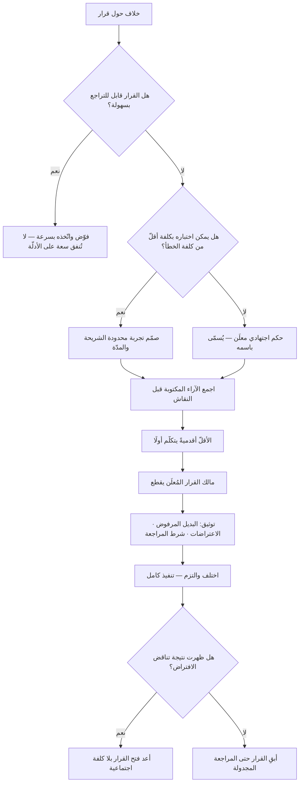

# رأي أعلى الحاضرين أجرًا (HiPPO)

> [!info] تعريف مختصر
> اختصار ساخر لعبارة **Highest Paid Person's Opinion**، يصف نمطًا في اتّخاذ القرار يُحسم فيه الخلاف بحسب **موقع صاحب الرأي في السلّم التنظيمي** لا بحسب قوّة الدليل المتاح. المصطلح لا يصف شخصًا سيّئًا بل **آلية حسم معيبة**: حين لا تكون هناك قاعدة متّفق عليها لفضّ الاختلاف، تتقدّم السلطة تلقائيًّا لملء الفراغ. ولهذا يُعالَج المصطلح مؤسّسيًّا — بتصميم آلية القرار — لا شخصيًّا بمواجهة المدير.

## الشرح العلمي والاحترافي
- **المشكلة ليست وجود سلطة بل غياب قاعدة الحسم**: كل منظّمة تحتاج مَن يقطع النقاش، وكثير من القرارات لا يتوفّر لها دليل أصلًا. المشكلة تحديدًا هي أن يُحسم بالسلطة **ما كان يمكن حسمه بالدليل بكلفة معقولة**. لذلك السؤال التشخيصي الصحيح ليس «من قرّر؟» بل «هل كان بالإمكان اختبار هذا بتكلفة أقلّ من كلفة الخطأ؟».
- **آلية الانتشار: كبت المُدخلات قبل صدور القرار**: أخطر أثر لهذا النمط لا يقع لحظة القرار بل قبلها. حين يعلم الفريق أن الرأي الأعلى سيسود، يتوقّف عن تقديم البيانات المخالفة أصلًا، فتصل إلى القائد صورة مُنقّاة تؤكّد رأيه ([[Confirmation Bias]] مُعزَّزًا تنظيميًّا). النتيجة أن القائد يتّخذ قرارًا سيّئًا بمعلومات ناقصة وهو يظنّ أن الجميع متّفق — وهذا يفسّر لماذا يتفاجأ كبار المسؤولين بالنتائج أكثر من غيرهم.
- **الأصل والسياق**: شاع المصطلح في أوساط تحليلات الويب والتجريب الرقمي في العقدين الأخيرين، ضمن حركة تدفع نحو اتّخاذ القرار المبني على البيانات والتجارب المضبوطة (A/B Testing) بدل الحدس التنفيذي. صورته المجازية مقصودة: فرس النهر (Hippo) كائن ضخم هادئ الظاهر لكنه يسحق ما في طريقه دون قصد — وهو وصف دقيق للأثر: القائد غالبًا لا ينوي إسكات أحد، لكن ثقل موقعه وحده كافٍ.
- **ليس كل رأي تنفيذي HiPPO**: للقائد ميزة معرفية حقيقية في أمور لا يراها الفريق: اتّجاه السوق، محادثات الشركاء، قيود التمويل، مخاطر تنظيمية. الفرق الفاصل هو **الشفافية في المُدخل**: إذا قال «أقرّر هذا لأنني أعلم من محادثات لم تُشارَك أن الشريك سينسحب» فهذا قرار بمعلومة إضافية؛ أما «أشعر أن هذا أفضل» في مسألة قابلة للاختبار فهو النمط المعيب.
- **درجة الرجعة تحدّد الأسلوب الصحيح**: القرارات القابلة للتراجع بسهولة يجب أن تُتّخذ بسرعة وبتفويض واسع؛ فحشد الأدلّة لها إهدار لسعة. أما القرارات صعبة الرجعة (اختيار معماري، التزام تعاقدي طويل، تخصيص [[Initiative]] لربع كامل) فهي بالضبط موضع الاستثمار في الدليل. الخلل الشائع مزدوج: تُستهلك الشهور في تحليل قرارات قابلة للتراجع، وتُحسم بالحدس قرارات لا رجعة فيها.
- **العلاج مؤسّسي لا شخصي**: مواجهة المدير بالمصطلح نفسه («هذا قرار HiPPO») تنتج دفاعية لا تغييرًا. العلاج المُجرَّب هو تغيير البنية: كتابة **مُدخلات القرار قبل النقاش** (رأي منفرد مكتوب من كل مشارك)، وتحديد **مالك القرار صراحةً** حتى لا يُملأ الفراغ بالأقدمية، وجعل القائد **يتكلّم أخيرًا** لا أولًا، وربط الخلافات القابلة للاختبار بتجربة صغيرة محدّدة المدّة.
- **تحويل الخلاف إلى رهان قابل للحسم**: أقوى ممارسة عملية هي أن يُحوَّل الخلاف من «رأيي ضد رأيك» إلى «ما التجربة التي لو أعطت نتيجة كذا لغيّرت رأيك؟». هذا السؤال يُخرج النقاش من ميدان المكانة إلى ميدان المعطيات، ويُظهر أيضًا الحالات التي لن يغيّر فيها أي دليل رأي أحد الطرفين — وهي معلومة مفيدة بحدّ ذاتها.
- **مبدأ «اختلف والتزم»**: حتى مع أفضل الآليات، بعض القرارات تُحسم بلا إجماع. الممارسة الناضجة أن يُعلن الاعتراض ويُوثَّق ثم يلتزم الجميع بالتنفيذ الكامل — لا تنفيذ فاتر يُثبت وجهة نظر المعترض لاحقًا. توثيق الاعتراض في [[Decision Log]] يحفظ التعلّم دون شلّ التنفيذ.
- **الوجه المعاكس: التحصّن بالبيانات**: النقيض المرَضي للـ HiPPO هو شلل القرار بانتظار دليل قاطع لكل شيء، أو استخدام البيانات انتقائيًّا لتبرير موقف مُتّخذ سلفًا. البيانات نفسها يمكن أن تكون أداة سلطة إذا كان من يملك الوصول إليها واحدًا.

## أين ومتى يُستخدم
- **في تشخيص أعطال [[Prioritization]]**: حين يتغيّر ترتيب الـ Backlog بعد كل اجتماع تنفيذي دون معطى جديد.
- **في تصميم حوكمة القرار**: عبر [[Decision Log]] وتحديد مالك لكل نوع قرار، وضمن [[Governance]] و[[Explicit Policies]].
- **في ثقافة التجريب**: حيث تُستبدل المناظرات بتجارب صغيرة عبر [[Hypothesis]] و[[Fake Door Test]] و[[Cost of Experimentation]].
- **في بناء [[Psychological Safety]]**: إذ إن استمرار النمط أوضح مؤشّرات غيابها، وأسرع طريق إلى صمت الخبراء داخل الفريق.
- **في علاقة الفريق بـ[[Sponsor]] و[[Steering Committee]]**: بتحديد ما يُرفع للراعي للقرار وما يُبتّ داخل الفريق، فالغموض هنا هو ما يفتح الباب أصلًا.
- **في تحوّل المنظّمة من [[Feature Factory]] إلى فرق نتائج**: لأن مصنع الميزات في جوهره آلية لتحويل آراء القيادة إلى بنود تسليم بلا تحقّق.

## مثال وسيناريو تطبيقي
> [!example] شركة تجارة إلكترونية إقليمية. في مراجعة الربع، قال الرئيس التنفيذي إن صفحة المنتج «مزدحمة» وإن إزالة قسم تقييمات العملاء من أعلى الصفحة سيرفع التحويل. لم يعترض أحد في الاجتماع رغم أن محلّل البيانات كان يملك مؤشّرًا معاكسًا. دخل البند خارطة الطريق بأولوية قصوى وأُزيح مقابله بند تحسين البحث.
> **ما حدث بلا آلية**: نُفّذ التغيير على كامل الموقع خلال 3 أسابيع. بعد شهر انخفض معدّل التحويل من 2.9% إلى 2.4%، لكن نسبة كبيرة من الفريق عزت الانخفاض إلى الموسم، ولم يجرؤ أحد على ربطه بالقرار. استغرق التراجع عن التغيير 6 أسابيع أخرى.
> **كيف عولج مؤسّسيًّا لاحقًا**: لم يُواجَه أحد، بل أُقرّت ثلاث قواعد مكتوبة في حوكمة المنتج:
> ① **تصنيف القرار قبل النقاش**: قرار قابل للتراجع خلال أسبوع = يُنفَّذ فورًا بتفويض؛ قرار يمسّ مسار الشراء = يمرّ بتجربة على شريحة قبل التعميم.
> ② **الرأي المكتوب المسبق**: قبل أي اجتماع قرار، يكتب كل مشارك في نصف صفحة توصيته وسندها ويُرسلها؛ لا يتكلّم أعلى الحاضرين منصبًا إلا بعد سماع الجميع.
> ③ **سؤال الحسم**: يُسأل صاحب كل رأي: «ما النتيجة التي لو ظهرت لغيّرت رأيك؟» — والإجابة تُحدّد تصميم التجربة.
> **الاختبار التالي**: طُرح اقتراح مشابه بعد شهرين (إخفاء أسعار الشحن حتى السلّة). بدل التنفيذ الشامل، أُجريت تجربة على 10% من الزوّار لأسبوعين بكلفة 4 أيام عمل. النتيجة كانت انخفاض إتمام الطلب بمقدار ملموس، فأُغلق النقاش في أسبوعين بدل ربع كامل — **وأهمّ ما في القصة أن صاحب الاقتراح نفسه هو من أعلن النتيجة**، فلم يكن التراجع هزيمة شخصية بل نتيجة إجراء يخضع له الجميع.
> الأثر الأبعد: انخفض عدد بنود خارطة الطريق التي تدخل بلا سند، وارتفعت جرأة المحلّلين على عرض المعطيات المخالفة، لأن الإجراء صار يحميهم بدل أن يعرّضهم.

## خطوات أو مخطّط
1. صنّف القرار أولًا: قابل للتراجع أم لا؟ وما كلفة الخطأ مقابل كلفة الاختبار؟
2. حدّد مالك القرار صراحةً بالاسم قبل بدء النقاش — الفراغ في الملكية هو ما تملؤه الأقدمية.
3. اطلب رأيًا مكتوبًا منفردًا من كل مشارك قبل الاجتماع، مع سنده.
4. رتّب الكلام بحيث يتحدّث الأقلّ أقدميةً أولًا، والأعلى منصبًا أخيرًا.
5. حوّل الخلاف إلى سؤال قابل للحسم: «ما الدليل الذي يغيّر رأيك؟».
6. إن كان الاختبار أرخص من كلفة الخطأ، فاختبر بشريحة محدودة ومدّة محدّدة بدل المناظرة.
7. إن تعذّر الاختبار، اتّخذ القرار صراحةً بوصفه حكمًا اجتهاديًّا وسمِّه كذلك — لا تُلبسه ثوب البيانات.
8. وثّق في [[Decision Log]]: القرار، مالكه، البديل المرفوض، الاعتراضات، وشرط إعادة النظر.
9. طبّق «اختلف والتزم»: ينفّذ الجميع بالكامل، ويُراجَع القرار عند موعد محدّد سلفًا.

## ⚠️ مفاهيم خاطئة شائعة
> [!warning]
> - **فهم المصطلح كإهانة للقيادة**: هو توصيف لآلية حسم لا حكم على شخص، واستخدامه كسلاح في النقاش يُنتج دفاعية ويوقف الإصلاح. التصحيح: تحدّث عن «آلية القرار» لا عن «رأي فلان»، واقترح إجراءً بديلًا لا اتّهامًا.
> - **الظنّ أن العلاج هو التصويت الجماعي**: قرارات المنتج ليست انتخابات، والتصويت يُنتج حلولًا وسطًا بلا تماسك ويُميّع المسؤولية. التصحيح: مالك واحد يقرّر بعد سماع مُدخلات مُنظَّمة؛ المشاركة في المُدخل لا في الحسم.
> - **افتراض أن كل قرار يجب أن يُبنى على بيانات**: كثير من القرارات لا تتوفّر لها بيانات، وانتظارها شلل. التصحيح: ميّز بين قرار قابل للاختبار وقرار اجتهادي، وأعلن أيّهما تتّخذ.
> - **الاعتقاد أن وجود لوحات بيانات يحلّ المشكلة**: البيانات تُقرأ انتقائيًّا لدعم الرأي القائم، والوصول غير المتكافئ إليها يجعلها أداة سلطة إضافية. التصحيح: اشترط تحديد المقياس **قبل** التنفيذ لا بعده، واجعل الوصول مشتركًا.
> - **الظنّ أن الفرق الصغيرة محصّنة منه**: كلما صغرت المنظّمة زاد وزن المؤسّس، وقد يكون النمط أشدّ لا أخفّ. التصحيح: أدخل الرأي المكتوب المسبق مبكّرًا؛ كلفته دقائق وأثره كبير.
> - **الخلط بينه وبين الحسم السريع**: الحسم السريع فضيلة حين تكون كلفة التأخير عالية والقرار قابلًا للتراجع. التصحيح: المشكلة في **مصدر الحسم** لا في سرعته.
> - **افتراض أن القائد يعرف أنه يمارسه**: غالبًا لا يعرف، لأن ما يصله من الفريق قد جرى تنقيته سلفًا. التصحيح: اجعل جمع الآراء المكتوبة إجراءً افتراضيًّا لا استثناءً، فهو يخدم القائد قبل غيره.

## ❌ ممارسات خاطئة في المشاريع
> [!failure]
> - **الخطأ: إدخال بنود إلى خارطة الطريق بعد اجتماع تنفيذي دون سند مكتوب.** لماذا يضرّ: يُزاح عمل ملتزَم به وتُهدر [[Opportunity Cost]] بلا نقاش، وتفقد الخطة معناها لدى الفريق. الحل: اشترط لكل بند جديد نموذج إدخال يتضمّن المشكلة والسند والبند الذي سيخرج مقابله.
> - **الخطأ: عرض التوصية على القائد قبل جمع آراء الفريق.** لماذا يضرّ: بمجرّد إبداء القائد ميلًا، تُصاغ كل المُدخلات اللاحقة لتوافقه ويُفقد الاختلاف قبل أن يُسمع. الحل: اجمع الآراء المنفردة مكتوبةً أولًا، ثم اعرضها كلها بما فيها المتعارض.
> - **الخطأ: عدم تسمية مالك القرار.** لماذا يضرّ: الغموض في الملكية يُملأ تلقائيًّا بالأقدمية، ثم لا يتحمّل أحد مسؤولية النتيجة. الحل: حدّد لكل نوع قرار مالكًا معلنًا ومستوى تفويض واضحًا ضمن [[Governance]].
> - **الخطأ: معاقبة من يعرض بيانات تناقض رأي الإدارة.** لماذا يضرّ: يتعلّم الجميع أن الصمت أأمن، فتتحوّل تقارير الحالة إلى وثائق طمأنة لا معلومات. الحل: اطلب صراحةً «الحجّة المضادّة» في كل قرار كبير، وكلّف بها شخصًا بالدور لا بالمصادفة.
> - **الخطأ: تنفيذ تغيير جوهري على كامل قاعدة المستخدمين مباشرة.** لماذا يضرّ: يمنع عزل الأثر، ويجعل التراجع مكلفًا ومهينًا، فيُقاوَم حتى مع وضوح الضرر. الحل: طبّق على شريحة محدودة أولًا مع معيار نجاح مكتوب سلفًا و[[Rollback]] جاهز.
> - **الخطأ: إدارة النقاش بحيث يتكلّم الأعلى منصبًا أولًا.** لماذا يضرّ: يُثبّت مرساة تُقيّد كل ما يليها، ويتحوّل الاجتماع إلى تفاوض حول رأيه. الحل: اجعل ترتيب المداخلات تصاعديًّا بالأقدمية قاعدة ثابتة في اجتماعات القرار.
> - **الخطأ: إعادة فتح القرار نفسه في كل اجتماع بلا معطى جديد.** لماذا يضرّ: يستهلك سعة القيادة والفريق ويُضعف الالتزام بالتنفيذ. الحل: اكتب شرط إعادة الفتح لحظة اتّخاذ القرار، ولا يُعاد فتحه إلا بتحقّق الشرط.

## 🔗 مصطلحات ومفاهيم ذات صلة
[[Prioritization]] | [[Opportunity Cost]] | [[Sunk Cost Fallacy]] | [[Eisenhower Matrix]] | [[Initiative]] | [[Circuit Breaker]] | [[Decision Log]] | [[Confirmation Bias]] | [[Psychological Safety]] | [[Feature Factory]] | [[Hypothesis]] | [[Fake Door Test]] | [[Governance]] | [[Radical Transparency]]
