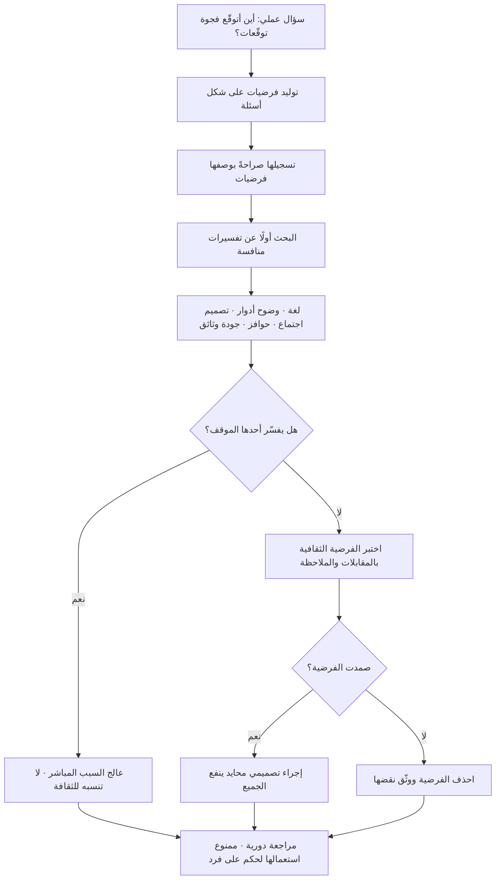

# أبعاد هوفستيده الثقافية (Hofstede Cultural Dimensions)

> [!info] تعريف مختصر
> نموذج يقترح وصف الثقافة الوطنية عبر ستّة أبعاد قابلة للترتيب النسبي بين الدول: **مسافة السلطة، والفردية مقابل الجماعية، وتجنّب عدم اليقين، ونزوع الإنجاز والتنافس مقابل نزوع الرعاية وجودة الحياة، والتوجّه طويل المدى مقابل قصير المدى، والانغماس مقابل ضبط النفس**. صاغه عالِم النفس الاجتماعي الهولندي **خيرت هوفستيده (Geert Hofstede)** انطلاقًا من تحليل بيانات استبيانات موظّفين واسعة النطاق داخل شركة متعدّدة الجنسيات، ثم وُسِّع لاحقًا بأبعاد إضافية بمساهمة باحثين آخرين. الاستعمال الرشيد للنموذج هو أنه **مولّد فرضيات** تنبّهك إلى فروق محتملة في توقّعات التواصل والقرار والمخاطرة، لا **مُصدِر أحكام** عن أفراد بعينهم. والنموذج — رغم انتشاره الهائل — من أكثر النماذج الإدارية تعرّضًا لنقد أكاديمي جادّ، ومعرفة حدوده جزء لا يتجزّأ من استعماله الصحيح.

## الشرح العلمي والاحترافي
- **الأبعاد الستّة بمعناها التشغيلي**: **مسافة السلطة (Power Distance)** — مدى قبول توزيع غير متساوٍ للسلطة، وأثره في هل يعترض المرؤوس علنًا على رئيسه أم يلتمس طرقًا غير مباشرة. **الفردية مقابل الجماعية (Individualism / Collectivism)** — هل تُبنى الهوية حول الفرد وإنجازه أم حول الجماعة والانتماء، وأثره في التقدير والمكافأة والمساءلة. **تجنّب عدم اليقين (Uncertainty Avoidance)** — مدى الانزعاج من الغموض، وأثره في الحاجة إلى قواعد مكتوبة وتفصيل مسبق. **نزوع الإنجاز والتنافس مقابل نزوع الرعاية وجودة الحياة** (يُشار إليه في الأدبيات الأصلية بثنائية «الذكورة/الأنوثة» وهي تسمية تُنتقد بشدّة اليوم لتحميلها معنى جندريًّا لا يخدم المفهوم) — أيّهما يُقدَّم عند التعارض: التنافس والإنجاز أم التوافق ورعاية العلاقات. **التوجّه طويل المدى مقابل قصير المدى** — التركيز على الثمار المستقبلية والمثابرة مقابل احترام التقاليد والنتائج القريبة. **الانغماس مقابل ضبط النفس (Indulgence / Restraint)** — درجة القبول الاجتماعي للاستمتاع والإشباع مقابل كبحه بمعايير صارمة.
- **الطبيعة النسبية لا المطلقة**: درجات النموذج **مواقع نسبية في مقارنة بين الدول**، لا مقاييس مطلقة. قول «هذه الدولة مرتفعة في مسافة السلطة» معناه: أعلى نسبيًّا من دول أخرى في العيّنة نفسها. استعمال الرقم كخاصّية جوهرية للسكّان انحراف عن منطق الأداة نفسها.
- **ما يقيسه فعلًا هو المتوسّط لا الشخص**: النموذج يعمل على **مستوى الدولة كوحدة تحليل**؛ والتباين **داخل** أي دولة عادةً أوسع بكثير من الفارق بين متوسّطات دولتين. لذلك الاستدلال من متوسّط وطني على سلوك موظّف أمامك هو ما يسمّيه المنهجيون **مغالطة البيئة (Ecological Fallacy)** — إسقاط خاصّية جماعية على فرد. هذا هو الخطأ الأشيع والأخطر في الاستعمال العملي للنموذج.
- **الفائدة الحقيقية: توقّع سوء الفهم لا توقّع السلوك**: القيمة العملية ليست في التنبّؤ بما سيفعله شخص، بل في تنبيهك إلى أن **التوقّع الضمني قد يختلف**. مثال: مدير من بيئة تعتاد الاعتراض العلني في الاجتماعات قد يقرأ صمت فريق في بيئة أخرى على أنه موافقة، بينما هو تحفّظ سيظهر لاحقًا في قناة خاصّة. النموذج لا يخبرك بالحقيقة، لكنه يجعلك تسأل: هل غياب الاعتراض هنا يعني الموافقة فعلًا؟ وكيف أُنشئ قناة يظهر فيها الاعتراض بأمان ([[Psychological Safety]])؟
- **النقد المنهجي — البيانات والمصدر**: البيانات المؤسِّسة جُمعت أساسًا من موظّفي شركة واحدة متعدّدة الجنسيات في سبعينيات القرن الماضي. يُؤخذ على ذلك أن عيّنة من موظّفي شركة تقنية كبرى ليست ممثّلة للمجتمع ككل (تحيّز طبقي وتعليمي ومهني)، وأن التصنيف الوظيفي داخل الشركة قد يفسّر بعض الفروق بدل الثقافة الوطنية. كما أن كثيرًا من الأرقام المتداولة اليوم مبنية على قواعد بيانات قديمة أو على تقديرات لاحقة لدول لم تكن في العيّنة الأصلية.
- **النقد المنهجي — الدولة كوحدة تحليل**: يفترض النموذج أن حدود الدولة تحدّ ثقافة متجانسة، وهو افتراض ضعيف في دول متعدّدة القوميات واللغات والأقاليم، وفي مجتمعات ذات نسبة عالية من المقيمين الوافدين — وهي حالة عدد من أسواق الخليج حيث تتكوّن قوّة العمل من خلفيات وطنية شديدة التنوّع، فيصبح «المتوسّط الوطني» مؤشّرًا شديد الضبابية على من ستقابله فعليًّا في مكتب العمل.
- **النقد المنهجي — الثبات عبر الزمن**: يُقدَّم النموذج أحيانًا كأن الثقافة ثابتة بطيئة التغيّر جدًّا، بينما شهدت مجتمعات كثيرة تحوّلات ديموغرافية وتعليمية واقتصادية سريعة خلال عقدين. استعمال أرقام قديمة لوصف سوق تغيّر تركيبه العمري وتعليمه ونمط استهلاكه جذريًّا هو استعمال لمرآة قديمة.
- **خطر الحكم النمطي والاستعمال التبريري**: أخطر ضرر عملي للنموذج هو تحوّله إلى غطاء «علمي» للصورة النمطية: «لا نُشرك الفريق هناك في القرار لأن ثقافتهم كذا»، أو «فشل المشروع بسبب الثقافة المحلّية» بدل فحص سبب إداري حقيقي. هذا الاستعمال يعطّل التحقيق في الأسباب الجذرية ([[Root Cause Analysis]]) ويُلحق ظلمًا مهنيًّا بالأفراد. القاعدة العملية: **استعمل النموذج لتوليد سؤال، وامنع نفسك من استعماله كإجابة**، وامنعه تمامًا في قرارات تخصّ فردًا بعينه (توظيف، ترقية، تقييم).
- **موقع النموذج بين البدائل**: ليس النموذج الوحيد ولا المتّفق عليه؛ في أدبيات الثقافة والإدارة نماذج أخرى تعتمد أبعادًا مختلفة ومنهجيات مختلفة، وبعضها انتقد نتائج هوفستيده صراحةً وتوصّل إلى ترتيبات مغايرة. تعدّد النماذج ذاته دليل على أن المجال وصفي تفسيري لا مجال قياس دقيق، وأن الاعتماد على نموذج واحد كمرجع قاطع خطأ منهجي.

## أين ومتى يُستخدم
- **في إعداد فرق موزّعة عبر دول متعدّدة**: لتوقّع اختلاف توقّعات التواصل والاعتراض والالتزام الزمني، وترجمة ذلك إلى قواعد صريحة في [[Team Working Agreement]] بدل ترك الأمر لافتراضات ضمنية متعارضة.
- **قبل دخول سوق جديد**: كمصدر فرضيات عن سلوك المشتري وأسلوب التفاوض ومكانة العلاقة الشخصية في القرار، تُغذّي البعد الثقافي في [[CAGE Framework]] وتُدمج في تصميم [[Go-to-Market]] — على أن تُختبر ميدانيًّا لا تُعتمد كما هي.
- **في تصميم عمليات التغيير والتبنّي**: لفهم لماذا قد تحتاج بيئة إلى مسار تدرّج وتوثيق ورعاية قيادية أعلى، وربط ذلك بأدوات مثل [[ADKAR Model]] ومقاييس [[Adoption]].
- **في التفاوض التعاقدي عبر الحدود**: لتفسير اختلاف الأهمية النسبية بين تفصيل العقد المكتوب وبناء الثقة الشخصية، وهو ما ينعكس عمليًّا في مدد التفاوض ضمن [[Vendor Management]].
- **في تصميم آليات التغذية الراجعة والمراجعات**: لاختيار قنوات تُظهر الاعتراض فعلًا (كتابي، مجهول، فردي) بدل الاكتفاء بالاجتماع المفتوح، وهو ما يحسّن جودة [[Feedback Loop]].
- **في تدريب القادة الجدد المنتقلين بين أسواق**: لتوقّع فجوات التوقّع في الإشراف والمساءلة، وتقليل الأخطاء المبكرة المكلفة في الأشهر الأولى.

## مثال وسيناريو تطبيقي
> [!example] شركة برمجيات ألمانية استحوذت على شركة سعودية متوسّطة (85 موظّفًا)، وعيّنت مديرًا هندسيًّا من مقرّها لقيادة التكامل التقني خلال 12 شهرًا.
> **ما حدث في الشهرين الأولين:** عقد المدير اجتماعات مراجعة معمارية أسبوعية، وطرح فيها خطّة الترحيل وطلب الاعتراضات صراحةً. لم يعترض أحد. سجّل في محضر كل اجتماع «تمّت الموافقة بالإجماع». في الشهر الثالث تعثّر الترحيل: تبيّن أن ثلاثة أنظمة تكامل مع جهات محلّية لم تُذكر في الخطّة، وأن مهندسَين اثنين كانا يعرفان بها منذ الاجتماع الأول.
> **التشخيص الأول (الخاطئ):** كتب المدير في تقريره أن السبب «ثقافة مسافة سلطة عالية تمنع الاعتراض على المدير»، واقترح تجاوز الفريق واتّخاذ القرارات مركزيًّا. وهذا بالضبط الاستعمال المعيب للنموذج: تفسير جاهز يُغلق التحقيق ويُنتج قرارًا يزيد المشكلة.
> **التشخيص الثاني (بعد مقابلات فردية):** ظهرت ثلاثة أسباب لا علاقة لأيّها بحتمية ثقافية. (١) الاجتماع كان يُدار بالإنجليزية بوتيرة سريعة، وأربعة من الحاضرين قالوا إنهم كانوا يفهمون المحتوى لكن لا يستطيعون صياغة اعتراض تقني دقيق ارتجالًا بالسرعة نفسها. (٢) سؤال «هل من اعتراض؟» في آخر اجتماع مدّته ساعة، أمام المالك الجديد، بعد استحواذ لم تُعلن فيه بعد قرارات التوظيف — سياق يجعل الصمت خيارًا عقلانيًّا لأي شخص من أي ثقافة. (٣) الاثنان اللذان يعرفان المشكلة كتباها فعلًا في تعليق داخل وثيقة الخطّة المشتركة، لكن المدير كان يقرأ الوثيقة في نسخة مصدَّرة لا تعرض التعليقات.
> **ما فُعل:** تُرجمت الخطّة المعمارية إلى العربية إلى جانب الإنجليزية عبر مسار توطين موحّد ([[Translation Memory]])؛ وتغيّرت آلية جمع الاعتراضات إلى نموذج كتابي يُملأ قبل الاجتماع بـ48 ساعة مع خيار الإرسال باسم أو دون اسم؛ وأُعلنت خريطة الأدوار بعد الاستحواذ صراحةً لإزالة الغموض الوظيفي؛ وأصبح المدير يفتح الاجتماع بمراجعة الاعتراضات المكتوبة بدل طلبها شفهيًّا.
> **النتيجة:** في الدورة التالية وصل 11 اعتراضًا مكتوبًا، ثلاثة منها كشفت تبعيات لم تكن في الخطّة أصلًا. لاحظ الفرق: **النموذج الثقافي كان مفيدًا كتنبيه** إلى أن «الصمت قد لا يعني الموافقة»، لكنه لو استُعمل كإجابة نهائية لأنتج قرارًا معاكسًا تمامًا للصحيح. الفرضية فتحت التحقيق، والحكم النمطي كان سيغلقه.

## خطوات أو مخطّط
1. تحديد السؤال العملي أولًا: ما القرار أو الموقف الذي أحتاج فيه إلى فهم فروق التوقّع؟ (اجتماع، تفاوض، آلية تغذية راجعة، خطّة تبنٍّ).
2. استعمال الأبعاد لتوليد **فرضيات مصاغة كأسئلة**، لا كأوصاف: «هل يُتوقَّع هنا أن يُصاغ الاعتراض في قناة خاصّة؟» بدل «هم لا يعترضون».
3. تسجيل الفرضية صراحةً مع الاعتراف بأنها فرضية، ووضعها في موضع يمكن نقضها ([[Decision Log]]).
4. اختبار الفرضية بالملاحظة والمقابلات الفردية مع أشخاص من السياق نفسه، لا بالبحث عن شواهد تؤكّدها.
5. البحث عن التفسيرات المنافسة أولًا: اللغة، وضوح الأدوار، توقيت الاستحواذ، الحوافز، تصميم الاجتماع، جودة الوثائق — قبل نسبة أي شيء إلى «الثقافة».
6. تحويل ما ثبت إلى **إجراء تصميمي محايد** ينفع الجميع: قناة اعتراض كتابية، وقت كافٍ للتحضير، وثائق ثنائية اللغة، تعريف صريح للأدوار.
7. مراجعة الفرضيات دوريًّا وحذف ما لم يصمد، ومنع أي استعمال للنموذج في قرار يخصّ فردًا بعينه.

## ⚠️ مفاهيم خاطئة شائعة
> [!warning]
> - **«درجة الدولة تصف الشخص الذي أمامي»**: هذه مغالطة البيئة بعينها؛ التباين داخل الدولة أوسع من الفارق بين الدول. التصحيح: عامل الدرجة كمعلومة عن توزيع إحصائي مجمّع، وتعامل مع الفرد بما تلاحظه منه هو لا بما يقوله متوسّط.
> - **«الأرقام قياس علمي دقيق»**: هي مؤشّرات نسبية مستخرَجة من استبيانات عيّنة محدودة في سياق تاريخي محدّد، وبعضها مقدَّر لدول لم تُقس أصلًا. التصحيح: استعملها كترتيب تقريبي مثير للسؤال، لا كرقم يُبنى عليه قرار.
> - **«الثقافة الوطنية ثابتة»**: المجتمعات تتغيّر بتغيّر التركيبة العمرية والتعليم والاقتصاد والانفتاح الرقمي، وبعض الأسواق تغيّرت بسرعة كبيرة خلال عقدين. التصحيح: انتبه إلى تاريخ البيانات، ورجّح الملاحظة الميدانية الحديثة عليها عند التعارض.
> - **«الدولة وحدة ثقافية متجانسة»**: افتراض ضعيف في الدول متعدّدة الأقاليم واللغات، وأضعف في أسواق تشكّل فيها العمالة الوافدة نسبة كبيرة من قوّة العمل. التصحيح: انزل بمستوى التحليل إلى المنظّمة والفريق والمهنة، فهي أقرب إلى ما تواجهه فعلًا.
> - **«الثقافة تفسّر فشل المشروع»**: تفسير مريح لأنه يُعفي الإدارة من المساءلة ويُغلق التحقيق. التصحيح: استنفد التفسيرات الإدارية والتقنية واللغوية والتنظيمية أولًا؛ ولا تقبل «الثقافة» سببًا جذريًّا إلا بشواهد محدّدة.
> - **«الأبعاد تصنّف الثقافات إلى أفضل وأسوأ»**: النموذج وصفي لا معياري؛ لا يوجد طرف «متقدّم» وآخر «متخلّف» على أي بُعد. التصحيح: احذف لغة التفضيل من أي عرض تقدّمه، فهي المدخل الأول إلى الحكم النمطي.
> - **«تسمية البُعد الرابع تتعلّق بالرجال والنساء»**: التسمية الأصلية («الذكورة/الأنوثة») مضلّلة وتُنتقد بشدّة؛ المقصود مقايضة بين نزوع الإنجاز والتنافس ونزوع الرعاية وجودة الحياة. التصحيح: استعمل الصياغة الوصفية وتجنّب التسمية الجندرية تمامًا في الاستعمال المهني.
> - **«النموذج مرجع متّفق عليه»**: هو من أكثر النماذج الإدارية استشهادًا ومن أكثرها نقدًا في آن، وثمّة نماذج بديلة تتوصّل إلى ترتيبات مختلفة. التصحيح: اعرضه دائمًا مقرونًا بحدوده، ولا تبنِ عليه قرارًا مصيريًّا وحده.

## ❌ ممارسات خاطئة في المشاريع
> [!failure]
> - **الخطأ: استعمال النموذج في قرارات التوظيف أو الترقية أو تقييم الأداء.** لماذا يضرّ: يحوّل متوسّطًا إحصائيًّا إلى حكم على فرد، وهو ظلم مهني وخطأ منهجي، وقد يعرّض المنشأة لمساءلة تتعلّق بالتمييز. الحل: امنع استعماله في أي قرار فردي بنصّ صريح في سياسة الموارد البشرية، واقصره على تصميم العمليات والتواصل.
> - **الخطأ: بناء استراتيجية دخول سوق على درجات النموذج وحدها.** لماذا يضرّ: تُختزل بيئة كاملة في ستّة أرقام قديمة، فتُغفَل عوامل حاسمة تنظيمية واقتصادية وتقنية. الحل: استعمله كمدخل واحد بين مدخلات، إلى جانب [[PESTEL]] و[[CAGE Framework]]، وتحقّق ميدانيًّا عبر [[Customer and Market Validation]].
> - **الخطأ: تقديم ورشة «توعية ثقافية» تقوم على تعميمات عن «كيف يتصرّف الناس هناك».** لماذا يضرّ: تُرسّخ صورًا نمطية وتُنتج سلوكًا متكلّفًا ومحرجًا يزيد المسافة بدل تقليلها. الحل: درّب على مهارات عامّة قابلة للتحقّق — الإصغاء، التحقّق من الفهم، صياغة الاعتراض، تصميم اجتماع شامل — بدل وصفات سلوكية عن شعوب.
> - **الخطأ: تفسير صمت الفريق في الاجتماع بأنه سمة ثقافية.** لماذا يضرّ: يُهمل أسبابًا مباشرة قابلة للإصلاح (لغة الاجتماع، غياب وقت التحضير، غموض الأدوار، خوف مشروع بعد إعادة هيكلة)، فتبقى المخاطر مخفيّة. الحل: صمّم قنوات اعتراض كتابية ومسبقة، وقِس مؤشّرات [[Psychological Safety]] بدل الافتراض.
> - **الخطأ: نسخ عمليات الإدارة من المقرّ الرئيس حرفيًّا إلى الفروع.** لماذا يضرّ: تنشأ عمليات لا يستعملها أحد فعليًّا، ويتحوّل الالتزام إلى شكلي بينما يجري العمل الحقيقي في قنوات موازية غير مرصودة. الحل: عرّف الحدّ الأدنى غير القابل للتفاوض (حوكمة، امتثال، أمن)، واترك ما عداه للتكييف المحلّي الموثّق ضمن [[Explicit Policies]].
> - **الخطأ: الاعتماد على أرقام قديمة دون ذكر تاريخها ومصدرها.** لماذا يضرّ: تُعرض معلومة عمرها عقود بصفتها واقعًا راهنًا، فتُبنى قرارات على صورة انتهت. الحل: اذكر المصدر وتاريخ البيانات في أي عرض، وضع بجانبه ملاحظة ميدانية حديثة.
> - **الخطأ: إغفال أن التباين المهني والتنظيمي قد يفوق التباين الوطني.** لماذا يضرّ: يُبحث عن حلّ ثقافي لمشكلة سببها اختلاف بين ثقافة قسم المبيعات وقسم الهندسة، أو بين شركة ناشئة وشركة تقليدية. الحل: حدّد مستوى التحليل الصحيح قبل اختيار الأداة، وافحص الثقافة التنظيمية قبل القفز إلى الوطنية.

## 🔗 مصطلحات ومفاهيم ذات صلة
[[CAGE Framework]] | [[PESTEL]] | [[Market Entry Modes]] | [[Go-to-Market]] | [[Cash on Delivery]] | [[Translation Memory]] | [[Psychological Safety]] | [[Team Working Agreement]] | [[ADKAR Model]] | [[Feedback Loop]] | [[Root Cause Analysis]]
