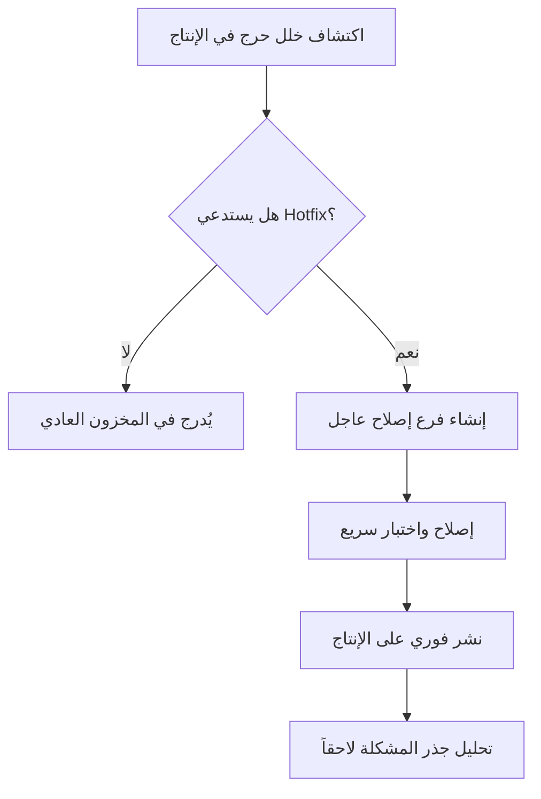

# الإصلاح العاجل (Hotfix)

> [!info] تعريف مختصر
> الإصلاح العاجل (Hotfix) هو تعديل سريع وصغير يُنشَر مباشرة على بيئة الإنتاج (Production) لحل مشكلة حرجة، دون انتظار دورة الإصدار العادية للفريق.

## الشرح العلمي والاحترافي
- يُطبَّق الـHotfix عادة خارج نطاق سير العمل المعتاد؛ فبدلاً من انتظار السبرنت القادم أو الإصدار المجدول، يُعطى أولوية قصوى ويُنشَر بأسرع وقت ممكن.
- يهم هذا المفهوم لأنه يوازن بين سرعة الاستجابة وجودة الكود؛ فالضغط الزمني قد يدفع لتخطي بعض خطوات المراجعة والاختبار المعتادة، ما يزيد خطر ظهور خطأ جديد (Regression).
- غالباً ما يُصنَّف الخلل الذي يستدعي Hotfix بأنه ذو أولوية عالية جداً (P1 أو Critical)، ويُفرَّق فيه بين شدة الخطأ وأولويته ([[Severity vs Priority]])، مثل توقف نظام الدفع بالكامل عن العمل.
- يرتبط بفئة التعجيل (Expedite Class) في أنظمة كانبان، حيث تُمنح مهمة الـHotfix حق تجاوز حدود العمل الجاري ([[WIP Limit]]) لأنها أهم من أي مهمة أخرى قيد التنفيذ.
- بعد نشر الإصلاح العاجل، يُفترض إجراء مراجعة لاحقة (Post-mortem) أو تحليل جذر المشكلة ([[Root Cause Analysis]]) لفهم سبب حدوث الخلل ومنع تكراره.

## أين ومتى يُستخدم
- يُستخدم عندما يظهر خلل حرج في بيئة الإنتاج ([[Staging vs Production Environment]]) يؤثر مباشرة على المستخدمين أو الإيرادات، مثل عطل أمني أو توقف خدمة أساسية.
- شائع في فرق DevOps وموثوقية الأنظمة ([[SRE]]) التي تراقب مؤشرات مثل زمن التعافي ([[MTTR]]) وتسعى لتقليله عبر إصلاحات عاجلة سريعة.
- يُستخدم في أي منهجية عمل - سواء أجايل أو شلال أو كانبان - لأنه استثناء من سير العمل المعتاد يتجاوز الأولويات العادية.
- يظهر في سجل المخاطر أو سجل القضايا ([[Issue Log]]) كحدث طارئ يحتاج توثيقاً بعد حله.

## مثال وسيناريو تطبيقي
> [!example] سيناريو
> في تطبيق "بنكي" للتحويلات المالية، اكتشف فريق الدعم الساعة 9 صباحاً أن المستخدمين لا يستطيعون تسجيل الدخول بعد آخر تحديث نُشر مساء الأمس. الخطأ يمنع آلاف المستخدمين من الوصول لحساباتهم.
> صنّف فريق SRE المشكلة كخلل حرج (P1)، وشكّل مطوّر كبير فرع كود جديد اسمه hotfix/login-crash مباشرة من فرع الإنتاج، دون الانتظار لدورة النشر الأسبوعية المعتادة.
> بعد إصلاح السطر المسبّب للمشكلة واختباره بسرعة على بيئة التجهيز، نُشر الإصلاح مباشرة على الإنتاج خلال ساعتين من اكتشاف المشكلة. بعدها، عقد الفريق اجتماع تحليل جذر المشكلة لفهم كيف مرّ هذا الخطأ من الاختبار الأصلي.

## خطوات أو مخطّط
1. اكتشاف المشكلة الحرجة: يبلغ فريق الدعم أو المراقبة عن عطل يؤثر على المستخدمين في الإنتاج.
2. التصنيف والتأكيد: تأكيد أن المشكلة تستحق فعلاً معاملة Hotfix (شدة عالية وتأثير واسع).
3. إنشاء فرع إصلاح مخصص: عادة من فرع الإنتاج مباشرة، لتفادي جلب تغييرات أخرى غير مختبرة.
4. الإصلاح والاختبار السريع: كتابة أقل تعديل ممكن لحل المشكلة، مع اختبار مركّز على الجزء المتأثر فقط.
5. النشر الفوري: نشر الإصلاح على بيئة الإنتاج خارج دورة الإصدار المعتادة.
6. المتابعة والتوثيق: مراقبة النظام بعد النشر، وتوثيق الحادثة لتحليل السبب الجذري لاحقاً.

## ⚠️ مفاهيم خاطئة شائعة
> [!warning]
> - الاعتقاد أن أي خطأ مزعج يستحق معاملة Hotfix؛ في الواقع يُحجَز هذا المسار للأخطاء الحرجة عالية التأثير فقط، أما الأخطاء الأقل خطورة فتُضاف للمخزون وتُعالَج في الدورة العادية.
> - الظن بأن سرعة النشر تعني تجاوز الاختبار كلياً؛ الأصح هو اختبار مركّز وسريع للجزء المتأثر تحديداً، لا نشر بلا أي تحقق.
> - الخلط بين Hotfix وتجميد الميزات ([[Feature Freeze]])؛ الأول استجابة طارئة لخلل قائم، بينما الثاني قرار مخطط لمنع إضافة ميزات جديدة قبل إطلاق.

## ❌ ممارسات خاطئة في المشاريع
> [!failure]
> - نشر الإصلاح العاجل مباشرة دون أي اختبار خوفاً من الوقت، مما قد يُدخِل خطأ أسوأ من الأصلي. التجنب: تخصيص حد أدنى من الاختبار السريع المركّز حتى في حالات الطوارئ.
> - عدم توثيق الإصلاح العاجل أو نسيان دمجه لاحقاً في فرع التطوير الرئيسي، مما يسبب فقدان الإصلاح عند الإصدار التالي. التجنب: التأكد من دمج فرع الـHotfix في كل الفروع النشطة (Production وDevelopment) فور نشره.
> - تكرار اللجوء إلى Hotfix بشكل متكرر بسبب ضعف عملية الاختبار الأصلية، مما يشير لمشكلة أعمق في الجودة. التجنب: إجراء تحليل جذر المشكلة ([[Root Cause Analysis]]) بعد كل إصلاح عاجل لمعالجة السبب الحقيقي لا الأعراض فقط.

## 🔗 مصطلحات ومفاهيم ذات صلة
[[Severity vs Priority]] | [[MTTR]] | [[SRE]] | [[Root Cause Analysis]] | [[Staging vs Production Environment]] | [[WIP Limit]] | [[Feature Freeze]] | [[Issue Log]] | [[Regression Testing]] | [[Escaped Defect Rate]]
