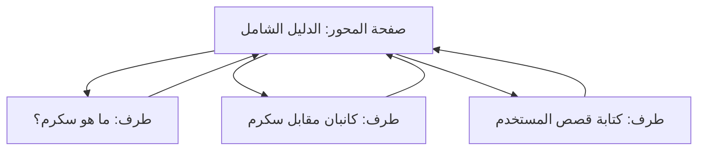

# نموذج المحور والأطراف (Hub and Spoke Content Model)
> [!info] تعريف مختصر
> نموذج لتنظيم المحتوى حول موضوع رئيسي واحد يُسمّى "المحور" (Hub)، تتفرّع منه صفحات فرعية متخصّصة تُسمّى "الأطراف" (Spokes)، وتُربط جميعها ببعضها عبر روابط داخلية لتعزيز السلطة الموضوعية (Topical Authority) وتحسين ترتيب محرّكات البحث.

## الشرح العلمي والاحترافي
- **المحور (Hub)**: صفحة عريضة وشاملة تغطّي موضوعًا رئيسيًا بشكل عام (مثل "إدارة المشاريع الرشيقة")، وتُعتبر نقطة الدخول الأساسية للزائر.
- **الأطراف (Spokes)**: صفحات فرعية أعمق وأكثر تخصصًا تتناول جوانب دقيقة من نفس الموضوع (مثل "سكرم"، "كانبان"، "قصص المستخدم")، وكل طرف يرتبط بالمحور والعكس صحيح.
- الفكرة الأساسية أن محرّكات البحث مثل Google تفضّل المواقع التي تُظهر عمقًا وشمولية في موضوع معيّن (Topical Authority)، لا مجرّد كتابة مقالات متفرّقة بلا رابط منطقي بينها.
- هذا النموذج يُستخدم بكثرة في مشاريع المحتوى وتحسين محرّكات البحث (SEO)، وأيضًا في بناء قواعد المعرفة الداخلية (Knowledge Base) وهيكلة التوثيق (Docs as Code).
- من الناحية الإدارية، يتطلّب هذا النموذج تخطيطًا مسبقًا لخريطة المحتوى (Content Map) قبل الكتابة، بدلًا من إنتاج محتوى عشوائي.

## أين ومتى يُستخدم
- في مشاريع استراتيجية المحتوى وتحسين محركات البحث (SEO)، خصوصًا عند بناء مدونة أو مركز معرفة (Resource Center) لموقع شركة.
- في مرحلة التخطيط لأي مشروع تسويق محتوى طويل الأمد، قبل البدء بالإنتاج الفعلي.
- عند إعادة هيكلة موقع قديم يحتوي محتوى مبعثرًا لتحويله إلى بنية مترابطة وقابلة للقياس.
- يُستخدم أيضًا في توثيق المنتجات التقنية (Product Docs) لتنظيم الأدلة حول محاور رئيسية.

## مثال وسيناريو تطبيقي
> [!example] سيناريو ملموس
> شركة "تِك-فلو" لديها مدونة تسويقية وتريد ترتيب موقعها ليتصدّر نتائج البحث لكلمة "إدارة المشاريع الرشيقة". يبدأ مدير المحتوى بإنشاء صفحة محور (Hub) بعنوان "الدليل الشامل لإدارة المشاريع الرشيقة" تتكوّن من 3000 كلمة تغطّي المفاهيم الأساسية. ثم يخطّط لعشرة مقالات أطراف (Spokes): "ما هو سكرم؟"، "الفرق بين كانبان وسكرم"، "كيفية كتابة قصص المستخدم"... إلخ. كل مقال طرف يحتوي رابطًا داخليًا يعود إلى صفحة المحور، وصفحة المحور بدورها تحتوي روابط لكل الأطراف. بعد 6 أشهر، ترتفع زيارات الموقع العضوية بنسبة 40% لأن Google بدأ يعتبر الموقع مرجعًا موثوقًا (Authority) في هذا الموضوع.

## خطوات أو مخطّط
1. تحديد الموضوع الرئيسي (Hub Topic) الذي يمثّل مجال خبرة المشروع أو الشركة.
2. إجراء بحث الكلمات المفتاحية (Keyword Research) لإيجاد المواضيع الفرعية ذات الصلة.
3. كتابة صفحة المحور بشكل شامل وعميق تغطّي نظرة عامة على كل موضوع فرعي.
4. إنتاج صفحات الأطراف تباعًا، كل واحدة تتعمّق في جانب محدد.
5. ربط كل طرف بالمحور، وربط المحور بكل الأطراف (الربط الداخلي المتبادل).
6. قياس الأداء دوريًا (الزيارات، الترتيب) وتحديث المحتوى القديم.

## ⚠️ مفاهيم خاطئة شائعة
> [!warning]
> - الاعتقاد بأن مجرد وجود روابط داخلية كافٍ، بينما الأهم هو التخطيط المسبق لهيكل المواضيع قبل الكتابة.
> - الخلط بين هذا النموذج وخريطة الموقع (Sitemap) العادية؛ نموذج المحور والأطراف هو استراتيجية محتوى وليس مجرد تنظيم تقني للملفات.
> - الظن بأن صفحة المحور يجب أن تكون الأطول دائمًا؛ الأهم هو أن تكون الأشمل من حيث تغطية المفاهيم، وليس فقط عدد الكلمات.

## ❌ ممارسات خاطئة في المشاريع
> [!failure]
> - إنشاء صفحات أطراف كثيرة دون ربطها فعليًا بصفحة المحور، مما يُضعف الفائدة الكاملة من النموذج. الحل: مراجعة دورية للروابط الداخلية (Internal Link Audit).
> - تكرار نفس الموضوع في أكثر من صفحة طرف مما يسبب تنافسًا داخليًا (Keyword Cannibalization). الحل: تخصيص كل صفحة لكلمة مفتاحية ومحتوى فريد.
> - إهمال تحديث صفحة المحور بعد إضافة أطراف جديدة، فتصبح غير مواكبة. الحل: جعل مراجعة المحور جزءًا من دورة إصدار المحتوى (Content Release Cycle).

## 🔗 مصطلحات ومفاهيم ذات صلة
[[GEO]] | [[YMYL]] | [[AI Overviews]] | [[Docs as Code]] | [[Single Source of Truth]] | [[15 - Roadmap]]
