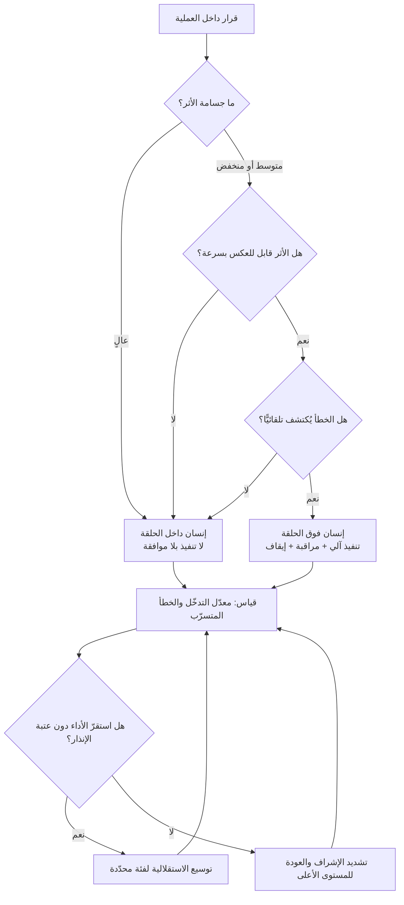

# الإنسان في الحلقة (Human in the Loop)

> [!info] تعريف مختصر
> نمط تصميم يحدّد **درجة إشراك الإنسان في حلقة قرار آلي**: هل يقف الإنسان بين اقتراح النظام وتنفيذه فيكون التنفيذ موقوفًا على موافقته، أم يقف مراقبًا لنظام ينفّذ بنفسه ويملك حق التدخّل والإيقاف، أم يخرج من الحلقة تمامًا فيصير دوره لاحقًا في المراجعة الدورية؟ المصطلح ليس شعارًا أخلاقيًّا («لا بدّ من إنسان») بل **قرار هندسي وتنظيمي** له كلفة ومقايضة: كلّما اقترب الإنسان من الحلقة زاد الأمان وقلّت السرعة والقابلية للتوسّع، وكلّما ابتعد زاد الإنتاج وزادت كلفة الخطأ غير المُكتشَف. وأخطر ما في المصطلح أن يُعلَن على الورق دون أن يكون للإنسان — عمليًّا — لا الوقت ولا المعلومة ولا السلطة ليقول «لا».

## الشرح العلمي والاحترافي
- **أصل الفكرة أقدم من الذكاء الاصطناعي التوليدي بعقود**: نشأ التمييز في هندسة أنظمة التحكّم والطيران والأنظمة العسكرية والدفاعية، حيث كان السؤال المتكرّر: أيّ حلقات التحكّم (Control Loops) تُغلق آليًّا وأيّها تمرّ بمشغّل بشري؟ ومن هذا التراث الهندسي انتقل المصطلح إلى تعلّم الآلة (حيث استُخدم لوصف إدخال الإنسان في دورة تصنيف البيانات وتحسين النموذج)، ثم إلى حوكمة الذكاء الاصطناعي المؤسّسي. لذلك تجد للمصطلح ثلاث دلالات متجاورة يجب التمييز بينها عند الاستعمال: إنسان في **حلقة التدريب** (يوسم البيانات ويصحّح النموذج)، وإنسان في **حلقة التشغيل** (يوافق على القرار قبل تنفيذه)، وإنسان في **حلقة الحوكمة** (يراجع الأداء التراكمي ويعدّل السياسات).
- **التمييز الثلاثي هو جوهر المصطلح**: لا تُوجد «حالة إشراف» واحدة، بل ثلاث مواقع مختلفة جوهريًّا:
  1. **Human in the Loop — إنسان داخل الحلقة**: النظام يقترح، والتنفيذ **لا يقع** إلّا بفعل بشري صريح. الإنسان جزء إلزامي من مسار القرار؛ لو غاب توقّفت العملية. هذا أعلى مستويات الضبط وأبطؤها.
  2. **Human on the Loop — إنسان فوق الحلقة**: النظام يقرّر وينفّذ من تلقاء نفسه، والإنسان يراقب مجرى العمل ويملك **حق الاعتراض والإيقاف والتراجع**. العملية تمضي في غياب الإنسان، لكن يده على المكبح. ويُشترط لصلاحية هذا المستوى ثلاثة شروط عملية: أن تكون المخرجات **مرئية** له فعلًا لا مدفونة في سجل، وأن يكون **زمن التدخّل** أقصر من زمن وقوع الضرر، وأن يكون **التراجع ممكنًا** (Rollback).
  3. **Human out of the Loop — إنسان خارج الحلقة**: لا مراقبة لحظية أصلًا؛ النظام يعمل مغلقًا، ودور الإنسان ينتقل إلى **ما قبل** (وضع السياسات والحدود ومعايير القبول) و**ما بعد** (مراجعة العيّنات والتقارير الدورية والتدقيق). هذا ليس بالضرورة إهمالًا — كثير من الأنظمة الآلية اليومية تعمل هكذا بأمان — لكنه يشترط أن يكون **أثر الخطأ الواحد محدودًا وقابلًا للعكس**.
- **المعيار الحاكم في اختيار المستوى ليس «هل النموذج ذكي؟» بل «ما كلفة الخطأ ومدى قابليته للعكس؟»**: القاعدة العملية أن يُختار المستوى بدلالة ضرب ثلاثة عوامل: **جسامة الأثر** (مالي، قانوني، صحّي، سمعي) × **قابلية العكس** (هل يمكن التراجع خلال دقائق؟) × **قابلية الاكتشاف** (هل سيظهر الخطأ تلقائيًّا أم قد يمرّ صامتًا شهورًا؟). قرار منخفض الأثر، سريع العكس، ظاهر الخطأ = مرشّح ممتاز للأتمتة الكاملة. قرار عالي الأثر، غير قابل للعكس، صامت الخطأ = يجب أن يبقى إنسان **داخل** الحلقة مهما بلغت دقّة النظام.
- **الإشراف الشكلي (Rubber-Stamping) هو وضع الفشل الأشهر**: حين يُطلب من موظّف اعتماد 400 اقتراح آلي يوميًّا، فإنه بعد أيام قليلة يعتمدها جميعًا دون فحص حقيقي. هنا يبقى الإنسان «في الحلقة» على المخطّط، لكنه عمليًّا **خارجها** — والأسوأ أن المؤسّسة صارت تملك غطاءً وهميًّا للمسؤولية. ويتفاقم هذا بفعل [[Automation Bias]]، أي ميل البشر إلى قبول مخرجات الأنظمة الآلية وترجيحها على أدلّتهم الخاصة. ولذلك فإن أي تصميم HITL جادّ يجب أن يقيس **معدّل الرفض والتعديل**، لا مجرّد وجود خانة موافقة.
- **قدرة الإشراف مورد محدود يجب أن يُوازَن بالطاقة الاستيعابية**: الإشراف البشري له **سعة** ([[Capacity]]) تمامًا كأي عمل آخر، وإغراق هذه السعة يُنشئ [[Bottleneck]] أمام الأتمتة كلها، أو — وهو الأسوأ — ينهار الإشراف إلى ختم صوري. لذلك يُفضَّل في التصميم الناضج ألّا يُعرَض على الإنسان كل شيء، بل **يُوجَّه الإشراف بالمخاطرة** (Risk-Based Review): مراجعة كاملة للحالات عالية الأثر أو منخفضة الثقة، وعيّنة إحصائية لبقيّة الحالات — وهو المنطق نفسه في [[Risk-Based Testing]].
- **المسؤولية والمساءلة لا تنتقلان إلى النظام مطلقًا**: هذه نقطة قانونية وتنظيمية لا مجرّد أخلاقية. النظام الآلي ليس شخصًا اعتباريًّا يتحمّل التبعة؛ المسؤولية تبقى على المؤسّسة وعلى من فوّض القرار. ومن هنا يجب التفريق بين ثلاثة أشياء يخلطها كثيرون: **مَن نفّذ** (قد يكون النظام)، و**مَن وافق** (الإنسان في الحلقة)، و**مَن يتحمّل التبعة** (المالك التنظيمي للعملية). والتصميم السليم يجعل هذه الثلاثة مُوثَّقة صراحةً في [[Decision Log]] وفي [[Explicit Policies]]، بحيث لا تُكتشف الإجابة عن سؤال «من المسؤول؟» بعد وقوع الحادث.
- **الإشراف بلا معلومة كافية ليس إشرافًا**: لكي يكون قرار الإنسان معتبَرًا يجب أن يُقدَّم له ثلاثة أشياء: **ما الذي يقترحه النظام**، و**على أي أساس** (المصدر، السياق، درجة الثقة إن وُجدت)، و**ما البدائل التي أُهملت**. عرض النتيجة النهائية وحدها يحوّل الإنسان إلى زرّ. كما أن **عرض ثقة النظام برقم** سلاح ذو حدّين: قد يحسّن التمييز، وقد يعمّق الانحياز إن كانت الثقة المُعلَنة غير معايَرة (نظام يقول «ثقة 95%» وهو مخطئ فعليًّا في 30% من الحالات يفسد الحكم البشري أكثر ممّا يعينه).
- **مستوى الإشراف ليس ثابتًا عبر عمر المنتج**: النمط الناضج هو **تدرّج مُخطَّط**: يبدأ النظام بإشراف كامل (in the loop) خلال فترة إثبات، وتُجمع بيانات معدّل الخطأ ومعدّل تعديل البشر للمخرجات، فإن استقرّت دون عتبة متّفق عليها يُرفَع القيد إلى (on the loop) لفئة محدّدة من الحالات منخفضة الأثر — مع الاحتفاظ بقدرة **العودة الفورية** إلى المستوى الأشدّ عند تجاوز حدّ إنذار. هذا يجعل الاستقلالية **امتيازًا مكتسبًا بالأدلّة** لا افتراضًا ابتدائيًّا.
- **علاقة خاصّة بأنظمة تعمل بخطوات متتابعة**: حين يكون النظام [[AI Agent|وكيلًا ذكيًّا]] ينفّذ سلسلة خطوات، فإن سؤال «أين يقف الإنسان؟» يتغيّر من نقطة واحدة إلى **اختيار نقاط تفتيش (Checkpoints)** داخل السلسلة. ووضع الإشراف عند نهاية السلسلة فقط خيار رديء في الغالب، لأن الخطأ المبكر يكون قد أنتج آثارًا جانبية لا تُعكس بمجرّد رفض المخرَج الأخير. القاعدة: **ضع نقطة التفتيش قبل أول فعل غير قابل للعكس**، لا بعده.

## أين ومتى يُستخدم
- **في تصميم أي عملية تُدخِل الذكاء الاصطناعي إلى مسار عمل قائم**: تحديد مستوى الإشراف لكل خطوة هو جزء أصيل من [[AI Orchestration]]، ويُوثَّق في [[SOP]] الخاص بالعملية حتى لا يُترك لاجتهاد كل موظّف.
- **في الحوكمة والامتثال ([[Governance]])**: كثير من الأطر التنظيمية والسياسات الداخلية تشترط تدخّلًا بشريًّا معتبَرًا في القرارات ذات الأثر على الأفراد. وتُترجم هذه الاشتراطات عمليًّا إلى سياسات مكتوبة ضمن [[Explicit Policies]] و[[Guard Rails]].
- **في بوّابات القرار الكبرى**: قرار الإطلاق أو التوقّف ([[Go or No-Go Decision]])، واعتماد التسليم ([[Sign-off]])، وقرارات [[Change Request]] — هذه بطبيعتها «إنسان داخل الحلقة» ولا تُفوَّض لنظام آلي مهما بلغت دقّته.
- **في عمليات التشغيل والحوادث**: التمييز بين إجراء تصحيحي يُنفَّذ آليًّا (إعادة تشغيل خدمة) وآخر يتطلّب موافقة (تنفيذ [[Rollback]] لإصدار في الإنتاج) هو تطبيق مباشر للتمييز الثلاثي، وينعكس على [[MTTR]].
- **في مراجعة المخرجات المُولَّدة قبل نشرها للعميل**: أي محتوى أو ردّ أو مستند يصل إلى طرف خارجي يمرّ عادة بمستوى إشراف أعلى، لأن الخطأ فيه غير قابل للعكس سمعيًّا حتى لو كان قابلًا للحذف تقنيًّا.
- **في تحديد معايير القبول واختبار الأنظمة غير الحتمية**: حين يكون سلوك النظام متغيّرًا ([[Non-determinism]])، يصبح الإشراف البشري أحد وسائل ضبط الجودة إلى جانب الاختبار الآلي، ويُقاس أثره عبر [[Escaped Defect Rate]].

## مثال وسيناريو تطبيقي
> [!example] شركة تأمين في الرياض تعالج **مطالبات السيارات**. الحجم اليومي 1,200 مطالبة، ومتوسط زمن المعالجة اليدوية 11 دقيقة، ولدى القسم 14 موظّفًا. أدخلت الشركة نظامًا ذكيًّا يقرأ المستندات ويقترح: **قبول** أو **رفض** أو **إحالة للفحص**، مع تقدير للمبلغ.
> **المرحلة الأولى (إنسان داخل الحلقة — 6 أسابيع):** لا تُصرف أي مطالبة دون ضغطة موظّف. النتيجة المرصودة داخليًّا: النظام وافقه الموظّفون في 86% من الحالات، وعدّلوا المبلغ في 9%، وعكسوا القرار كليًّا في 5%. الأهم أن الفريق حلّل الـ5% فوجد أنها تتركّز في نمطين: مطالبات فوق 25,000 ريال، ومطالبات ذات مستندات ممسوحة بجودة رديئة.
> **المرحلة الثانية (تقسيم بالمخاطرة):** أُعيد تصميم العملية على ثلاثة مسارات بدل مسار واحد:
> ① مطالبات **أقل من 3,000 ريال** ومستنداتها مقروءة → تُصرف آليًّا (**إنسان فوق الحلقة**): لوحة مباشرة تعرض كل صرف آلي، وأي موظّف يستطيع إيقاف الصرف خلال نافذة 30 دقيقة قبل تنفيذ الحوالة، مع مراجعة عيّنة 10% لاحقًا.
> ② مطالبات **بين 3,000 و25,000** → تبقى **داخل الحلقة**، لكن الشاشة أُعيد تصميمها لتعرض سبب الاقتراح والمستند المرجعي والحالات المشابهة، لا الرقم وحده.
> ③ مطالبات **فوق 25,000** أو ذات علامات اشتباه → إحالة إلزامية لفاحص أوّل، ولا يملك النظام صلاحية اقتراح «قبول» أصلًا فيها.
> **الحادثة المفيدة:** في الأسبوع الثالث من المرحلة الثانية، ارتفع فجأة عدد المطالبات الصغيرة المصروفة آليًّا من ~300 إلى 470 في يوم واحد. أطلقت لوحة المراقبة إنذارًا مبنيًّا على انحراف الحجم لا على خطأ فردي، فأوقف مدير العمليات المسار الآلي خلال 40 دقيقة. تبيّن أن ورشة واحدة كانت ترفع مطالبات مجزّأة عمدًا لتبقى تحت عتبة الـ3,000. **لولا وجود إنسان «فوق الحلقة» بمؤشّر تجميعي، لكانت مراجعة العيّنة العشوائية اكتشفت النمط بعد أسابيع.**
> **النتيجة بعد ربع كامل:** متوسط زمن المعالجة نزل من 11 دقيقة إلى 4، وتحرّرت طاقة الفريق للحالات المعقّدة، ومعدّل الخطأ المكتشَف لاحقًا بقي ضمن الحدّ المتّفق عليه. والدرس التنظيمي الذي وثّقه الفريق: **العتبة المالية وحدها لم تكن كافية؛ الأتمتة الآمنة احتاجت أيضًا مؤشّرًا على مستوى النمط لا الحالة الفردية.**

## خطوات أو مخطّط
1. فكّك العملية إلى قرارات مفردة؛ لا تسأل «هل نؤتمت هذه العملية؟» بل «أي قرار داخلها نؤتمت؟».
2. صنّف كل قرار بثلاثة أسئلة: ما جسامة أثره؟ هل هو قابل للعكس؟ هل خطؤه يظهر تلقائيًّا أم يمرّ صامتًا؟
3. اختر مستوى الإشراف المبدئي لكل قرار: داخل الحلقة / فوق الحلقة / خارجها.
4. عرّف **معيار القبول** الذي يحكم به المشرف: ما الذي يجعل المخرَج مقبولًا؟ (بدون هذا يتحوّل الإشراف إلى ذوق شخصي).
5. صمّم شاشة القرار لتعرض السبب والمصدر والبدائل، لا النتيجة وحدها؛ واجعل «الرفض» و«التعديل» بنفس سهولة «الموافقة».
6. حدّد سعة الإشراف: كم حالة يستطيع فريقك فحصها فحصًا حقيقيًّا في اليوم؟ ووجّه الإشراف بالمخاطرة إن تجاوز الحجم السعة.
7. وثّق المسؤولية صراحةً: من ينفّذ، من يوافق، من يتحمّل التبعة — في [[Decision Log]] و[[Explicit Policies]].
8. قِس صحّة الإشراف لا وجوده: معدّل الرفض، معدّل التعديل، متوسط زمن المراجعة، ونسبة الأخطاء التي مرّت.
9. راجع دوريًّا وارفع أو اخفض مستوى الإشراف بناءً على البيانات، مع إبقاء مسار عودة فوري إلى المستوى الأشدّ.

## ⚠️ مفاهيم خاطئة شائعة
> [!warning]
> - **«وجود إنسان في الحلقة يعني أن النظام آمن»**: وجود خانة موافقة لا يعني إشرافًا. الإشراف يتحقّق فقط حين يملك الإنسان الوقت والمعلومة والسلطة للرفض، ويُثبت ذلك بمعدّل رفض وتعديل غير صفري. صفر رفض عبر آلاف الحالات مؤشّر خطر لا مؤشّر جودة.
> - **«الإشراف البشري يحلّ محلّ الاختبار والضوابط التقنية»**: الإنسان طبقة أخيرة وضعيفة نسبيًّا، وليس بديلًا عن [[Guard Rails]] والتحقّق الآلي والقيود على الصلاحيات. الترتيب الصحيح: امنع تقنيًّا ما يمكن منعه، ثم أشرِف بشريًّا على ما تبقّى.
> - **الخلط بين «in the loop» و«on the loop»**: كثير من الفرق تكتب في وثائقها «Human in the Loop» بينما تصميمها الفعلي مراقبة بعدية. الفرق جوهري: في الأولى لا يقع الفعل بلا إنسان، وفي الثانية يقع ثم يُراجَع. الخلط بينهما في مستند حوكمة يُنشئ التزامًا لا يفي به النظام.
> - **«الخروج من الحلقة إهمال دائمًا»**: ليس كذلك. الأنظمة منخفضة الأثر وسريعة العكس تعمل خارج الحلقة بأمان وكفاءة، وإصرارك على إشراف بشري فيها يستهلك سعة إشراف كنت أحوج إليها في القرارات الخطرة.
> - **«الإشراف مسؤولية شخص»**: الإشراف قدرة نظامية تحتاج شاشة مناسبة، ووقتًا مخصّصًا، وصلاحية معلنة، ومقياسًا. تعيين اسم في خانة «المراجع» دون هذه العناصر لا يُنشئ إشرافًا.
> - **«كلّما زادت دقّة النموذج قلّت الحاجة للإشراف»**: الدقّة العالية قد تزيد الخطر لا تقلّله، لأنها تُضعف يقظة المراجع البشري وتعمّق [[Automation Bias]]؛ النظام الذي يخطئ نادرًا هو أصعب نظام يُراقَب.
> - **«المسؤولية تنتقل إلى مزوّد النظام»**: العقد قد يوزّع التعويض، لكن المساءلة أمام العميل والجهة التنظيمية تبقى على المؤسّسة صاحبة العملية.

## ❌ ممارسات خاطئة في المشاريع
> [!failure]
> - **الخطأ: عرض كل المخرجات على مراجع واحد دون تصنيف بالمخاطرة.** لماذا يضرّ: يُغرق سعة الإشراف فينهار إلى ختم صوري، أو يصير [[Bottleneck]] يعطّل الفائدة كلها. الحل: صنّف بالأثر والثقة، وراجع كليًّا ما هو خطر وعيّنةً ما هو روتيني.
> - **الخطأ: تصميم واجهة تجعل «موافق» ضغطة واحدة و«رفض» يتطلّب ملء نموذج.** لماذا يضرّ: التصميم نفسه يفرض النتيجة، فيتحوّل الإشراف إلى موافقة افتراضية. الحل: ساوِ كلفة المسارين، واجعل تسجيل سبب الرفض قيمة تُغذّي التحسين لا عقوبة على المراجع.
> - **الخطأ: عدم تعريف معيار قبول مكتوب للمراجع.** لماذا يضرّ: يصير القبول مزاجيًّا ومتفاوتًا بين الأفراد، ويستحيل تدقيقه أو تدريب موظّف جديد عليه. الحل: اكتب معيار القبول بصيغة قابلة للفحص، على غرار [[Definition of Done]] و[[Given When Then]].
> - **الخطأ: وضع نقطة الإشراف بعد آخر خطوة في سلسلة الوكيل.** لماذا يضرّ: الأفعال الجانبية (إرسال بريد، تعديل سجل، تنفيذ عملية مالية) تكون قد وقعت فعلًا. الحل: ضع نقطة التفتيش **قبل أول فعل غير قابل للعكس**.
> - **الخطأ: قياس نجاح الإشراف بعدد الحالات المُراجَعة.** لماذا يضرّ: يكافئ السرعة الشكلية ويعاقب التدقيق. الحل: قِس معدّل الاكتشاف، والخطأ المتسرّب لاحقًا، وزمن المراجعة الفعلي لكل حالة.
> - **الخطأ: غياب مسار تصعيد وإيقاف واضح.** لماذا يضرّ: حين يكتشف موظّف خللًا نمطيًّا لا يعرف من يوقف النظام ولا كيف، فتستمرّ الأخطاء ساعات. الحل: عرّف «مفتاح إيقاف» معلومًا ومختبَرًا، وسمِّ المخوَّل باستخدامه، وادرجه في [[Risk Register]].
> - **الخطأ: إعلان «إنسان في الحلقة» في العقد أو سياسة الخصوصية بينما التطبيق مراقبة بعدية.** لماذا يضرّ: يخلق مخاطرة امتثالية وسمعية حقيقية عند أول تدقيق أو شكوى. الحل: طابق النص على التصميم الفعلي، وعدّل أحدهما لا كليهما بالتمنّي.

## 🔗 مصطلحات ومفاهيم ذات صلة
[[AI Agent]] | [[AI Copilot]] | [[AI Orchestration]] | [[Automation Bias]] | [[Non-determinism]] | [[Guard Rails]] | [[Explicit Policies]] | [[Governance]] | [[Decision Log]] | [[Go or No-Go Decision]] | [[Sign-off]] | [[Risk-Based Testing]] | [[Rollback]]
