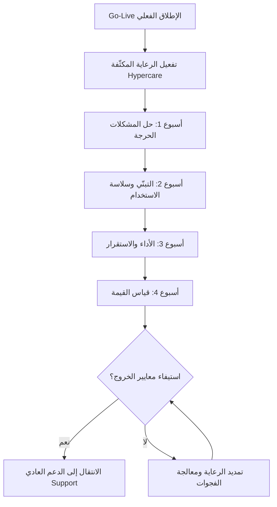

# الرعاية المكثّفة (Hypercare)

> [!info] تعريف مختصر
> الرعاية المكثّفة (Hypercare) هي فترة دعم **استباقية مُكثَّفة** محدودة المدة تبدأ فور الإطلاق الفعلي للنظام ([[Go or No-Go Decision|Go-Live]])، يُخصَّص فيها فريق مُعيَّن وقنوات تواصل مباشرة واستجابة سريعة وفق [[SLA]] صارمة، بهدف امتصاص صدمة الانتقال إلى النظام الجديد وتثبيت استخدامه قبل تسليمه إلى الدعم التشغيلي المعتاد. جوهرها أنها **لا تنتظر البلاغ** بل تُراقب وتتدخّل قبل أن يتحوّل الخلل إلى أزمة.

## الشرح العلمي والاحترافي
- **الفكرة الأساسية**: لحظة الإطلاق ليست نهاية المشروع بل أخطر نقطة فيه. فبين البيئة الاختبارية والواقع فجوة دائمة: مستخدمون حقيقيون، أحجام بيانات حقيقية، ضغط تشغيلي حقيقي، وسلوكيات لم يتنبّأ بها أي سيناريو اختبار. الرعاية المكثّفة هي الفترة التي نعترف فيها صراحةً بوجود هذه الفجوة ونُخصِّص لها موارد بدل أن نتفاجأ بها.
- **الفرق الجوهري بين Hypercare والدعم العادي (Support)**: هذا هو المفصل الذي يجب أن يفهمه كل من يدير إطلاقًا.
  - الدعم العادي **تفاعلي (Reactive)**: ينتظر أن يفتح المستخدم تذكرة (Ticket)، ثم يُصنَّف البلاغ ويدخل طابور الانتظار، ويُعالَج ضمن أولويات مشتركة مع عشرات العملاء.
  - الرعاية المكثّفة **استباقية (Proactive)**: الفريق يراقب لوحات المتابعة والسجلات (Logs) ومعدلات الأخطاء، ويتصل بالمستخدم قبل أن يشتكي، ويجلس أحيانًا داخل موقع العميل، ويسأل يوميًا: "ما الذي لم يعمل معكم أمس؟".
- **مكوّنات الرعاية المكثّفة المحترفة**:
  1. **فريق مخصّص (Dedicated Team)**: أسماء محدّدة من فريق المشروع نفسه — الذي بنى النظام ويعرف قراراته — لا فريق دعم عام لم يشارك في التنفيذ.
  2. **قنوات مباشرة**: مجموعة تواصل فورية مشتركة مع مستخدمي العميل الرئيسيين، ورقم/شخص محدّد للتصعيد، بدلًا من نظام تذاكر بارد فقط.
  3. **اجتماع يومي قصير (Daily Stand-up)**: 15 دقيقة مع ممثلي العميل لمراجعة بلاغات الأمس، وحالة المعالجة، ومخاطر اليوم.
  4. **[[SLA]] صريحة بالأولوية**: تُكتب في وثيقة الرعاية المكثّفة ويوقّع عليها الطرفان، مثال شائع: مشكلة **حرجة (Critical)** توقف العمل → استجابة ومعالجة خلال **4 ساعات**؛ مشكلة **كبيرة (Major)** تعرقل العمل مع وجود حل بديل → خلال **24 ساعة**؛ مشكلة **بسيطة (Minor)** تجميلية أو تحسينية → خلال **يومين**.
  5. **سجل موحّد للمشكلات** يُغذّي [[RAID Log]] ويُظهر الاتجاه: هل عدد البلاغات يتناقص فعلًا؟
- **البرنامج الأسبوعي النموذجي (4 أسابيع)** — وهو ما يميّز الرعاية المكثّفة المهنية عن "الوجود المستمر بلا هدف":
  - **الأسبوع 1 — حلّ المشكلات الحرجة**: تركيز كامل على ما يوقف العمل: أخطاء الترحيل، الصلاحيات، الطباعة، التكاملات. الهدف: تصفير المشكلات الحرجة.
  - **الأسبوع 2 — التبنّي وسلاسة الاستخدام ([[Adoption]])**: بعد استقرار النظام تقنيًا، يتحوّل التركيز إلى الإنسان: هل يستخدم الموظفون النظام فعلًا؟ أين يتعثّرون؟ ما الشاشات التي يتجنّبونها؟ تدريب مُصغَّر مُوجَّه حسب الملاحظة.
  - **الأسبوع 3 — الأداء والاستقرار**: بطء الشاشات، أزمنة الاستجابة، التقارير الثقيلة، أحمال الذروة، ضبط الفهارس والذاكرة، ومعالجة [[MTTR]] المرتفع.
  - **الأسبوع 4 — قياس القيمة**: مقارنة الوضع الجديد بخط الأساس (Baseline): كم اختصر النظام من زمن الدورة؟ ما نسبة المعاملات المُنجزة داخل النظام؟ وتوثيق ذلك في [[Project Health Report]] ليكون دليل نجاح لا انطباعًا.
- **معايير الخروج (Exit Criteria)**: الرعاية المكثّفة تنتهي بقرار مبني على معايير مكتوبة سلفًا، لا بانتهاء التاريخ فقط. أبرزها: **اختفاء المشكلات الحرجة لعدة أيام متتالية** (مثلًا 5 أيام عمل متتالية بلا بلاغ Critical)، وانخفاض معدل البلاغات اليومية تحت حد متفق عليه، وإغلاق نسبة مرتفعة من البلاغات المفتوحة، واكتمال [[Incident Runbook]] وتوثيق الحلول المتكررة، وتدريب فريق الدعم المُستلِم.
- **نقطة تعاقدية مهمة**: الرعاية المكثّفة **لا تزيد مدة العقد ولا كلفته**، بل تُعيد تنظيم فترة الدعم المتفق عليها أصلًا: بدل توزيع الدعم بوتيرة ثابتة على اثني عشر شهرًا، تُضخّ الكثافة في الأسابيع الأولى حيث القيمة أعلى، ثم تعود إلى المستوى الطبيعي. هذه الصياغة تُغلق باب اعتراض العميل بأنها "خدمة إضافية مدفوعة"، وباب توقّع أنها "دعم مجاني إلى الأبد".

## أين ومتى يُستخدم
- بعد إطلاق أنظمة المؤسسات (ERP / CRM / HRMS) حيث يتوقف عمل أقسام كاملة على النظام الجديد، وأي خلل يعني توقف فوترة أو رواتب أو مبيعات.
- في مشاريع ترحيل البيانات والأنظمة القديمة (Legacy Migration)، حيث تظهر مشكلات لا تكشفها إلا البيانات الحقيقية بعد الإطلاق رغم إجراء [[Data Dry Run]].
- عند الإطلاق التدريجي على مواقع أو فروع متعددة: تُطبَّق رعاية مكثّفة لكل موجة إطلاق (Wave) على حدة.
- في المرحلة الفاصلة بين انتهاء التنفيذ و[[Closure vs Handover|التسليم والإغلاق]]، إذ تُعدّ الرعاية المكثّفة الجسر الرسمي بين فريق المشروع وفريق التشغيل.
- عند إطلاق تغييرات كبيرة في المنتجات الرقمية العامة (إعادة تصميم شامل، تغيير مسار الدفع)، حيث يُراقَب سلوك المستخدمين لحظيًا في الأيام الأولى.

## مثال وسيناريو تطبيقي
> [!example] شركة تجزئة لديها 8 فروع أطلقت نظام ERP جديدًا يوم الأحد 1 من الشهر، مع اتفاق رعاية مكثّفة مدته 4 أسابيع ضمن عقد دعم سنوي قائم أصلًا.
> **الترتيبات**: فريق من 4 أشخاص (مستشار وظيفي، مطوّر، مختص بيانات، مدير المشروع)، مجموعة تواصل فورية تضم 12 مستخدمًا رئيسيًا، واجتماع يومي الساعة 9:00 لمدة 15 دقيقة، و[[SLA]] معتمدة: Critical خلال 4 ساعات، Major خلال 24 ساعة، Minor خلال يومين.
> **الأسبوع 1**: وصل **63 بلاغًا**، منها 7 حرجة (فاتورة الضريبة تُطبع بنسبة خاطئة، وصلاحيات أمين المخزن تمنعه من الصرف). عولجت البلاغات الحرجة السبعة كلها خلال متوسط 3.2 ساعة.
> **الأسبوع 2**: انخفضت البلاغات إلى **28**، ولم تكن أي منها حرجة. لاحظ الفريق أن 3 فروع ما زالت تسجّل المبيعات في ملف Excel جانبي؛ فأُجريت 4 جلسات تدريب مُصغَّرة، فارتفع [[Adoption|معدل التبنّي]] من 61% إلى 88%.
> **الأسبوع 3**: البلاغات **11**، أغلبها بطء تقرير المخزون (كان يستغرق 48 ثانية). بعد ضبط الفهارس نزل إلى 6 ثوانٍ.
> **الأسبوع 4**: **4 بلاغات** تحسينية فقط، وصفر بلاغات حرجة منذ 9 أيام متتالية. قِيست القيمة: زمن إقفال المبيعات اليومي انخفض من 45 دقيقة إلى 12 دقيقة لكل فرع.
> **قرار الخروج**: استُوفيت معايير الخروج (صفر Critical لأكثر من 5 أيام، وإغلاق 94% من البلاغات، واكتمال [[Incident Runbook]])، فوُقّع محضر انتقال إلى الدعم العادي، وسُلّم النظام رسميًا لفريق التشغيل ضمن [[Closure vs Handover|التسليم]].

## خطوات أو مخطّط
1. **قبل الإطلاق**: كتابة وثيقة الرعاية المكثّفة (المدة، الفريق، القنوات، [[SLA]]، معايير الخروج) واعتمادها من العميل ضمن قائمة تدقيق الإطلاق.
2. **يوم الإطلاق**: تفعيل المراقبة الاستباقية للسجلات ولوحات المتابعة، وتواجد الفريق المخصّص.
3. **الأسبوع 1**: تصفير المشكلات الحرجة، واستجابة وفق الأولوية المتفق عليها.
4. **الأسبوع 2**: التركيز على التبنّي والتدريب المُوجَّه وسلاسة الاستخدام.
5. **الأسبوع 3**: معالجة الأداء والاستقرار وأزمنة الاستجابة.
6. **الأسبوع 4**: قياس القيمة مقابل خط الأساس وتوثيقها في [[Project Health Report]].
7. **مراجعة معايير الخروج** أسبوعيًا: هل تناقصت البلاغات؟ هل اختفت المشكلات الحرجة عدة أيام متتالية؟
8. **الانتقال**: تسليم [[Incident Runbook]] والتوثيق وتدريب فريق الدعم، ثم توقيع محضر الانتقال إلى الدعم العادي.

## ⚠️ مفاهيم خاطئة شائعة
> [!warning]
> - **الظن أن الرعاية المكثّفة مجرد "دعم أكثر"**: الفرق ليس في الكمّية بل في الطبيعة؛ الدعم يستجيب للبلاغ، والرعاية المكثّفة تبحث عن المشكلة قبل وقوعها.
> - **اعتبارها خدمة إضافية تُكلِّف العميل مبلغًا جديدًا**: هي إعادة توزيع لكثافة الدعم داخل المدة المتعاقد عليها، لا زيادة في مدة العقد أو قيمته.
> - **الاعتقاد بأنها تنتهي بانتهاء التاريخ المحدد**: تنتهي باستيفاء **معايير خروج مكتوبة**؛ والتاريخ مؤشر لا حكم.
> - **الظن بأن نجاحها يُقاس بعدد البلاغات المُغلقة**: المؤشر الحقيقي هو **اتجاه** البلاغات نحو الانخفاض واختفاء الحرجة منها، لا حجم النشاط.
> - **افتراض أن وجودها يغني عن اختبار جيد قبل الإطلاق**: الرعاية المكثّفة شبكة أمان لا بديل عن [[UAT]] و[[Data Dry Run]]؛ من يعتمد عليها لتغطية اختبار ناقص يدفع الثمن مضاعفًا.

## ❌ ممارسات خاطئة في المشاريع
> [!failure]
> - **إسناد الرعاية المكثّفة إلى فريق دعم لم يشارك في التنفيذ**: يقضي الفريق الجديد أسابيع في فهم النظام بينما العميل ينزف مشكلات. الحل: تخصيص أفراد من فريق المشروع نفسه خلال الرعاية، مع نقل معرفي تدريجي لفريق الدعم قبل الخروج.
> - **إطلاق الرعاية المكثّفة بلا [[SLA]] مكتوبة ولا تصنيف أولويات**: يتحوّل كل بلاغ إلى "عاجل"، ويستهلك الفريق وقته في المشكلات التجميلية بينما تبقى الحرجة معلّقة. الحل: تصنيف مُعتمد مسبقًا (Critical / Major / Minor) بأزمنة استجابة صريحة.
> - **عدم تحديد معايير خروج، فتتحوّل الرعاية إلى دعم مجاني مفتوح**: يستنزف الفريق ويؤخّر [[Closure vs Handover|إغلاق المشروع]] وتحصيل الدفعة الأخيرة. الحل: كتابة معايير الخروج ضمن العقد وتوقيع محضر انتقال رسمي عند استيفائها.
> - **الاكتفاء بالحل السريع دون توثيق سببه الجذري**: تتكرر المشكلة نفسها بعد انتهاء الرعاية ولا يعرف فريق الدعم كيف عولجت. الحل: تحديث [[Incident Runbook]] بعد كل بلاغ متكرر، وتسجيل السبب الجذري لا العَرَض فقط.
> - **إهمال بُعد التبنّي والاكتفاء بالجانب التقني**: يستقر النظام تقنيًا بينما يعود المستخدمون إلى الطريقة القديمة في الخفاء. الحل: قياس [[Adoption|معدل التبنّي]] أسبوعيًا واعتباره أحد معايير الخروج.
> - **التوقّف عن قياس القيمة بحجة انشغال الفريق**: ينتهي المشروع بلا دليل موضوعي على نجاحه، فتضعف مصداقية الفريق في المشاريع اللاحقة. الحل: تثبيت خط أساس قبل الإطلاق وقياسه في الأسبوع الأخير.

## 🔗 مصطلحات ومفاهيم ذات صلة
[[SLA]] | [[MTTR]] | [[Go or No-Go Decision]] | [[Adoption]] | [[Closure vs Handover]] | [[Incident Runbook]] | [[Data Dry Run]] | [[Project Health Report]]
