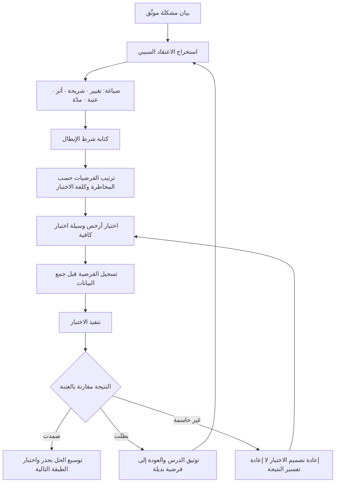

# الفرضية (Hypothesis)

> [!info] تعريف مختصر
> عبارة **سببية محدّدة وقابلة للإبطال** تقول: إذا فعلنا كذا لشريحة كذا، فسيحدث أثر كذا بمقدار كذا خلال مدة كذا — ونعرف أننا مخطئون إذا لم يحدث. الفرضية ليست رأيًا ولا هدفًا ولا نيّة؛ ما يميّزها عن كل ذلك هو **شرط الإبطال**: التصريح المسبق بالنتيجة التي إن ظهرت اعترفنا بأن الاعتقاد كان خاطئًا. وهي الوحدة الأساسية للتعلّم في تطوير المنتجات، لأنها تحوّل الجدال حول الآراء إلى تجربة يمكن أن تحسمها البيانات.

## الشرح العلمي والاحترافي
- **القابلية للإبطال هي الخط الفاصل**: المعيار المعروف في فلسفة العلم — والمنسوب إلى الفيلسوف **كارل بوبر (Karl Popper)** — هو أن العبارة تُعدّ علمية بقدر ما يمكن تصوّر دليل ينقضها. عبارة مثل «تحسين تجربة المستخدم سيزيد الرضا» لا يمكن نقضها بأي نتيجة تقريبًا، فهي ليست فرضية. أما «تقليص خطوات التسجيل من خمس إلى خطوتين سيرفع نسبة إتمام التسجيل لدى المستخدمين الجدد من الجوال من 42% إلى 55% خلال أسبوعين» فهي فرضية، لأن نتيجة 43% تنقضها صراحة.
- **البنية القياسية**: `نعتقد أن [تغييرًا محدّدًا] لصالح [شريحة محدّدة] سيؤدّي إلى [أثر قابل للقياس] بمقدار [عتبة رقمية] خلال [مدة]. سنعتبر الفرضية مُبطَلة إذا [شرط الإبطال]`. العنصران اللذان يُحذفان غالبًا هما **العتبة** و**شرط الإبطال** — وحذفهما هو تحديدًا ما يجعل التجربة غير حاسمة، إذ يمكن تفسير أي نتيجة بعدها لصالح ما كنّا نريده أصلًا.
- **الفرق بين الفرضية والهدف**: الهدف بيان طموح نلتزم بتحقيقه ([[OKR]]، [[SMART Goals]])؛ والفرضية اعتقاد نسعى لاختباره وقد نُسَرّ بإبطاله. الخلط بينهما ضارّ جدًّا: حين يُعامل الفريق فرضياته كأهداف يُصبح إبطالها فشلًا شخصيًّا، فيُدفع لا شعوريًّا إلى تأويل البيانات لصالحها — وهذا مدخل مباشر إلى [[Confirmation Bias]].
- **طبقات الفرضيات**: تُبنى عادة على ثلاث طبقات متمايزة: **فرضية المشكلة** (هل يعاني هؤلاء الناس من هذا العائق فعلًا وبهذه الكلفة؟)، و**فرضية الحل** (هل يزيل هذا الحل بالذات العائق؟)، و**فرضية النموذج** (هل يمكن تقديمه بكلفة وقناة توزيع تجعله مستدامًا؟). ترتيب هذه الطبقات ملزم: اختبار فرضية حل قبل التثبّت من فرضية المشكلة هو أكثر أسباب هدر جهد الفرق شيوعًا.
- **مصدر الفرضيات هو المشكلة لا العصف الذهني**: الفرضية السليمة تُشتقّ من [[Problem Statement]] موثّق ومن ملاحظات ميدانية، لا من جلسة أفكار حرّة. الأفكار الحرّة تُنتج فرضيات كثيرة متساوية الوجاهة ظاهريًّا، بينما الفرضية المشتقّة من مشكلة موصوفة تحمل معها معيار نجاحها سلفًا.
- **قوّة الفرضية تُقاس بما تخاطر به**: الفرضية التي تتوقّع «تحسّنًا ما» ضعيفة لأنها تكاد لا تخاطر بشيء؛ والتي تتوقّع مقدارًا محدّدًا في اتجاه محدّد قوية لأنها تعرّض نفسها للنقض. القاعدة العملية: كلما ضاق مدى النتائج التي تعدّها الفرضية «نجاحًا»، زاد ما تتعلّمه منها — سواء صحّت أو بطلت.
- **الاختبار لا يعني بالضرورة بناء منتج**: تُختبر الفرضيات بوسائل متدرّجة في الكلفة — مقابلة منظّمة ([[User Interview]])، صفحة هبوط، عرض تجريبي يدوي خلف الكواليس (Concierge)، تجربة A/B على واجهة قائمة، إطلاق محدود ([[Pilot Launch]])، وأخيرًا [[MVP]] كامل. اختيار أرخص وسيلة تكفي لحسم الفرضية هو مهارة جوهرية، وإهمالها يعني دفع كلفة برمجية كاملة مقابل معلومة كان يمكن شراؤها بمكالمتين.
- **تدوين الفرضية قبل التجربة شرط نزاهة**: تسجيل الفرضية والعتبة وشرط الإبطال **قبل** رؤية البيانات هو ما يمنع «تحريك الهدف بعد إطلاق السهم» (وهو ما يُعرف في أدبيات المنهج بمغالطة القنّاص، أو بالتحليل الانتقائي للنتائج). سجلّ القرارات ([[Decision Log]]) هو المكان الطبيعي لهذا التدوين.
- **إبطال الفرضية نتيجة ناجحة**: من حيث الاقتصاد، الفرضية المُبطَلة مبكّرًا وبكلفة صغيرة توفّر مبالغ ضخمة لاحقًا، تمامًا كما يصف [[Cost-of-Change Curve]]. الثقافة التي تعاقب على الإبطال تُنتج فرقًا لا تختبر شيئًا حقيقيًّا، بل تصمّم تجارب مضمونة النتيجة.

## أين ومتى يُستخدم
- **بعد صياغة المشكلة مباشرة**: تُشتقّ الفرضيات من [[Problem Statement]] وتُرتَّب بحسب خطورة الافتراض الكامن فيها عبر [[Assumption Mapping]].
- **في دورات الاكتشاف المستمر**: تُشكّل الفرضيات محتوى أسبوعي لـ[[Continuous Discovery]] و[[Product Discovery]]، وتُعلَّق على فروع [[Opportunity Solution Tree]] بحيث يقابل كل فرصة عدة فرضيات حلول متنافسة.
- **قبل بناء أي [[MVP]]**: لتحديد ما الذي يجب أن يثبته الحد الأدنى بالضبط؛ فالـ MVP بلا فرضية معلنة يتحوّل إلى نسخة أولى ناقصة لا إلى تجربة.
- **في تحسين مسارات التحويل والاحتفاظ**: كل تجربة A/B هي عمليًّا فرضية بعتبة ومدّة، وتُقاس بمؤشّر مرتبط بـ[[North Star Metric]] لا بمؤشّر محلّي قد يتحسّن على حساب الكل.
- **في تقييم المخاطر**: الفرضيات غير المُختبَرة عالية الأثر تُسجَّل بوصفها مخاطر في [[Risk Register]] و[[RAID Log]]، لأن الافتراض غير المُختبَر هو تعريف المخاطرة عمليًّا.
- **في قرارات المضيّ من عدمه**: تُستخدم نتائج الفرضيات مدخلًا لـ[[Go or No-Go Decision]]، بحيث يكون قرار الاستمرار مبنيًّا على ما ثبت لا على ما أُنفق.

## مثال وسيناريو تطبيقي
> [!example] منصّة سعودية لبيع قطع غيار السيارات للورش الصغيرة. لاحظ الفريق أن 63% ممن يضيفون قطعًا إلى السلّة لا يكملون الطلب. الرأي السائد داخل الشركة: «السعر مرتفع، نحتاج خصمًا».
> بدل تنفيذ الخصم مباشرة، كُتبت ثلاث فرضيات متنافسة بعتبات وشروط إبطال معلنة:
> **ف١ (السعر)**: نعتقد أن خصمًا بنسبة 10% لأصحاب الورش الذين تجاوزت سلّتهم 800 ريال سيرفع إتمام الطلب من 37% إلى 50% خلال ثلاثة أسابيع. تُبطَل إذا بقي الإتمام دون 42%.
> **ف٢ (اليقين في التوافق)**: نعتقد أن إظهار تأكيد صريح لتوافق القطعة مع طراز السيارة قبل الدفع سيرفع الإتمام إلى 50% في المدة نفسها. تُبطَل دون 42%.
> **ف٣ (وسيلة الدفع)**: نعتقد أن إتاحة الدفع الآجل لنهاية الشهر سيرفعه إلى 50%. تُبطَل دون 42%.
> رُتّبت الفرضيات بحسب كلفة الاختبار لا بحسب قناعة الإدارة. فرضية ٢ كانت الأرخص: شارة نصّية ورسالة تأكيد، ونُفّذت في أربعة أيام على 50% من الزيارات. النتيجة: 51% إتمام مقابل 38% في المجموعة الضابطة — أي أنها صمدت. أما فرضية ١ فاختُبرت لاحقًا على شريحة صغيرة وأُبطلت: 41% فقط رغم كلفة الخصم المباشرة على الهامش، ما يعني أن تنفيذها أولًا كان سيكلّف الشركة هامشًا دائمًا مقابل أثر لا يُذكر.
> الدرس الذي دوّنه الفريق في سجلّ القرارات: العائق الحقيقي لم يكن الثمن بل **الخوف من شراء قطعة لا تناسب**، وهو ما لم يقله أحد صراحة في أي اجتماع داخلي — لأن السعر تفسير جاهز ومريح، بينما القلق من الخطأ لا يُصرّح به المشتري بسهولة.

## خطوات أو مخطّط
1. ابدأ من [[Problem Statement]] مكتوب ومؤرَّخ، لا من فكرة حل.
2. استخرج الاعتقاد السببي الكامن: ما الذي نظنّ أنه يسبّب هذا السلوك؟
3. حدّد الشريحة بدقّة، وحدّد من ستستبعده من القياس ولماذا.
4. حدّد المؤشّر الوحيد الذي سيحكم، واحذر تعدّد المؤشّرات الذي يتيح انتقاء ما يوافقك.
5. اكتب العتبة الرقمية والمدّة الزمنية صراحة، قبل بدء أي جمع للبيانات.
6. اكتب **شرط الإبطال** بجملة واحدة لا تحتمل التأويل.
7. اختر أرخص وسيلة تكفي لحسم الفرضية، لا أقربها إلى ما تودّ بناءه.
8. سجّل كل ما سبق في [[Decision Log]] قبل التنفيذ.
9. نفّذ الاختبار دون تعديل العتبة أثناء الجري.
10. احسم: صمدت، أم بطلت، أم كانت النتيجة غير حاسمة (وهي حالة ثالثة مشروعة تستوجب إعادة تصميم الاختبار لا إعادة تفسير النتيجة).
11. دوّن ما تعلّمته حتى عند الإبطال، وارفعه إلى ذاكرة المؤسسة ([[Organizational Process Assets]]).

## ⚠️ مفاهيم خاطئة شائعة
> [!warning]
> - **«كل توقّع فرضية»**: خطأ. التوقّع الذي لا يمكن أن يُخطئ ليس فرضية. «نعتقد أن المستخدمين سيحبّون التصميم الجديد» عبارة لا يمكن نقضها لأنها بلا مؤشّر ولا عتبة — فهي أمنية بصيغة الجزم.
> - **«الفرضية التي بطلت تعني ضياع الجهد»**: خطأ جوهري. الإبطال المبكّر هو المخرَج الاقتصادي الأهم من الاختبار، لأنه يمنع إنفاقًا أكبر بكثير في الاتجاه الخطأ. الضياع الحقيقي هو الفرضية التي لم تُختبر أصلًا وبُني عليها منتج.
> - **«الفرضيات للشركات الناشئة فقط»**: خطأ. كل قرار في مؤسسة كبيرة يقوم على اعتقاد سببي، والفرق أن المؤسسة الكبيرة تدفع كلفة الخطأ متأخّرة وموزّعة فتصعب رؤيتها.
> - **«نحتاج بيانات كثيرة جدًّا لأي فرضية»**: خطأ في التعميم. فرضيات المشكلة تُحسم غالبًا بعدد صغير من المقابلات النوعية إذا كانت منضبطة؛ أما فرضيات الأثر الكمّي الدقيق فتحتاج حجم عيّنة كافيًا. الخلط بين النوعين يشلّ الفريق أو يخدعه.
> - **«إذا صمدت الفرضية فقد أثبتنا صحّتها»**: خطأ منهجي. الصمود يعني فقط أنها لم تُنقض في هذا الشرط وهذه المدّة وهذه الشريحة؛ التعميم خارج ذلك ادّعاء جديد يحتاج اختبارًا جديدًا.
> - **«يمكن تعديل العتبة أثناء التجربة إذا اتّضح أنها غير واقعية»**: خطأ خطير. تعديل العتبة بعد رؤية البيانات يُلغي كل قيمة الاختبار ويحوّله إلى تمرين تبريري. إن اتّضح خطأ العتبة، أوقف التجربة وأعد تصميمها معلنًا ذلك.

## ❌ ممارسات خاطئة في المشاريع
> [!failure]
> - **صياغة فرضيات بلا شرط إبطال**: الخطأ أن تُكتب العبارة وتُترك مفتوحة النهاية. لماذا يضرّ: أي نتيجة ستُقرأ لصالح ما نريد، فيتحوّل الاختبار إلى طقس شكلي. الحل: امنع اعتماد أي تجربة في مراجعة الأولويات ما لم تتضمّن جملة «تُبطَل إذا…» مكتوبة ومؤرّخة.
> - **اختبار عدّة تغييرات دفعة واحدة**: الخطأ أن يُطلق تعديل السعر والواجهة والرسائل معًا. لماذا يضرّ: يستحيل نسب الأثر إلى سببه، فيُبنى تعلّم زائف يُعمَّم على مشاريع لاحقة. الحل: افصل المتغيّرات، أو استخدم تصميمًا إحصائيًّا يسمح بالفصل، واقبل بطء التعلّم مقابل صحّته.
> - **اختبار فرضية الحل قبل التثبّت من فرضية المشكلة**: الخطأ أن يبني الفريق نموذجًا كاملًا لمشكلة لم تُتحقّق أصلًا. لماذا يضرّ: نتيجة الاختبار لا تعني شيئًا لأن الشريحة قد لا تعاني العائق أساسًا. الحل: رتّب الفرضيات طبقيًّا واشترط اجتياز طبقة المشكلة قبل تمويل أي بناء.
> - **اختيار المؤشّر بعد رؤية النتائج**: الخطأ أن تُعلن التجربة ناجحة بمؤشّر لم يكن مذكورًا في البداية («صحيح أن التحويل لم يرتفع، لكن مدة الجلسة زادت»). لماذا يضرّ: هذه صورة صريحة من [[Confirmation Bias]] وتُفسد ذاكرة المؤسسة بدروس مغلوطة. الحل: مؤشّر حاكم واحد يُثبَّت مسبقًا، وأي مؤشّر آخر يُصنَّف صراحةً «للاستكشاف لا للحسم».
> - **ربط تقييم أداء الأفراد بصمود فرضياتهم**: الخطأ أن يُكافأ من صمدت فرضيته ويُلام من بطلت. لماذا يضرّ: يدفع الفرق لتصميم تجارب آمنة بلا قيمة معرفية، ويقتل الإبلاغ عن النتائج السلبية. الحل: قِس جودة **تصميم** التجربة وسرعة التعلّم، لا اتجاه النتيجة، واحمِ ذلك بأمان نفسي معلن ([[Psychological Safety]]).
> - **إيقاف التجربة فور ظهور نتيجة مواتية**: الخطأ أن تُعلن النتيجة بعد يومين لأن الأرقام كانت جيدة. لماذا يضرّ: التقلّب المبكّر يُنتج إشارات كاذبة، خاصة مع تأثيرات الجدّة وأيام الأسبوع. الحل: ثبّت المدّة وحجم العيّنة مسبقًا والتزم بهما.
> - **الاكتفاء بالفرضيات الشفهية في الاجتماعات**: الخطأ أن تُطرح الفرضية نقاشًا ولا تُكتب. لماذا يضرّ: تتبدّل صياغتها في الأذهان بمرور الوقت، فيتذكّر كلٌّ منها ما يوافق موقفه الحالي. الحل: صفحة واحدة لكل فرضية، مؤرّخة ومحفوظة، تُراجَع عند إعلان النتيجة كما كُتبت لا كما تُذكر.

## 🔗 مصطلحات ومفاهيم ذات صلة
[[Problem Statement]] | [[Assumption Mapping]] | [[User Interview]] | [[The Mom Test]] | [[Confirmation Bias]] | [[MVP]] | [[Product Discovery]] | [[Continuous Discovery]] | [[Opportunity Solution Tree]] | [[Outcome vs Output]] | [[Decision Log]] | [[Go or No-Go Decision]]
