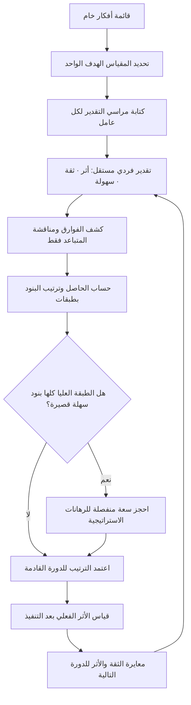

# تقييم ICE (ICE Scoring)

> [!info] تعريف مختصر
> طريقة سريعة لترتيب أولويات الأفكار والتجارب والميزات، تُعطي كل بند ثلاث درجات على مقياس موحّد (غالبًا من ١ إلى ١٠): **الأثر (Impact)** أي حجم التغيير المتوقّع في المقياس الذي نهتمّ به، و**الثقة (Confidence)** أي مدى قوة الدليل الذي يسند تقديرنا للأثر، و**السهولة (Ease)** أي قلّة الجهد والتعقيد المطلوبين للتنفيذ. ثم يُضرب الثلاثة في بعضها لينتج رقم واحد يُرتَّب به الـ Backlog تنازليًّا. جاذبيتها في أنها تُنجَز في دقائق وبلا اجتماع طويل؛ وخطرها في أن الضرب يضخّم أخطاء التقدير، وأن الرقم الناتج يبدو موضوعيًّا أكثر بكثير ممّا يستحق.

## الشرح العلمي والاحترافي
- **الأصل والمنشأ**: تُنسب صياغة ICE في سياق نموّ المنتجات الرقمية إلى **شون إليس (Sean Ellis)**، أحد أبرز من روّجوا لمنهج "قرصنة النمو" (Growth Hacking)، الذي استخدمها لترتيب ركام أفكار التجارب التي ينتجها فريق النمو أسبوعيًّا. السياق الذي وُلدت فيه مهمّ لفهم حدودها: هي أداة لفرز **تجارب صغيرة سريعة ومتكرّرة** — تغيير عنوان، اختبار رسالة، تعديل تدفّق تسجيل — لا لاتخاذ قرارات استثمار ضخمة أو معمارية. حين تُنقل خارج هذا السياق تفقد كثيرًا من ملاءمتها.
- **البنية الرياضية ومعناها**: النتيجة = الأثر × الثقة × السهولة. الضرب (لا الجمع) اختيار متعمّد: يجعل أي عامل منخفض جدًّا **يُسقط البند كلّه**. فكرة أثرها ١٠ وثقتها ١ وسهولتها ١٠ تنتج ١٠٠، بينما فكرة متوسّطة في كل شيء (٦×٦×٦) تنتج ٢١٦. المنطق الضمني: لا قيمة لأثر ضخم لا نملك عليه دليلًا، ولا لفكرة سهلة بلا أثر. لكن الوجه الآخر لهذا الاختيار هو **تضخيم الخطأ**: خطأ نقطة واحدة في كل عامل قد يغيّر الناتج بنسبة تتجاوز ٤٠٪، فترتيب البنود المتقاربة يصبح ضجيجًا لا إشارة.
- **الثقة هي العامل الذي يمنح ICE قيمتها الحقيقية**: أغلب طرائق الترتيب تسأل عن القيمة والكلفة فقط، فتعامل التقدير المبني على بيانات فعلية والتقدير المبني على حدس مدير تنفيذي معاملة واحدة. عامل الثقة يجبر الفريق على التصريح بجودة الدليل: هل عندنا بيانات تحليلية ([[Product Analytics]])؟ اختبار سابق مشابه؟ مقابلات مستخدمين ([[User Interview]])؟ أم مجرّد رأي؟ ولهذا يُنصح بربط درجات الثقة بسُلَّم أدلّة معلَن (مثلًا: ٩–١٠ تجربة مضبوطة سابقة، ٦–٨ بيانات ارتباطية، ٣–٥ مقابلات نوعية، ١–٢ حدس) بدل تركها للانطباع.
- **"السهولة" ليست "الجهد" مقلوبًا فحسب**: في ICE تُرفع السهولة كلما قلّت الكلفة، بعكس الطرائق التي تضع الجهد في المقام. الفرق ليس شكليًّا: السهولة تشمل — إلى جانب ساعات التطوير — التبعيّات ([[Dependency]])، والحاجة إلى موافقات، وحجم المخاطر التشغيلية، وسهولة التراجع ([[Rollback]]). البند الذي يستغرق يومين برمجة لكنه يتطلّب موافقة جهة تنظيمية ليس "سهلًا".
- **علاقتها بـ RICE**: صيغة [[RICE Prioritization]] تضيف عامل **المدى (Reach)** — كم مستخدمًا يمسّه البند في فترة زمنية — وتقسم على الجهد بدل ضربه. أي أن ICE هي الحالة المبسّطة التي تُطوى فيها فكرة المدى داخل "الأثر". هذا التبسيط مقبول حين تكون البنود متجانسة في جمهورها، وخطر حين تُقارَن ميزة تمسّ ١٪ من المستخدمين بأخرى تمسّ ٨٠٪.
- **مقياس عشرة نقاط بلا تعريف = وهم دقّة**: أخطر ما في ICE أن مقياس ١–١٠ يبدو دقيقًا وهو في الحقيقة **ترتيبي (Ordinal)** لا نسبي (Ratio). الفرق بين ٧ و٨ ليس بالضرورة كالفرق بين ٢ و٣، وضرب أرقام ترتيبية عملية مشكوك فيها رياضيًّا. العلاج العملي ليس هجر الطريقة، بل **تثبيت مراسٍ (Anchors) مكتوبة** لكل درجة، واستخدام سلّم خشن (١، ٣، ٥، ٨) بدل عشر درجات وهمية.
- **الترتيب مخرَج نقاش لا بديل عنه**: القيمة الأكبر لـ ICE غالبًا ليست في الرقم بل في **الانحراف بين تقديرات الأفراد**. حين يعطي مهندس درجة سهولة ٣ ومدير منتج ٩ للبند نفسه، فقد كشفت الأداة سوء فهم في النطاق يستحقّ خمس دقائق نقاش أكثر ممّا يستحقّه أي متوسّط حسابي. لذلك يُفضَّل التقدير المستقلّ أولًا ثم كشف الفوارق — على غرار منطق [[Planning Poker]].
- **موضعها من الأدوات الأخرى**: ICE أداة **فرز أوّلي (Triage)** لا أداة قرار نهائي. تصلح لتقليص قائمة من ٦٠ فكرة إلى ١٢ تستحقّ النقاش، ثم يُنتقل إلى أدوات أعمق: [[WSJF]] حين تكون كلفة التأخير حاسمة، أو [[Weighted Scoring]] حين تتعدّد المعايير الاستراتيجية، أو [[Opportunity Scoring]] حين يكون السؤال عن فجوات الرضا لدى العميل.

## أين ومتى يُستخدم
- **في فرز قائمة تجارب النمو أو التحسينات الصغيرة**: حين تتجاوز الأفكار قدرة الفريق بأضعاف، وتكون كل فكرة قابلة للتنفيذ خلال دورة قصيرة، وتُقاس بمقياس واحد مشترك مثل [[North Star Metric]].
- **في جلسات [[Backlog Refinement]] السريعة**: كوسيلة لاستبعاد الذيل الطويل من البنود التي لا تستحقّ حتى الشرح، بدل استهلاك الاجتماع في مناقشة كل بند بالتساوي.
- **عند اختبار الفرضيات في مسار الاكتشاف**: كل [[Hypothesis]] يُقيَّم بأثره المحتمل وثقتنا فيه وسهولة اختباره — وهو استعمال طبيعي جدًّا داخل [[Continuous Discovery]] و[[Dual-Track Agile]].
- **في تحديد ما يدخل نطاق [[MVP]]**: البنود ذات الأثر العالي والسهولة العالية والثقة المعقولة تُشكّل نواة الإصدار الأول، وما دونها يُؤجَّل إلى أفق لاحق في [[Now-Next-Later Roadmap]].
- **في اختيار المكاسب السريعة**: يتقاطع مباشرة مع منطق [[Quick Wins vs Big Bangs]]، إذ يميل ICE بحكم بنيته إلى تفضيل السهل — وهي ميزة عند بناء الزخم، وعيب إن استمرّت سنة.
- **كأداة كشف اختلاف لا كأداة حساب**: في فرق فيها خلاف مزمن على الأولويات، يُستعمل ICE لإظهار أن الخلاف ليس على القيمة بل على الثقة أو على تقدير الجهد — فيتحوّل النقاش من مواقف إلى وقائع.

## مثال وسيناريو تطبيقي
> [!example] منصّة توصيل خليجية لديها فريق نموّ من ٥ أشخاص و**٤٧ فكرة** مقترحة لرفع نسبة إتمام الطلب (Checkout Completion) المتعثّرة عند **٦١٪**. الاجتماع الأول استُهلك كاملًا في مناقشة ٦ أفكار فقط، فقرّر الفريق تطبيق ICE بمقياس خشن (١، ٣، ٥، ٨) مع مراسٍ مكتوبة: درجة ثقة ٨ تعني «لدينا تجربة سابقة مشابهة نجحت»، ودرجة ٣ تعني «رأي فريق خدمة العملاء فقط».
> قدّر كل عضو الأفكار منفردًا ثم كُشفت الفوارق. النتائج بعد التوحيد:
>
> | الفكرة | الأثر | الثقة | السهولة | ICE |
> |---|---|---|---|---|
> | تفعيل الدفع عند الاستلام ([[Cash on Delivery]]) | 8 | 8 | 5 | 320 |
> | حفظ العنوان تلقائيًّا من الطلب السابق | 5 | 8 | 8 | 320 |
> | إعادة تصميم شاشة الدفع بالكامل | 8 | 3 | 1 | 24 |
> | إضافة محفظة رقمية جديدة | 8 | 5 | 1 | 40 |
> | رسالة تذكير للسلّة المتروكة | 5 | 5 | 5 | 125 |
>
> اللافت أن «إعادة تصميم شاشة الدفع» كانت الفكرة المفضّلة لدى الإدارة، لكن درجتها انهارت لسببين معًا: ثقة منخفضة (لا دليل على أن التصميم هو سبب التعثّر) وسهولة منخفضة جدًّا. وقد كشف الانحراف في التقديرات مشكلة أهم: مهندسان أعطيا «الدفع عند الاستلام» سهولة ١ بينما أعطاها مدير المنتج ٨ — والسبب أن المهندسين كانا يحسبان تكامل التسوية المحاسبية مع الشركاء، وهو عمل لم يكن في ذهن مدير المنتج أصلًا. أُعيد التقدير إلى ٥ بعد تجزئة البند.
> نفّذ الفريق البندين الأعلى خلال ٣ أسابيع، فارتفعت نسبة الإتمام إلى **٦٩٪**. لكن بعد أربعة أشهر ظهرت مشكلة الطريقة: كل البنود المنفَّذة كانت من فئة «سهلة»، وتراكم دين تقني ([[Technical Debt]]) في شاشة الدفع نفسها، وثبتت النسبة عند سقف ٧٠٪ تقريبًا. اضطرّ الفريق حينها لإخراج إعادة التصميم من ICE كليًّا ومعالجتها كرهان استراتيجي بقرار صريح — وهو الحدّ الطبيعي الذي تتوقّف عنده هذه الأداة.

## خطوات أو مخطّط
1. حدّد **المقياس الهدف الواحد** الذي يُقاس عليه "الأثر" (نسبة تحويل، احتفاظ، زمن إنجاز). بلا هدف واحد معلَن، تصبح الدرجات غير قابلة للمقارنة.
2. اكتب **مراسي التقدير** لكل عامل قبل الجلسة: ماذا تعني درجة ٨ في الأثر؟ وماذا تعني ٣ في الثقة؟ ثبّتها في وثيقة يراها الجميع.
3. اختر سلّمًا خشنًا (١، ٣، ٥، ٨) بدل ١–١٠ لتقليل وهم الدقّة.
4. اجعل كل مشارك يقدّر **منفردًا** قبل رؤية تقديرات غيره، منعًا لأثر الإرساء والتحيّز نحو رأي الأعلى منصبًا.
5. اكشف الفوارق، وناقش فقط البنود التي تباعدت فيها التقديرات بدرجتين أو أكثر — فهذه هي مواضع سوء الفهم الحقيقي.
6. احسب الناتج، ورتّب تنازليًّا، ثم **تعامل مع النتائج كطبقات لا كصفوف**: البنود المتقاربة (فرق أقل من ٢٠٪) تُعدّ في المرتبة نفسها ويُفصل بينها بمعيار آخر.
7. طبّق فحص السلامة: هل النتيجة تخلو من أي رهان استراتيجي طويل الأمد؟ إن كان الجواب نعم، احجز حصّة ثابتة من السعة للرهانات خارج الترتيب.
8. بعد التنفيذ، **راجع دقّة تقديراتك** بمقارنة الأثر الفعلي بالمقدَّر، واستخدم الفارق لمعايرة درجات الثقة مستقبلًا.

## ⚠️ مفاهيم خاطئة شائعة
> [!warning]
> - **اعتبار الرقم الناتج موضوعيًّا**: الناتج حاصل ضرب ثلاثة أحكام تقديرية، فهو رأي مُقنَّع بصيغة رياضية. لا يكتسب صحّة إضافية لأنه مكتوب بأرقام. الصحيح أن يُقرأ كملخّص لنقاش، وأن يُذكر معه أساس كل درجة.
> - **الخلط بين "الثقة" و"التفاؤل"**: كثيرون يرفعون الثقة لأنهم يحبّون الفكرة، بينما الثقة تقيس **قوة الدليل** لا قوة الحماس. علاجها الوحيد ربط الدرجة بسُلَّم أدلّة مكتوب.
> - **الظنّ بأن ICE بديل عن RICE أو WSJF**: هي أداة فرز أوّلي لبنود صغيرة متجانسة. حين تتفاوت البنود في عدد المستخدمين المتأثّرين، فـ[[RICE Prioritization]] أدقّ؛ وحين تكون حساسية التوقيت هي المتغيّر الحاسم، فـ[[WSJF]] أنسب لأنه يُدخل [[Cost of Delay]] صراحةً.
> - **افتراض أن الترتيب يعني تسلسل التنفيذ حرفيًّا**: البند الأعلى قد يكون محجوبًا بتبعيّة أو بغياب مهارة. الترتيب مُدخَل لقرار التخطيط لا بديل عنه.
> - **قياس "الأثر" بمقاييس مختلفة لبنود مختلفة**: مقارنة بند أثره على الإيراد ببند أثره على رضا الفريق داخل الجدول نفسه تُفسد الترتيب كلّه. إمّا مقياس واحد، وإمّا تقييم منفصل لكل فئة.
> - **الاعتقاد بأن المقياس من ١ إلى ١٠ يُحسّن الدقّة**: عشر درجات تعطي وهم تمييز لا يستطيع البشر إنتاجه فعليًّا. السلّم الخشن أصدق وأسرع، ويقلّل الجدل حول فروق لا معنى لها.

## ❌ ممارسات خاطئة في المشاريع
> [!failure]
> - **الخطأ: تقدير جماعي مفتوح يبدأ فيه أعلى الحاضرين منصبًا.** لماذا يضرّ: يُنتج إجماعًا زائفًا؛ فالدرجات تلتفّ حول رأيه ويضيع الاختلاف الذي هو أثمن مخرجات الأداة. الحل: تقدير فردي مكتوب أولًا، ثم كشف متزامن، ثم نقاش الفوارق فقط.
> - **الخطأ: ترك عامل الثقة عند ٨ أو ٩ لكل البنود.** لماذا يضرّ: يُلغي فعليًّا العامل الوحيد الذي يميّز ICE، فتتحوّل المعادلة إلى «أثر × سهولة» وتنحاز إلى الأفكار الجذّابة بلا دليل. الحل: افرض توزيعًا واقعيًّا واشترط سطرًا واحدًا يذكر مصدر الدليل بجانب كل درجة ثقة تتجاوز ٦.
> - **الخطأ: استخدام ICE لترتيب مبادرات كبيرة متعدّدة الفصول.** لماذا يضرّ: البنود الكبيرة تحصل حتمًا على سهولة منخفضة فتُدفن دائمًا، فتتحوّل خارطة الطريق إلى سلسلة تحسينات تجميلية بلا تقدّم استراتيجي — وهو طريق مباشر إلى [[Feature Factory]]. الحل: احصر ICE في البنود التي تُنجَز داخل دورة واحدة، وافصل ميزانية مستقلّة للرهانات الكبرى.
> - **الخطأ: عدم مراجعة التقديرات بعد التنفيذ.** لماذا يضرّ: يبقى الفريق يقدّر بالحدس نفسه سنوات، ولا تتحسّن معايرته أبدًا. الحل: سجّل الأثر المقدَّر مقابل الفعلي في [[Decision Log]]، وراجع الانحراف كل ربع كما تُراجع [[Estimation Variance]].
> - **الخطأ: التلاعب بالدرجات لتبرير قرار متّخذ سلفًا.** لماذا يضرّ: يُفقد الأداة مصداقيتها لدى الفريق نهائيًّا، فيصير الجميع يعرف أن الأرقام تُهندَس عكسيًّا. الحل: إن كان القرار سياسيًّا أو استراتيجيًّا، أعلنه صراحةً بوصفه قرار قيادة ولا تُمرّره عبر جدول تقييم.
> - **الخطأ: تجاهل التبعيّات وتكاليف التشغيل في تقدير السهولة.** لماذا يضرّ: بنود تبدو سهلة تتفجّر عند التنفيذ بسبب موافقات أو تكامل خارجي، فينهار التخطيط وتضيع الثقة بالترتيب. الحل: اجعل قائمة فحص قصيرة للسهولة تشمل: تبعيّة خارجية؟ موافقة تنظيمية؟ ترحيل بيانات؟ إمكانية تراجع؟
> - **الخطأ: تشغيل ICE على بنود غير معرّفة بما يكفي.** لماذا يضرّ: التقدير يصير على عناوين لا على نطاق، فيختلف كل مقدّر عمّا يقدّره أصلًا. الحل: اشترط حدًّا أدنى من الوضوح شبيهًا بـ[[Definition of Ready]] قبل إدخال أي بند في الجدول.

## 🔗 مصطلحات ومفاهيم ذات صلة
[[RICE Prioritization]] | [[Weighted Scoring]] | [[WSJF]] | [[MoSCoW Prioritization]] | [[Kano Model]] | [[Opportunity Scoring]] | [[Now-Next-Later Roadmap]] | [[Cost of Delay]] | [[Backlog Refinement]] | [[Hypothesis]] | [[Product Analytics]]
