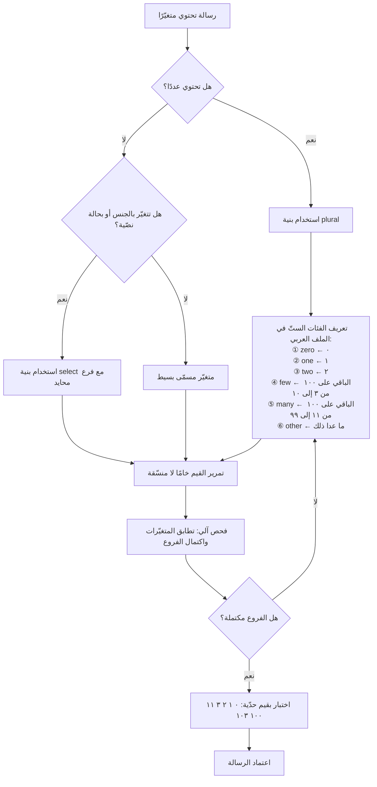

# صيغة رسائل ICU (ICU Message Format)

> [!info] تعريف مختصر
> صيغة معيارية لكتابة الرسائل النصّية المتغيّرة داخل البرمجيات، تسمح بأن تُكتب الرسالة **سلسلة واحدة كاملة** تحتوي متغيّرات ومنطق اختيار داخلها — بدل تجميعها برمجيًّا من أجزاء نصّية متفرّقة. تنتمي إلى مشروع **ICU (International Components for Unicode)**، وهي المكتبة المرجعية في الصناعة لدعم Unicode والتدويل، وتعتمد بيانات **CLDR** لقواعد الجمع والتنسيق. أهميتها المركزية أنها تنقل **قرار الصياغة النحوية إلى المترجم** حيث يجب أن يكون: فالمطوّر يمرّر عددًا أو جنسًا، والمترجم يقرّر كيف تُصاغ الجملة في لغته. وهي حاسمة في العربية تحديدًا لأن العربية من اللغات النادرة التي تستعمل **فئات الجمع الستّ كاملة** في معيار CLDR، وهو أعقد نظام جمع في اللغات الشائعة، ومصدر متكرّر لأخطاء تمرّ إلى الإنتاج بلا أي رسالة خطأ.

## الشرح العلمي والاحترافي

- **المشكلة الجذرية: التجميع النصّي (String Concatenation)**: الطريقة الشائعة لبناء الرسائل هي جمع أجزاء برمجيًّا: نصّ + متغيّر + نصّ. هذه البنية تنهار عند الترجمة لثلاثة أسباب مجتمعة: **رتبة الكلمات** تختلف بين اللغات فقد يجب أن يسبق المتغيّر النصّ لا أن يتلوه؛ و**الإعراب والتذكير والتأنيث** يجعلان الجزء الثابت متغيّرًا بحسب ما حوله؛ و**قواعد الجمع** قد تفرض إعادة صياغة الجملة كلّها لا كلمة واحدة فيها. والأسوأ أن المترجم يستلم أجزاءً معزولة بلا سياق فلا يعرف أصلًا أنها ستُركَّب معًا. الحلّ المعياري: رسالة واحدة كاملة بمتغيّرات مسمّاة، والمنطق داخل الرسالة لا حولها.

- **البنى الأساسية في الصيغة**: تدعم الصيغة متغيّرات مسمّاة تُستبدل بقيمها، و**وسوم تنسيق** تجعل الرقم أو التاريخ أو العملة يُنسَّق تلقائيًّا حسب [[Locale|الـLocale]] بدل تنسيقه يدويًّا قبل الإدراج، و**بنية `plural`** التي تختار الصياغة بحسب فئة العدد، و**بنية `select`** التي تختار بحسب قيمة نصّية كالجنس أو نوع الحساب، و**بنية `selectordinal`** للأعداد الترتيبية. وتدعم التداخل: رسالة تختار بحسب الجنس ثم بحسب العدد داخل كل فرع.

- **مفهوم فئات الجمع في CLDR**: المعيار لا يعرّف «مفرد وجمع» بل مجموعة من **الفئات الممكنة عالميًّا** هي: `zero`, `one`, `two`, `few`, `many`, `other`. كل لغة تستعمل ما تحتاجه منها فقط. الإنجليزية تستعمل اثنتين (`one`, `other`)، وكثير من اللغات تستعمل ثلاثًا أو أربعًا، و**العربية تستعملها الستّ كاملة**. وهنا تكمن الخطورة العملية: مطوّر يكتب الرسالة الأصلية بفرعين فقط لأن لغته تكتفي بهما، ثم يستلم المترجم العربي بنية لا تتّسع للفئات المطلوبة أصلًا. الصيغة المعيارية تحلّ ذلك لأن ملف كل لغة يعرّف فروعه بنفسه، ولا يُلزَم بعدد فروع اللغة الأصلية.

- **فئات الجمع الستّ في العربية — التفصيل الحاكم**:

| الفئة | القاعدة العددية | أمثلة | الصياغة العربية النموذجية |
|---|---|---|---|
| `zero` | العدد = 0 | 0 | «لا توجد رسائل» |
| `one` | العدد = 1 | 1 | «رسالة واحدة» |
| `two` | العدد = 2 | 2 | «رسالتان» |
| `few` | باقي القسمة على 100 يقع بين 3 و10 | 3، 7، 10، 103، 205، 1006 | «{n} رسائل» |
| `many` | باقي القسمة على 100 يقع بين 11 و99 | 11، 25، 99، 111، 1099 | «{n} رسالة» |
| `other` | كل ما عدا ذلك | 100، 101، 102، 200، 1000، والكسور | «{n} رسالة» |

  ثلاث ملاحظات عملية تُخطئ فيها الفرق باستمرار. **الأولى**: الفئات تتبع **باقي القسمة على 100** لا العدد نفسه، فالعدد 103 ينتمي إلى `few` لا إلى `other`، والعدد 1099 ينتمي إلى `many`. **الثانية**: العدد 100 و101 و102 تقع كلّها في `other` وهو ما يفاجئ من يفترض تناظرًا مع 1 و2 و3. **الثالثة**: هذه فئات **صرفية للغة**، وقد لا تقابل تمامًا الصياغة البلاغية المفضّلة في نصّ تسويقي — والمترجم هو من يقرّر الصياغة داخل كل فرع، لا المطوّر.

- **بنية `select` للجنس والحالات النصّية**: العربية تُذكِّر وتؤنِّث في الفعل والصفة والضمير، فجملة مثل «قام بتعديل الملف» تختلف عن «قامت بتعديل الملف». الحلّ المعياري هو تمرير قيمة الجنس كمتغيّر والسماح للملف العربي بتعريف فروع له، حتى لو كانت اللغة الأصلية لا تحتاج ذلك إطلاقًا. وهنا اشتراط تصميمي مهمّ: **يجب أن يوجد فرع افتراضي محايد** لحالة عدم معرفة الجنس، وألّا يُجبَر المنتج على تخمينه — فالتخمين الخاطئ أسوأ من الصياغة المحايدة.

- **التنسيق داخل الرسالة لا خارجها**: من الأخطاء الشائعة تنسيق الرقم أو التاريخ في الكود ثم إدراج النتيجة كنصّ. هذا يكسر أمرين: يفقد الرسالةَ القدرةَ على تنسيق القيمة حسب Locale المستخدم، ويكسر منطق الجمع لأن البنية تحتاج **القيمة العددية** لا نصّها المنسَّق. القاعدة: مرّر القيمة الخام، ودع الصيغة تتولّى التنسيق.

- **الأثر التشغيلي على سلسلة الترجمة**: تُخزَّن الرسائل بصيغة ICU في ملفات الموارد، وتدعمها منصّات إدارة الترجمة بواجهات تُظهر للمترجم فروع الجمع المطلوبة **للغته تحديدًا** فتمنعه من إغفال فئة. كما يمكن التحقّق آليًّا من صحّة بنية الرسالة في أنبوب [[CI and CD]]: هل المتغيّرات في الترجمة تطابق الأصل؟ هل الفروع مكتملة؟ هل الأقواس متوازنة؟ وهذه فحوصات رخيصة تمنع فئة كاملة من الأعطال قبل الدمج.

- **حدود الصيغة وتكلفتها**: الرسائل المتداخلة العميقة (اختيار داخل اختيار داخل جمع) تصير عسيرة القراءة على المترجم ومصدرًا للخطأ. القاعدة العملية: إن بلغت الرسالة مستويين من التداخل، فالغالب أن التصميم النصّي نفسه يحتاج تبسيطًا — بتقسيم الجملة أو بإعادة صياغة الواجهة. كما أن الصيغة تحتاج مكتبة تشغيل ووعيًا من الفريق، وهذه كلفة إعداد حقيقية لكنها تُدفع مرّة.

## أين ومتى يُستخدم

- **في كل رسالة تحتوي عددًا متغيّرًا**: عدّادات النتائج والإشعارات وسلال الشراء وعناصر القوائم — أي موضع يظهر فيه رقم متبوعًا باسم.
- **في كل رسالة تشير إلى شخص**: لأن العربية تفرض التذكير والتأنيث في الفعل والضمير، وهو ما يتعذّر حلّه بأي أسلوب آخر غير `select`.
- **في رسائل الأخطاء والتحقّق**: وهي أكثر المواضع التي تُبنى بالتجميع النصّي وأشدّها ضررًا لأنها تظهر في لحظة إحباط المستخدم — وهي نقطة يجب أن تُغطّى صراحةً في [[Edge Cases]].
- **في أعمال [[Internationalization|التدويل]]**: إعادة صياغة الرسائل المركّبة بصيغة ICU من أهم بنود عمل التدويل وأكثرها استهلاكًا للوقت في الأنظمة القائمة.
- **في تعريف [[Definition of Done]]**: «لا تجميع نصّي لبناء رسائل» و«كل رسالة ذات عدد تستخدم بنية جمع» شرطا قبول قابلان للفحص الآلي.
- **في اختبار الحدود**: يجب أن تُختبر الرسائل بقيم تغطّي الفئات الستّ (0، 1، 2، 3، 11، 100 على الأقل) وهي حالة نموذجية يجب أن تدخل [[Regression Testing|اختبار الانحدار]].
- **في عقود المورّدين اللغويين**: [[Vendor Management]] يجب أن يشترط دعم صيغة ICU في المنصّة المستخدمة، وإلا استُلمت ترجمات ناقصة الفروع.

## مثال وسيناريو تطبيقي

> [!example] منصّة تجارة إلكترونية سعودية تعرض في سلّة الشراء رسالة عدد المنتجات. كانت الرسالة مبنيّة في الكود بتجميع نصّي: نصّ «لديك » + العدد + نصّ « منتجات في السلّة». بدت صحيحة لأن أغلب اختبارات الفريق جرت بعدد 5.
> ما رآه المستخدمون فعليًّا: «لديك 0 منتجات في السلّة» في الحالة الفارغة، و«لديك 1 منتجات»، و«لديك 2 منتجات»، و«لديك 25 منتجات» — أربع صياغات خاطئة نحويًّا من أصل ست حالات ممكنة. لم يُبلَّغ عن أي منها كعطل، لأن النظام لم يفشل ولم تظهر رسالة خطأ؛ لكن ما وثّقه فريق البحث في جلسات قابلية الاستخدام أن مستخدمين وصفوا المنصّة بأنها «تبدو غير مهنية» دون أن يستطيعوا تحديد السبب.
> الأشدّ ضررًا كان في مسار الدفع: رسالة «سيصلك طلبك خلال {n} أيام» ظهرت لعميل بمهلة يومين هكذا: «خلال 2 أيام»، ولعميل آخر بمهلة 11 يومًا هكذا: «خلال 11 أيام». وفي شاشة الإرجاع كانت رسالة «قام العميل بإلغاء الطلب» تُعرض بصيغة مذكّرة دائمًا حتى للعميلات، وهو ما ورد صراحةً في شكاوى الدعم.
> أعاد الفريق كتابة الرسائل بصيغة ICU: رسالة واحدة كاملة بستّة فروع جمع مكتملة في الملف العربي — `zero`: «سلّتك فارغة»، `one`: «لديك منتج واحد في السلّة»، `two`: «لديك منتجان في السلّة»، `few`: «لديك {n} منتجات في السلّة»، `many`: «لديك {n} منتجًا في السلّة»، `other`: «لديك {n} منتج في السلّة». ولاحظ الفريق أن فرع `zero` أتاح صياغة **مختلفة كليًّا** لا مجرّد تصريف مختلف، وهي ميزة تصميمية لم تكن ممكنة بالتجميع النصّي أصلًا.
> ثم أُضيف فحص آلي في أنبوب البناء يرفض أي ملف ترجمة عربي تنقصه فئة من الفئات الستّ في رسالة ذات عدد، واختبار وحدة يمرّر القيم 0، 1، 2، 3، 11، 100، 103 على كل رسالة جمع. النتيجة التي سجّلها الفريق: 74 رسالة كانت مبنيّة بالتجميع النصّي أُعيدت صياغتها، واختفت فئة الشكاوى المتعلّقة بـ«ركاكة اللغة» من تذاكر الدعم خلال دورتين.

## خطوات أو مخطّط

1. جرد كل الرسائل التي تُبنى بتجميع نصّي أو تحتوي عددًا أو إشارة إلى شخص، وتصنيفها بأولوية بحسب ظهورها للمستخدم.
2. إعادة كتابة كل رسالة كسلسلة واحدة كاملة بمتغيّرات **مسمّاة** (لا مرقّمة، لأن الأسماء تعطي المترجم سياقًا).
3. استخدام بنية `plural` لكل رسالة ذات عدد، وبنية `select` لكل رسالة تتغيّر بالجنس أو بحالة نصّية.
4. تمرير القيم **خامًا** (رقمًا، تاريخًا، مبلغًا) وترك تنسيقها للصيغة بحسب الـ[[Locale]]، لا تنسيقها في الكود قبل الإدراج.
5. تعريف فروع الجمع الستّ كاملة في الملف العربي، مع صياغة مستقلّة لفرع `zero` لا مجرّد تصريف.
6. توفير فرع محايد افتراضي في بنى `select` لحالة عدم معرفة الجنس، ومنع تخمينه.
7. تزويد المترجم بالسياق: وصف الموضع، ونوع كل متغيّر، ومداه المتوقّع، ولقطة شاشة.
8. تفعيل فحوصات آلية في أنبوب [[CI and CD]]: تطابق المتغيّرات مع الأصل، اكتمال فروع الجمع لكل لغة، توازن الأقواس.
9. كتابة اختبارات تمرّ على القيم الحدّية للفئات الستّ: 0، 1، 2، 3، 10، 11، 99، 100، 103.
10. مراجعة الرسائل بالغة التداخل وتبسيطها على مستوى نصّ الواجهة نفسه إن تجاوزت مستويين.

## ⚠️ مفاهيم خاطئة شائعة

> [!warning]
> - **«يكفي فرعان: مفرد وجمع»**: صحيح في الإنجليزية، خاطئ تمامًا في العربية التي تستعمل الفئات الستّ كاملة. تصميم الرسالة بفرعين يجعل الترجمة العربية الصحيحة **مستحيلة بنيويًّا** مهما كان المترجم بارعًا.
> - **«الفئات تتبع العدد نفسه»**: لا، تتبع **باقي القسمة على 100**. فـ103 تقع في `few` و1099 تقع في `many`، بينما 100 و101 و102 تقع كلّها في `other`. الاختبار بأعداد صغيرة فقط يمرّر أخطاء تظهر مع الأعداد الكبيرة.
> - **«فرع zero يعني عرض الرقم صفر»**: هو فرصة لصياغة **مختلفة كليًّا** أفضل للمستخدم: «سلّتك فارغة» بدل «لديك 0 منتجات». إغفال ذلك يُنتج جملًا صحيحة نحويًّا لكنها ركيكة في أكثر الحالات شيوعًا.
> - **«الجمع مسألة لغوية تخصّ المترجم وحده»**: هي مسألة **معمارية** أولًا. إن بُنيت الرسالة بالتجميع النصّي، لا يملك المترجم أي وسيلة لإصلاحها. المطوّر هو من يفتح الباب أو يغلقه.
> - **«صيغة ICU تخصّ الجمع فقط»**: تشمل أيضًا التنسيق حسب Locale للأرقام والتواريخ والعملات، والاختيار بحسب الجنس أو أي حالة نصّية، والأعداد الترتيبية. حصرها في الجمع يُبقي فئات أخطاء كاملة بلا حلّ.
> - **«المتغيّرات المرقّمة كافية»**: متغيّر باسم `{count}` يعطي المترجم معلومة، ومتغيّر باسم `{0}` لا يعطيه شيئًا — فلا يعرف أهو عدد أم اسم أم تاريخ، وقد يعيد ترتيبه خطأً. التسمية جزء من جودة الترجمة لا تفصيل أسلوبي.
> - **«ننسّق الرقم في الكود ثم نمرّره»**: هذا يكسر منطق الجمع لأن البنية تحتاج قيمة عددية لا نصًّا، ويمنع التنسيق الصحيح حسب [[Locale|الـLocale]]. مرّر القيمة الخام دائمًا.

## ❌ ممارسات خاطئة في المشاريع

> [!failure]
> - **بناء الرسائل بالتجميع النصّي**: الخطأ — تُركَّب الجملة برمجيًّا من نصّ + متغيّر + نصّ. لماذا يضرّ — يستلم المترجم أجزاءً معزولة بلا سياق ولا يستطيع تغيير الرتبة ولا الإعراب ولا فروع الجمع، فتنتج جمل مكسورة في كل لغة غير الأصلية. الحل — رسالة واحدة كاملة بمتغيّرات مسمّاة، مع قاعدة فحص آلي تمنع التجميع النصّي في مراجعة الكود.
> - **الاكتفاء بفرعَي جمع لأن اللغة الأصلية تكتفي بهما**: الخطأ — يُصمَّم مفتاح الرسالة بفرعين وتُبنى عليه الملفات كلّها. لماذا يضرّ — يصير النقص بنيويًّا: الملف العربي لا يجد مكانًا لتعريف `two` و`few` و`many`، فتُعرض صياغة واحدة لكل الأعداد. الحل — استخدم بنية جمع تسمح لكل لغة بتعريف فروعها بحرّية، وافحص اكتمال الفروع لكل لغة آليًّا.
> - **اختبار رسائل الجمع بعدد واحد**: الخطأ — تُختبر الرسالة بقيمة 5 فقط فتبدو سليمة. لماذا يضرّ — تمرّ خمس حالات خاطئة إلى الإنتاج بلا أي إشارة، لأن الخطأ نحوي لا برمجي ولا يرفع أي إنذار — وهو نموذج صافٍ لعيب متسرّب يرفع [[Escaped Defect Rate]]. الحل — اجعل اختبار القيم الحدّية للفئات الستّ إلزاميًّا في مجموعة الاختبار الآلي.
> - **تخمين جنس المستخدم لملء بنية `select`**: الخطأ — يُستنتج الجنس من الاسم أو من بيانات غير موثوقة. لماذا يضرّ — الخطأ هنا شخصي ومسيء وقد يمسّ خصوصية المستخدم، وهو أسوأ من صياغة محايدة. الحل — وفّر فرعًا محايدًا افتراضيًّا، ولا تستخدم الفروع الجنسية إلا ببيانات صرّح بها المستخدم نفسه.
> - **تسليم رسائل ICU للمترجم بلا سياق ولا شرح للمتغيّرات**: الخطأ — تُرسَل الرسالة بصيغتها الخام بلا بيان لمعنى كل متغيّر ومداه. لماذا يضرّ — يخطئ المترجم في اختيار الفرع أو يعيد ترتيب المتغيّرات أو يكسر بنية الأقواس، فيفشل البناء أو يظهر نصّ مشوّه. الحل — أرفق وصفًا لكل متغيّر ونوعه ومداه ولقطة شاشة، واستخدم منصّة ترجمة تعرض فروع الجمع الخاصة بلغة المترجم.
> - **الإفراط في تداخل البنى**: الخطأ — رسالة تجمع اختيارًا بالجنس داخل جمع داخل اختيار آخر. لماذا يضرّ — تصير غير قابلة للقراءة، ويرتفع احتمال خطأ المترجم، ويستحيل مراجعتها بشريًّا. الحل — اعتبر تجاوز مستويين إشارة إلى أن نصّ الواجهة نفسه يحتاج تبسيطًا أو تقسيمًا.
> - **إهمال فحص بنية الرسائل في أنبوب البناء**: الخطأ — تُدمج ملفات الترجمة بلا تحقّق آلي. لماذا يضرّ — متغيّر ناقص أو قوس غير متوازن قد يُسقط الشاشة كاملة في لغة واحدة فقط، فلا يُكتشف إلا من مستخدم تلك اللغة. الحل — أضف فحص صحّة بنية ICU وتطابق المتغيّرات كخطوة إلزامية في [[CI and CD]] تمنع الدمج عند الفشل.

## 🔗 مصطلحات ومفاهيم ذات صلة
[[Internationalization]] | [[Localization]] | [[Locale]] | [[RTL]] | [[Pseudo-localization]] | [[Definition of Done]] | [[Regression Testing]] | [[Edge Cases]] | [[Escaped Defect Rate]] | [[CI and CD]]
