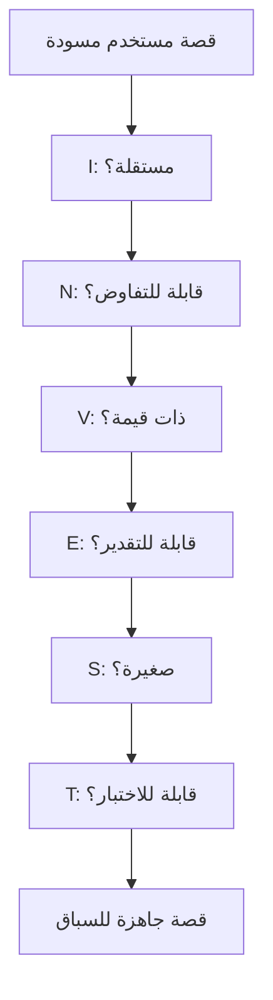

# معايير INVEST (INVEST Criteria)
> [!info] تعريف مختصر
> معايير INVEST هي اختصار يجمع ست خصائص يجب أن تتوفر في أي [[11 - User Stories|قصة مستخدم]] جيدة الصياغة: مستقلة، قابلة للتفاوض، ذات قيمة، قابلة للتقدير، صغيرة، وقابلة للاختبار. صاغها Bill Wake عام 2003 كأداة عملية لتقييم جودة القصص قبل قبولها في السباق.

## الشرح العلمي والاحترافي
كل حرف من INVEST يمثل معيارًا:
- **Independent (مستقلة)**: يجب ألا تعتمد القصة على قصة أخرى غير مكتملة، حتى يمكن تطويرها وترتيب أولويتها بحرية.
- **Negotiable (قابلة للتفاوض)**: القصة ليست عقدًا جامدًا، بل نقطة بداية لنقاش بين مالك المنتج والفريق حول التفاصيل الدقيقة.
- **Valuable (ذات قيمة)**: يجب أن تقدّم قيمة واضحة للمستخدم أو للعميل، لا مجرد مهمة تقنية بلا فائدة ملموسة.
- **Estimable (قابلة للتقدير)**: يجب أن يكون الفريق قادرًا على تقدير حجم الجهد المطلوب تقريبًا، وهذا يستلزم وضوحًا كافيًا في الوصف.
- **Small (صغيرة)**: يجب أن تكون صغيرة بما يكفي لإنجازها ضمن سباق واحد، وغالبًا خلال أيام قليلة.
- **Testable (قابلة للاختبار)**: يجب أن تملك معايير قبول واضحة (Acceptance Criteria) تحدد متى تُعتبر القصة مكتملة فعليًا.

تُستخدم هذه المعايير كقائمة فحص عملية أثناء [[Backlog Refinement]] لتحديد ما إذا كانت القصة جاهزة فعلاً لدخول [[08 - Sprint Planning]]، وترتبط ارتباطًا وثيقًا بمفهوم [[Definition of Ready]].

## أين ومتى يُستخدم
- يُستخدم في أي منهجية Agile تعتمد قصص المستخدم، وأبرزها Scrum و Kanban للفرق البرمجية.
- يُطبَّق أثناء كتابة القصص لأول مرة، وأثناء تنقيح قائمة الأعمال قبل السباقات.
- يُستخدم كأداة تدريب للفرق الجديدة على كتابة قصص مستخدم عالية الجودة.

## مثال وسيناريو تطبيقي
> [!example] كتب مطوّر مبتدئ في فريق تطبيق حجوزات مطاعم "طاولتي" قصة: "كمستخدم أريد تطبيقًا أفضل". هذه القصة تفشل في كل معايير INVEST تقريبًا: غير محددة القيمة، غير قابلة للتقدير، وغير قابلة للاختبار. أعاد الفريق صياغتها بمساعدة مالك المنتج إلى: "كمستخدم جائع، أريد تصفية المطاعم حسب النوع (شرقي، إيطالي، ياباني) حتى أجد خيارًا مناسبًا بسرعة، مع معيار قبول: تظهر نتائج التصفية خلال ثانيتين ولا تعرض مطاعم مغلقة حاليًا". هذه الصياغة الجديدة مستقلة عن قصص أخرى، قابلة للتفاوض في تفاصيل الواجهة، ذات قيمة واضحة، قابلة للتقدير بنقاط قصة، صغيرة بما يكفي لسباق واحد، وقابلة للاختبار عبر معيار القبول المحدد.

## خطوات أو مخطّط
1. اكتب مسودة أولية للقصة بصيغة "كمستخدم... أريد... حتى...".
2. راجع القصة مقابل كل حرف من INVEST واحدًا تلو الآخر.
3. إذا فشلت في "الاستقلالية" أو "الحجم الصغير"، فكّر بتقسيمها (انظر [[Task and Story Slicing]]).
4. إذا فشلت في "القابلية للاختبار"، أضف معايير قبول واضحة.
5. أعد الصياغة حتى تحقق القصة جميع المعايير الستة.

## ⚠️ مفاهيم خاطئة شائعة
> [!warning]
> - يظن البعض أن INVEST قالب صياغة إلزامي (كصيغة "كمستخدم... أريد...")، بينما هو في الحقيقة معايير جودة تُطبَّق على أي صياغة.
> - يعتقد البعض أن "الصغر" يعني تفاصيل تقنية دقيقة، بينما المقصود هو حجم قابل للإنجاز ضمن سباق واحد بغض النظر عن التعقيد التقني الداخلي.
> - يُهمل البعض معيار "الاستقلالية" ظنًا أنه غير مهم، رغم أنه يمنع الاختناقات في الترتيب والتخطيط عند تشابك القصص.

## ❌ ممارسات خاطئة في المشاريع
> [!failure]
> - كتابة قصص كبيرة جدًا (Epics) ومحاولة إدخالها في السباق مباشرة دون تقسيم؛ الحل تطبيق [[Task and Story Slicing]] أولاً.
> - إهمال معايير القبول بحجة "الجميع يفهم المقصود"، مما يسبب خلافات عند مراجعة العمل المكتمل؛ الحل توثيق معايير قبول محددة وقابلة للتحقق.
> - معاملة القصة كعقد نهائي غير قابل للنقاش، مما يفقد الفريق مرونة التفاوض على أفضل حل تقني أثناء التنفيذ.

## 🔗 مصطلحات ومفاهيم ذات صلة
[[11 - User Stories]] | [[Definition of Ready]] | [[Backlog Refinement]] | [[Task and Story Slicing]] | [[Epic]] | [[12 - Story Points]] | [[Relative Estimation]] | [[Given When Then]]
