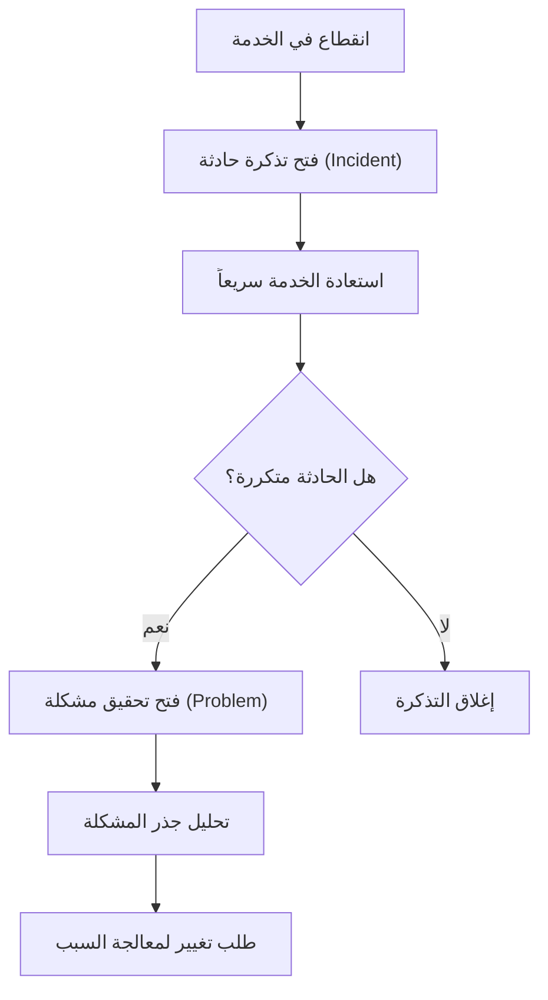

# إطار ITIL 4 (ITIL 4)

> [!info] تعريف مختصر
> إطار ITIL 4 (Information Technology Infrastructure Library) هو مجموعة من أفضل الممارسات لإدارة خدمات تقنية المعلومات (IT Service Management)، تساعد المؤسسات على تصميم وتقديم ودعم الخدمات التقنية بطريقة منظّمة تخلق قيمة حقيقية للعميل.

## الشرح العلمي والاحترافي
- ITIL 4 هو الإصدار الحديث من إطار ITIL، ويركّز على مفهوم "نظام القيمة الخدمي" (Service Value System) الذي يربط كل نشاط في المؤسسة بهدف واحد: خلق قيمة للعميل والمستخدم النهائي.
- يقوم الإطار على 34 "ممارسة" (Practice) بدلاً من "العمليات" الجامدة في النسخ القديمة، مثل ممارسة إدارة الحوادث (Incident Management)، وإدارة المشكلات (Problem Management)، وإدارة التغيير (Change Enablement).
- يهم هذا الإطار لأنه يوفّر لغة مشتركة ومنهجية موحّدة للفرق التقنية الكبيرة، بحيث يُعالَج كل عطل أو طلب خدمة بطريقة متسقة وقابلة للقياس بدلاً من الارتجال.
- يفرّق ITIL 4 بوضوح بين الحادثة (Incident) وهي انقطاع مؤقت للخدمة يحتاج حلاً سريعاً، والمشكلة (Problem) وهي السبب الجذري المتكرر خلف عدة حوادث، ما يربطه مباشرة بتحليل جذر المشكلة ([[Root Cause Analysis]]).
- يعتمد الإطار على مبادئ توجيهية سبعة مثل "التركيز على القيمة" و"التقدم بشكل تكراري مع التغذية الراجعة" و"التعاون وزيادة الشفافية"، وهي مبادئ تتقاطع مع فلسفة أجايل ([[Agile Manifesto]]) رغم أن ITIL أقدم منها تاريخياً.
- يُستخدم أيضاً مفهوم اتفاقيات مستوى الخدمة ([[SLO]]) ومؤشرات مستوى الخدمة ([[SLI]]) داخل ممارسات ITIL 4 لقياس جودة تقديم الخدمة بشكل رقمي دقيق.

## أين ومتى يُستخدم
- يُطبَّق في المؤسسات الكبيرة التي تدير بنية تحتية تقنية معقدة، مثل البنوك وشركات الاتصالات، لتنظيم كيفية تقديم ودعم الخدمات التقنية للموظفين والعملاء.
- يُستخدم عند بناء مكتب خدمة (Service Desk) لإدارة طلبات الدعم الفني والحوادث بطريقة موحّدة وقابلة للتتبع.
- يتكامل مع ممارسات موثوقية المواقع ([[SRE]]) الحديثة، حيث تتبنى بعض الفرق مزيجاً من ITIL للحوكمة وSRE للتنفيذ التقني اليومي.
- يُلجأ إليه عند الحاجة لإدارة التغييرات في بيئة الإنتاج بشكل آمن، عبر ممارسة "تمكين التغيير" (Change Enablement) التي تقيّم المخاطر قبل الموافقة على أي تعديل.

## مثال وسيناريو تطبيقي
> [!example] سيناريو
> شركة اتصالات كبرى تدير مركز بيانات يخدم مليون مشترك. تعطّلت خدمة الإنترنت في منطقة كاملة الساعة 2 ظهراً.
> وفق ممارسات ITIL 4، فتح مكتب الخدمة "تذكرة حادثة" (Incident Ticket) فوراً، وصنّفها بأولوية عالية جداً بناءً على عدد المتأثرين، وأُعيدت الخدمة خلال 40 دقيقة عبر إعادة تشغيل جهاز شبكة معطّل - هذا حلّ الحادثة لكنه لم يحل السبب الجذري بعد.
> بعد استقرار الخدمة، فتح فريق "إدارة المشكلات" تحقيقاً منفصلاً باستخدام تحليل جذر المشكلة ([[Root Cause Analysis]])، واكتشف أن الجهاز يتعطّل بسبب ارتفاع حرارة متكرر في غرفة السيرفرات. تمت معالجة السبب الجذري عبر طلب تغيير رسمي لتركيب نظام تبريد إضافي، مروراً بعملية "تمكين التغيير" لتقييم المخاطر قبل التنفيذ.

## خطوات أو مخطّط
1. تحديد نظام القيمة الخدمي: فهم كيف تخلق كل خدمة قيمة فعلية للعميل النهائي.
2. اختيار الممارسات المناسبة: من بين الـ34 ممارسة، تختار المؤسسة ما يناسب حجمها واحتياجها (مثل إدارة الحوادث، إدارة المشكلات، إدارة التغيير).
3. تشغيل مكتب الخدمة: استقبال طلبات الدعم والحوادث وتصنيفها حسب الأولوية والتأثير.
4. حل الحوادث بسرعة: التركيز أولاً على إعادة الخدمة للعمل، وليس بالضرورة حل السبب الجذري فوراً.
5. إدارة المشكلات: تحليل الحوادث المتكررة لإيجاد السبب الجذري ومنع تكرارها مستقبلاً.
6. التحسين المستمر: مراجعة الأداء دورياً وتحسين الممارسات بناءً على مؤشرات الخدمة الفعلية.

## ⚠️ مفاهيم خاطئة شائعة
> [!warning]
> - الخلط بين "الحادثة" (Incident) و"المشكلة" (Problem)؛ الحادثة توقف مؤقت يُحل بسرعة لإعادة الخدمة، بينما المشكلة هي السبب الجذري الذي قد يستغرق حله وقتاً أطول.
> - الاعتقاد بأن ITIL 4 مجرد وثائق وإجراءات بيروقراطية بطيئة؛ في الواقع الإصدار الرابع يركّز صراحة على المرونة والقيمة السريعة، ويتقاطع مع مبادئ أجايل وDevOps.
> - الظن بأن تطبيق ITIL يعني تجاهل السرعة لصالح الرقابة الصارمة؛ الهدف الحقيقي هو التوازن بين الاستقرار والسرعة، لا التضحية بأحدهما.

## ❌ ممارسات خاطئة في المشاريع
> [!failure]
> - إغلاق تذكرة الحادثة فور استعادة الخدمة دون فتح تحقيق في السبب الجذري، مما يجعل نفس العطل يتكرر مراراً. التجنب: ربط كل حادثة متكررة تلقائياً بعملية إدارة مشكلات رسمية.
> - تطبيق كل الـ34 ممارسة دفعة واحدة في مؤسسة صغيرة، مما يخلق تعقيداً إدارياً غير ضروري. التجنب: اختيار الممارسات الأساسية المناسبة لحجم المؤسسة ونضجها فقط، والتوسع تدريجياً.
> - معاملة كل طلب تغيير بنفس درجة الصرامة والبيروقراطية، حتى التغييرات البسيطة منخفضة المخاطر، مما يبطئ الفريق دون داعٍ. التجنب: تصنيف التغييرات حسب مستوى الخطر واستخدام مسارات موافقة أسرع للتغييرات البسيطة.

## 🔗 مصطلحات ومفاهيم ذات صلة
[[SLO]] | [[SLI]] | [[SRE]] | [[Root Cause Analysis]] | [[Change Request]] | [[Issue Log]] | [[MTTR]] | [[RTO and RPO]] | [[Agile Manifesto]] | [[19 - Risk Management]]
