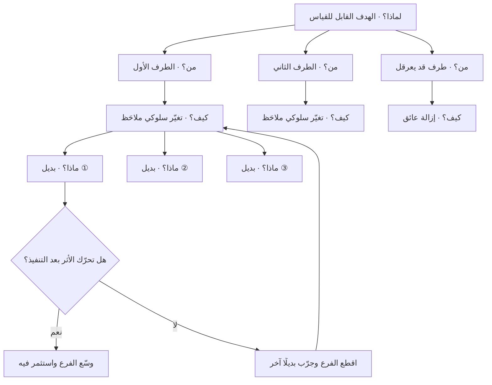

# خريطة الأثر (Impact Mapping)

> [!info] تعريف مختصر
> أسلوب تخطيط تعاوني يربط كل عنصر عمل مقترح بالهدف التجاري الذي يُفترض أن يخدمه، عبر شجرة من أربعة مستويات: **لماذا** (الهدف) ← **من** (الأطراف المؤثّرة على تحقيقه) ← **كيف** (التغيّر السلوكي المطلوب من كل طرف، وهو "الأثر") ← **ماذا** (ما يمكن للفريق بناؤه أو فعله ليُحدث ذلك الأثر). قيمتها الأساسية ليست في توليد الأفكار، بل في **جعل الافتراض الرابط بين الميزة والهدف مرئيًّا وقابلًا للنقض**؛ فأي عنصر في المستوى الرابع لا يمكن تتبّع مساره صعودًا إلى هدف، هو عنصر مرشّح للحذف لا للجدولة. الأسلوب صاغه وقدّمه **جوكو أدجيتش (Gojko Adzic)** في كتابه *Impact Mapping* (2012).

## الشرح العلمي والاحترافي
- **جذر المشكلة التي يعالجها الأسلوب**: أكثر خرائط الطريق في المؤسسات هي قوائم مسطّحة من الميزات مرتّبة بالتاريخ. القائمة المسطّحة تخفي سؤالين خطيرين: (١) ما الافتراض الذي يجعلنا نظنّ أن هذه الميزة ستُحدث فرقًا؟ (٢) وماذا يحدث لو كان الافتراض خاطئًا؟ خريطة الأثر تُحوّل القائمة إلى **شجرة افتراضات**: كل فرع هو ادّعاء سببي («إن بنينا X، فسيتغيّر سلوك الطرف Y، وتغيّر سلوكه سيقرّبنا من الهدف Z»). وما إن يُكتب الادّعاء صراحةً حتى يصبح قابلًا للاختبار والدحض — وهذا هو المكسب الحقيقي.
- **المستويات الأربعة بدقّة**:
  1. **لماذا (Why) — الهدف**: ليس رؤية عامة ولا شعارًا، بل هدف قابل للقياس بصيغة تسمح بمعرفة متى تحقّق. «تحسين تجربة العميل» ليس هدفًا صالحًا لخريطة أثر؛ «خفض نسبة الطلبات الملغاة قبل التسليم من 12% إلى 6% خلال ربعين» هدف صالح.
  2. **من (Who) — الأطراف المؤثّرة (Actors)**: كل من يستطيع أن يساعد في بلوغ الهدف أو أن يعرقله. لاحظ أن الدائرة أوسع من "المستخدم النهائي": قد تشمل موظّف الدعم، وسائق التوصيل، وموظّف الامتثال، وحتى الطرف الخارجي كالبنك أو الجهة التنظيمية. تجاهل الأطراف المعرقِلة هو أشيع سبب لفشل الخرائط.
  3. **كيف (How) — الأثر (Impact)**: التغيّر السلوكي المطلوب من الطرف، مصوغًا بفعل يصف ما سيفعله بشكل مختلف: «يُكمل التسجيل دون اتصال بالدعم»، «يوافق على طلب الاسترجاع خلال ساعة بدل يومين». الأثر ليس ميزة ولا شعورًا، بل **سلوك ملاحَظ**. وقد يكون الأثر سلبيًّا يُراد منعه («يتوقّف عن إلغاء الطلب عند رؤية رسوم الشحن»).
  4. **ماذا (What) — المُخرَجات (Deliverables)**: الميزات والحملات والتغييرات التشغيلية المرشَّحة. وهذا المستوى هو **الأقل التزامًا في الخريطة**: يُفترض أنه قابل للاستبدال بالكامل ما دام الأثر لم يتحقّق.
- **الانقلاب المنهجي في اتجاه التفكير**: الطريقة التقليدية تبدأ من "ماذا نبني" ثم تبحث لاحقًا عن مبرّر. خريطة الأثر تفرض البدء من الهدف والنزول، مما يجعل المُخرَج **وسيلة بين وسائل بديلة**، لا التزامًا. هذا الانقلاب يُترجم عمليًّا إلى سؤال قوي في كل اجتماع تخطيط: «ما البدائل الأرخص لإحداث الأثر نفسه؟» — وغالبًا ما يكون البديل الأرخص تغييرًا في النص، أو في سياسة تشغيلية، أو في ترتيب شاشة، لا ميزة برمجية.
- **الأثر ليس مُخرَجًا**: وهذا هو التمييز الجوهري الذي يشترك فيه الأسلوب مع [[Outcome vs Output]]. «أطلقنا تطبيق الجوال» مُخرَج. «صار 40% من الطلبات تُقدَّم من الجوال دون مساعدة» أثر. الفرق أن الأول تحت سيطرة الفريق تمامًا، والثاني ليس كذلك — ولهذا هو مفيد: لأنه يقيس استجابة العالم لا نشاط الفريق.
- **الخريطة أداة محادثة قبل أن تكون وثيقة**: القيمة الكبرى تحدث في الغرفة أثناء الرسم المشترك بين المنتج والتقنية والأعمال والتشغيل، حين تظهر الخلافات الصامتة على تعريف الهدف ذاته. الخريطة المرسومة منفردًا ثم المُعمَّمة تفقد أغلب قيمتها وتتحوّل إلى مخطّط زينة.
- **آلية تحديد النطاق بالخريطة**: بدل أن يُسأل «ما الذي يجب أن يدخل في الإصدار؟»، يُسأل «ما أقصر فرع في الشجرة يُوصلنا إلى الهدف؟». تُنفَّذ الفروع فرعًا فرعًا، ويُقاس الأثر بعد كل فرع، ويُقصّ الفرع كاملًا إن لم يتحرّك المؤشّر — وهذا سلوك مختلف جذريًّا عن إكمال قائمة ميزات لأنها في الخطة.
- **علاقتها بشجرة الفرص والحلول**: تتقاطع خريطة الأثر مع [[Opportunity Solution Tree]] في البنية الشجرية والتصاعد إلى نتيجة واحدة، لكنها تختلف في العمود الأوسط: شجرة الفرص تضع **الفرص/الاحتياجات المكتشفة بحثيًّا** بين النتيجة والحل، بينما خريطة الأثر تضع **الأطراف وسلوكياتها**. الأولى أقوى في سياق اكتشاف مدفوع بأبحاث المستخدم، والثانية أقوى حين يكون تحقيق الهدف موزّعًا على أطراف متعدّدة داخل المؤسسة وخارجها.
- **حدود الأسلوب**: الخريطة لا تُنتج معرفة جديدة عن العملاء؛ هي **تنظّم ما تعرفه وتكشف ما تجهله**. إن كانت المعرفة الأساسية عن الأطراف وسلوكهم مبنيّة على تخمين داخلي، فستُنتج خريطة أنيقة قائمة على وهم منظَّم. لذلك تُستخدم بجوار أدوات الاكتشاف مثل [[User Interview]] و[[Continuous Discovery]] لا بديلًا عنها.

## أين ومتى يُستخدم
- **عند بدء مبادرة أو ربع تخطيطي جديد**: لتحويل أهداف [[OKR]] المجرّدة إلى فروع تنفيذية مربوطة بأطراف وسلوكيات محدّدة، بدل قائمة مشاريع منفصلة عن الأهداف.
- **عند تضخّم قائمة الأعمال المتراكمة**: الخريطة أداة **حذف** ممتازة؛ كل بند لا يجد له مسارًا صاعدًا إلى أثر ثم إلى هدف يُنقل إلى قائمة "خارج النطاق" ([[Out of Scope]]) بحجّة معلنة قابلة للنقاش.
- **في مواجهة ثقافة "مصنع الميزات"** ([[Feature Factory]]): الخريطة تجعل الحديث في مراجعات الإدارة يدور حول تحرّك المؤشّرات لا حول عدد الميزات المُسلَّمة.
- **في المشاريع متعدّدة الأطراف**: منصات فيها بائع ومشتري ومندوب توصيل وجهة رقابية — لأن مستوى "من" يُجبر الفريق على الاعتراف بأن الهدف لا يتحقّق بتغيير سلوك طرف واحد فقط.
- **مع أصحاب المصلحة عند تحديد الأولويات**: استخدامها إلى جانب [[Stakeholder Map]] يجعل النقاش عن "من نحتاج أن يتغيّر سلوكه" بدل "من يصرخ أعلى".
- **عند تبرير الاستثمار**: فروع الخريطة تغذّي [[Business Case]] بمنطق سببي واضح بدل قائمة نفقات مقابل وعد عام بالتحسين.
- **في تشكيل [[Problem Statement]] الأولي**: مستوى "لماذا" هو في جوهره إعادة صياغة للمشكلة بلغة قابلة للقياس.

## مثال وسيناريو تطبيقي
> [!example] **منصّة توصيل طلبات في السوق الخليجي.** الإدارة طلبت من فريق المنتج «إطلاق برنامج ولاء بالنقاط» في الربع القادم، وقُدِّرت كلفته بنحو 5 أشهر عمل مطوّر وتكامل مع نظام المحاسبة.
> جلس الفريق (منتج + تقنية + عمليات + دعم + مالية) ساعتين لرسم خريطة أثر بدل الشروع في التنفيذ.
> **لماذا**: الهدف الحقيقي خلف الطلب لم يكن "الولاء" بل رقم محدّد: رفع متوسط عدد الطلبات الشهرية للعميل النشط من 2.4 إلى 3.2 خلال ستة أشهر.
> **من**: عند تعداد الأطراف ظهر أن الأطراف ليست العميل وحده: العميل، المطعم الشريك، مندوب التوصيل، وموظّف الدعم.
> **كيف (الأثر لكل طرف)**:
> — العميل: «يعيد الطلب من مطعم سبق أن طلب منه دون تصفّح طويل».
> — المطعم: «يقبل الطلب خلال أقل من 90 ثانية بدل 4 دقائق».
> — المندوب: «يقبل الطلبات في الأحياء البعيدة بدل رفضها».
> — الدعم: «يغلق شكوى التأخير دون تصعيد للمشرف».
> **ماذا**: تحت أثر العميل وحده ظهرت خمسة مُخرَجات مرشّحة، وبرنامج النقاط كان أحدها فقط، إلى جانب: زرّ "أعد طلبي السابق" في الشاشة الأولى، وإشعار في وقت الوجبة المعتاد للعميل، وحفظ العنوان الافتراضي، وتبسيط الدفع.
> عند مقارنة الفروع بالكلفة تبيّن أن ثلاثة من هذه المُخرَجات تُقدَّر بأسبوعين عمل مجتمعة. قرّر الفريق تنفيذها أولًا وتأجيل برنامج النقاط ربعًا كاملًا، مع كتابة الافتراض صراحةً في سجلّ القرارات: «نفترض أن العائق الأكبر أمام تكرار الطلب هو الاحتكاك لا نقص الحافز المالي».
> بعد ستة أسابيع تحرّك متوسط الطلبات الشهرية إلى 2.9 من الفروع الرخيصة وحدها، وظهر أثر جانبي لم يكن متوقّعًا: زرّ إعادة الطلب خفّض تذاكر الدعم المتعلّقة بالعنوان الخاطئ. عند مراجعة الربع لم يُلغَ برنامج النقاط، لكن نقاشه تغيّر جذريًّا: صار سؤالًا عن الفجوة المتبقّية (2.9 → 3.2) لا عن فكرة عامة اسمها "الولاء".

## خطوات أو مخطّط
1. اكتب هدفًا واحدًا فقط في مركز الخريطة، وتحقّق أنه يستوفي شرطين: قابل للقياس، ومحدَّد بمدى زمني. إن لم يكن كذلك فأنت أمام رؤية لا هدف.
2. عرّف مقياس النجاح ومصدر بياناته قبل الاستمرار. الخريطة بلا مقياس تتحوّل إلى مخطّط ذهني.
3. عدّد الأطراف المؤثّرة (Actors) بثلاث فئات: من يساعد مباشرة، من يستفيد، ومن قد يعرقل. لا تكتفِ بالمستخدم النهائي.
4. لكل طرف، اكتب التغيّر السلوكي المطلوب بصيغة فعل ملاحَظ. تحقّق من كل أثر بسؤال: «هل أستطيع رؤية هذا يحدث في البيانات أو بالملاحظة؟».
5. رتّب الآثار حسب حجم المساهمة المتوقّعة في الهدف، وليس حسب سهولة تنفيذها.
6. لكل أثر ذي أولوية، ولّد **ثلاثة مُخرَجات بديلة على الأقل**. اشتراط البدائل يمنع تثبيت الحل الأول الذي يخطر في الذهن.
7. قدّر كلفة كل بديل وقارنها بالأثر المتوقّع، ثم اختر الفرع الأقصر لا الأشمل.
8. نفّذ فرعًا واحدًا، ثم قِس الأثر بعد فترة كافية، وسجّل النتيجة على الخريطة نفسها.
9. عند المراجعة: إن تحرّك الأثر، وسّع الفرع؛ وإن لم يتحرّك، اقطع الفرع كاملًا وعُد إلى بديل آخر تحت الأثر نفسه — لا تُضِف ميزات فوق فرع ميت.
10. أعِد النظر في الخريطة عند كل تغيّر جوهري في الهدف أو في فهم الأطراف؛ الخريطة وثيقة حيّة لا مخرَج تخطيط لمرّة واحدة.

## ⚠️ مفاهيم خاطئة شائعة
> [!warning]
> - **اعتبارها مجرّد خريطة ذهنية ملوّنة**: الشكل الشجري خادع. الفارق أن كل مستوى في خريطة الأثر له **معنى دلالي ملزم** (هدف / طرف / سلوك / مُخرَج)، وأن العلاقات بين المستويات ادّعاءات سببية قابلة للاختبار. الخريطة الذهنية تجمع أفكارًا؛ خريطة الأثر تفرز افتراضات.
> - **الخلط بين "الأثر" و"المُخرَج"**: كتابة «تطبيق جوال» أو «لوحة تحكّم» في مستوى "كيف" هو الخطأ الأشيع على الإطلاق، ويُفرغ الأداة من وظيفتها. المستوى الثالث لا يقبل إلا أفعالًا يقوم بها **طرف بشري**، لا أشياء يبنيها الفريق.
> - **الظنّ بأن مستوى "من" يعني الشخصيات النمطية (Personas)**: الطرف هنا يُعرَّف بقدرته على التأثير في الهدف، لا بخصائصه الديموغرافية. قد يكون طرفًا داخليًّا (فريق الامتثال) أو مؤسّسيًّا (بنك، مورّد) لا شخصية مستخدم.
> - **افتراض أن كل الأطراف مساعِدون**: الأطراف التي قد تعرقل الهدف جزء أصيل من الخريطة، وتجاهلها يُنتج خطّة تعمل فقط في عالم بلا مقاومة تنظيمية.
> - **معاملة الخريطة كوثيقة نهائية تُعتمَد وتُؤرشَف**: بمجرّد أن تُوقَّع وتُغلَق تتحوّل إلى خطة ميزات تقليدية بشكل شجري. جوهر الأداة أن الفروع تُقصّ وتُستبدل بناءً على القياس.
> - **الاعتقاد بأن الخريطة تُغني عن البحث**: هي بنية تنظيمية للمعرفة والافتراضات، لا مصدر معرفة. الفروع المبنيّة على حدس غير مُختبَر تبقى حدسًا مهما بدت الشجرة متماسكة.
> - **الظنّ بأنها تصلح لهدف مركّب**: خريطة بهدفين أو ثلاثة في مركزها تفقد قدرتها على الفرز، لأن أي مُخرَج سيجد له مبرّرًا تحت أحد الأهداف. القاعدة: هدف واحد لكل خريطة.

## ❌ ممارسات خاطئة في المشاريع
> [!failure]
> - **الخطأ: البدء من قائمة الميزات الجاهزة ثم رسم الخريطة بأثر رجعي لتبريرها.** لماذا يضرّ: يحوّل الأداة إلى آلة تبرير، ويُنتج آثارًا مصطنعة مفصّلة على مقاس ما تقرّر أصلًا، فتُغلق الفرصة الوحيدة لاكتشاف بديل أرخص. الحل: ارسم الخريطة قبل عرض أي قائمة ميزات، واشترط توليد ثلاثة بدائل تحت كل أثر قبل السماح بذكر الحل المفضّل مسبقًا.
> - **الخطأ: صياغة الهدف بعبارة غير قابلة للقياس مثل «تحسين تجربة المستخدم» أو «مواكبة المنافسين».** لماذا يضرّ: هدف غير قابل للقياس يجعل كل فرع صحيحًا وكل فرع باطلًا في آن، فتنهار قدرة الخريطة على الحذف. الحل: اشترط قبل رسم أي فرع تحديد المؤشّر ومصدر بياناته وخطّ الأساس الحالي ([[Baseline]]).
> - **الخطأ: رسم الخريطة بمعزل عن فرق التقنية والتشغيل والدعم.** لماذا يضرّ: تُبنى فروع يستحيل تنفيذها أو تتجاهل قيودًا تشغيلية معروفة لدى من يشتغل بها يوميًّا، فتُرفض الخريطة صامتةً عند التنفيذ. الحل: اجعل الرسم ورشة مشتركة قصيرة (90–120 دقيقة) بحضور ممثّل عن كل وظيفة، واعتبر غياب أي وظيفة سببًا لتأجيل الورشة.
> - **الخطأ: تنفيذ كل الفروع بالتوازي لأنها "كلها مهمّة".** لماذا يضرّ: يُلغي إمكانية عزو أي تغيّر في المؤشّر إلى سبب محدّد، فتفقد الخريطة قيمتها التعلّمية ويعود الفريق إلى الحكم بالانطباع. الحل: نفّذ فرعًا أو فرعين في الدورة، وحدّد مسبقًا مدّة القياس ومعيار قطع الفرع ([[Kill Criteria]]).
> - **الخطأ: تجاهل الآثار الجانبية على أطراف أخرى في الخريطة.** لماذا يضرّ: قد يتحقّق الأثر المستهدف على حساب طرف آخر (كأن يزيد الطلب فيرتفع ضغط الدعم أو ينسحب الشركاء)، فيبدو المؤشّر ناجحًا والنظام يتدهور. الحل: عيّن لكل فرع مؤشّرًا مضادًّا ([[Counter Metric]]) وراقبه مع المؤشّر الأساسي.
> - **الخطأ: عدم تحديث الخريطة بعد القياس.** لماذا يضرّ: تُفقد الذاكرة المؤسسية عن الفروع التي جُرِّبت وفشلت، فتُقترح الفكرة نفسها بعد ربعين وكأنها جديدة. الحل: دوّن نتيجة كل فرع على الخريطة نفسها وفي [[Decision Log]]، مع تاريخ القياس والقرار المتّخذ.
> - **الخطأ: تحويل مستوى "ماذا" إلى مواصفة تفصيلية داخل الورشة.** لماذا يضرّ: يستهلك وقت الورشة في نقاش تصميمي مبكّر، ويُنشئ التزامًا نفسيًّا بالحل قبل التحقّق من الأثر. الحل: اكتفِ في الورشة بعنوان المُخرَج في سطر واحد، وأجّل التفصيل إلى ما بعد اختيار الفرع.

## 🔗 مصطلحات ومفاهيم ذات صلة
[[Outcome vs Output]] | [[Opportunity Solution Tree]] | [[OKR]] | [[Feature Factory]] | [[Stakeholder Map]] | [[Problem Statement]] | [[Business Case]] | [[Counter Metric]] | [[Prioritization]] | [[Jobs to be Done]] | [[HEART Framework]] | [[Service Blueprint]]
