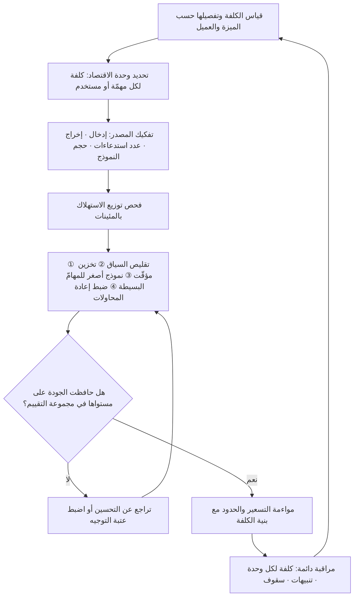

# كلفة الاستدلال (Inference Cost)

> [!info] تعريف مختصر
> الكلفة المترتّبة على **كل استدعاء** لنموذج ذكاء اصطناعي مُدرَّب لإنتاج مخرَج (إجابة، تصنيف، تلخيص، صورة). و«الاستدلال» هو مرحلة تشغيل النموذج بعد التدريب، في مقابل «التدريب» الذي يبنيه. أهمّيتها الإدارية لا تأتي من حجمها بل من **طبيعتها**: فهي كلفة متغيّرة تتناسب طرديًّا مع الاستخدام، بخلاف البرمجيات التقليدية التي تكاد كلفتها الحدّية للمستخدم الإضافي تكون صفرًا. وهذا التحوّل يعيد كتابة اقتصاديات الوحدة (Unit Economics) للمنتج: النجاح نفسه — نموّ الاستخدام — يصبح مصدر ضغط على الهامش لا مجرّد مصدر إيراد.

## الشرح العلمي والاحترافي
- **الانقلاب البنيوي في اقتصاديات البرمجيات**: النموذج الاقتصادي الذي بُنيت عليه صناعة SaaS يقوم على كلفة حدّية شبه معدومة — تكتب البرنامج مرّة، ثم لا يكلّفك المستخدم رقم مليون تقريبًا شيئًا (تكلفة استضافة ضئيلة موزّعة). المنتجات المبنية على نماذج توليدية تكسر هذا: كل رسالة يكتبها المستخدم تستهلك حوسبة مدفوعة فعليًّا. النتيجة أن **هامش الربح الإجمالي (Gross Margin)** لمنتجات الذكاء الاصطناعي يقع غالبًا في نطاق أدنى من هوامش SaaS التقليدية، وأن الفرق بين مستخدم مربح ومستخدم خاسر قد يعتمد على سلوكه لا على خطّته.
- **مكوّنات الكلفة عند الاستهلاك عبر واجهة برمجية**: تُحتسب عادةً بعدد الوحدات النصّية (Tokens)، ويُفرّق بين **رموز الإدخال** (المطالبة والسياق والوثائق المرفقة) و**رموز الإخراج** (نصّ النموذج المولَّد) — والأخيرة أغلى عادةً بعدّة أضعاف. ومن هنا تنبع مفارقة عملية: نظام يحقن آلاف الرموز من السياق في كل طلب قد تكون كلفته أعلى بكثير من نظام يُخرج إجابة طويلة.
- **مكوّنات الكلفة عند الاستضافة الذاتية**: تختلف بنية الكلفة كلّيًّا — إيجار وحدات معالجة رسومية بالساعة، ونسبة استغلالها الفعلية (وهي القاتل الصامت: بطاقة مؤجَّرة 24 ساعة ومستغلّة 12% تعني أن 88% من الإنفاق ضائع)، وذاكرة تحميل النموذج، وكلفة فريق يشغّلها ويراقبها. الاستضافة الذاتية تحوّل الكلفة من متغيّرة بحتة إلى **شبه ثابتة**، وهو ما يجعل المفاضلة بينها وبين الواجهة البرمجية حالة تطبيقية مباشرة لـ[[CapEx vs OpEx]]: الواجهة أقرب إلى التشغيلي المرن، والاستضافة أقرب إلى الالتزام الرأسمالي الذي لا يُبرَّر إلا فوق حجم معيّن.
- **العوامل التي تحرّك الكلفة**: حجم النموذج المختار وقدرته، وطول السياق المُمرَّر، وطول الإخراج، وعدد الاستدعاءات لكل مهمّة واحدة (فسلسلة وكيل ذكي قد تستدعي النموذج 12 مرّة لإنجاز طلب يبدو للمستخدم استدعاءً واحدًا)، ومحاولات إعادة التنفيذ عند الفشل، ونسبة الإصابة في ذاكرة التخزين المؤقّت للسياق المتكرّر.
- **قاعدة تشغيلية مهمّة — عدم تجانس المستخدمين**: توزيع الاستهلاك في منتجات الذكاء الاصطناعي شديد الانحراف؛ نسبة صغيرة من المستخدمين قد تستهلك حصّة غالبة من الحوسبة. لذلك يخطئ من يقيس الكلفة بالمتوسّط الحسابي، والصحيح النظر إلى التوزيع والمئينات كما في منطق [[Percentiles and Median vs Average]]، لأن المتوسّط يُخفي أن العشرة بالمئة الأعلى استهلاكًا هم من يحدّد فاتورتك.
- **خطر التسعير الثابت غير المحدود**: بيع اشتراك شهري ثابت «بلا حدود» فوق كلفة متغيّرة هو مراهنة على ألّا يستخدم الناس ما اشتروه. هذه المخاطرة محتمَلة في مرحلة الاستحواذ المبكّر، لكنها تتحوّل إلى نزيف عند النموّ. لذلك تظهر في هذه المنتجات نماذج تسعير هجينة: قاعدة ثابتة + حصّة استخدام + تسعير حسب النتيجة أحيانًا.
- **علاقتها بـ[[TCO]]**: كلفة الاستدلال بند واحد ضمن التكلفة الكلّية لملكية أي حلّ ذكاء اصطناعي، وإلى جانبها: كلفة تجهيز البيانات، والتقييم المستمرّ لجودة المخرجات، والمراجعة البشرية حيث تلزم، والمراقبة، وإعادة الضبط عند تغيّر النموذج، وكلفة الترحيل عند تغيير المزوّد ([[Vendor Lock-in]]). والخطأ الشائع في دراسات الجدوى أن يُقارَن سعر الرمز الواحد بين مزوّدين ويُهمَل كل ما عداه.
- **الاتجاه الزمني للأسعار وأثره على القرار**: الاتجاه العام في السوق كان انخفاضًا ملموسًا في سعر الوحدة الحسابية للقدرة المتكافئة عبر الوقت، مع ظهور نماذج أصغر وأرخص تؤدّي مهامّ محدّدة بجودة كافية. الاستنتاج الإداري ليس «انتظر حتى ترخص»، بل: **لا تبنِ معماريّتك على افتراض بقاء النموذج والسعر ثابتين**، واجعل استبدال النموذج عملية رخيصة لا مشروع إعادة بناء.

## أين ومتى يُستخدم
- **في دراسة الجدوى وحالة العمل ([[Business Case]])**: لتقدير كلفة تشغيل الميزة لكل مستخدم شهريًّا قبل الالتزام ببنائها، ومقارنتها بالقيمة المتوقّعة ([[Business Impact]]).
- **في تصميم التسعير وحدود الاستخدام**: لتحديد ما إذا كان الاشتراك الثابت مستدامًا، وأين توضع الحدود، وكيف تُعرَض على المستخدم دون إفساد التجربة.
- **في قرارات المعمارية**: اختيار النموذج المناسب لكل مهمّة بدل استخدام أقوى نموذج لكل شيء، وتحديد ما إذا كان الاسترجاع ([[Retrieval-Augmented Generation]]) يقلّل الكلفة أم يرفعها بحقن سياق ضخم في كل طلب.
- **في المفاضلة بين الاستضافة الذاتية والواجهة البرمجية**: وهي مفاضلة [[CapEx vs OpEx]] بامتياز، ويحسمها حجم الاستهلاك المتوقّع وثباته ومتطلبات [[Data Residency]].
- **في مراقبة الصحّة التشغيلية للمنتج ([[Project Health Report]])**: بجعل «الكلفة لكل مستخدم نشط» و«الكلفة لكل مهمّة منجزة» مؤشّرَي أداء دائمين ([[KPI]]) لا رقمًا يُراجَع عند وصول الفاتورة.
- **في تحديد نطاق [[MVP]]**: إذ قد يكون الحلّ الأرخص لإثبات القيمة نموذجًا أصغر أو حتى معالجة غير توليدية، قبل الاستثمار في أقوى الخيارات.

## مثال وسيناريو تطبيقي
> [!example] شركة سعودية تقدّم منصّة خدمة عملاء لمتاجر إلكترونية، أطلقت ميزة «مساعد ذكي» يجيب عن استفسارات العملاء تلقائيًّا. الخطّة: 300 ريال شهريًّا للمتجر مقابل محادثات غير محدودة. بعد شهرين كان لديهم 220 متجرًا مشتركًا، أي إيراد شهري 66,000 ريال — لكن فاتورة الحوسبة بلغت 41,000 ريال، فبقي هامش إجمالي 38% فقط قبل أي كلفة أخرى، بينما كانت خطّة الأعمال مبنيّة على 80%.
> عند التحليل التفصيلي ظهرت أربعة أسباب:
> ① **حقن سياق ضخم في كل رسالة**: كان النظام يمرّر كتالوج المنتجات كاملًا وسياسات الإرجاع مع كل رسالة، بمعدّل نحو 9,000 رمز إدخال للرسالة الواحدة، بينما كانت إجابة النموذج نحو 150 رمزًا فقط. أي أن الكلفة كانت في المدخلات لا المخرجات.
> ② **استخدام أقوى نموذج لكل شيء**: بما في ذلك مهامّ بسيطة مثل تصنيف نيّة الرسالة («استفسار شحن» أم «طلب إرجاع») وهي مهمّة يؤدّيها نموذج صغير بكفاءة قريبة.
> ③ **توزيع منحرف بشدّة**: 14 متجرًا من 220 (أقل من 7%) استهلكوا 61% من إجمالي الحوسبة، وكانوا يدفعون 300 ريال كغيرهم تمامًا.
> ④ **إعادة محاولات صامتة**: خلل في معالجة الأخطاء كان يعيد الاستدعاء 3 مرّات عند أي انقطاع، فيضاعف الكلفة دون أن يظهر ذلك في أي لوحة.
> المعالجة عبر 6 أسابيع: استرجاع انتقائي يمرّر المقاطع ذات الصلة فقط بدل الكتالوج كاملًا (انخفض متوسّط الإدخال إلى نحو 1,200 رمز)، وتوجيه المهامّ البسيطة إلى نموذج أصغر مع الإبقاء على النموذج القوي للحالات المعقّدة، وتخزين مؤقّت لإجابات الأسئلة المتكرّرة التي شكّلت 34% من الرسائل، وإصلاح إعادة المحاولات وربطها بسقف واضح، وإعادة تصميم التسعير إلى ثلاث خطط بحصص محادثات معلنة مع سعر إضافي شفّاف لما يتجاوزها.
> النتيجة بعد ربع كامل: انخفضت كلفة الحوسبة إلى 12,400 ريال مع نموّ عدد المتاجر إلى 265، وارتفع الهامش الإجمالي إلى 84%، **دون تغيير محسوس في رضا العملاء** — لأن ما حُذف كان إهدارًا لا قيمة.

## خطوات أو مخطّط
1. قياس الكلفة الحالية بدقّة وتفصيلها حسب الميزة والمهمّة والعميل، لا كرقم إجمالي في فاتورة واحدة.
2. تحديد وحدة الاقتصاد الصحيحة: الكلفة لكل مهمّة منجزة أو لكل محادثة أو لكل مستخدم نشط شهريًّا.
3. تفكيك مصدر الكلفة: هل هي في رموز الإدخال أم الإخراج؟ في عدد الاستدعاءات أم في حجم النموذج؟
4. فحص توزيع الاستهلاك بين المستخدمين بالمئينات لكشف الشريحة الأعلى استهلاكًا.
5. تطبيق التحسينات بترتيب العائد: تقليص السياق أولًا (غالبًا أكبر مكسب وأقلّ مخاطرة)، ثم التخزين المؤقّت، ثم توجيه المهامّ إلى نماذج أصغر، ثم ضبط إعادة المحاولات.
6. التحقّق من أن كل تحسين لم يُسقط الجودة، عبر مجموعة تقييم ثابتة تُشغَّل قبل وبعد كل تغيير.
7. مواءمة نموذج التسعير مع بنية الكلفة، ومنع الاشتراك الثابت غير المحدود فوق كلفة متغيّرة مفتوحة.
8. تثبيت المراقبة والحدود: تنبيه عند تجاوز عتبة، وسقف يومي، وقياس مستمرّ للكلفة لكل وحدة.

## ⚠️ مفاهيم خاطئة شائعة
> [!warning]
> - **الخلط بين كلفة التدريب وكلفة الاستدلال**: التدريب حدث كبير غالبًا نادر ويكاد يقتصر على من يبني النماذج، أمّا الاستدلال فتيّار دائم يتدفّق مع كل استخدام. أغلب الفرق لن تدرّب نموذجًا أبدًا، لكنها ستدفع كلفة الاستدلال كل يوم ما دام المنتج حيًّا.
> - **الظنّ بأن الكلفة تتبع طول إجابة النموذج فقط**: في كثير من الأنظمة تكون الكلفة الغالبة في **المدخلات** — سياق ووثائق وتاريخ محادثة يُعاد حقنه في كل طلب. من يحسّن الإخراج فقط قد يعالج 20% من فاتورته.
> - **اعتبار كلفة الاستدلال بندًا تشغيليًّا يخصّ الفريق التقني**: هي مكوّن مباشر في تكلفة البضاعة المباعة وتحدّد الهامش والتسعير وحدود النموّ. تجاهلها في تخطيط المنتج يعني تسعير منتج بلا معرفة كلفته.
> - **افتراض أن الاستضافة الذاتية أرخص دائمًا**: أرخص فقط فوق حجم استخدام مرتفع وثابت يبرّر الالتزام ويحقّق استغلالًا عاليًا للعتاد، ومع فريق قادر على التشغيل. تحت ذلك الحدّ تكون أغلى وأبطأ وأكثر مخاطرة.
> - **الظنّ بأن انخفاض الأسعار المستقبلي سيحلّ المشكلة تلقائيًّا**: انخفاض سعر الوحدة يقابله غالبًا نموّ في الاستخدام وفي طول السياق وتعقيد المهامّ، فقد تبقى الفاتورة كما هي أو ترتفع. الانضباط في التصميم يبقى مطلوبًا مهما رخصت الوحدة.
> - **قياس الكلفة بالمتوسّط**: المتوسّط يخفي الانحراف الشديد في التوزيع. مستخدم واحد ثقيل قد يعادل مئات المستخدمين العاديين، والمتوسّط يجعله غير مرئي حتى تصل الفاتورة.

## ❌ ممارسات خاطئة في المشاريع
> [!failure]
> - **الخطأ**: إطلاق ميزة ذكاء اصطناعي دون تقدير مسبق لكلفة تشغيلها لكل مستخدم. **لماذا يضرّ**: يُكتشف الخلل بعد أشهر من النموّ حين يكون التسعير قد أُعلن والعقود وُقّعت. **الحل**: اجعل تقدير الكلفة لكل وحدة شرطًا في تعريف الجاهزية ([[Definition of Ready]]) لأي ميزة تستدعي نموذجًا.
> - **الخطأ**: استخدام أقوى نموذج متاح في كل مسار داخل المنتج. **لماذا يضرّ**: يدفع الفريق ثمن قدرة عالية في مهامّ يؤدّيها نموذج صغير بجودة كافية، فيتضخّم الإنفاق بلا فرق ملموس للمستخدم. **الحل**: صنّف المهامّ حسب صعوبتها الحقيقية ووجّه كلًّا منها إلى النموذج المناسب، مع تصعيد إلى النموذج الأقوى عند انخفاض الثقة فقط.
> - **الخطأ**: تمرير كل السياق المتاح في كل طلب «حتى لا يفوت النموذج شيء». **لماذا يضرّ**: يرفع الكلفة خطّيًّا مع طول السياق، وقد يخفض الجودة أيضًا لأن الإشارة المهمّة تغرق في ضجيج. **الحل**: استرجاع انتقائي مضبوط، وتلخيص تاريخ المحادثة الطويل بدل إعادة حقنه كاملًا.
> - **الخطأ**: بيع اشتراك ثابت «غير محدود» فوق كلفة متغيّرة. **لماذا يضرّ**: يجعل أفضل عملائك استخدامًا أسوأهم ربحية، ويعاقب نجاح المنتج. **الحل**: حصص معلنة بشفافية، وتسعير تدرّجي، ومراقبة الشريحة الأعلى استهلاكًا ومعالجتها تجاريًّا لا هندسيًّا فقط.
> - **الخطأ**: عدم وجود سقوف أو تنبيهات على الإنفاق. **لماذا يضرّ**: خلل برمجي واحد في حلقة تكرار أو إعادة محاولة قد يستهلك ميزانية شهر كامل في ليلة، وقد يُستغلّ من الخارج بإساءة استخدام متعمّدة. **الحل**: سقوف يومية، وحدود لكل مستخدم، وتنبيه آلي عند انحراف الاستهلاك عن نمطه المعتاد.
> - **الخطأ**: تحسين الكلفة دون قياس أثر التحسين على الجودة. **لماذا يضرّ**: قد ينخفض الإنفاق 40% وينخفض معه رضا المستخدم بصمت، فتُحقّق وفرًا محاسبيًّا وخسارة منتجية. **الحل**: مجموعة تقييم ثابتة تُشغَّل آليًّا قبل وبعد كل تغيير، ولا يُعتمد أي تحسين قبل اجتيازها.
> - **الخطأ**: ربط المنتج بمزوّد واحد بعمق في كل طبقة. **لماذا يضرّ**: يفقدك القدرة على التفاوض والاستفادة من انخفاض الأسعار أو من نموذج أنسب، وهو [[Vendor Lock-in]] كلاسيكي. **الحل**: طبقة تجريد بين المنتج والمزوّد، ومجموعة تقييم قابلة لإعادة التشغيل على أي نموذج بديل.

## 🔗 مصطلحات ومفاهيم ذات صلة
[[TCO]] | [[CapEx vs OpEx]] | [[Business Case]] | [[Retrieval-Augmented Generation]] | [[MCP]] | [[Vendor Lock-in]] | [[Percentiles and Median vs Average]] | [[KPI]] | [[Data Residency]] | [[MVP]]
