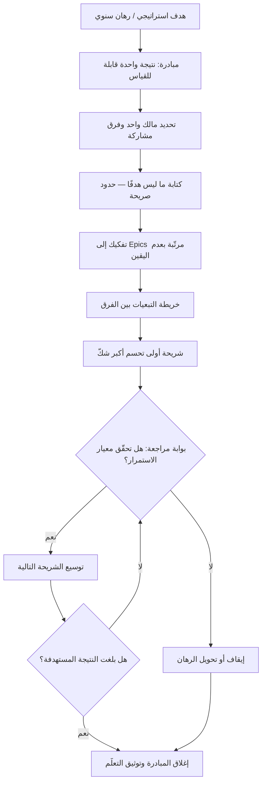

# المبادرة (Initiative)

> [!info] تعريف مختصر
> حزمة عمل متماسكة تخدم **هدفًا استراتيجيًّا واحدًا**، وتقع في هرم التخطيط فوق [[Epic]] وتحت الرهان السنوي أو الهدف المؤسّسي. المبادرة أكبر من أن يستوعبها فريق واحد في سبرنت أو اثنين، وأصغر من أن تكون اتّجاهًا سنويًّا مفتوحًا؛ مداها المعتاد ربع إلى ثلاثة أرباع، وقد تضمّ عدّة Epics موزّعة على أكثر من فريق. وهي **الوحدة التي تُرتَّب عندها الأولويات على مستوى المنظّمة**: قرار الالتزام بمبادرة هو قرار التخلّي عن مبادرة أخرى، لا قرار جدولة.

## الشرح العلمي والاحترافي
- **موقعها في هرم التخطيط**: الترتيب الشائع تنازليًّا هو: استراتيجية/رهان سنوي ← **مبادرة** ← [[Epic]] ← قصة/بند ← مهمّة. صعودًا تزداد المدّة والغموض والقيمة الاستراتيجية، ونزولًا تزداد الدقّة وقابلية التقدير. المبادرة هي **نقطة الالتقاء** بين لغة القيادة (نتائج وأهداف) ولغة التنفيذ (نطاق وتسليم)، ولهذا تُكتب بلغة النتيجة لا بلغة المخرَج ([[Outcome vs Output]]).
- **ليست مشروعًا بالضرورة**: المشروع في التعريف الكلاسيكي مسعى مؤقّت بنطاق ومدّة وميزانية محدّدة سلفًا. المبادرة قد تُنفَّذ كمشروع، وقد تُنفَّذ كتيّار عمل مستمر داخل فرق دائمة تحكمه نتيجة مستهدفة لا نطاق مغلق. الفرق العملي: المشروع يُقاس باكتماله، والمبادرة تُقاس ببلوغ نتيجتها — وقد تُغلق مبكّرًا لأن النتيجة تحقّقت بنصف النطاق، أو تُوقَف لأن الفرضية سقطت.
- **علاقتها بالأهداف والنتائج**: في أدبيات [[OKR]] تُوصف المبادرات عادةً بأنها **ما نفعله** لتحريك النتائج الرئيسية (Key Results)، أي أنها الجانب القابل للتحكّم من المعادلة. الهدف طموح، والنتيجة الرئيسية مقياس، والمبادرة رهان على السببية بينهما. ولأنها رهان، فمن الطبيعي أن تفشل بعض المبادرات دون أن يعني ذلك فشل الهدف — بل قد يعني أن الرهان التالي أوضح.
- **الحجم كقرار إداري لا كحقيقة**: لا يوجد تعريف كوني لحجم المبادرة؛ في منظّمة من 30 شخصًا قد تكون المبادرة عمل فريقين لشهرين، وفي منظّمة كبيرة قد تكون عمل خمسة فرق لثلاثة أرباع. المعيار العملي المفيد: **المبادرة هي أصغر وحدة يستطيع مستوى القيادة أن يفاضل عندها بين البدائل دون الغرق في التفاصيل**. إن كانت اللجنة تناقش قصصًا فردية فالتحبيب أدقّ مما ينبغي؛ وإن كانت تناقش «تحسين تجربة العميل» فالتحبيب أخشن من أن يُقرَّر.
- **الخطر البنيوي: المبادرة كصندوق مفتوح**: لأنها كبيرة وطويلة، تميل المبادرات إلى ابتلاع كل عمل لا يجد مكانًا، فتفقد تماسكها وتتحوّل إلى مظلّة إدارية. العلاج المعروف: أن يكون لكل مبادرة **نتيجة مقاسة واحدة**، و[[Non-Goals]] مكتوبة، ومالك واحد، وأفق زمني أقصى تُراجَع عنده إلزاميًّا.
- **تحتاج شروط إيقاف بقدر ما تحتاج شروط نجاح**: كلما كبرت الحزمة زاد احتمال الوقوع في [[Sunk Cost Fallacy]]، لأن الالتزام العلني بها أكبر. لذلك تُصمَّم المبادرات الجيّدة على شكل **مراحل قابلة للإيقاف**: شريحة اكتشاف تحسم عدم اليقين الأكبر أولًا، ثم شريحة قيمة قابلة للإطلاق، ثم التوسّع — مع بوابة [[Go or No-Go Decision]] بين كل مرحلتين.
- **حاملة التبعيات بين الفرق**: أكثر ما يقتل المبادرات ليس صعوبة العمل بل [[Dependency]] غير المُدارة بين الفرق المشاركة. ولهذا تتضمّن إدارة المبادرة عادة خريطة تبعيات صريحة، ومالكًا لكل واجهة بين فريقين، وتسلسلًا يبدأ بالبند الذي يفكّ أكبر عدد من الاعتماديات.
- **وحدة قياس القيمة على مستوى المنظّمة**: لأن الأولوية تُحسم عندها، تُطبَّق عليها أُطر مثل [[WSJF]] و[[Cost of Delay]] بشكل أنسب مما تُطبَّق على القصص الصغيرة، إذ تتوفّر لها تقديرات أثر ذات معنى، وتتضح فيها [[Opportunity Cost]] بين البدائل.

## أين ومتى يُستخدم
- **في التخطيط الربعي وبناء خارطة الطريق**: كوحدة الالتزام المُعلَنة للمنظّمة، مربوطة بـ[[OKR]] و[[North Star Metric]].
- **في [[Prioritization]] على مستوى المحفظة**: للمفاضلة بين رهانات كبرى بموارد محدودة، وتخصيص حصص السعة بين النموّ والاستقرار والامتثال.
- **في تنسيق العمل عبر فرق متعدّدة**: لتجميع Epics متفرّقة تحت نتيجة واحدة، وإدارة [[Dependency]] بينها.
- **في المتابعة والحوكمة**: عبر [[Project Health Report]] و[[RAG Status]] على مستوى المبادرة لا على مستوى المهام، لأن تجميع حالة المهام لا يعطي صورة استراتيجية.
- **في ربط الاكتشاف بالتسليم**: حيث تُغذّى المبادرة بمخرجات [[Product Discovery]] و[[Opportunity Solution Tree]]، فتكون الفرص المكتشَفة مصدر المبادرات لا العكس.
- **في [[Business Case]] وطلب التمويل**: المبادرة هي المستوى الذي تُبنى عنده حالة العمل، لأن الـ Epic أصغر من أن يبرّر استثمارًا والاستراتيجية أعمّ من أن تُموَّل.

## مثال وسيناريو تطبيقي
> [!example] بنك رقمي خليجي حدّد لعام كامل هدفًا مؤسّسيًّا واحدًا: «خفض تكلفة خدمة العميل الفرد بمقدار الثلث دون تراجع الرضا». ترجم الهدف إلى ثلاث مبادرات متنافسة على سعة 6 فرق:
> **المبادرة (1) «التسجيل الذاتي الكامل»**: تمكين فتح الحساب دون تدخّل بشري. النتيجة المستهدفة: خفض نسبة الطلبات التي تحتاج موظّفًا من 62% إلى 20%. المدّة المقدَّرة: ربعان، وتضمّ 4 Epics (التحقّق من الهوية، قراءة المستندات، حالات الاستثناء، لوحة المراجعة اليدوية).
> **المبادرة (2) «تقليل مكالمات الدعم المتكرّرة»**: النتيجة المستهدفة: خفض المكالمات المتعلّقة بأعلى 5 أسباب بنسبة 40%.
> **المبادرة (3) «تحديث نواة الحوالات»**: مبادرة تمكينية لا نتيجة عميل مباشرة لها، لكنها تفكّ اعتمادية تُبطئ كل شيء آخر.
> **المفاضلة**: بالسعة المتاحة يمكن تنفيذ اثنتين بجدّية لا ثلاث. طبّقت الإدارة منطق [[WSJF]]، فتقدّمت (1) لأن أثرها على الهدف الأكبر ولأن كلفة تأخيرها تتصاعد مع نمو الطلبات. أُخذت (2) بحصّة أصغر لأن أول سببين من أسباب الاتصال كانا يمثّلان وحدهما 55% من الحجم — أي أن 30% من نطاق المبادرة يحقّق معظم قيمتها. أُجّلت (3) بشرط مكتوب: «تُفتح فورًا إذا تجاوز زمن التسليم في أي فريق أسبوعين بسبب النواة».
> **التصميم على مراحل**: قُسّمت المبادرة (1) إلى ثلاث شرائح ببوابات: شريحة أولى تغطّي الحالة الأبسط فقط (عميل سعودي بهوية سارية، بلا وكالة) بهدف إثبات أن الأتمتة تعمل؛ بوابة مراجعة بعد 6 أسابيع؛ ثم توسيع الحالات. عند البوابة الأولى تبيّن أن نسبة الطلبات التي مرّت آليًّا 71% داخل الشريحة المستهدفة، فمُنحت المبادرة الضوء الأخضر للتوسّع — ولو كانت النسبة دون 40% لكان القرار المكتوب سلفًا هو **إيقاف المبادرة**، لا تمديدها.
> **ما مُنع صراحةً**: كُتب في وثيقة المبادرة قسم [[Non-Goals]] يتضمّن «لا نعالج حسابات الشركات في هذه المبادرة» و«لا نعيد تصميم واجهة التطبيق». هذان السطران أسقطا لاحقًا سبعة طلبات توسيع نطاق كانت ستضاعف المدّة.

## خطوات أو مخطّط
1. ابدأ من الهدف الاستراتيجي أو النتيجة الرئيسية التي تسعى المبادرة لتحريكها، لا من الحل.
2. اكتب المبادرة بصيغة نتيجة قابلة للقياس: من المتأثّر، وما المقياس، وما القيمة الحالية والمستهدفة.
3. حدّد مالكًا واحدًا مسؤولًا عن النتيجة (لا عن التسليم فقط)، والفرق المشاركة وواجهاتها.
4. اكتب [[Non-Goals]] صراحةً — ما لن تعالجه المبادرة رغم قربه منها.
5. فكّك المبادرة إلى Epics متسلسلة، وابدأ بما يحسم أكبر قدر من عدم اليقين لا بما هو أسهل.
6. ارسم خريطة [[Dependency]] بين الفرق، وحدّد مالكًا لكل واجهة وموعدًا لكل تسليم بيني.
7. عرّف بوابات مراجعة بمعايير استمرار **ومعايير إيقاف** مكتوبة قبل البدء.
8. اربطها بأولويات المحفظة عبر [[WSJF]] أو [[Cost of Delay]]، وسمِّ المبادرة المُضحّى بها ([[Opportunity Cost]]).
9. تابعها على مستوى النتيجة عبر [[Project Health Report]]، وأغلقها رسميًّا عند بلوغ النتيجة أو عند سقوط الفرضية.

## ⚠️ مفاهيم خاطئة شائعة
> [!warning]
> - **اعتبار المبادرة مجرّد «Epic كبير»**: الفرق ليس في الحجم بل في الطبيعة — الـ Epic وحدة تسليم ضمن فريق، والمبادرة وحدة **رهان استراتيجي** قد تشمل فرقًا وميزانية وقرار استمرار. التصحيح: إن لم يكن للحزمة نتيجة مؤسّسية ومالك على مستوى القيادة، فهي Epic لا مبادرة.
> - **الظنّ أن المبادرة يجب أن تكتمل بالكامل**: كثير من المبادرات تحقّق نتيجتها عند 40% من نطاقها المخطّط. التصحيح: اجعل معيار الإغلاق هو بلوغ النتيجة، وأغلق فورًا عند بلوغها بدل استكمال النطاق شكليًّا.
> - **كتابة المبادرة بلغة الحل**: «بناء لوحة تحكّم جديدة» ليست مبادرة بل مخرَج؛ فهي تُغلق مسبقًا على حل واحد قبل التحقّق. التصحيح: اكتب النتيجة («خفض زمن اكتشاف الخلل من 40 دقيقة إلى 10») واترك الحل للاكتشاف.
> - **الاعتقاد أن كل عمل يجب أن ينتمي إلى مبادرة**: إجبار كل بند صيانة أو إصلاح على الانتماء لمبادرة يُنتج تصنيفًا صوريًّا يُفسد التتبّع. التصحيح: خصّص حصّة سعة معلنة للعمل التشغيلي خارج المبادرات.
> - **افتراض أن المبادرات مستقلّة عن بعضها**: تنافس المبادرات على الأشخاص أنفسهم (خاصة المهندس النادر أو مهندس البنية) يجعل تشغيل خمس مبادرات بالتوازي أبطأ من تشغيل اثنتين بالتتابع. التصحيح: طبّق [[WIP Limit]] على مستوى المبادرات لا القصص فقط.
> - **الخلط بين مالك المبادرة ومدير المشروع**: المالك مسؤول عن **صحّة الرهان** ونتيجته، ومدير المشروع مسؤول عن انسياب التنفيذ. التصحيح: عرّف الدورين صراحةً؛ غياب هذا التمييز يُنتج مبادرة تُدار جيّدًا نحو نتيجة لا أحد يملكها.

## ❌ ممارسات خاطئة في المشاريع
> [!failure]
> - **الخطأ: إطلاق مبادرات أكثر مما تسمح به السعة الفعلية.** لماذا يضرّ: تتقاسم الفرق انتباهها بين خمسة رهانات، فتتضاعف أزمنة التسليم ولا تكتمل أي مبادرة في موعدها، وهو أثر [[Little's Law]] على مستوى المحفظة. الحل: احسب سعة الفرق أولًا، والتزم بعدد مبادرات نشطة أقلّ مما تظنّ ممكنًا، وأنجزها بالتتابع.
> - **الخطأ: مبادرة بلا نتيجة مقاسة.** لماذا يضرّ: يستحيل الحكم على نجاحها أو تبرير إيقافها، فتستمر إلى ما لا نهاية بتقارير «نتقدّم بشكل جيّد». الحل: اشترط في وثيقة الانطلاق مقياسًا واحدًا بقيمة حالية ومستهدفة وتاريخ قياس.
> - **الخطأ: تجميع أعمال غير متجانسة تحت مظلّة مبادرة لتسهيل التمويل.** لماذا يضرّ: تفقد المبادرة تماسكها، ويصبح تقييم أثرها مستحيلًا، ويختبئ داخلها عمل لم يكن ليُقرّ لو عُرض منفردًا. الحل: اشترط أن يخدم كل Epic داخل المبادرة النتيجة المعلنة نفسها، واستبعد ما لا يخدمها.
> - **الخطأ: تأجيل معالجة التبعيات بين الفرق إلى ما بعد البدء.** لماذا يضرّ: يُكتشف الاعتماد متأخّرًا فيتوقّف فريق ينتظر آخر، ويتحوّل التأخير إلى موجة عبر كل المبادرة. الحل: ارسم خريطة التبعيات قبل الالتزام، ورتّب التسلسل بحيث تُنجَز الواجهات أولًا.
> - **الخطأ: عدم تعريف بوابات إيقاف.** لماذا يضرّ: تصبح المبادرة أكبر من أن تُوقَف بعد شهور من الالتزام العلني، وهو مسار مثالي إلى [[Sunk Cost Fallacy]]. الحل: اكتب معايير الإيقاف مع معايير النجاح في اليوم الأول، ورتّب المراحل بحيث يأتي أكبر شكّ أولًا.
> - **الخطأ: إبقاء نطاق المبادرة مفتوحًا لاستقبال الطلبات الجديدة.** لماذا يضرّ: يتضخّم النطاق تدريجيًّا ([[Scope Creep]]) حتى يفقد الفريق أي تقدير موثوق للموعد. الحل: اجعل الإضافة مشروطة بإخراج ما يعادلها، ووثّق [[Non-Goals]] وحدّثها.
> - **الخطأ: قياس تقدّم المبادرة بنسبة المهام المكتملة.** لماذا يضرّ: يمكن إنجاز 80% من المهام دون تحريك النتيجة إطلاقًا، فيُخدع الجميع حتى الشهر الأخير. الحل: تابع مؤشّر النتيجة نفسه على فترات، واعتبر ثبات المؤشّر إشارة مراجعة لا إشارة اجتهاد أكبر.

## 🔗 مصطلحات ومفاهيم ذات صلة
[[Prioritization]] | [[Opportunity Cost]] | [[Sunk Cost Fallacy]] | [[Circuit Breaker]] | [[HiPPO]] | [[Eisenhower Matrix]] | [[Epic]] | [[OKR]] | [[WSJF]] | [[Non-Goals]] | [[Outcome vs Output]] | [[Dependency]] | [[Go or No-Go Decision]] | [[Opportunity Solution Tree]]
