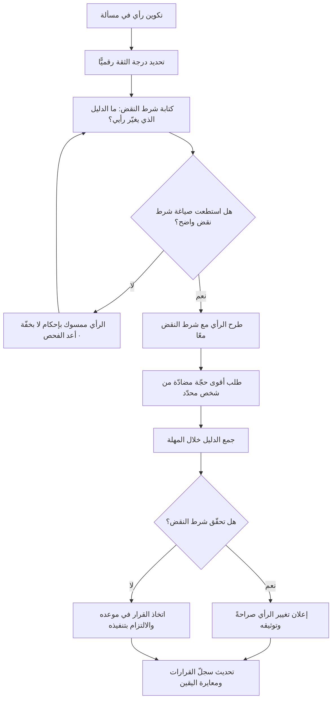

# التواضع الفكري (Intellectual Humility)

> [!info] تعريف مختصر
> قدرة الشخص على إدراك حدود معرفته والاعتراف بها علنًا، وعلى معاملة قناعاته كفرضيات قابلة للمراجعة بدل معاملتها امتدادًا لهويّته. مظهرها العملي في العمل ليس التردّد ولا ضعف الحسم، بل ثلاث قدرات محدّدة: أن تقول «لا أعلم» في اجتماع دون أن تشعر بتهديد؛ أن تحدّد **مسبقًا** ما الدليل الذي سيجعلك تغيّر رأيك؛ وأن تغيّر رأيك فعلًا حين يظهر ذلك الدليل، دون إعادة صياغة الماضي لتبدو متّسقًا. وهي مقابلة للثقة المفرطة لا للثقة، إذ يجتمع فيها الحسم في القرار مع الانفتاح على النقض.

## الشرح العلمي والاحترافي
- **تمييزها عن التواضع الاجتماعي**: التواضع الاجتماعي أسلوب في التعامل (عدم التباهي، إسناد الفضل للفريق). أما التواضع الفكري فموقف **معرفي** من المحتوى: تقدير دقيق لدرجة اليقين المستحقّة لكل اعتقاد. وقد يكون الشخص متواضعًا اجتماعيًّا ومتصلّبًا فكريًّا في آن — لطيفًا في الخطاب، مستعصيًا على أي دليل.
- **معايرة اليقين (Calibration)**: المهارة الأساسية هنا ليست الشكّ في كل شيء، بل أن تكون درجة ثقتك متناسبة مع قوّة الدليل. من يقول «واثق 90%» يجب أن يصدق تقريبًا في تسع من كل عشر مرّات. تحسين هذه المعايرة يتطلّب تسجيل التوقّعات وتواريخها ومراجعتها لاحقًا — وهو ما يجعل [[Decision Log]] أداة تدريب على التواضع الفكري لا مجرّد أرشيف.
- **مقاومة الانحيازات التي تعمي**: التواضع الفكري هو المضادّ السلوكي لـ[[Confirmation Bias]] (البحث عمّا يؤكّد) ولانحياز الإدراك المتأخّر (ادّعاء أننا كنّا نعرف) ولانحياز الثقة المفرطة. ولا تُقاوم هذه الانحيازات بالنيّة الحسنة بل بآليات مؤسسية: توقّعات مكتوبة سلفًا، عتبات محدّدة، مراجعون بلا مصلحة في النتيجة.
- **علاقتها بالسلطة**: كلّما ارتفع موقع الشخص ازدادت كلفة تصلّبه، لأن رأيه يُسكِت المعلومات المخالفة قبل أن تصل إليه أصلًا. لهذا يُعدّ تحدّث القائد **أخيرًا** في النقاش ممارسة عملية مباشرة لهذا المفهوم، وهو أيضًا شرط لعمل [[Psychological Safety]] وللفائدة من جلسات [[Pre-mortem]].
- **«آراء قويّة مُمسَكة بخفّة» — القاعدة وشهرتها**: صيغة شاعت في أوساط التخطيط بالسيناريوهات والتقنية، وتُنسب عادةً إلى مدير معهد المستقبل **بول ساڤو (Paul Saffo)**، ومفادها: كوّن رأيًا واضحًا بسرعة لتستطيع اختباره ونقده، ثم تخلَّ عنه بلا تعلّق حين يظهر ما ينقضه. القيمة فيها أنها تحلّ عقدة الشلل التحليلي — فالرأي الصريح يمنح النقاش هدفًا يُصوَّب نحوه.
- **النقد الجادّ لهذه القاعدة تحديدًا — كيف تُستعمل غطاءً للتسرّع**:
  ① **الشطر الأول يُطبَّق والثاني يُنسى**: في الواقع العملي، ما يُمارَس هو «آراء قويّة» فقط. أما «الإمساك بخفّة» فتصريح لفظي لا يُختبر أحد بمقتضاه، لأن أحدًا لا يسأل: متى تخلّيت آخر مرّة عن رأي قويّ؟
  ② **إذن اجتماعي بالجزم بلا عمل**: تمنح القاعدة غطاءً لإطلاق أحكام قاطعة في مجالات لم يُبذل فيها جهد بحثي، بحجّة أن الرأي «مؤقت وقابل للتعديل» — بينما تكلفته على النقاش ليست مؤقتة.
  ③ **عدم تماثل السلطة**: حين يُطلق كبير المهندسين رأيًا «قويًّا ممسَكًا بخفّة»، فإن ثقله في الغرفة قويّ فعلًا وخفّته نظرية فقط. يُثبّت الرأي تفكير المجموعة، ويصبح على المبتدئ عبء إثبات العكس أمام رأي مُعلَن.
  ④ **الخفّة غير قابلة للتحقّق بلا معيار مسبق**: بلا تحديد مسبق لما سينقض الرأي، يستطيع صاحبه أن يهضم كل دليل مخالف بتفسير ظرفي ويظلّ يدّعي انفتاحه. **العلاج العملي**: اقرن كل رأي قويّ بجملة صريحة — «سأتخلّى عن هذا الرأي إذا رأيت [دليلًا محدّدًا] بحلول [تاريخ]». من لم يستطع صياغة هذا الشرط فرأيه ليس ممسَكًا بخفّة بل بإحكام، مهما أعلن غير ذلك.
  ⑤ **بديل مقترح متداول**: صاغ بعض الممارسين بديلًا أدقّ بمعنى «آراء ضعيفة مُمسَكة بقوّة»، أي: كن متحفّظًا في درجة الجزم، ثم التزم بالقرار الجماعي التزامًا تنفيذيًّا صارمًا بعد اتّخاذه. والقصد نقل الحسم من طبقة الرأي إلى طبقة الالتزام بالتنفيذ.
- **حدودها**: التواضع الفكري ليس تعليقًا دائمًا للقرار. المشاريع تُدار تحت عدم يقين لا يُحلّ كاملًا، والقرار المؤجَّل قرار له كلفة. الصياغة الناضجة: **اقرّر بحزم في الموعد، ووثّق درجة يقينك وما قد ينقض القرار، وراجع عند ظهور دليل جديد** — لا أن تعيد فتح كل قرار عند كل انطباع جديد، وهو ما يُنهك الفرق ويسمّى إعياء القرار.

## أين ومتى يُستخدم
- **في المراجعات اللاحقة للحوادث**: كشرط لصدق السرد في [[Blameless Postmortem]]، حيث يقتل انحياز الإدراك المتأخّر («كان واضحًا أنه سيفشل») أي تحليل نافع.
- **في التقدير والتخطيط**: بالإفصاح عن درجة عدم اليقين بدل رقم واحد قاطع، عبر [[Relative Estimation]] و[[Percentiles and Median vs Average]] و[[Monte Carlo Simulation]] و[[Estimation Variance]].
- **في مقابلات المستخدمين والاكتشاف**: جوهر منهج [[The Mom Test]] هو الامتناع عن الدفاع عن فكرتك أثناء البحث، وهو تطبيق مباشر للتواضع الفكري في [[User Interview]].
- **في اتخاذ القرار الجماعي**: بتوثيق درجة الثقة والافتراضات في [[Decision Log]]، وبتحديد ما سينقض القرار مسبقًا كما في [[Kill Criteria]].
- **في العمل مع أنظمة غير حتمية**: التعامل مع مخرجات نماذج اللغة يستلزم إقرارًا دائمًا بحدود اليقين ومقاومة [[Automation Bias]] و[[Hallucination]] عبر تحقّق منهجي.
- **في القيادة وإدارة أصحاب المصلحة**: عند إبلاغ خبر سيّئ أو تصحيح تقدير سابق علنًا، بما ينسجم مع [[Radical Transparency]] و[[Servant Leadership]].

## مثال وسيناريو تطبيقي
> [!example] شركة تقنية في الرياض كانت تخطّط لإعادة بناء نظامها الأساسي. مدير الهندسة، وهو ذو خبرة 14 سنة، أعلن في اجتماع التصميم رأيًا حاسمًا: «الأداء لن يتحسّن إلا بالانتقال إلى معمارية الخدمات المصغّرة، وأي حل آخر ترقيع». وحين اعترض مهندسان قال العبارة المألوفة: «رأيي قويّ لكنني ممسك به بخفّة، أقنعوني بالعكس».
> **ما حدث فعلًا خلال ثلاثة أسابيع**: لم يقتنع أحد بشيء. المهندسان توقّفا عن الاعتراض بعد جولتين، لأن عبء الإثبات صار عليهما أمام رأي مُعلَن من صاحب أعلى خبرة في الغرفة. وبُدئ التخطيط للترحيل. أي أن «الخفّة» لم تكن قابلة للتحقّق: لم يُذكر قط ما الذي سيجعل المدير يغيّر رأيه.
> **التدخّل**: اقترحت مديرة المنتج قاعدة واحدة قبل اعتماد الخطة — أن يكتب كل صاحب رأي جملة واحدة: «سأتخلّى عن رأيي إذا…».
> كتب المدير بعد تفكير: «سأتخلّى عن رأيي إذا أظهر قياس فعلي أن أكثر من 70% من زمن الاستجابة يأتي من الاستعلامات لا من بنية النشر».
> استغرق القياس أسبوعًا واحدًا على بيئة الإنتاج: **83%** من زمن الاستجابة كان في ثلاثة استعلامات غير مفهرسة وطبقة تخزين مؤقّت معطّلة منذ ترقية سابقة.
> فقال المدير في الاجتماع التالي جملة اعتبرها الفريق نقطة تحوّل ثقافية: «كنت مخطئًا، والدليل الذي حدّدته أنا بنفسي ينقض رأيي». أُلغي مسار الترحيل الذي كان مقدَّرًا بـ 11 شهرًا و7 مهندسين، واستُبدل به عمل استغرق 6 أسابيع لمهندسَين، فانخفض زمن الاستجابة الوسيط من 940 مللي ثانية إلى 210.
> **الخلاصة التي وُثّقت في [[Decision Log]]**: العبارة «آراء قويّة ممسَكة بخفّة» لم تنفع بذاتها ثلاثة أسابيع؛ ما نفع هو **تحويل الخفّة إلى شرط نقض مكتوب وقابل للقياس بتاريخ**. ولولا ذلك لكانت الشركة قد أنفقت 11 شهرًا على حلّ لمشكلة تشخيصها خاطئ.

## خطوات أو مخطّط
1. **افصل الرأي عن الهوية**: صِغ رأيك بصيغة «الدليل الحالي يرجّح…» لا «أنا أرى…». الصياغة الأولى تجعل تغيّر الرأي تحديثًا للمعلومة، والثانية تجعله تنازلًا شخصيًّا.
2. **صرّح بدرجة ثقتك رقميًّا**: «واثق 60%» أنفع بكثير من «أعتقد»، لأنها تفتح النقاش على الأربعين في المئة الباقية.
3. **اكتب شرط النقض قبل النقاش**: «سأغيّر رأيي إذا ظهر [دليل محدّد] بحلول [تاريخ]». وهذه الخطوة هي التي تحوّل «الإمساك بخفّة» من ادّعاء إلى التزام قابل للتحقّق.
4. **اعكس عبء الإثبات على نفسك**: اسأل «ما الذي يجعلني مخطئًا؟» قبل «ما الذي يؤكّد رأيي؟»، واطلب من شخص بعينه أن يبني أقوى حجّة مضادّة.
5. **تكلّم أخيرًا إن كنت الأعلى سلطة**: واجمع الآراء مكتوبةً قبل النقاش المفتوح لتفادي تثبيت المجموعة على رأيك.
6. **وثّق التوقّع لا الانطباع**: سجّل ما تتوقّعه وتاريخه في [[Decision Log]]، فبلا سجلّ ستتذكّر دائمًا أنك «كنت تعرف».
7. **راجع توقّعاتك السابقة دوريًّا**: افتح السجلّ كل ربع سنة واحسب كم مرّة صدق يقينك المُعلَن. هذه هي المعايرة العملية.
8. **اجعل قول «لا أعلم» مكلفًا صفرًا**: قلها أنت أولًا وعلنًا، وأتبعها بـ«سأتحقّق وأعود خلال يومين» ثم افعل. الالتزام بالمتابعة هو ما يمنعها من أن تصبح تهرّبًا.
9. **افصل مرحلة النقاش عن مرحلة الالتزام**: بعد اتّخاذ القرار في موعده، التزم بالتنفيذ التزامًا كاملًا ولا تُعِد فتحه إلا بدليل يستوفي شرط النقض المكتوب.

## ⚠️ مفاهيم خاطئة شائعة
> [!warning]
> - **الخلط بينه وبين التردّد أو ضعف القيادة**: التواضع الفكري لا يمنع الحسم في الموعد. الصيغة الناضجة: قرار حاسم + إقرار صريح بدرجة عدم اليقين + شرط مراجعة محدّد. أما القائد الذي لا يقرّر فمشكلته إدارية لا معرفية.
> - **الظنّ أن «لا أعلم» تكفي وحدها**: هي نصف الممارسة فقط. النصف الثاني هو «وسأعرف بحلول كذا وبهذه الطريقة». «لا أعلم» المجرّدة والمتكرّرة تتحوّل إلى تهرّب من المسؤولية.
> - **افتراض أن إعلان الانفتاح دليل عليه**: عبارات مثل «صحّحوني إن كنت مخطئًا» و«أنا منفتح على أي رأي» بلا شرط نقض مكتوب لا تعني شيئًا قابلًا للتحقّق، وقد تكون في الواقع إغلاقًا مهذّبًا للنقاش.
> - **اعتبار «آراء قويّة ممسَكة بخفّة» قاعدة سليمة بلا تحفّظ**: القاعدة تُطبَّق عمليًّا بشطرها الأول غالبًا، وتوفّر غطاءً للجزم المتسرّع، ويتضاعف ضررها مع فارق السلطة. لا تُستعمل إلا مقرونةً بشرط نقض معلَن وبقاعدة تحدّث القائد أخيرًا.
> - **الاعتقاد بأنه سمة شخصية ثابتة**: هو سلوك يتأثّر بشدّة بالبيئة. الشخص نفسه يكون منفتحًا في فريق آمن ومتصلّبًا في فريق يُعاقَب فيه على الخطأ. لذلك يُبنى بالآليات ([[Psychological Safety]]، شروط النقض، السجلّات) لا بالاختيار الشخصي وحده.
> - **الظنّ أنه يعني المساواة بين كل الآراء**: الاعتراف بحدود المعرفة لا يلغي وزن الخبرة والدليل. رأي مسنود ببيانات ليس مساويًا لانطباع، والتواضع الفكري هو تقدير الأدلّة بدقّة — لا التسوية بينها.

## ❌ ممارسات خاطئة في المشاريع
> [!failure]
> - **الخطأ: أن يعلن صاحب أعلى سلطة رأيه أولًا في اجتماع التصميم**. لماذا يضرّ: يثبّت تفكير المجموعة ويقلب عبء الإثبات على المعترضين، فتُفقد آراء كانت ستغيّر القرار. الحل: اجمع الآراء مكتوبةً قبل النقاش، واجعل قاعدة «الأعلى سلطة يتحدّث أخيرًا» صريحة في ميثاق الفريق ([[Team Working Agreement]]).
> - **الخطأ: استعمال «رأيي ممسوك بخفّة» بلا تحديد ما ينقضه**. لماذا يضرّ: يمنح غطاء لفظيًّا للجزم بلا مساءلة، ويستحيل التحقّق من الخفّة المدّعاة، فيستمر الرأي مؤثّرًا بلا كلفة على صاحبه. الحل: اشترط في أي رأي حاسم جملة «سأتخلّى عنه إذا…» بدليل وتاريخ، واعتبر العجز عن صياغتها إشارة إلى تصلّب لا إلى وضوح.
> - **الخطأ: إعادة كتابة الماضي بعد ظهور النتيجة («كنت أقول ذلك منذ البداية»)**. لماذا يضرّ: يمنع أي تعلّم لأن أحدًا لا يعترف بأنه فوجئ، ويضرّ بمعنويات من قال ذلك فعلًا ولم يُسمع. الحل: وثّق التوقّعات بتاريخها في [[Decision Log]]، واحتكم إلى النص لا إلى الذاكرة في المراجعات.
> - **الخطأ: معاقبة من غيّر رأيه علنًا واعتباره متذبذبًا**. لماذا يضرّ: يتعلّم الجميع أن الثبات على الخطأ أرخص من التصحيح، فتُبقى قرارات ميّتة قيد التنفيذ لسنوات. الحل: أظهر التقدير علنًا لتغيير الرأي المسنود بدليل، واذكره كمثال في مراجعة الأداء بوصفه سلوكًا مطلوبًا.
> - **الخطأ: طلب «رأي صريح» ثم مجادلة كل من يقدّمه**. لماذا يضرّ: يعلّم الفريق أن السؤال شكلي وأن التكلفة أعلى من العائد، فيصمت الجميع ويتحوّل الاجتماع إلى مصادقة. الحل: التزم بقاعدة الاستماع دون ردّ فوري، وسجّل الاعتراضات مكتوبة، وأجب عنها في جلسة لاحقة بعد تفكير.
> - **الخطأ: الخلط بين مرحلة النقاش ومرحلة التنفيذ**. لماذا يضرّ: إعادة فتح القرار عند كل انطباع جديد تُنهك الفريق وتُفقد الخطة معناها، ويُساء فهم ذلك على أنه انفتاح. الحل: اعلن إغلاق النقاش بتاريخ محدّد، واربط أي إعادة فتح بشرط نقض مكتوب سلفًا لا برأي جديد.
> - **الخطأ: تقديم التقدير برقم واحد قاطع بلا مدى**. لماذا يضرّ: يخفي عدم اليقين الحقيقي، فيُبنى التزام تعاقدي على رقم لا يستحقّ هذا القدر من الثقة، ثم يُلام الفريق عند الانحراف. الحل: قدّم مدى مع درجة ثقة وافتراضات مكتوبة ([[Estimation Variance]])، وحدّث المدى مع تناقص عدم اليقين.

## 🔗 مصطلحات ومفاهيم ذات صلة
[[Growth Mindset]] | [[Blameless Postmortem]] | [[Pre-mortem]] | [[Kill Criteria]] | [[Intelligent Failure]] | [[Psychological Safety]] | [[Decision Log]] | [[Confirmation Bias]] | [[Automation Bias]] | [[The Mom Test]] | [[User Interview]] | [[Estimation Variance]] | [[Radical Transparency]] | [[Active Listening]] | [[Team Working Agreement]]
