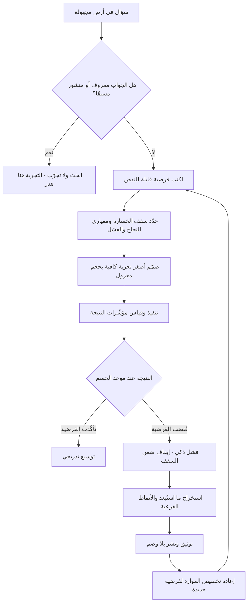

# الفشل الذكي (Intelligent Failure)

> [!info] تعريف مختصر
> فشل يقع نتيجة محاولة مقصودة ومصمَّمة سلفًا لاستكشاف أرض مجهولة، بحجم مضبوط بحيث لا يتجاوز ما يمكن تحمّله، ويُنتج معلومة جديدة لم تكن متاحة بأي طريقة أرخص. مصطلح شاعت صياغته في أعمال الباحثة الإدارية **إيمي إدموندسون (Amy Edmondson)**، التي ميّزت بين أنواع الفشل بحسب سياقها وقيمتها المعرفية، وحاججت بأن المؤسسات تعامل كل الإخفاقات معاملة واحدة — بالتوبيخ — فتخنق النوع الوحيد منها الذي يستحق التشجيع. الفشل الذكي ليس تسامحًا مع الرداءة، بل **استثمار مقصود في المعرفة** له معايير قبول صارمة: فرضية مسبقة، أصغر حجم كافٍ، وتعلّم موثّق ومنقول.

## الشرح العلمي والاحترافي
- **المعايير التي تجعل الفشل «ذكيًّا»**: لا يكفي أن يقع الفشل في مجال جديد ليُسمّى ذكيًّا. الشروط المتفق عليها في هذا الأدب خمسة: ① أن يقع في **أرض مجهولة** لا في عمل معروف مسبقًا؛ ② أن يسعى إلى **هدف ذي قيمة** لا إلى تجريب عبثي؛ ③ أن يكون مسبوقًا بـ**فرضية** واستعداد معرفي (بحث عمّا هو معلوم قبل تكرار خطأ سبق أن ارتكبه غيرك)؛ ④ أن يكون **بأصغر حجم كافٍ** لتوليد الإجابة؛ ⑤ أن يُستخلص منه **تعلّم موثّق** ويُنقل. غياب أي شرط يخرجه من الفئة.
- **التصنيف الثلاثي للفشل — وهو أهم ما في الإطار عمليًّا**:
  ① **الفشل الرديء (Preventable / Basic)**: يقع في عمل معروف ومحدّد الخطوات، وسببه انحراف عن إجراء قائم أو إهمال أو تخطّي فحص. لا قيمة معرفية له، والاستجابة الصحيحة تصحيح الانضباط والتصميم ليقلّ احتماله — لا الاحتفاء به.
  ② **الفشل المعقّد (Complex)**: يقع في أنظمة معروفة الأجزاء لكن تفاعلاتها كثيرة، حين تجتمع عدّة عوامل صغيرة كلٌّ منها مقبول وحده. لا يمكن منعه كليًّا، والاستجابة الصحيحة هي الاكتشاف المبكّر والتخفيف والحواجز — وهو الميدان الطبيعي لـ[[Blameless Postmortem]].
  ③ **الفشل الذكي (Intelligent)**: يقع في أرض مجهولة حيث لا توجد إجابة مسبقة يمكن الرجوع إليها، والاستجابة الصحيحة هي الاحتفاء بالتعلّم بشرط أن يكون الحجم مضبوطًا والدرس موثّقًا.
  الخطأ الإداري الشائع أن تُعامَل الفئات الثلاث بردّ فعل واحد: إمّا التسامح مع الجميع (فتنهار الجودة)، أو العقاب للجميع (فيموت الابتكار).
- **حدّ الفشل المحتمل (Failure Budget)**: الفشل الذكي يستلزم تحديد سقف الخسارة مسبقًا — مبلغ، مدّة، عدد مستخدمين متأثّرين — بحيث تكون الخسارة القصوى معلومة قبل البدء. التجربة التي لا سقف لها ليست ذكية مهما كانت نيّتها، لأنها تفتح الباب لتصعيد الالتزام. ومن هنا تكامله الوثيق مع [[Kill Criteria]].
- **العائد الحقيقي هو المعرفة المستبعِدة**: التجربة الفاشلة تُغلق فرعًا كاملًا من شجرة الاحتمالات وتوجّه الموارد إلى ما بقي. وهذا يجعل الفشل الذكي منطقيًّا اقتصاديًّا: كلفة معرفة أن هذا المسار لا يعمل، مدفوعة الآن بمئة ألف، أرخص من اكتشافها بعد سنتين بعشرة ملايين — وهو منطق [[Cost-of-Change Curve]] و[[Cost of Experimentation]].
- **شرطه الثقافي**: لا يمكن أن يوجد فشل ذكي في بيئة يُعاقَب فيها كل إخفاق. الفرق في مثل هذه البيئات تختار المشاريع المضمونة، وتخفي النتائج السلبية، وتُبقي المبادرات حيّة اسميًّا لتفادي إعلان الفشل. لذلك يقترن هذا المفهوم دائمًا بـ[[Psychological Safety]].
- **تمييزه عن «تحرّك سريعًا واكسر الأشياء»**: الشعار الشائع يُفهم غالبًا كإذن بالإهمال، بينما الفشل الذكي **أكثر انضباطًا** لا أقل: فرضية مكتوبة، عيّنة محدودة، معيار نجاح وفشل مسبق، توثيق. الفارق بين الاثنين هو الفارق بين التجربة المخبرية والحادث.
- **التوثيق شرط لا إضافة**: الفشل الذي لا يُوثَّق ولا يُنقل يُدفع ثمنه مرّتين، لأن فريقًا آخر سيكرّره بعد عام. لهذا تُنقل مخرجات التجارب الفاشلة إلى [[Decision Log]] و[[Organizational Process Assets]]، ويُسجَّل فيها ما استُبعد لا ما نجح فقط.
- **الحجم أهم من النيّة**: تجربة بحسن نيّة لكنها أُطلقت على قاعدة المستخدمين كاملة ليست فشلًا ذكيًّا بل مقامرة. تقنيات ضبط الحجم — إطلاق تدريجي، شريحة صغيرة، بيئة محدودة — هي ما يحوّل المخاطرة إلى استثمار، وهي جوهر [[Pilot Launch]] و[[Fake Door Test]].

## أين ومتى يُستخدم
- **في اكتشاف المنتج والتجريب**: كإطار لتقييم جودة التجربة في [[Continuous Discovery]] و[[Dual-Track Agile]]، حيث يُقاس الفريق بعدد الفرضيات المحسومة لا بعدد الميزات المُطلقة.
- **في تصميم إثباتات المفهوم**: لتحديد ما يُعدّ نتيجة مقبولة في [[Proof of Concept]] و[[Prototype]]، بحيث لا تتحوّل إلى مسار تطوير كامل قبل الحسم.
- **في مبادرات الذكاء الاصطناعي**: حيث الأداء غير حتمي ([[Non-determinism]]) ولا يمكن ضمان النتيجة مسبقًا، فتُصمَّم التجارب بمعايير قبول واضحة عبر [[Evals]] وحدود كلفة عبر [[Inference Cost]].
- **في الأهداف الطموحة**: عند استخدام [[Stretch Goal]] أو [[2X and 10X Goals]]، حيث يُتوقّع عدم بلوغ الهدف كاملًا، ويُشترط تمييز عدم البلوغ الناتج عن استكشاف حقيقي من الناتج عن ضعف التنفيذ.
- **في تصنيف الحوادث والإخفاقات**: كخطوة أولى في أي [[Blameless Postmortem]] — تحديد فئة الفشل قبل اختيار الاستجابة، لأن الاستجابة الخاطئة للفئة تكلّف أكثر من الفشل نفسه.
- **في حوكمة محفظة المشاريع**: لتخصيص نسبة صريحة من الميزانية للمبادرات الاستكشافية بسقف خسارة معلوم، وفصلها عن ميزانية التشغيل المضمون.

## مثال وسيناريو تطبيقي
> [!example] شركة توصيل طلبات في الإمارات أرادت خفض كلفة الميل الأخير في الأحياء عالية الكثافة. طُرحت فكرة «نقاط استلام ذكية» بدل التسليم إلى الباب، وكانت الإدارة منقسمة: فريق يقدّر وفرًا يصل إلى 30% من كلفة التوصيل، وفريق يرى أن العميل الخليجي لن يقبل النزول لاستلام طلبه.
> لم يكن لدى أحد بيانات، وليست هناك سابقة محلّية يمكن الرجوع إليها — أي أن المسألة تقع في **أرض مجهولة** بالمعنى الدقيق.
> صُمّمت التجربة بمعايير الفشل الذكي:
> ① **فرضية مكتوبة**: «إذا وُفّرت نقطة استلام على مسافة تقلّ عن 400 متر وخصم 6 دراهم، فإن ما لا يقلّ عن 18% من عملاء الحي سيختارونها خلال 6 أسابيع».
> ② **سقف خسارة معلوم**: 240 ألف درهم و8 أسابيع، بموافقة مكتوبة على أن هذا المبلغ يُعدّ مصروف تعلّم لا استثمارًا يجب استرداده.
> ③ **حجم مضبوط**: حيّان فقط من أصل 46، و3 نقاط استلام مستأجرة شهريًّا لا مبنية.
> ④ **شرط إيقاف مسبق**: إن لم يتجاوز التبنّي 8% بنهاية الأسبوع الرابع، يوقف المسار فورًا.
> ⑤ **معرفة مسبقة**: راجع الفريق التجارب المنشورة علنًا في أسواق أخرى ليتفادى تكرار أخطاء معروفة في موقع النقاط وساعات العمل.
> النتيجة بعد أربعة أسابيع: التبنّي 5.4% فقط. فُعِّل شرط الإيقاف وأُنهي المسار بخسارة 187 ألف درهم من أصل السقف.
> لكن ما استُخرج من التجربة غيّر الاستراتيجية: بيّنت المقابلات أن المانع الأول لم يكن المسافة ولا الخصم، بل **عدم القدرة على استلام الطلب في نافذة زمنية مرنة** — فالنقاط تغلق الساعة 10 مساءً بينما ذروة الطلب بعد 11. كما ظهر نمط فرعي مهمّ: بين سكان المجمّعات السكنية الكبيرة كان التبنّي 21%، أي أضعاف المتوسط، لأن نقطة الاستلام كانت داخل المجمّع نفسه.
> فتحوّلت المبادرة من «نقاط استلام في الأحياء» إلى «خزائن داخل المجمّعات السكنية»، وهو مسار لم يكن مطروحًا أصلًا قبل التجربة.
> التصنيف الصحيح لهذه الحالة: **فشل ذكي**. ولو أن الفريق أطلق الفكرة في 46 حيًّا دفعة واحدة بميزانية 4 ملايين درهم بناءً على قناعة الإدارة، لكانت الخسارة نفسها بلا معرفة إضافية — وهي حينئذ **فشل رديء**، لأن أدوات معرفة الجواب بثمن أقل كانت متاحة ولم تُستعمل.

## خطوات أو مخطّط
1. **تحقّق أنك في أرض مجهولة فعلًا**: ابحث عمّا هو منشور ومعروف داخليًّا وخارجيًّا. تجربة سؤال له إجابة معروفة ليست فشلًا ذكيًّا بل هدرًا.
2. **اكتب الفرضية بصيغة قابلة للنقض**: «إذا [فعلنا كذا] لفئة [كذا]، فسيحدث [كذا] بمقدار [رقم] خلال [مدّة]».
3. **حدّد سقف الخسارة صراحةً**: مالًا ووقتًا وعدد مستخدمين متأثّرين، واحصل على موافقة مكتوبة عليه بوصفه مصروف تعلّم.
4. **صمّم أصغر تجربة كافية**: اسأل «ما أقلّ ما يلزم لحسم هذا السؤال؟» لا «ما أفضل ما يمكن بناؤه؟».
5. **اكتب معياري النجاح والفشل معًا قبل البدء**: ومنهما تُشتقّ [[Kill Criteria]] بعتبة وموعد ومالك.
6. **احمِ العملاء والنظام من أثر التجربة**: عزل بيئي، إطلاق تدريجي، إمكانية تراجع فورية ([[Rollback]]).
7. **نفّذ وراقب مؤشّرات النتيجة لا النشاط**: عدد الاجتماعات والشرائح ليس دليلًا على تقدّم معرفي ([[Outcome vs Output]]).
8. **احسم في الموعد**: الحسم في وقته هو ما يفصل الاستكشاف عن التعلّق. تمديد المهلة بلا معيار جديد إشارة إنذار.
9. **استخرج المعرفة من الفشل**: ما الذي استُبعد يقينًا؟ ما الذي ظهر ولم يكن متوقّعًا؟ ما الفرضية الجديدة التي نشأت؟ الأنماط الفرعية غالبًا أثمن من المتوسط العام.
10. **وثّق وانشر بلا وصم**: في [[Decision Log]] و[[Organizational Process Assets]]، بصيغة يستطيع فريق آخر بعد سنتين أن يستفيد منها.
11. **أعد تخصيص الموارد فورًا**: التعلّم الذي لا يغيّر خطة تخصيص الموارد لم يُستثمر بعد.

## ⚠️ مفاهيم خاطئة شائعة
> [!warning]
> - **فهمه كترخيص عام للفشل**: أكثر إساءة استعمال شائعة. الفشل الذكي فئة ضيّقة بشروط صارمة، ومعظم الإخفاقات في المؤسسات لا تنتمي إليها بل إلى الفشل الرديء الذي كان يمكن منعه بفحص أو إجراء قائم.
> - **الظنّ أن الشعار «احتفوا بالفشل» يعني الاحتفاء بكل فشل**: الاحتفاء موجَّه إلى **المخاطرة المنضبطة والتعلّم الموثّق**، لا إلى الخسارة ذاتها. الاحتفاء غير المميِّز يُرسل رسالة مدمّرة للمنضبطين ويكافئ العشوائية.
> - **الخلط بينه وبين الفشل المعقّد**: الحادثة التشغيلية في نظام قائم ليست فشلًا ذكيًّا؛ لم يكن فيها استكشاف مقصود. علاجها حواجز واكتشاف مبكّر، لا احتفاء ولا «درس ملهم».
> - **اعتبار حجم الخسارة تفصيلًا ثانويًّا**: الحجم هو الشرط الفاصل تقريبًا. المخاطرة نفسها تكون استثمارًا حكيمًا بحجم صغير ومقامرة متهوّرة بحجم كبير، مع أن النية والفكرة واحدة.
> - **الاعتقاد بأنه يُقاس بعدد التجارب**: مؤشّر «عدد التجارب» يُغري بتجارب كثيرة تافهة لا تحسم شيئًا. المقياس الأدقّ هو عدد **الفرضيات المحسومة** ومقدار تغيّر خطة الموارد نتيجة لها.
> - **افتراض أن الشركات الناشئة وحدها تحتاجه**: المؤسسات الكبيرة أحوج إليه لأن كلفة الخطأ فيها أعلى، ولأن ميلها إلى المشاريع المضمونة يجعلها تكتشف تحوّلات السوق متأخّرة. الفارق أن حجم التجربة عندها يجب أن يكون أصغر نسبيًّا وأشدّ عزلًا.

## ❌ ممارسات خاطئة في المشاريع
> [!failure]
> - **الخطأ: إعادة تسمية أي إخفاق «فشلًا ذكيًّا» بعد وقوعه**. لماذا يضرّ: يُلغي التمييز بين فئات الفشل فتفقد المؤسسة قدرتها على تحسين الانضباط، ويصير المصطلح غطاءً لغويًّا لسوء التنفيذ. الحل: اشترط وجود فرضية وسقف ومعيار فشل **مكتوبة قبل البدء** كشرط لتصنيف التجربة في هذه الفئة.
> - **الخطأ: إطلاق التجربة على كامل قاعدة المستخدمين لأن «الفكرة واضحة»**. لماذا يضرّ: يحوّل خسارة محدودة قابلة للاستيعاب إلى ضرر تشغيلي وسمعي واسع لا يمكن التراجع عنه. الحل: اربط حجم التجربة بدرجة عدم اليقين — كلّما قلّ اليقين صغُر الحجم وأُحكم العزل.
> - **الخطأ: عدم تحديد سقف خسارة مسبق**. لماذا يضرّ: يتحوّل الاستكشاف إلى نزيف مفتوح يُغذّيه تصعيد الالتزام، إذ يبدو كل شهر إضافي صغيرًا مقارنةً بما أُنفق. الحل: اكتب السقف في وثيقة الاعتماد واقرنه بـ[[Kill Criteria]] بموعد فحص محدّد.
> - **الخطأ: إغلاق التجربة الفاشلة بهدوء دون توثيق ولا مشاركة**. لماذا يضرّ: تُدفع كلفة التعلّم ثم تُهدر المعرفة، ويكرّر فريق آخر التجربة نفسها بعد عامين بكلفة مماثلة. الحل: اجعل مخرج كل تجربة — ناجحة أو فاشلة — وثيقة قصيرة إلزامية في [[Organizational Process Assets]] تُذكر فيها الاحتمالات المستبعَدة.
> - **الخطأ: معاقبة فريق التزم بالمنهج ولم تنجح فرضيته**. لماذا يضرّ: يتعلّم الجميع أن الأمان في المشاريع المضمونة، فتجفّ مصادر الابتكار وتتحوّل التجارب إلى عروض تأكيدية لقرارات مُتّخذة. الحل: قيّم **جودة تصميم التجربة والالتزام بحدودها** لا نتيجتها، واذكر ذلك صراحةً في معايير التقييم.
> - **الخطأ: التسامح مع الفشل الرديء باسم ثقافة التعلّم**. لماذا يضرّ: تنهار الجودة التشغيلية، ويستاء المنضبطون حين يرون تجاوز الإجراءات بلا أثر، فيهبط المعيار للجميع. الحل: صنّف كل إخفاق في فئته قبل اختيار الاستجابة، وعالج الرديء بتحسين التصميم والفحوص الآلية لا بالخطب.
> - **الخطأ: تصميم التجربة بحيث لا يمكن أن تفشل**. لماذا يضرّ: معيار نجاح فضفاض أو عيّنة منتقاة تجعل النتيجة إيجابية دائمًا، فلا تُنتج التجربة معلومة بل طمأنينة زائفة تُبنى عليها قرارات كبيرة. الحل: اكتب معيار الفشل أولًا قبل معيار النجاح، واعرض التصميم على من لا مصلحة له في النتيجة.

## 🔗 مصطلحات ومفاهيم ذات صلة
[[Kill Criteria]] | [[Pre-mortem]] | [[Blameless Postmortem]] | [[Growth Mindset]] | [[Intellectual Humility]] | [[Psychological Safety]] | [[Hypothesis]] | [[Cost of Experimentation]] | [[Lean Startup]] | [[Proof of Concept]] | [[Pilot Launch]] | [[Fake Door Test]] | [[Continuous Discovery]] | [[Stretch Goal]] | [[Outcome vs Output]] | [[Cost-of-Change Curve]]
