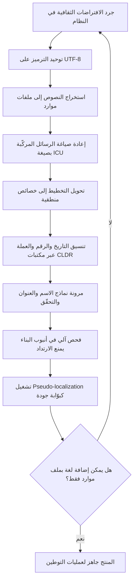

# التدويل (Internationalization)

> [!info] تعريف مختصر
> العمل الهندسي والتصميمي الذي يجعل المنتج **قابلًا للتوطين دون تعديل الكود**. التدويل لا يضيف أي لغة ولا يستهدف أي سوق بعينه؛ بل يزيل من البرمجية كل افتراض مدفون عن اللغة والاتجاه والتاريخ والتقويم والأرقام والعملة وترتيب الأسماء وقواعد الفرز والمقارنة، ويحوّلها إلى بيانات وإعدادات خارجية تُحقَن وقت التشغيل بحسب [[Locale|الـLocale]]. يُختصر بـ **i18n** (حرف I، ثم 18 حرفًا، ثم N). المعيار العملي للحكم على جودة التدويل بسيط وقاسٍ: **هل يمكن إضافة لغة جديدة — بما فيها لغة معاكسة الاتجاه — بإضافة ملف موارد وإعدادات فقط، دون فتح ملف كود واحد؟** إن كان الجواب لا، فالمنتج ليس مُدوَّلًا مهما بلغ عدد لغاته.

## الشرح العلمي والاحترافي

- **التدويل عمل يُنجَز مرّة، والتوطين عمل يتكرّر لكل سوق**: هذه هي الفكرة الاقتصادية المركزية. التدويل تكلفة ثابتة مسبقة، وكل [[Localization|توطين]] لاحق تكلفة حدّية. حين يُنجز التدويل جيدًا تنخفض كلفة السوق الثاني والثالث انخفاضًا حادًّا؛ وحين يُهمَل، تظلّ كلفة كل سوق مساوية تقريبًا لكلفة السوق الأول، فيصير التوسّع خطّيًّا بدل أن يكون تراكميًّا — وهذا هو الفارق بين شركة تدخل عشرة أسواق وشركة تعجز عن الخروج من سوقها.

- **جوهر التدويل: فصل المحتوى والصيغ عن المنطق**: يعني عمليًّا أربعة فصول متمايزة. **فصل النصّ عن الكود** (كل سلسلة ظاهرة للمستخدم تعيش في ملف موارد لها مفتاح، لا داخل الشيفرة). **فصل الصيغة عن القيمة** (يُخزَّن التاريخ كطابع زمني والمبلغ كرقم + رمز عملة، ثم يُنسَّق وقت العرض حسب الـLocale). **فصل الاتجاه عن التخطيط** (يُبنى التخطيط بمفاهيم منطقية: بداية/نهاية بدل يسار/يمين). **فصل القواعد الثقافية عن المنطق** (ترتيب الاسم، صيغة العنوان، التحقّق من رقم الهاتف، قواعد الفرز الأبجدي — كلّها بيانات لكل Locale لا شروط `if` في الكود).

- **الترميز أساس كل شيء: Unicode وUTF-8**: التدويل الحديث يقوم على معيار **Unicode** الذي يمنح كل محرف في لغات العالم نقطة ترميز موحّدة، وعلى تمثيله الأشيع **UTF-8**. القاعدة العملية: UTF-8 من طرف إلى طرف — قاعدة البيانات، والاتصال، وترويسات HTTP، والملفات، والسجلّات. أي حلقة واحدة بترميز مختلف تُنتج «محارف مشوّهة» (Mojibake) يصعب تتبّعها لاحقًا. ويترتّب على Unicode مفهوم دقيق كثيرًا ما يُخطئ فيه المطوّرون: **طول النصّ ليس عدد البايتات ولا حتى عدد نقاط الترميز**، فالحرف الواحد المعروض قد يتكوّن من عدّة نقاط ترميز (حرف + علامة تشكيل، أو رمز تعبيري مركّب). لذلك قصّ النصّ بعدد البايتات يمزّق المحارف، وحدود الحقول يجب أن تُعرَّف بوحدة صحيحة ومعلنة.

- **التطبيع والمقارنة والفرز ليست بديهية**: النصّ نفسه قد يُمثَّل بأكثر من تسلسل ترميز صحيح، ولذلك يوجد **التطبيع (Normalization)** ليوحّد التمثيل قبل المقارنة أو التخزين أو البحث. وفي العربية تحديدًا تظهر مسائل عملية إضافية: التشكيل، والهمزات، وأشكال الألف، والتاء المربوطة — كلها تجعل البحث الحرفي يفشل في مطابقة ما يراه المستخدم متطابقًا. كذلك **الفرز الأبجدي ليس فرزًا بقيم الترميز**، بل يتبع قواعد لغوية لكل Locale، وتُستخدم له خوارزميات مقارنة (Collation) لا مقارنة بايتات.

- **مرجع البيانات الثقافية: CLDR**: بيانات صيغ التواريخ وأسماء الشهور والعملات وفئات الجمع وقواعد الفرز لا تُكتب يدويًّا، بل تُستمدّ من مستودع معياري مفتوح هو **CLDR (Common Locale Data Repository)** التابع لاتحاد Unicode، وهو الأساس الذي تبني عليه المكتبات القياسية في المتصفّحات وأنظمة التشغيل ولغات البرمجة. الاعتماد على CLDR بدل الجداول اليدوية هو الفرق بين تدويل صحيح ومتّسق وبين مجموعة تخمينات — وهو أيضًا ما يجعل [[ICU Message Format]] قادرًا على التعامل مع فئات الجمع الستّ في العربية بلا كود خاص.

- **التدويل يشمل التصميم لا البرمجة وحدها**: على المصمّم أن يبني واجهات تحتمل **تمدّد النصّ**؛ فالنصّ المترجم يطول أو يقصر بنسب معتبرة عن الأصل، والنصوص القصيرة جدًّا (كلمة على زرّ) هي الأكثر عرضة للتمدّد النسبي الكبير. لذلك: لا عروض ثابتة للأزرار والحقول، ولا نصّ محشور في مساحة بلا هامش، ولا نصّ مرسوم داخل الصور (لأنه غير قابل للترجمة ولا للبحث ولا لقارئ الشاشة)، ولا اعتماد على أن العنوان سيبقى في سطر واحد. ويُختبر ذلك مبكرًا عبر [[Pseudo-localization]].

- **الحقول والبيانات الشخصية مسألة تدويل لا مجرّد تصميم نموذج**: افتراض «اسم أول + اسم أخير» يكسر أنظمة تسمية كثيرة؛ وافتراض بنية عنوان واحدة (شارع/مدينة/رمز بريدي بترتيب معيّن) لا يصلح عالميًّا؛ والتحقّق الصارم من رقم الهاتف بصيغة بلد واحد يمنع مستخدمين صالحين من التسجيل. التدويل هنا يعني: حقول مرنة، وتحقّق مُعرَّف لكل Locale، وتخزين يحفظ ما أدخله المستخدم بدل قولبته.

- **المناطق الزمنية والتقويمات جزء أصيل من التدويل**: القاعدة الهندسية المستقرّة هي **تخزين الأزمنة بتوقيت عالمي موحّد مع معرّف منطقة زمنية، والعرض بتوقيت المستخدم**. وتُضاف في السياق العربي والخليجي مسألة **التقويم الهجري**: عرض التواريخ وفق تقويم أُمّ القرى في السياقات الحكومية والإدارية، مع الانتباه إلى أن التحويل بين التقويمين ليس عملية حسابية بسيطة قابلة للارتجال، ويجب أن يُترك للمكتبات المعيارية.

- **التدويل ليس مجانيًّا وله كلفة تشغيلية دائمة**: يضيف طبقة تجريد، ويزيد وقت البناء والاختبار، ويطلب انضباطًا مستمرًّا من كل مطوّر (كل نصّ جديد يجب أن يمرّ عبر ملف الموارد). لذلك قرار التدويل قرار منتَجي واستراتيجي: تدويلٌ كامل لمنتج لن يخرج أبدًا من سوق واحد هو نوع من [[Gold Plating]]. لكن التدويل **الأساسي** (UTF-8، فصل النصوص، عدم تثبيت الاتجاه، تنسيق التواريخ عبر المكتبات) رخيص جدًّا إن فُعل من البداية، وباهظ جدًّا إن أُجّل — وهذا ما يجعله من قرارات المعمارية التي تُتّخذ مبكرًا حتى دون خطّة توسّع مؤكّدة.

## أين ومتى يُستخدم

- **في قرارات المعمارية الأولى للمنتج**: اختيار الترميز، وآلية إدارة الموارد النصّية، ونموذج تخزين الوقت والمال — قرارات يصعب عكسها لاحقًا، ويوضّح [[Cost-of-Change Curve]] لماذا يتضاعف ثمن تأجيلها.
- **في [[Software Requirements Specification]] و[[PRD]]**: تُكتب متطلّبات التدويل كمتطلّبات غير وظيفية صريحة (ترميز، اتجاهات مدعومة، تقويمات، عملات، سلوك الرجوع عند غياب ترجمة) لا كافتراضات ضمنية.
- **في [[Definition of Done]] لكل قصّة تُنتج نصًّا أو صيغة**: «لا سلسلة نصّية داخل الكود» و«لا تنسيق تاريخ يدوي» و«لا خاصية `left`/`right` صريحة في التنسيق» شروط قبول قابلة للفحص آليًّا.
- **قبل أي مشروع [[Localization|توطين]]**: التدويل شرط مسبق؛ البدء بالترجمة قبله يُنتج عملًا يُعاد بالكامل.
- **في المراجعات التقنية وفحص الكود الآلي**: قواعد Lint تمنع النصوص الحرفية والخصائص الاتجاهية، فتحوّل انضباط التدويل من اجتهاد فردي إلى [[Explicit Policies|سياسة صريحة]] مؤتمتة.
- **في اختبار الحالات الحديّة**: [[Edge Cases]] الخاصة بالتدويل (اسم بمحرف غير لاتيني، تاريخ عند انقلاب المنطقة الزمنية، عملة بلا كسور عشرية، نصّ مختلط الاتجاهات) يجب أن تدخل صراحة في خطة الاختبار.
- **عند تقييم منتج جاهز أو مورّد خارجي**: [[Fit-Gap Analysis]] يجب أن يتضمّن بندًا لجاهزية التدويل، لأن اكتشاف أن النظام المشترى لا يدعم [[RTL]] أو التقويم الهجري بعد التعاقد يكاد يكون غير قابل للإصلاح.

## مثال وسيناريو تطبيقي

> [!example] جهة حكومية خليجية طرحت بوّابة خدمات إلكترونية بُنيت أصلًا بالإنجليزية على يد مورّد خارجي، ثم طُلب إضافة العربية بوصفها اللغة الرسمية الأساسية للبوّابة، على أن تكون الإنجليزية ثانوية. قدّر المورّد المهمّة بـ«ترجمة الواجهة» في 4 أسابيع.
> عند الفحص التقني تبيّن الآتي. أولًا: 2,847 سلسلة نصّية مكتوبة داخل الكود مباشرة، منها 640 داخل رسائل تحقّق مولّدة برمجيًّا بجمع أجزاء نصّية («لا يمكن» + اسم الحقل + «أن يكون فارغًا») — وهي بنية لا يمكن ترجمتها إطلاقًا إلى لغة تختلف فيها الرتبة والإعراب، وتحتاج إعادة صياغة إلى [[ICU Message Format]]. ثانيًا: ملف التنسيق يحوي 1,190 استخدامًا لخصائص `margin-left` و`padding-right` و`text-align: left`، أي أن التخطيط مثبَّت الاتجاه بالكامل. ثالثًا: التواريخ مُنسَّقة يدويًّا بدالة داخلية بصيغة واحدة، ولا وجود لأي دعم للتقويم الهجري رغم أن الوثائق الرسمية تعتمده. رابعًا: قاعدة البيانات كانت بترميز غير UTF-8 في ثلاثة جداول، وقد ظهرت فيها بالفعل أسماء مشوّهة لمستخدمين أدخلوا حروفًا عربية عبر تكامل خارجي. خامسًا: حقلا «First Name / Last Name» إلزاميان بينما الاسم الرسمي في السجلات المحلية رباعي.
> أعادت الجهة تعريف العمل: لم يعد «مشروع ترجمة» بل **مشروع تدويل** مدّته 11 أسبوعًا يسبق أي ترجمة، بمخرجات محدّدة: ترحيل الترميز إلى UTF-8 مع تنظيف البيانات المشوّهة، واستخراج كل النصوص إلى ملفات موارد، وإعادة كتابة الرسائل المركّبة كرسائل كاملة ذات متغيّرات، وتحويل التنسيق إلى خصائص منطقية، وإدخال طبقة تنسيق تاريخ تدعم الميلادي والهجري، وتعديل نموذج الاسم والعنوان.
> بعدها أُدخلت [[Pseudo-localization]] فكشفت 189 موضع قصّ في الواجهة و31 نصًّا لم يُستخرج أصلًا. ثم بدأت الترجمة وأُنجزت في 3 أسابيع. الأثر الذي سجّلته الجهة: أُضيفت لاحقًا لغة ثالثة (الأردية لخدمة شريحة من المقيمين) في 8 أيام عمل فقط دون أي تعديل برمجي — وهو الاختبار الحقيقي لنجاح التدويل، لا عدد اللغات المعروضة في القائمة.

## خطوات أو مخطّط

1. جرد كامل لمواضع الافتراضات الثقافية في النظام: النصوص، التواريخ، الأرقام، العملات، الفرز، التحقّقات، الاتجاه، الصور التي تحوي نصًّا.
2. توحيد الترميز على UTF-8 من طرف إلى طرف، مع ترحيل البيانات القديمة وتنظيف المحارف المشوّهة.
3. استخراج كل السلاسل النصّية إلى ملفات موارد بمفاتيح دلالية واضحة (لا مفاتيح مثل `msg_17`، بل مفاتيح تصف الموضع والغرض).
4. إعادة صياغة كل رسالة مركّبة بالتجميع النصّي إلى رسالة واحدة ذات متغيّرات وفق [[ICU Message Format]]، ومعالجة الجمع والجنس داخل الصيغة لا في الكود.
5. تحويل التخطيط إلى خصائص منطقية (بداية/نهاية) بدل يسار/يمين، وضبط اتجاه المستند ديناميكيًّا استعدادًا لـ[[RTL]].
6. نقل كل تنسيق للتاريخ والوقت والرقم والعملة إلى مكتبات معيارية تعتمد بيانات CLDR، مع دعم التقويم الهجري حيث يلزم.
7. مراجعة نماذج البيانات الشخصية: الاسم، العنوان، الهاتف، الهوية — وجعل التحقّق مرتبطًا بالـ[[Locale]] لا ثابتًا.
8. تخزين الأزمنة بتوقيت عالمي موحّد مع معرّف المنطقة الزمنية، والعرض بتوقيت المستخدم.
9. تفعيل قواعد فحص آلي في أنبوب [[CI and CD]] تمنع دخول نصّ حرفي أو خاصية اتجاهية جديدة.
10. تشغيل [[Pseudo-localization]] بوصفها بوّابة جودة، وإصلاح ما تكشفه قبل التسليم للترجمة.
11. توثيق «دليل التدويل للمطوّرين» ودمجه في [[Definition of Done]] كي يبقى الانضباط بعد انتهاء المشروع.

## ⚠️ مفاهيم خاطئة شائعة

> [!warning]
> - **الخلط بين i18n وl10n**: التدويل تهيئة تقنية محايدة لا تخصّ لغة بعينها، والتوطين تنفيذ لسوق محدّد. الخلط يجعل الفريق يظنّ أن «إضافة العربية» عمل ترجمة، فيقدّره بسعر الكلمة ويصطدم بأشهر عمل هندسي.
> - **«دعمنا العربية إذًا المنتج مُدوَّل»**: إضافة لغة واحدة بحلول خاصة (شرط `if` للاتجاه، ملف تنسيق منفصل، دالة تاريخ مكتوبة يدويًّا) ليست تدويلًا بل حالة خاصة مُعالَجة. المعيار هو أن تُضاف اللغة **التالية** بلا كود.
> - **«UTF-8 يكفي»**: الترميز شرط لازم غير كافٍ. منتج بترميز سليم قد يظلّ عاجزًا عن الجمع الصحيح، ومقلوب التخطيط، ومثبّت صيغة التاريخ. الترميز يحلّ مشكلة **تمثيل** المحارف لا مشكلة **عرض** المعنى.
> - **«طول النصّ = عدد المحارف»**: في Unicode قد يتألّف المحرف المعروض من عدّة نقاط ترميز. القصّ أو حدّ الطول المبني على وحدات خاطئة يُنتج نصًّا مشوّهًا أو رفضًا لمدخلات صحيحة. التصحيح: عرّف وحدة القياس صراحة واستخدم دوال واعية بالنصّ.
> - **«المقارنة النصّية عملية بديهية»**: تساوي سلسلتين ظاهرتين لا يعني تطابق ترميزهما، والفرز الأبجدي يتبع قواعد لغوية لا قيم ترميز. تجاهل التطبيع والمقارنة اللغوية يُنتج بحثًا يفشل في إيجاد ما يراه المستخدم موجودًا، وقوائم مرتّبة بترتيب لا معنى له.
> - **«التدويل يخصّ الواجهة الأمامية فقط»**: الخلفية معنية بالقدر نفسه: رسائل الأخطاء المعادة من الخدمات، والتقارير والملفات المُصدَّرة، والفواتير، والبريد الآلي، ومنطق الفرز والبحث في قاعدة البيانات. تدويلٌ يقف عند الواجهة يُنتج تجربة نصف مترجمة تنكشف عند أول عملية تصدير أو إشعار.
> - **«التدويل استثمار لا يلزم إلا عند نيّة التوسّع»**: الحدّ الأساسي منه (الترميز، فصل النصوص، عدم تثبيت الاتجاه، التنسيق عبر المكتبات) شبه مجاني عند البناء الأول، وتكلفته ترتفع أضعافًا مع كل شهر تأجيل. تأجيله رهانٌ على ألّا يتوسّع المنتج أبدًا.

## ❌ ممارسات خاطئة في المشاريع

> [!failure]
> - **بناء الرسائل بتجميع أجزاء نصّية**: الخطأ — يُكوَّن النصّ برمجيًّا مثل «تمّ حذف » + العدد + « عنصرًا». لماذا يضرّ — رتبة الكلمات والإعراب وقواعد الجمع تختلف بين اللغات، فتستحيل ترجمة الأجزاء المنفصلة ترجمة صحيحة، وتظهر جمل مكسورة في كل لغة غير الأصلية. الحل — اجعل كل رسالة سلسلة واحدة كاملة ذات متغيّرات مسمّاة بصيغة [[ICU Message Format]]، وامنع التجميع النصّي بقاعدة فحص آلي.
> - **تثبيت الاتجاه في ملفات التنسيق**: الخطأ — استخدام `left`/`right` في الهوامش والمحاذاة والحدود. لماذا يضرّ — كل لغة معاكسة الاتجاه تتطلّب ملف تنسيق موازيًا يجب صيانته إلى الأبد، ويتباعد عن الأصل مع كل تعديل. الحل — استخدم الخصائص المنطقية (start/end) وضبط `dir` على مستوى المستند، وراجع تفاصيل الانعكاس الانتقائي في [[RTL]].
> - **تخزين المبالغ كنصّ منسَّق**: الخطأ — يُحفظ المبلغ في قاعدة البيانات هكذا «1,250.00 SAR». لماذا يضرّ — يصير الحساب مستحيلًا بلا تحليل نصّي هشّ، وتختلط الفواصل العشرية بفواصل الآلاف بين الـLocales فتظهر أخطاء مالية صامتة. الحل — خزّن القيمة العددية بدقّة مناسبة ورمز العملة منفصلًا، ونسّق وقت العرض فقط حسب [[Locale]].
> - **تأجيل التدويل إلى ما بعد إطلاق المنتج**: الخطأ — «نطلق أولًا ثم ندوّل». لماذا يضرّ — يتضاعف حجم النصوص والافتراضات المدفونة شهرًا بعد شهر، فيتحوّل التدويل من عمل بنيوي مبكّر إلى إعادة كتابة واسعة، ويتراكم بوصفه [[Technical Debt|دَينًا تقنيًّا]] عالي الفائدة. الحل — نفّذ الحدّ الأساسي من التدويل منذ الإصدار الأول حتى بلغة واحدة، وأجّل التوطين لا التدويل.
> - **الاعتماد على مطوّر واحد «يفهم التدويل»**: الخطأ — تُوكل المسألة إلى شخص، ويستمرّ بقية الفريق في كتابة نصوص حرفية. لماذا يضرّ — الانضباط ينهار فور مغادرته أو انشغاله، ويعود الدَّين للتراكم بسرعة أكبر لأن أحدًا لا يراقبه. الحل — حوّل القواعد إلى فحوصات آلية في أنبوب [[CI and CD]]، ووثّقها في دليل مكتوب، واجعلها بندًا في مراجعة الكود لا مسؤولية شخص.
> - **إهمال المخرجات غير التفاعلية**: الخطأ — تُدوَّل الشاشات وتُترك التقارير المُصدَّرة والفواتير وملفات PDF ورسائل البريد الآلي بصيغ وترميز ثابتين. لماذا يضرّ — هذه المخرجات هي ما يصل إلى العميل الخارجي والجهات الرقابية، فيظهر الخلل في أكثر السياقات حساسية، وقد يخالف اشتراطات تنظيمية. الحل — أدرج كل مخرَج غير تفاعلي في نطاق التدويل صراحة وفي [[RTM|مصفوفة التتبّع]].
> - **افتراض بنية اسم وعنوان عالمية واحدة**: الخطأ — حقلان إلزاميان للاسم، وقالب عنوان وحيد، وتحقّق صارم من الهاتف بصيغة بلد واحد. لماذا يضرّ — يمنع مستخدمين صالحين من إتمام التسجيل، ويشوّه البيانات المخزّنة، ويولّد تذاكر دعم يصعب تصنيفها. الحل — اجعل بنية الاسم والعنوان وقواعد التحقّق بيانات مرتبطة بالـ[[Locale]]، وخزّن ما أدخله المستخدم كما هو.

## 🔗 مصطلحات ومفاهيم ذات صلة
[[Localization]] | [[Locale]] | [[RTL]] | [[Pseudo-localization]] | [[ICU Message Format]] | [[Technical Debt]] | [[Cost-of-Change Curve]] | [[Definition of Done]] | [[Edge Cases]] | [[Fit-Gap Analysis]]
