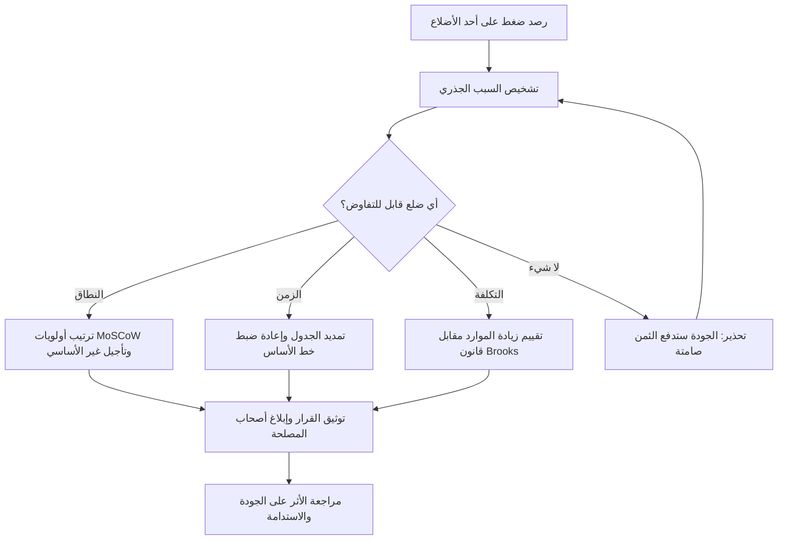

# مثلث القيود (Iron Triangle)

> [!info] تعريف مختصر
> مثلث القيود (Iron Triangle) — ويُسمّى أيضًا Triple Constraint أو Project Management Triangle — نموذج يصف العلاقة الإجبارية المتبادلة بين ثلاثة قيود أساسية في أي مشروع: **النطاق (Scope)** و**الزمن (Time)** و**التكلفة (Cost)**، وفي مركز المثلث تقع **الجودة (Quality)** بوصفها المحصّلة النهائية لتوازن الأضلاع الثلاثة. القاعدة الحاكمة: لا يمكن تثبيت الأضلاع الثلاثة معًا؛ أي تغيير في ضلع يفرض تعديلًا في ضلع آخر على الأقل، وإن رفضتَ التعديل فإن الجودة هي التي تدفع الثمن صامتةً.

## الشرح العلمي والاحترافي
- **النطاق (Scope)**: مجموع ما سيُنجَز فعليًا — الميزات، المتطلبات، المخرجات، ومستوى التفصيل المطلوب في كل منها. يُوثَّق عادة في [[Scope Statement]] ويُحمى من التمدّد غير المنضبط الموصوف في [[Scope Creep]].
- **الزمن (Time)**: الجدول الزمني، المعالم (Milestones)، وتاريخ التسليم النهائي. وهو غالبًا الضلع الأكثر صلابة عمليًا لارتباطه بالتزامات تعاقدية أو نوافذ سوقية أو أحداث خارجية لا تُؤجَّل.
- **التكلفة (Cost)**: الميزانية بكل مكوّناتها — رواتب الفريق، التراخيص، البنية التحتية، الاستشارات، واحتياطي الطوارئ ([[Contingency Reserve]]).
- **الجودة (Quality)** في المركز: ليست ضلعًا رابعًا مستقلًا بل نتيجة تفاعل الأضلاع الثلاثة. حين يُضغَط الزمن ويُثبَّت النطاق وتُجمَّد التكلفة، فإن المتغيّر الوحيد المتبقّي للتكيّف هو جودة التنفيذ: اختبار أقل، مراجعة كود أسرع، توثيق ناقص، حلول التفافية مؤقتة — أي [[Technical Debt]] يُسدَّد لاحقًا بفائدة مركّبة.
- **الصياغة العملية الشهيرة**: «سرعة عالية + جودة عالية + كل الميزات = مستحيل. اختر اثنين». وهي ليست مبالغة بلاغية بل وصف لبنية القيد: الموارد المتاحة في نافذة زمنية محدّدة تنتج سعة إنتاجية محدودة، وتوزيع هذه السعة على ثلاثة مطالب متزامنة يعني حتمًا تجويع أحدها.
- **لماذا زيادة الموارد أسوأ حل**: الاستجابة الغريزية للضغط الزمني هي إضافة أفراد إلى الفريق، وهي استجابة تُفاقم المشكلة لسببين قابلين للقياس:
  1. **منحنى التعلّم (Learning Curve)**: العضو الجديد لا ينتج قيمة صافية من يومه الأول؛ بل يستهلك وقت الأعضاء الخبراء في التأهيل، وشرح المعمارية، ومراجعة أعماله الأولى. صافي إنتاجية الفريق ينخفض في الأسابيع الأولى قبل أن يرتفع — وفي مشروع متأخّر لا يوجد ترف انتظار هذا الارتفاع.
  2. **انفجار قنوات التواصل**: عدد قنوات التواصل الثنائية في فريق من `n` فردًا يساوي `n(n−1)/2`. فريق من 5 أفراد فيه 10 قنوات، وفريق من 10 أفراد فيه 45 قناة، وفريق من 15 فردًا فيه 105 قنوات. أي أن مضاعفة الفريق من 5 إلى 10 تضاعف حجم العمل التنسيقي أربع مرات تقريبًا، لا مرتين.
- هذا بالضبط ما لخّصه **قانون بروكس (Brooks's Law)**: «إضافة أفراد إلى مشروع برمجي متأخّر تزيده تأخيرًا». القانون ليس دعوة لتجميد أحجام الفرق، بل تحذير من استخدام التوظيف كعلاج طارئ لخلل في التخطيط.
- **ولماذا الأوفرتايم (Overtime) حلّ خادع**: العمل الإضافي يعطي مكسبًا حقيقيًا في الأسبوع الأول أو الثاني، ثم ينقلب سالبًا. السلسلة السببية معروفة: إرهاق ← تراجع التركيز ← ارتفاع معدل الأخطاء ← إعادة عمل (Rework) ← ضغط أكبر ← إرهاق أعمق. النتيجة أن ساعات أكثر تنتج قيمة أقل، فضلًا عن ارتفاع دوران الموظفين وفقدان المعرفة الضمنية. المقابل الصحّي هو [[Sustainable Pace]].
- **الخلاصة العملية: اللعب على `Scope` هو المتغيّر الأسلم**. الزمن غالبًا مرتبط بالسوق أو العقد، والجودة تُدفَع فاتورتها لاحقًا مضاعَفة، والتكلفة محكومة بالميزانية ولا تُترجَم خطّيًا إلى سرعة (لقانون بروكس). أما النطاق فقابل للتفاوض والتجزئة والتأجيل دون إتلاف بنيوي: ثبّت الزمن والجودة، وقايض النطاق عبر ترتيب أولويات صريح مثل [[MoSCoW Prioritization]] — سلّم الـ Must Have في الموعد، وأجّل الـ Could Have إلى إصدار لاحق.
- **الامتداد الحديث للنموذج**: أدركت الأطر المعاصرة أن الأضلاع الثلاثة تصف «كفاءة التنفيذ» ولا تصف «صواب ما نُنفّذه»، فأُضيفت أبعاد: **القيمة (Value)** — هل يستحق ما نبنيه أن يُبنى أصلًا؟ و**قابلية التنبؤ (Predictability)** — هل يستطيع أصحاب المصلحة الاعتماد على وعودنا؟ و**الاستدامة (Sustainability)** — هل يستطيع الفريق تكرار هذا الأداء في الربع القادم دون احتراق؟ مشروع سُلّم في موعده وبميزانيته لكنه لم يُنتج قيمة، أو دمّر الفريق، ليس مشروعًا ناجحًا مهما بدا المثلث متوازنًا.

## أين ومتى يُستخدم
- **عند التفاوض الأولي على المشروع (Project Charter)**: أداة تواصل لا غنى عنها لشرح المقايضة لأصحاب المصلحة بلغة بسيطة، وتوثيق أي ضلع منها «ثابت» وأيها «مرن» قبل بدء التنفيذ.
- **عند استقبال أي طلب تغيير ([[Change Request]])**: كل طلب إضافة يُقاس فورًا بأثره على الأضلاع الثلاثة، فيُصبح السؤال المهني: «تمام، ما الذي نحذفه من النطاق أو نؤجّله في الزمن مقابل هذه الإضافة؟» بدل الرفض الجاف أو القبول المجاني.
- **عند تأخّر المشروع أو تجاوز الميزانية**: إطار تشخيصي يمنع القفز إلى الحل الغريزي (وظّف المزيد / اطلب أوفرتايم) ويوجّه النقاش نحو خفض النطاق.
- **في التقارير الدورية لأصحاب المصلحة والرعاة (Sponsors)**: عرض حالة الأضلاع الثلاثة يجعل التصعيد مبكرًا ومبنيًا على منطق، لا مفاجأة في نهاية المشروع.
- **في المشاريع الرشيقة (Agile)**: يُقلَب المثلث — يُثبَّت الزمن (Sprint) والتكلفة (حجم الفريق) ويُترك النطاق متغيّرًا، وهو تطبيق منهجي مباشر لخلاصة النموذج.

## مثال وسيناريو تطبيقي
> [!example] شركة تطوير تعاقدت على منصّة تجارة إلكترونية: النطاق 40 ميزة، الزمن 6 أشهر (تاريخ إطلاق مرتبط بموسم التخفيضات، غير قابل للتأجيل)، الميزانية 600,000 ريال، الفريق 6 مطوّرين (أي 10 قنوات تواصل).
> بعد 3 أشهر، أظهر التتبّع أن الفريق أنجز 15 ميزة فقط من أصل 40، أي بمعدل 5 ميزات شهريًا؛ والاستقراء المباشر يعطي 30 ميزة في 6 أشهر — عجز قدره 10 ميزات.
> **الخيار الأول — إضافة موارد**: التعاقد مع 4 مطوّرين إضافيين بتكلفة 120,000 ريال. النتيجة الواقعية: قنوات التواصل ترتفع من 10 إلى 45 (زيادة 350%)، ويستهلك التأهيل نحو 30% من وقت المطوّرين الأصليين لمدة 6 أسابيع، فتنخفض سعة الفريق القديم إلى ما يعادل 4.2 مطوّر بينما لا ينتج الجدد إلا جزءًا يسيرًا. المحصّلة قرابة 3 أسابيع تأخّر إضافي وتكلفة أعلى — تجسيد حرفي لقانون بروكس.
> **الخيار الثاني — أوفرتايم**: 10 ساعات إضافية أسبوعيًا. الأسبوعان الأولان أعطيا فعلًا ميزتين إضافيتين، ثم قفز معدل عيوب الاختبار من 3 إلى 9 عيوب لكل ميزة، فاستهلكت إعادة العمل الوقت المكتسب كلّه وأكثر، واستقال مطوّر أساسي في الشهر الخامس.
> **الخيار الثالث — مقايضة النطاق**: عُقدت جلسة [[MoSCoW Prioritization]] مع العميل، فصُنّفت الـ 40 ميزة إلى 24 Must Have و10 Should Have و6 Could Have. سُلّمت الـ 24 الأساسية في الموعد بجودة كاملة، وأُدرجت الـ 16 المتبقية في إصدار ثانٍ بعد 8 أسابيع. النتيجة: إطلاق في موسم التخفيضات، ميزانية محترمة، جودة سليمة، وفريق قادر على مواصلة العمل — الضلع الوحيد الذي تحرّك كان الأسلم.

## خطوات أو مخطّط
1. توثيق الأضلاع الثلاثة صراحةً في وثيقة بدء المشروع: ما هو النطاق المتفق عليه؟ ما هو الموعد الملزم؟ ما هي الميزانية المعتمدة؟
2. الاتفاق المبكر مع الراعي على **أيّ ضلع ثابت وأيّ ضلع مرن** — والأفضل تسمية ضلع واحد مرنًا صراحةً قبل بدء التنفيذ لا بعد الأزمة.
3. قياس الانحراف دوريًا بمقارنة التقدّم الفعلي بالمخطّط (Velocity، الإنفاق، نسبة الإنجاز).
4. عند رصد انحراف: تشخيص السبب أولًا (تقدير خاطئ؟ زحف نطاق؟ عائق خارجي؟) قبل اقتراح أي علاج.
5. تقييم الخيارات بترتيب المخاطرة: خفض/تأجيل النطاق ← تمديد الزمن ← زيادة التكلفة ← (وأبدًا لا: التضحية بالجودة ضمنيًا).
6. عرض المقايضة على صاحب القرار بأرقام واضحة، لا بوصف نوعي: «حذف 6 ميزات يوفّر 4 أسابيع».
7. توثيق القرار في سجل التغييرات وإعادة ضبط خط الأساس (Baseline) المعتمد.
8. مراجعة الأثر على الجودة والاستدامة صراحةً بعد كل مقايضة، للتأكد من أن الثمن لم يُدفَع من رصيد مخفي.

## ⚠️ مفاهيم خاطئة شائعة
> [!warning]
> - **الظن بأن الجودة ضلع رابع قابل للمقايضة كالبقية**: الجودة ليست خيارًا تفاوضيًا بل نتيجة؛ خفضها لا يوفّر وقتًا حقيقيًا بل يؤجّل الكلفة إلى مرحلة الصيانة بفائدة أعلى ([[Technical Debt]]).
> - **الاعتقاد بأن المال يشتري الوقت خطّيًا**: مضاعفة الميزانية لا تنصّف المدة؛ فبعض الأعمال متسلسل بطبيعته، والموارد الجديدة تحمل كلفة تأهيل وتنسيق تُقلّل العائد الحدّي وقد تجعله سالبًا.
> - **اعتبار المثلث نموذجًا تقليديًا لا يخصّ Agile**: الرشاقة لم تُلغِ المثلث بل قلبت أولويات أضلاعه، بتثبيت الزمن والتكلفة وجعل النطاق هو المتغيّر — وهو أنقى تطبيق عملي للنموذج.
> - **الخلط بين تقليص النطاق وتقليص القيمة**: حذف ميزات منخفضة الأثر قد يرفع القيمة المُسلَّمة لأنه يركّز الجهد على ما يستخدمه العميل فعلًا.
> - **الظن بأن المثلث وحده كافٍ لتعريف النجاح**: مشروع سُلّم في موعده وميزانيته وبنطاقه الكامل قد يفشل تمامًا إن لم يُنتج قيمة أو إن أحرق الفريق.

## ❌ ممارسات خاطئة في المشاريع
> [!failure]
> - **الوعد بتثبيت الأضلاع الثلاثة معًا لإرضاء العميل**: يخلق التزامًا مستحيلًا رياضيًا، وينتهي بتسليم متأخّر أو منتج هشّ وبفقدان الثقة مرتين. الحل: تحديد الضلع المرن صراحةً في العقد أو الميثاق قبل التوقيع، وشرح المقايضة بالأرقام لا بالاعتذار.
> - **إضافة أفراد إلى مشروع متأخّر كإجراء طارئ**: يفعّل قانون Brooks — منحنى تعلّم للجدد وانفجار قنوات تواصل بمعادلة n(n−1)/2 — فيزيد التأخير والتكلفة معًا. الحل: تقليص النطاق أولًا، وإن كان لا بد من التوظيف فليكن مبكرًا وبحدود ضيقة وبمهام معزولة قليلة الاعتماد المتبادل.
> - **اللجوء الممنهج إلى الأوفرتايم كسياسة إدارة جدول**: يعطي مكسبًا وهميًا لأسبوعين ثم يعكس الاتجاه عبر الإرهاق والأخطاء وإعادة العمل، ويرفع دوران الموظفين. الحل: الالتزام بـ [[Sustainable Pace]] واعتبار الأوفرتايم استثناءً قصيرًا محدّدًا بحدث معلوم لا نمطًا دائمًا.
> - **قبول طلبات التغيير دون احتساب أثرها على الأضلاع**: يُنتج [[Scope Creep]] صامتًا يستهلك الجدول والميزانية دون أن يظهر في أي تقرير حتى يفوت الأوان. الحل: مسار [[Change Request]] رسمي يُقدّر لكل طلب أثره الزمني والمالي قبل الموافقة.
> - **التضحية بالاختبار والمراجعة أولًا عند الضغط**: أسهل بند يُحذف وأغلى بند يُدفَع لاحقًا، إذ ينتقل العيب إلى الإنتاج حيث كلفة إصلاحه أضعاف كلفته في التطوير. الحل: تثبيت [[Quality Assurance]] كخط أحمر غير قابل للمقايضة وتقليص النطاق بدلًا منه.
> - **التخطيط بلا احتياطي على أساس السيناريو المثالي**: يجعل أي عائق بسيط أزمة فورية في الأضلاع الثلاثة. الحل: تخصيص [[Contingency Reserve]] زمني ومالي معلن ومبني على تحليل مخاطر، لا رقمًا تجميليًا.

## 🔗 مصطلحات ومفاهيم ذات صلة
[[Scope Creep]] | [[Scope Statement]] | [[Sustainable Pace]] | [[MoSCoW Prioritization]] | [[Cost of Delay]] | [[Quality Assurance]] | [[Technical Debt]] | [[Contingency Reserve]]

> [!tip] 💡 إثراء عملي — كورس الإنتاجية
> أصل المثلث 1969، ولماذا **لم يحلّ انقلابه المشكلة** ما دام النطاق يساوي الميزات، وأدوات مقايضة النطاق: [[02 - المثلث الحديدي وانقلابه]].
