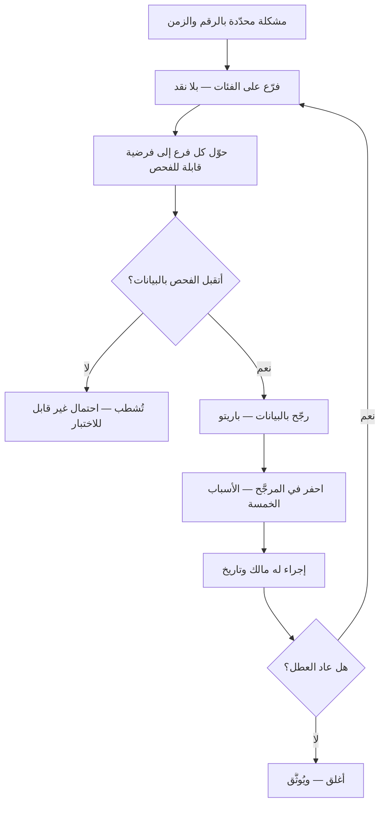

# مخطّط السبب والأثر (Ishikawa Diagram)

> [!info] تعريف مختصر
> **مخطّط السبب والأثر** أداة تصنيف بصرية تضع **مشكلةً واحدة محدّدة** عند رأس المخطّط، ثم تتفرّع منه فئاتُ الأسباب المحتملة، ويتفرّع من كل فئة أسبابها. وضعه **كاورو إيشيكاوا** في اليابان — استعمله في أحواض كاواساكي أوائل الأربعينيات ونشره في *دليل ضبط الجودة* — وهو أحد **أدوات الجودة السبع** الأساسية. ويُسمّى **مخطّط عظم السمكة** لشكله.
> **ووظيفته توسيع دائرة الاحتمال قبل تضييقها.** فهو لا يكشف السبب الجذري ولا يثبته؛ إنما يمنع أن يُغلق التشخيص على أوّل تفسير خطر ببال الفريق — وهو أشيع ما يقع في تحليل الأعطال.

## الشرح العلمي والاحترافي

**والفكرة التي بُني عليها** أن العقل الجماعي حين يواجه عطلًا يقفز إلى تفسير واحد ثم يجمع له الشواهد ([[Confirmation Bias|التحيّز التأكيدي]]). فالمخطّط يفرض عليه أن يمرّ على **فئات** لا يختارها هو، فيُخرج من كل فئة احتمالاتها — بما فيها الفئة التي ما كان ليلتفت إليها.

**والفئات ليست قدرًا محتومًا** بل نقاط انطلاق، ولكل مجال مجموعته المتداولة:

| المجال | الفئات المتداولة |
|---|---|
| **التصنيع (6M)** | الآلة · الطريقة · المادّة · الناس · القياس · البيئة |
| **الخدمات والإدارة (4P)** | السياسات · الإجراءات · الناس · المنشآت والتقنية |
| **البرمجيات (مقترحة)** | الكود · البيانات · البنية التحتية · العملية · الناس · الطرف الثالث · القياس والمراقبة |

**وفئة «القياس والمراقبة» تستحقّ التنبيه في البرمجيات**، لأنها تسأل سؤالًا يُغفَل: **هل كنّا نرى العطل أصلًا؟** فكثيرًا ما يكون الجواب أن العطل قائم منذ أسابيع ولم يظهر لأن أحدًا لم يقس.

**ورأس السمكة أصعب أجزائه.** فالمشكلة توضع **محدّدة قابلة للقياس**: لا «تدهورت الجودة»، بل «ارتفع معدّل فشل عمليات الدفع من 0.4٪ إلى 3.1٪ بين 12 و19 من الشهر». **والمخطّط الذي رأسُه موضوعٌ عامّ يُنتج فروعًا عامّة**، وهي أشيع صور فشله.

### موضعه من الأدوات المجاورة

| ما يفعله الفريق | **مخطّط السبب والأثر** | **الأسباب الخمسة (5 Whys)** | **[[Pareto Principle\|تحليل باريتو]]** |
|---|---|---|---|
| يتحرّك في اتّجاه | **العرض** — كم احتمالًا هناك؟ | **العمق** — إلى أيّ حدّ نرجع في سلسلة واحدة؟ | **الترتيب** — أيّها يفسّر أكثر الوقائع؟ |
| يشتغل بـ | التصنيف الجماعي | سؤال متكرّر على مسار واحد | بيانات مُعدودة |
| يخرج بـ | خريطة احتمالات | سلسلة سببية واحدة | ترتيبٌ بالأثر |
| يخطئ حين | يُكتفى به فيُظنّ تشخيصًا | يُتّبع مسار واحد فيُغفل غيره | يُطبَّق قبل معرفة الاحتمالات |

> **والثلاثة تُستعمل متتابعة لا متبادلة:** المخطّط يفتح الاحتمالات، وباريتو يرتّبها بالبيانات، والأسباب الخمسة تحفر في الفرع الذي رجّحته البيانات. **ومن اكتفى بالأوّل خرج بجدارٍ ملوّن**، ومن بدأ بالثاني حفر في أوّل فرع خطر بباله.

**وهو أداةٌ داخل [[Root Cause Analysis|تحليل السبب الجذري]] لا بديلٌ عنه.** فالتحليل نشاطٌ يبدأ بالوصف وينتهي بإجراء مُثبَت الأثر، والمخطّط خطوةٌ فيه — **وكل فرع فيه فرضية لا نتيجة**، لا تصير حكمًا حتى تُختبر ببيانات.

> [!info] إضافة مرجعية — «الأثر» هنا `Effect` لا `Outcome`
> الاسم المستقرّ عربيًّا لهذا المخطّط **«مخطّط السبب والأثر»**، و«الأثر» فيه ترجمة `Effect` بمعناه السببي: ما يترتّب على السبب. وهو **غير `Outcome`** الذي حُجزت له «الأثر» في قاموس هذه الموسوعة (القاعدة 6)، إذ ذاك التغيّر الذي يُحدثه العمل عند المستخدم. **فالمفهومان مختلفان واللفظ واحد** — كما وقع في `Impact` تمامًا، ولها في القاموس صفّان لا صفّ. وهذا موضعٌ لا يصلح فيه الفحص الآليّ، لأن تمييز المعنيين يحتاج قراءة السياق.

## أين ومتى يُستخدم

- **بعد حادث أو عطل متكرّر**، لتوسيع دائرة الاحتمال قبل الحفر — وموضعه من [[Blameless Postmortem|المراجعة بلا لوم]] أوّلها لا آخرها.
- **حين يستقرّ رأي الفريق سريعًا على سبب واحد**، فالمخطّط يجبره على أن يكتب ما سواه ولو لم يقتنع به.
- **في تشخيص مشكلة عملية لا مشكلة تقنية**: تأخّر التسليم، وتكرار إعادة العمل، وارتفاع [[Escaped Defect Rate|العيوب المُفلتة]].
- **في جلسة يحضرها من لا يتكلّم**، فالتصنيف يعطي كلّ ذي تخصّص فرعًا يملك الكلام فيه — وهذه من أنفع خصاله التيسيرية.

> [!warning] متى لا يُستخدَم؟
> - **حين يكون السبب معلومًا** ومثبتًا ببيانات: فالمخطّط حينها طقسٌ يؤخّر الإصلاح.
> - **أثناء الحادث الجاري.** موضعه بعد الاستقرار؛ وأثناء النزيف يُتصرَّف ثم يُحلَّل ([[Cynefin|كونيفين]]: الفوضوي).
> - **في نظام تتشابك أسبابه تشابكًا حلقيًّا** — يتغذّى فيه العطل على نفسه — فالتفريع الشجري يبسّط ما ليس بسيطًا، وموضعه [[Systems Thinking|التفكير بالأنظمة]] وحلقات التغذية.
> - **بديلًا عن البيانات.** يولّد فرضيات ولا يرجّح بينها.

## مثال وسيناريو تطبيقي

> [!example] «منصّة رِفد» — أسبوعان من إصلاح السبب الخطأ
> **العَرَض:** ارتفاع فشل عمليات الدفع من 0.4٪ إلى 3.1٪.
> **التفسير الأوّل — وقد كاد يُعتمد:** «مزوّد الدفع الجديد ضعيف». وكان الفريق سيبدأ هجرة تستغرق ستّة أسابيع.
> **ما أخرجه المخطّط في خمسٍ وعشرين دقيقة:**
> - **الطرف الثالث:** تغيّر في واجهة المزوّد · مهلة استجابة قصيرة.
> - **الكود:** إعادة محاولة غير مضبوطة تُنشئ عملية مكرّرة.
> - **البيانات:** حسابات قديمة بصيغة عملة مختلفة.
> - **البنية التحتية:** انتهاء صلاحية شهادة على بوّابة فرعية.
> - **الناس:** إعداد يدويّ لبيئة الاختبار سرَّب مفتاحًا خاطئًا إلى الإنتاج.
> - **القياس:** **لا تنبيه على معدّل الفشل أصلًا** — ولهذا لم يُعرف متى بدأ.
> **ثم البيانات:** أظهر باريتو أن 71٪ من حالات الفشل في نافذة ست ساعات كل ليلة. فسقط أكثر الفروع.
> **ثم الأسباب الخمسة** على الفرع الباقي: النافذة تطابق مهمّة تسوية ليلية ← تفتح اتّصالات كثيرة ← تستنفد المجمع ← فتنتهي مهلة طلبات الدفع.
> **الإصلاح:** حدّ لاتصالات المهمّة الليلية — يومان بدل ستّة أسابيع.
> **والدرس المزدوج:** أن المخطّط وحده لم يكن ليكفي، وأن البدء بالأسباب الخمسة على «المزوّد ضعيف» كان سيحفر في فرعٍ لم يكن السبب. **ثم إن أنفع ما خرج من الجلسة لم يكن الإصلاح، بل فرع «القياس»:** أن العطل عاش أسبوعًا بلا أن يراه أحد.

## خطوات أو مخطّط

1. **اكتب المشكلة في رأس المخطّط** محدّدةً بالرقم والزمن، واعرضها على الجميع قبل البدء.
2. **اختر فئات تناسب مجالك** ولا تستورد فئات المصانع للبرمجيات، وأضِف فئة **القياس** دائمًا.
3. **املأ الفروع بلا نقد** — كل احتمال يُكتب ولو بدا بعيدًا.
4. **حوّل كل فرع إلى فرضية قابلة للفحص:** ما البيانات التي تؤكّده أو تنفيه؟ **والفرع الذي لا يقبل الفحص يُشطب.**
5. **رجّح بالبيانات** ([[Pareto Principle|باريتو]]) قبل أن تحفر.
6. **احفر في الفرع المرجَّح** بالأسباب الخمسة حتى تبلغ سببًا **تملك تغييره**.
7. **أغلق بإجراء له مالك وتاريخ**، ثم قِس: هل عاد العطل؟ فالتحليل الذي لا يُتبَع بقياس لا يُعرف أنجح.

## ⚠️ مفاهيم خاطئة شائعة

> [!warning]
> - **حسبانه يكشف السبب الجذري.** لا يكشف شيئًا؛ يُنظّم الاحتمالات فحسب، والكشف بالبيانات.
> - **الخلط بينه وبين تحليل السبب الجذري.** ذاك نشاط كامل، وهذا **أداة** داخله.
> - **الظنّ بأن الفئات ثابتة.** الستّ المصنعية اقتراح لمجالها، وفرضها على البرمجيات يُنتج فرعًا اسمه «المادّة» لا مضمون له.
> - **عدّ كثرة الفروع دليل جودة.** المخطّط الذي فيه أربعون فرعًا ولا فرضية قابلة للفحص أسوأ من خمسة فروع تُختبر.
> - **الظنّ بأنه يصلح للأنظمة المتشابكة حلقيًّا.** بنيته شجرية، وما يتغذّى على نفسه لا يُمثَّل شجرةً.
> - **حسبان فرع «الناس» تشخيصًا.** «إهمال من الفريق» ليس سببًا بل حكمًا؛ والسؤال بعده: **ما الذي في النظام جعل الخطأ ممكنًا وغير مرئيّ؟** وهذا هو أصل قول ديمنغ إن عامّة المشكلات من النظام لا من الأفراد.

## ❌ ممارسات خاطئة في المشاريع

> [!failure]
> - **وضع موضوع عامّ في الرأس** («مشاكل الجودة») — فتخرج فروع عامّة لا تُختبر. **الحلّ:** رقم وزمن وحدود.
> - **الوقوف عند المخطّط** وتعليقه على الجدار بلا فرضيات ولا بيانات. **الحلّ:** كل فرع يخرج بسؤال بيانيّ ومالك.
> - **تحويل الجلسة إلى تحقيق** — فيصمت من يعرف. **الحلّ:** تُعقد بقواعد [[Blameless Postmortem|المراجعة بلا لوم]]، ويُمنع اسم الشخص في الفروع.
> - **إغفال فرع القياس** — فيُصلَح العطل ويبقى الفريق أعمى عن عودته. **الحلّ:** فرع ثابت اسمه «هل كنّا نراه؟».
> - **الحفر بالأسباب الخمسة قبل الترجيح** — فتُبذل جهود في فرع لم ترجّحه البيانات. **الحلّ:** البيانات بين الأداتين لا بعدهما.
> - **إغلاق التحليل بلا قياس بعديّ** — فلا يُعرف أنجح الإصلاح أم اختفى العطل مصادفةً. **الحلّ:** مراجعة بعد أسبوعين على المؤشّر نفسه.

## 🔗 مصطلحات ومفاهيم ذات صلة

[[Root Cause Analysis]] | [[Pareto Principle]] | [[Blameless Postmortem]] | [[PDCA]] | [[DMAIC]] | [[Kaizen]] | [[Quality Assurance]] | [[Control Chart]] | [[Escaped Defect Rate]] | [[Systems Thinking]] | [[Confirmation Bias]] | [[Six Thinking Hats]] | [[Cynefin]]
