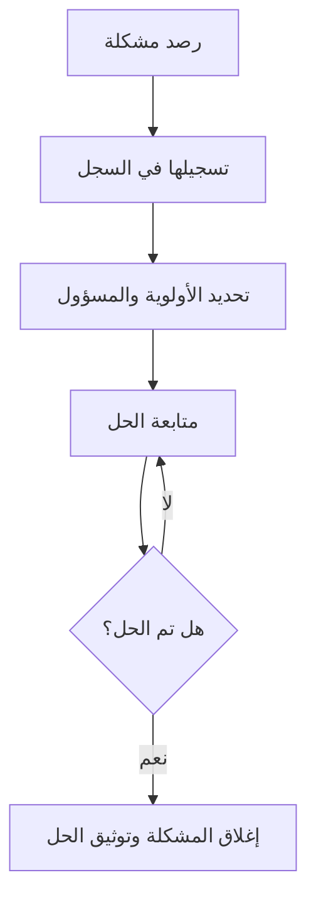

# سجل المشاكل (Issue Log)
> [!info] تعريف مختصر
> سجل المشاكل هو وثيقة أو أداة يُسجَّل فيها كل مشكلة (issue) فعلية تظهر أثناء تنفيذ المشروع، مع تفاصيلها، والمسؤول عن حلها، وحالتها الحالية.

## الشرح العلمي والاحترافي
- المشكلة (Issue) هي أمر يحدث فعلًا الآن ويؤثر على سير المشروع، بخلاف المخاطر (Risks) التي هي احتمالات مستقبلية. سجل المشاكل يوثّق هذه الأمور الواقعة بالفعل.
- يحتوي السجل عادة على: رقم تعريفي، وصف المشكلة، تاريخ الرصد، الشخص الذي رصدها، الأولوية (Severity vs Priority)، الشخص المسؤول عن الحل، تاريخ الحل المتوقع، والحالة (مفتوحة، قيد المعالجة، مغلقة).
- يساعد مدير المشروع على تتبع كل المشاكل في مكان واحد بدلًا من تشتتها بين رسائل البريد والمحادثات، مما يمنع ضياع المشاكل الصغيرة التي قد تتراكم وتصبح كبيرة.
- غالبًا يكون جزءًا من وثيقة أشمل تُسمى RAID Log (Risks, Assumptions, Issues, Dependencies).
- يُراجَع بشكل دوري (أسبوعي غالبًا) في اجتماعات متابعة المشروع.

## أين ومتى يُستخدم
- يُستخدم في جميع منهجيات إدارة المشاريع تقريبًا: الشلال، الرشيق، Kanban، وحتى في العمليات التشغيلية اليومية (Service Delivery).
- يبدأ استخدامه منذ بداية تنفيذ المشروع ويستمر حتى إغلاقه.
- مفيد بشكل خاص في المشاريع الطويلة أو المعقدة التي تضم فرقًا متعددة، حيث يصعب تتبع المشاكل شفهيًا.

## مثال وسيناريو تطبيقي
> [!example]
> في مشروع بناء موقع تجارة إلكترونية لشركة "متجري"، يكتشف فريق الاختبار أن بوابة الدفع تفشل مع بطاقات معينة.
> يسجّل مدير الاختبار المشكلة في سجل المشاكل: "ISS-014: فشل الدفع ببطاقات فيزا الدولية"، الأولوية: عالية، المسؤول: مطور التكامل مع بوابة الدفع، تاريخ الرصد: 5 يوليو.
> يُراجع مدير المشروع السجل في الاجتماع الأسبوعي، يجد أن المشكلة لا تزال مفتوحة منذ 4 أيام، فيتابع مع المطور مباشرة.
> يُحل الأمر بعد يومين، فيُحدَّث السجل: الحالة "مغلقة"، تاريخ الحل: 11 يوليو، مع ملاحظة عن سبب الخلل (رمز خطأ غير مدعوم من مزود الدفع).

## خطوات أو مخطّط
1. رصد المشكلة فور ظهورها من أي عضو في الفريق.
2. تسجيلها في السجل مع وصف واضح وتاريخ.
3. تحديد الأولوية والمسؤول عن الحل.
4. متابعة الحالة بشكل دوري حتى الحل.
5. توثيق الحل النهائي وإغلاق المشكلة.
6. مراجعة السجل دوريًا لرصد الأنماط المتكررة (Root Cause Analysis).

## ⚠️ مفاهيم خاطئة شائعة
> [!warning]
> - الخلط بين سجل المشاكل (Issue Log) وسجل المخاطر (Risk Register)؛ الأول يوثّق أحداثًا واقعة، والثاني يوثّق احتمالات مستقبلية.
> - الاعتقاد أن تسجيل المشكلة يعني حلها؛ التسجيل مجرد بداية عملية التتبع، والحل يحتاج متابعة فعلية.
> - الاعتقاد أن السجل خاص بمدير المشروع فقط؛ في الواقع يجب أن يكون مرئيًا لكل الفريق ليساهم الجميع في تحديثه.

## ❌ ممارسات خاطئة في المشاريع
> [!failure]
> - تسجيل المشاكل بصياغة غامضة مثل "مشكلة في النظام" بدون تفاصيل كافية لفهمها لاحقًا. الحل: كتابة وصف دقيق يشمل السياق والأثر.
> - ترك المشاكل مفتوحة لفترات طويلة بدون متابعة أو تحديث. الحل: مراجعة السجل في كل اجتماع متابعة وتحديد مواعيد نهائية للحل.
> - إغلاق المشاكل بدون توثيق السبب الجذري، مما يؤدي لتكرارها لاحقًا. الحل: ربط كل مشكلة مغلقة بتحليل مختصر للسبب الجذري.

## 🔗 مصطلحات ومفاهيم ذات صلة
[[RAID Log]] | [[Risk Register]] | [[Severity vs Priority]] | [[Root Cause Analysis]] | [[Blocker]] | [[RAG Status]] | [[19 - Risk Management]] | [[21 - Stakeholder Communication]]
