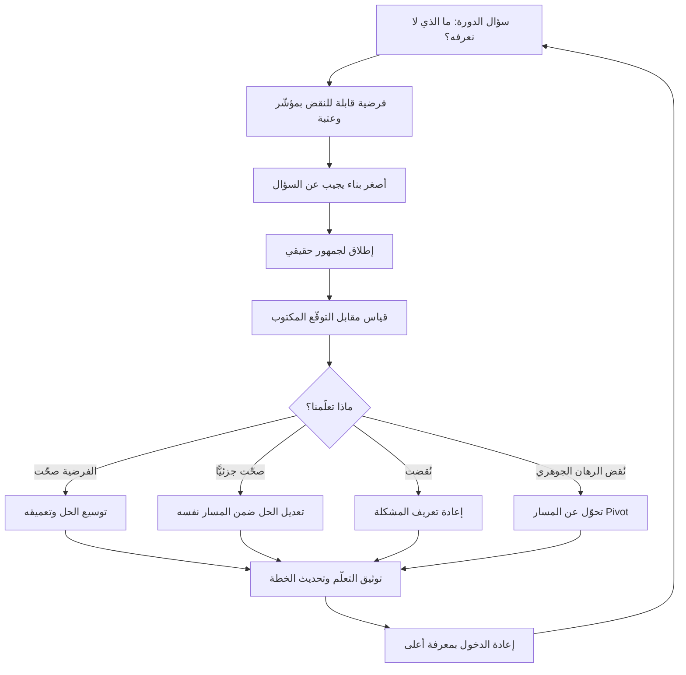

# التكرار (Iteration)

> [!info] تعريف مختصر
> إعادة الدخول إلى دورة العمل نفسها (بناء ← إطلاق ← قياس ← تعلّم) **بمعرفة أعلى ممّا دخلت به في المرّة السابقة**، بحيث يكون الناتج تحسينًا في الفهم لا مجرّد إضافة في الحجم. جوهر التكرار **معرفي لا زمني**: ليس كل عود إلى العمل تكرارًا، ولا كل إصدار جديد تكرارًا. الشرط الفاصل هو وجود **تعلّم مُوثَّق** بين الدورتين غيّر شيئًا في القرار. وللكلمة استعمال ثانٍ مشروع في الأطر الرشيقة، حيث تعني **الصندوق الزمني نفسه** (الدورة التي تنتج [[Increment]])، ومن هنا ينشأ أغلب اللبس.

## الشرح العلمي والاحترافي
- **الأصل والمنشأ**: التطوير التكراري والتزايدي (Iterative and Incremental Development) أقدم بكثير من الحركة الرشيقة؛ فقد مورس في مشاريع هندسية وبرمجية كبرى منذ منتصف القرن الماضي كردّ على قصور النموذج التتابعي ([[04 - Waterfall]]) الذي يفترض إمكان معرفة كل المتطلبات مقدّمًا. ثبّتت أطر مثل [[02 - Scrum]] و[[Extreme Programming]] الممارسة، وجعلها [[Agile Manifesto]] مبدأً معلنًا: التسليم المتكرّر والاستجابة للتغيير على اتّباع خطة.
- **الفرق الجوهري بين التكرار (Iteration) والتزايد (Increment)**: هذان مفهومان متعامدان لا مترادفان. **التزايد = إضافة جزء جديد** إلى ما هو قائم؛ تبني غرفة، ثم غرفة ثانية، ثم ثالثة — كل جزء صالح للاستخدام والمجموع يكبر. **التكرار = إعادة تشكيل الشيء نفسه** بمستوى فهم أعلى؛ ترسم اللوحة كاملة بخطوط أولية، ثم تعيد رسمها بتفصيل أعلى، ثم تعيدها ثالثة. المنتج يظلّ «هو هو» لكنه صار أدقّ وأصوب. التشبيه التقليدي في أدبيات التصميم: المنتج التكراري يبدأ لوحًا خشبيًّا بعجلات ثم دراجة ثم سيارة — لأن الوسيلة تتغيّر كليًّا مع تحسّن الفهم؛ بينما التزايدي يبدأ بعجلة ثم هيكل ثم محرّك — أجزاء صحيحة لكنها لا تنفع المستخدم إلا في النهاية. الفرق العملي حاسم: **التزايد يجيب عن «كم أنجزنا؟» والتكرار يجيب عن «هل نبني الشيء الصحيح؟»**. الممارسة الناضجة تستخدم الاثنين معًا: تزايد في الحجم، وتكرار في الصواب. وفريق يمارس التزايد وحده يبني بسرعة الشيء الخطأ.
- **الفرق بين التكرار و«إصدار جديد»**: الإصدار حدث تسليمي؛ التكرار حدث معرفي. يمكن أن تُصدر اثني عشر إصدارًا في سنة دون تكرار واحد إن كان كل إصدار تنفيذًا لبند كان مقرّرًا سلفًا في الـ Backlog دون أن يغيّر أي دليل شيئًا في الخطة. **الاختبار الحاسم: ما الذي عرفناه بعد الدورة السابقة ولم نكن نعرفه قبلها، وأي قرار تغيّر بسببه؟** إن كان الجواب «لا شيء»، فما جرى تسليم متسلسل لا تكرار. من هنا كان وصف «نحن نعمل بتكرارات مدّتها أسبوعان» غير كافٍ بذاته: هو يصف الإيقاع لا التعلّم.
- **حلقة التكرار المكتملة**: بناء ← إطلاق لجمهور حقيقي ← قياس ← تعلّم ← تعديل القرار. أضعف حلقة في معظم الفرق هي **القياس والتعلّم**، لأن الجزأين الأولين مرئيان ويُكافأ عليهما، والأخيرين غير مرئيين ويسهل تجاوزهما تحت الضغط. تكرار بلا قياس هو إعادة تنفيذ بحماس، وتكرار بلا إطلاق لجمهور حقيقي هو نقاش داخلي متكرّر.
- **ما الذي يحدّد طول التكرار**: ليس التقاليد، بل **زمن الوصول إلى إشارة قابلة للتفسير**. إن كان قياس أثر تغيير يحتاج ستة أسابيع من الاستخدام، فتكرار مدّته أسبوع ينتج ضجيجًا لا معرفة. والعكس: انتظار ربع كامل لاختبار فرضية يمكن نقضها في يومين بنموذج ([[Prototype]]) أو باختبار طلب ([[Fake Door Test]]) هو تبديد. القاعدة: **اجعل حجم التكرار بحجم أصغر سؤال يمكن الإجابة عنه**.
- **التكرار وسيلة لخفض كلفة الخطأ**: قيمته الاقتصادية أنه يقصّر المسافة بين القرار واكتشاف خطئه، وهو ما يعالجه [[Cost-of-Change Curve]]: كلفة تصحيح افتراض خاطئ تنمو أسّيًّا كلما تأخّر اكتشافه. ولهذا يرتبط عمليًّا بـ[[Feedback Loop]] وبـ[[CI and CD]]، لأن بنية تسليم بطيئة تجعل التكرار مكلفًا فيقلّ تلقائيًّا مهما كتبت في السياسات.
- **علاقته بالدوران والتحوّل (Pivot)**: التكرار تحسين داخل المسار نفسه؛ والتحوّل تغيير في المسار ذاته بعد تراكم إشارات تنقض فرضية جوهرية. الخلط بينهما يُنتج خطأين متقابلين: تكرار لا نهائي على فرضية ميتة (تحسين طريقة عبور طريق مسدود)، أو تحوّل متسرّع عند أول إشارة سلبية قبل بلوغ دليل معتبر. الفصل بينهما يكون بمعايير مكتوبة مسبقًا ضمن [[Assumption Mapping]] و[[Hypothesis]].
- **حدوده**: التكرار ليس صالحًا لكل شيء. القرارات المعمارية العميقة، ونماذج البيانات، والالتزامات التعاقدية، والقرارات التنظيمية الملزمة — كلها باهظة العكس، والتكرار فيها مكلف جدًّا. القاعدة المهنية: **كرّر بحرّية فيما يسهل عكسه، وقرّر بتروٍّ ودليل فيما يصعب عكسه**. ولا يعالج التكرار غياب الاتجاه أيضًا؛ فتكرار بلا [[Product Vision]] و[[Product Strategy]] ينتج تحسينات محلية دقيقة لا تتراكم في اتجاه واحد — أي صعودًا متقنًا في تلّة صغيرة بينما الجبل في الاتجاه الآخر.
- **مؤشّرات صحّة التكرار**: عدد الفرضيات التي نُقضت لا التي أُكّدت فقط؛ ونسبة بنود الخطة التي تغيّرت نتيجة تعلّم؛ وزمن الدورة من القرار إلى الإشارة ([[Cycle Time]] و[[Lead Time]])؛ ونسبة الميزات المستخدَمة فعلًا مما أُطلق. فريق لا يُبطل شيئًا أبدًا لا يتعلّم شيئًا — إمّا أنه لا يختبر، أو أنه يختبر ما يعرف جوابه سلفًا.

## أين ومتى يُستخدم
- **في تطوير المنتج تحت عدم يقين عالٍ**: عند إطلاق [[MVP]] واختبار فرضيات التبنّي والاحتفاظ ضمن منطق [[Lean Startup]].
- **داخل الأطر الرشيقة**: [[14 - Sprint]] في [[02 - Scrum]] هو صندوق زمني للتكرار، ويتحقّق التعلّم فيه عبر [[09 - Sprint Review]] و[[10 - Sprint Retrospective]] — الأول يكرّر فهم المنتج والثاني يكرّر فهم طريقة العمل.
- **في التصميم وتجربة المستخدم**: تكرار النماذج ([[Prototype]]) مع مستخدمين حقيقيين قبل كتابة أي كود، وهو أرخص أنواع التكرار وأعلاها عائدًا.
- **في تحسين العمليات لا المنتج فقط**: [[PDCA]] و[[Kaizen]] تكرار منهجي على طريقة العمل نفسها.
- **في التدرّج نحو الإطلاق الكامل**: [[Pilot Launch]] ثم توسيع تدريجي، مع بوابة قرار في كل جولة ([[Go or No-Go Decision]]).
- **في تحسين النماذج والأنظمة القائمة على الذكاء الاصطناعي**: حيث لا يمكن معرفة جودة المخرجات مسبقًا، فتُبنى دورات قياس متكرّرة عبر [[Evals]] و[[Prompt Engineering]].
- **في سداد [[Technical Debt]] تدريجيًّا**: بدل إعادة كتابة شاملة عالية المخاطرة.
- **في نضج [[15 - Roadmap]]**: تحويل الخارطة من قائمة ملتزَمة بتواريخ إلى سلسلة رهانات تُراجَع بدليل كل دورة.

## مثال وسيناريو تطبيقي
> [!example] منصّة تعليمية إلكترونية في المنطقة، تقدّم دورات مهنية. المشكلة: من يسجّل في دورة، 19% فقط يكملونها.
> **دورة تسليم بلا تكرار (ما حدث في السنة الأولى)**: نُفّذت أربعة إصدارات متتالية كانت مخطّطة مسبقًا في الـ Backlog — شهادات إتمام، نقاط وشارات، تذكيرات بريدية، ثم تطبيق جوّال. كل إصدار سُلّم في موعده، وسرعة الفريق كانت مستقرّة، ومخطّط الإنجاز مثاليًّا. ونسبة الإكمال بعد اثني عشر شهرًا: 21%. أربعة إصدارات، صفر تكرار — لأن أيًّا منها لم يبدأ من سؤال مفتوح ولم ينتهِ بتغيير قرار.
> **إعادة تشكيل العمل كتكرارات حقيقية**:
> **التكرار الأول (أسبوعان)**: السؤال — أين يتوقّف الناس بالضبط؟ لا بناء تقريبًا، فقط تحليل بيانات ([[Product Analytics]]) و12 مقابلة. **التعلّم**: 63% من المتوقّفين توقّفوا داخل أول 20 دقيقة من أول درس، أي قبل أن يعرف أحدهم إن كانت الدورة مفيدة له. **القرار المتغيّر**: المشكلة ليست التحفيز طويل المدى (وهو ما بُنيت لأجله الشارات والشهادات)، بل الدقائق الأولى.
> **التكرار الثاني (أسبوع)**: الفرضية — السبب أن الدرس الأول تأسيسي نظري طويل. الاختبار: إعادة ترتيب الدرس الأول في ثلاث دورات فقط ليبدأ بتمرين عملي ينتج نتيجة ملموسة خلال 10 دقائق، على 20% من المسجّلين الجدد. **النتيجة**: تجاوز الدرس الأول ارتفع من 41% إلى 68%، لكن الإكمال الكلي تحرّك إلى 26% فقط. **التعلّم**: كان الحاجز الأول حقيقيًّا لكنه لم يكن الوحيد.
> **التكرار الثالث (ثلاثة أسابيع)**: تركّز على الحاجز الثاني الذي كشفته البيانات — انقطاع بعد الدرس الرابع لدى من يدرسون مساءً بعد العمل. الفرضية: طول الدرس (34 دقيقة متوسّطًا) لا يناسب نافذة الوقت المتاحة. جُزّئت الدروس إلى وحدات من 8–12 دقيقة قابلة للاستئناف. **النتيجة**: الإكمال إلى 38%.
> **التكرار الرابع**: أُعيد اختبار الشارات — التي كانت قد بُنيت في السنة الأولى بلا فرضية — فتبيّن أنها **لا أثر لها إحصائيًّا**، فأُزيلت وقلّ التعقيد.
> **الحصيلة**: ثمانية أسابيع من التكرار الحقيقي حرّكت المؤشّر من 21% إلى 38%، بينما لم تحرّكه سنة كاملة من الإصدارات المنضبطة. الفرق لم يكن في سرعة الفريق ولا في جودة تنفيذه — بل في أن كل دورة بدأت بسؤال لا يُعرف جوابه، وانتهت بقرار تغيّر. وهذا بالضبط ما يفصل التكرار عن الإصدار.

## خطوات أو مخطّط
1. **صُغ سؤال الدورة**: ما الشيء الذي لا نعرفه والذي سيغيّر قرارًا إن عرفناه؟ لا تبدأ دورة بلا سؤال مفتوح.
2. **حوّله إلى فرضية قابلة للنقض** ([[Hypothesis]]) مع مؤشّر وعتبة: «نعتقد… وسنعتبره خاطئًا إذا…».
3. **حدّد أصغر ما يجيب عن السؤال**: نموذج، أو اختبار طلب، أو إطلاق محدود على شريحة — لا نسخة كاملة.
4. **حدّد طول الدورة بزمن وصول الإشارة** لا بالعرف؛ وتأكّد من أن حجم العيّنة يكفي لتفسير النتيجة.
5. **أطلق لجمهور حقيقي** لا داخليًّا فقط، فالتغذية الراجعة الداخلية مجاملة في الغالب.
6. **قِس النتيجة مقابل التوقّع المكتوب مسبقًا**، وسجّل الفارق.
7. **قرّر صراحةً**: نواصل، أم نعدّل الحل، أم ننقض الفرضية ونعيد تعريف المشكلة، أم نتحوّل عن المسار كليًّا.
8. **وثّق التعلّم لا المخرَج**: ماذا عرفنا؟ وأي بند في [[15 - Roadmap]] أو [[13 - Backlog]] تغيّر بسببه؟ — وسجّله في [[Decision Log]].
9. **أعد الدخول بمعرفة أعلى**: التكرار التالي يجب أن يبدأ من سؤال لم يكن ممكنًا طرحه قبل الدورة السابقة.

## ⚠️ مفاهيم خاطئة شائعة
> [!warning]
> - **اعتبار كل إصدار جديد تكرارًا**: الإصدار حدث تسليمي، والتكرار حدث معرفي. اثنا عشر إصدارًا لبنود مقرّرة سلفًا دون أن يغيّر دليلٌ قرارًا = صفر تكرار. الاختبار: ما الذي عرفناه ولم نكن نعرفه، وأي قرار تغيّر؟
> - **الخلط بين التكرار و[[Increment]]**: التزايد إضافة جزء جديد إلى ما هو قائم (كم أنجزنا؟)، والتكرار إعادة تشكيل الشيء نفسه بفهم أعلى (هل نبني الصواب؟). هما محوران متعامدان، والناضج يستخدمهما معًا.
> - **الظنّ أن التكرار يعني العمل بصناديق زمنية**: الصندوق الزمني ([[14 - Sprint]]) وعاء التكرار لا التكرار نفسه. فريق يعمل بسبرنتات منتظمة ولا يبطل فرضية أبدًا يمارس تسليمًا دوريًّا لا تكرارًا.
> - **افتراض أن التكرار الأسرع دائمًا أفضل**: طول الدورة يحكمه زمن وصول إشارة قابلة للتفسير؛ تقصيرها دون ذلك ينتج ضجيجًا يُقرأ خطأً على أنه تعلّم.
> - **الخلط بين التكرار والتحوّل (Pivot)**: الأول تحسين داخل المسار، والثاني تغيير المسار بعد نقض رهان جوهري. الخلط ينتج إمّا تحسينًا لا نهائيًّا على فرضية ميتة، أو تحوّلًا متسرّعًا عند أول إشارة سلبية.
> - **الظنّ أن التكرار يغني عن التخطيط والاتجاه**: بلا [[Product Vision]] و[[Product Strategy]] يُنتج التكرار تحسينات محلية متقنة لا تتراكم — ارتقاء دقيق في تلّة صغيرة بينما الجبل في اتجاه آخر.
> - **افتراض صلاحيته لكل نوع قرار**: القرارات المعمارية ونماذج البيانات والالتزامات التعاقدية باهظة العكس؛ كرّر فيما يسهل عكسه، وقرّر بدليل فيما يصعب عكسه.
> - **اعتبار التكرار عذرًا لتسليم عمل ناقص الجودة**: التكرار يقلّص **النطاق** لا **الجودة**؛ ما يُطلق يجب أن يستوفي [[Definition of Done]] ضمن نطاقه المعلن، وإلا فما تُقاس عليه الإشارة هو الخلل لا الفكرة.

## ❌ ممارسات خاطئة في المشاريع
> [!failure]
> - **دورات منتظمة بلا فرضية معلنة**: يدخل الفريق كل سبرنت بقائمة بنود لا بسؤال. لماذا يضرّ: يستحيل أن تُنقض الخطة، فيصبح التكرار طقسًا إداريًّا يستهلك وقت الاجتماعات ولا ينتج معرفة. الحل: اشترط في تخطيط كل دورة سطرًا واحدًا: «السؤال الذي نجيب عنه هذه الدورة هو…»، وراجعه في نهايتها.
> - **إغلاق الدورة عند التسليم دون قياس**: لماذا يضرّ: تُبتر الحلقة عند أكثر أجزائها كلفةً وأقلّها قيمة، فيتراكم المُسلَّم دون أن يتراكم الفهم. الحل: لا تُعدّ الدورة منتهية قبل تسجيل النتيجة المقاسة مقابل التوقّع؛ واجعل ذلك جزءًا من [[Definition of Done]] للبنود ذات الفرضية.
> - **التكرار داخليًّا فقط دون مستخدمين حقيقيين**: مراجعات وعروض داخلية متكرّرة تُسمّى «تكرارات». لماذا يضرّ: التغذية الراجعة الداخلية مجاملة ومتحيّزة لمن يعرف المنتج مسبقًا، فتؤكّد الفرضية دائمًا. الحل: اشترط أن يشمل كل تكرار تماسًّا مع مستخدم خارجي ولو بعيّنة صغيرة.
> - **الاستمرار في التكرار على فرضية ميتة**: تحسينات متتالية على ميزة لا يستخدمها أحد. لماذا يضرّ: يُستنزف الفريق ويُؤجَّل الاعتراف بالخطأ ويرتفع الالتزام العاطفي كلما زاد الاستثمار. الحل: اكتب مسبقًا شرط التوقّف («إن لم يبلغ المؤشّر كذا بعد ثلاث دورات نتوقّف»)، وعامله كالتزام لا كتوصية.
> - **تغيير عدّة متغيّرات في تكرار واحد**: إعادة تصميم وتغيير تسعير وتغيير رسائل دفعةً واحدة. لماذا يضرّ: تصبح النتيجة غير قابلة للعزو، فتُبنى قرارات لاحقة على تفسير خاطئ للسبب. الحل: افصل المتغيّرات على دورات متتالية، أو استخدم تصميم اختبار يسمح بالعزو.
> - **بنية تسليم بطيئة تجعل التكرار مكلفًا**: إطلاق شهري يدوي عالي المخاطر. لماذا يضرّ: ترتفع كلفة كل دورة فتقلّ الدورات تلقائيًّا مهما نُصّ في السياسات على «العمل التكراري». الحل: استثمر في [[CI and CD]] وأتمتة الاختبار بوصفه شرطًا تمكينيًّا للتكرار لا ترفًا هندسيًّا.
> - **قياس الفرق بعدد التكرارات المكتملة**: لماذا يضرّ: يُكافأ الطقس لا التعلّم، فتُغلق الدورات في مواعيدها وتبقى المؤشّرات ساكنة سنة كاملة. الحل: قِس عدد الفرضيات المنقوضة والقرارات التي تغيّرت ونسبة ما يُستخدم فعلًا ممّا أُطلق ([[Outcome vs Output]]).
> - **عدم توثيق التعلّم بين الدورات**: لماذا يضرّ: يعاد اكتشاف الشيء نفسه كل بضعة أشهر، خصوصًا مع تغيّر أعضاء الفريق، فتتحوّل الذاكرة التنظيمية إلى ذاكرة أفراد. الحل: سجل تعلّم مختصر لكل دورة (السؤال · التوقّع · النتيجة · القرار) مربوط بـ[[Decision Log]] ومتاح للجميع.

## 🔗 مصطلحات ومفاهيم ذات صلة
[[Product Life Cycle]] | [[Product Sense]] | [[Product Strategy]] | [[Opportunity Discovery]] | [[Increment]] | [[14 - Sprint]] | [[01 - Agile]] | [[Lean Startup]] | [[PDCA]] | [[Feedback Loop]] | [[Hypothesis]] | [[MVP]] | [[Prototype]] | [[Cost-of-Change Curve]] | [[Continuous Discovery]] | [[Outcome vs Output]]
