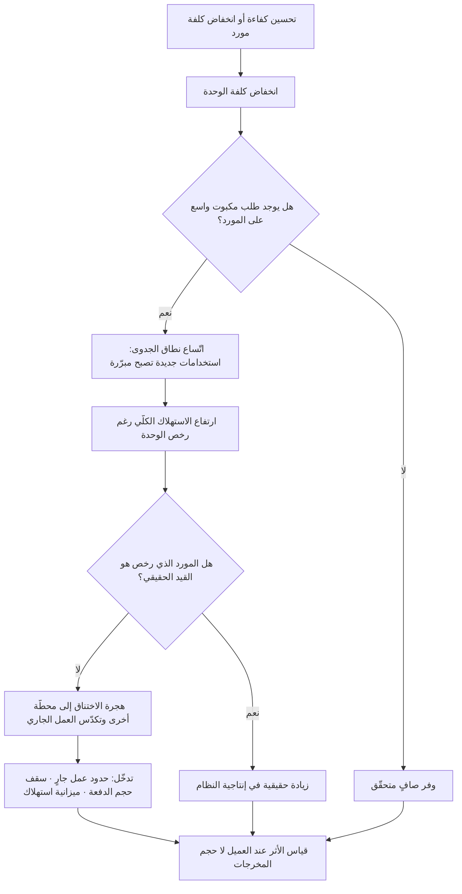

# مفارقة جيفونز (Jevons Paradox)

> [!info] تعريف مختصر
> ملاحظة اقتصادية مفادها أن **تحسين كفاءة استخدام مورد ما، أو انخفاض كلفته، قد يؤدّي إلى زيادة استهلاكه الكلّي بدل خفضه** — لأن رخص المورد يفتح استخدامات لم تكن مجدية اقتصاديًّا من قبل، فيتّسع الطلب بما يفوق الوفر المتحقّق في الوحدة الواحدة. صاغها الاقتصادي الإنجليزي **ويليام ستانلي جيفونز (William Stanley Jevons)** في كتابه *The Coal Question* الصادر سنة **١٨٦٥**، حين لاحظ أن المحرّكات البخارية الأكفأ لم تقلّل استهلاك بريطانيا من الفحم بل ضاعفته، لأن الكفاءة جعلت البخار مجديًا في صناعات ومواقع لم يكن يُستخدم فيها أصلًا. وأهميتها لمدير المشروع أنها تفسّر لغزًا متكرّرًا: **لماذا لم يتحرّر وقت الفريق بعد كل موجة أدوات وأتمتة؟**

## الشرح العلمي والاحترافي
- **المنشأ التاريخي بدقّة**: جيفونز (1835–1882) اقتصادي وعالم منطق إنجليزي، طرح المفارقة في سياق نقاش وطني بريطاني عن نضوب الفحم. كان الرأي السائد أن تحسين كفاءة المحرّكات سيمدّ عمر الاحتياطي، فجادل جيفونز بالعكس: «من الخلط في الأفكار أن نفترض أن الاستخدام الاقتصادي للوقود يعادل تقليل الاستهلاك — الحقيقة هي النقيض تمامًا». حجّته أن الكفاءة تخفض كلفة الوحدة، فتوسّع نطاق الجدوى، فيزداد الطلب الكلّي.
- **الآلية الاقتصادية وراءها (أثر الارتداد — Rebound Effect)**: الاقتصاد الحديث يفكّك الظاهرة إلى مستويات: **ارتداد مباشر** (تستخدم الشيء نفسه أكثر لأنه صار أرخص)، و**ارتداد غير مباشر** (تُنفق الوفر على شيء آخر يستهلك المورد نفسه)، و**ارتداد كلّي على مستوى الاقتصاد** (تتغيّر بنية الإنتاج كلها). مفارقة جيفونز هي **الحالة القصوى** حين يتجاوز الارتداد 100%، أي حين يفوق النمو في الاستهلاك الوفر الناتج عن الكفاءة. وليست حتمية: في كثير من الحالات يكون الارتداد جزئيًّا فيتحقّق وفر صافٍ.
- **الشرطان اللذان يجعلانها ترجّح**: تظهر المفارقة بقوّة حين (١) يكون **الطلب مرنًا** — أي توجد استخدامات كثيرة مؤجَّلة تنتظر انخفاض السعر، و(٢) يكون المورد **مُدخلًا وسيطًا** في أنشطة أخرى لا غاية نهائية. حين يكون الطلب مشبعًا (لا أحد يريد المزيد مهما رخص) لا تظهر المفارقة. وهذا هو المفتاح التشخيصي عمليًّا: اسأل عن **حجم الطلب المكبوت** قبل أن تتوقّع وفرًا.
- **التطبيق على وقت الفريق — الحالة الأوضح في المشاريع**: وقت المهندس أو المصمّم مورد نادر ومكلف. كل أداة تخفض «كلفة إنتاج الوحدة» (سطر شيفرة، تصميم، مستند، تقرير) تفتح الباب لطلب كان مؤجَّلًا لأنه لم يكن يستحقّ الجهد. النتيجة النمطية: لا يعود الفريق إلى منزله أبكر، بل يُنتج أضعافًا مضاعفة من المخرجات — وقد لا يرتفع أثر ذلك على النتائج بالقدر نفسه. هنا يتحوّل الأمر إلى مصنع مخرجات ([[Feature Factory]]) ما لم يُدار بوعي ([[Outcome vs Output]]).
- **التطبيق على كلفة البناء والتوليد الآلي**: انخفاض كلفة كتابة الشيفرة وتوليد المسودّات لا يخفض كلفة **دورة الحياة**. الشيفرة تُقرأ وتُراجَع وتُختبَر وتُصان وتُوثَّق وتُؤمَّن، وهذه الأنشطة لا ترخص بالوتيرة نفسها. النتيجة: **يهاجر عنق الزجاجة** من الإنتاج إلى المراجعة والدمج والتشغيل — وهي نتيجة يفسّرها [[Theory of Constraints]] تمامًا: تسريع محطّة ليست هي القيد لا يزيد إنتاجية النظام، بل يكدّس المخزون أمام القيد الحقيقي.
- **العلاقة بقانون ليتل**: زيادة معدّل ضخّ العمل في النظام دون تغيير معدّل الإنجاز ترفع كمية العمل الجاري، وبموجب [[Little's Law]] يرتفع زمن الدورة تناسبيًّا. أي أن رخص الإنتاج قد يُبطئ التسليم فعليًّا — وهي نتيجة تبدو معاكسة للحدس لكنها رياضية بحتة، ويعالجها [[WIP Limit]] لا مزيد من السرعة.
- **البُعد المالي المباشر — كلفة الاستدلال**: مع الأنظمة التي تُحاسب بالاستهلاك ([[Inference Cost]])، تظهر المفارقة في فاتورة صريحة: انخفاض سعر الوحدة يشجّع على إدخالها في مسارات لم تكن مبرّرة، فترتفع الفاتورة الكلّية رغم انخفاض سعر الوحدة. الخطأ التخطيطي الشائع هو إسقاط ميزانية مستقبلية بضرب السعر الجديد في الحجم القديم، والصحيح إدخال نمو الحجم المتوقّع في المعادلة ضمن [[TCO]].
- **الوجه الإيجابي للمفارقة**: ليست بالضرورة مشكلة. انخفاض [[Cost of Experimentation]] يجعل التجريب مجديًا في مواضع كثيرة، وهذا مكسب حقيقي للاكتشاف ([[Product Discovery]]) و[[Lean Startup]]. المفارقة تصبح ضارّة فقط حين يزيد الاستهلاك **دون أن يزيد التعلّم أو الأثر** — أي حين نستهلك المورد الرخيص في إنتاج ما لا أحد يحتاجه.

## أين ومتى يُستخدم
- **عند تبرير الاستثمار في أداة أو أتمتة بوعد «توفير ساعات»**: للتنبيه إلى أن الوفر المفترض قد يتبخّر في طلب مستحدَث ما لم يُحمَ صراحةً، وهو ما يرتبط مباشرة بمعالجة [[Toil]].
- **في تقدير الميزانيات التشغيلية للأنظمة المحاسَبة بالاستهلاك**: عند بناء نموذج كلفة يشمل [[Inference Cost]] ضمن [[TCO]] بدل الاعتماد على سعر الوحدة اللحظي.
- **في إدارة التدفّق وتحديد الاختناقات**: لتفسير سبب عدم تحسّن [[Lead Time]] رغم تسارع الإنتاج، والانتقال إلى معالجة القيد الحقيقي عبر [[Theory of Constraints]] و[[Bottleneck]].
- **عند مراجعة النطاق ومنع التضخّم**: لأن رخص التنفيذ يُضعف حاجز الرفض ويغذّي [[Scope Creep]] و[[Gold Plating]] و[[Feature Creep]].
- **في نقاشات الجودة والدين التقني**: لأن ما يُنتَج بسهولة يُراجَع بصعوبة، فيرتفع [[Technical Debt]] و[[Rework Percentage]] و[[Escaped Defect Rate]] بعد موجة تسريع.
- **في وضع سياسات استخدام الأدوات الجديدة**: صياغة حدود واضحة ضمن [[Explicit Policies]] و[[Guard Rails]] تمنع تحوّل الرخص إلى إسراف غير مقصود.

## مثال وسيناريو تطبيقي
> [!example] شركة برمجيات في دبي، فريق منتج من 9 مهندسين و2 مراجعَين تقنيَّين. قبل التحوّل، كان الفريق يفتح نحو 40 طلب دمج (Pull Request) شهريًّا، متوسط حجم الطلب 180 سطرًا، وزمن المراجعة الوسيط 6 ساعات، و[[Cycle Time]] الوسيط 3.1 يوم.
> اعتمدت الشركة أدوات توليد شيفرة، وكان التبرير في دراسة الجدوى صريحًا: «سيوفّر كل مهندس نحو 20% من وقته، أي ما يعادل مهندسَين إضافيَّين مجانًا، وسنستخدم الوفر في تسريع خارطة الطريق».
> بعد أربعة أشهر، القياس: طلبات الدمج ارتفعت من 40 إلى 96 شهريًّا (زيادة 140%)، ومتوسط حجم الطلب من 180 إلى 610 أسطر. أي أن «كلفة إنتاج السطر» انخفضت فعلًا وبشكل حقيقي. لكن: زمن المراجعة الوسيط ارتفع من 6 إلى 31 ساعة، و[[Cycle Time]] الوسيط ارتفع من 3.1 إلى 5.4 يوم، ونسبة إعادة العمل ارتفعت من 8% إلى 19%، ولم يتغيّر عدد الميزات المُطلقة للعملاء إلا بنسبة 12%.
> ما حدث تفسّره المفارقة بدقّة: رخص الإنتاج لم يوفّر وقتًا، بل أزال الحاجز الذي كان يمنع كتابة الشيفرة، ففتح الباب لأعمال كانت مؤجَّلة لأنها «لا تستحقّ الجهد». وانتقل عنق الزجاجة من المهندس (9 أشخاص) إلى المراجع (2 شخصان) الذي لم ترخص كلفته إطلاقًا.
> استجاب الفريق بأربعة إجراءات، لا بإلغاء الأداة: (١) حدّ أقصى لحجم طلب الدمج بـ400 سطر مع تقسيم إلزامي فوقه ([[Task and Story Slicing]])، (٢) [[WIP Limit]] على عدد الطلبات المفتوحة في طابور المراجعة (6 كحدّ أقصى)، (٣) شرط في [[Definition of Done]] بأن يُرفَق مع أي شيفرة مولَّدة اختبارٌ ومسوّغٌ لسبب وجودها مرتبط بعنصر في الـBacklog، (٤) نقل جزء من طاقة الإنتاج إلى المراجعة عبر تدوير مهندسَين أسبوعيًّا.
> بعد ربع آخر: طلبات الدمج 61 شهريًّا (أقلّ من الذروة، وأعلى من الأصل)، زمن المراجعة الوسيط 8 ساعات، [[Cycle Time]] 2.4 يوم — أفضل من ما قبل الأداة —، ونسبة إعادة العمل 9%. الوفر تحقّق أخيرًا، لكن بعد **تسقيف الطلب المستحدَث** لا بمجرّد شراء الأداة.

## خطوات أو مخطّط
1. قبل تبنّي أي أداة أو تحسين كفاءة، اكتب صراحةً: **ما المورد الذي سيرخص؟** (وقت، مال، طاقة استدلال، سعة).
2. قدّر **حجم الطلب المكبوت** على ذلك المورد: كم عملًا كنّا نرفضه لأنه غير مجدٍ؟ كلما كبر هذا الرقم زاد احتمال الارتداد الكامل.
3. حدّد **القيد الحقيقي** في النظام قبل التسريع ([[Theory of Constraints]]): إن لم يكن المورد الذي رخص هو القيد، فالتسريع سيكدّس المخزون لا أكثر.
4. حوّل الوفر المتوقّع إلى **التزام مكتوب**: هل سيُصرف في إنجاز أسرع؟ أم في عمل إضافي؟ أم في تقليل الضغط؟ القرار غير المعلن يُحسم تلقائيًّا لصالح العمل الإضافي.
5. ضع **حدودًا كمّية** تحمي القرار: [[WIP Limit]]، سقف حجم الدفعة، ميزانية استهلاك شهرية بتنبيه عند تجاوزها.
6. قِس **الأثر لا النشاط**: ما تغيّر عند العميل؟ ([[Outcome vs Output]]) — لا كم أنتجنا.
7. راقب **مؤشّرات الهجرة**: أين تراكم الانتظار الآن؟ ([[WIP Aging]]، [[Flow Efficiency]]) وعالج المحطّة الجديدة.
8. أعد التقدير المالي بضرب السعر الجديد في **الحجم الجديد المتوقّع** لا القديم، وضمّنه في [[TCO]].
9. راجع القرار بعد ربع كامل، ووثّق ما تعلّمته في [[Decision Log]] لتفادي تكرار التقدير المتفائل في الموجة التالية.

## ⚠️ مفاهيم خاطئة شائعة
> [!warning]
> - **اعتبارها قانونًا حتميًّا**: المفارقة **احتمال مشروط** لا قانونًا. تتحقّق حين يكون الطلب مرنًا والمورد مُدخلًا وسيطًا؛ وفي الأسواق المشبعة يتحقّق وفر صافٍ فعلًا. من يستشهد بها لرفض كل تحسين كفاءة يسيء استخدامها.
> - **قراءتها كذمّ للكفاءة**: جيفونز لم يقل إن الكفاءة سيئة، بل إن **الكفاءة وحدها ليست سياسة للترشيد**. الترشيد يحتاج إلى قيد صريح (سعر، سقف، حصّة) يرافق التحسين، وإلا امتصّه النمو.
> - **الخلط بينها وبين أثر الارتداد عمومًا**: الارتداد قد يكون 20% أو 60% فيبقى وفر صافٍ. المفارقة هي تحديدًا حالة تجاوز الارتداد 100%. الدقّة هنا مهمّة لأن الحالتين تستدعيان قرارين مختلفين.
> - **افتراض أن الاستهلاك الزائد ضارّ بالضرورة**: زيادة استهلاك مورد رخيص في **تجريب يُنتج تعلّمًا** مكسب لا خسارة. المشكلة ليست في الحجم بل في نسبة الحجم إلى الأثر.
> - **الظنّ أن المشكلة في الأداة**: الأداة تخفض كلفة الوحدة كما وُعدت. ما ينكسر هو **افتراض التخطيط** بأن الحجم سيبقى ثابتًا. العلاج في نموذج الحوكمة والقياس، لا في التخلّي عن الأداة.
> - **تجاهل هجرة عنق الزجاجة**: أشيع أثر عملي للمفارقة أن الاختناق ينتقل لا أن يختفي. من يقيس محطّة واحدة فقط سيرى تحسّنًا وهميًّا بينما يتباطأ النظام ككل.
> - **إسقاط الميزانية بسعر الوحدة الجديد على الحجم القديم**: هذا التقدير خاطئ بنيويًّا وليس متفائلًا فحسب، لأنه يهمل بالضبط الآلية التي تصفها المفارقة.

## ❌ ممارسات خاطئة في المشاريع
> [!failure]
> - **بناء دراسة الجدوى على «ساعات موفَّرة» فقط**: الخطأ حساب العائد بضرب عدد الأفراد في نسبة الوفر المفترضة. لماذا يضرّ؟ لأن الساعات الموفَّرة تُعاد فورًا إلى دورة العمل كطلب جديد، فلا تظهر في أي مؤشّر مالي أو زمني، وتفقد الإدارة الثقة بالأدوات لاحقًا. الحل: اربط الجدوى بمؤشّر نتيجة محدّد ([[KPI]] أو [[North Star Metric]])، والتزم مسبقًا بوجهة الوفر.
> - **تسريع محطّة ليست هي القيد**: الخطأ الاستثمار في تسريع الإنتاج بينما الاختناق في المراجعة أو الاختبار أو موافقة العميل. لماذا يضرّ؟ لأن العمل الجاري يتراكم أمام القيد فيطول [[Cycle Time]] رغم زيادة النشاط. الحل: حدّد القيد قياسًا ([[WIP Aging]]، [[Flow Efficiency]]) ووجّه التحسين إليه.
> - **رفع سقف الطلبات لأن التنفيذ صار أرخص**: الخطأ قبول كل طلب صغير بحجّة «لن يكلّفنا شيئًا». لماذا يضرّ؟ لأن كلفة البناء ليست إلا جزءًا يسيرًا من كلفة دورة الحياة (الاختبار والصيانة والدعم والتعقيد المتراكم)، فينمو [[Technical Debt]] بصمت. الحل: احتفظ بحاجز أولوية قائم على القيمة ([[RICE Prioritization]] أو [[WSJF]]) بصرف النظر عن كلفة التنفيذ.
> - **ترك ميزانية الاستهلاك بلا سقف ولا تنبيه**: الخطأ إطلاق استخدام خدمة محاسَبة بالاستهلاك بعد رؤية سعر وحدة منخفض. لماذا يضرّ؟ لأن الفاتورة تنكشف بعد شهر من التوسّع غير المرصود. الحل: سقف شهري، وتنبيهات عند نسب محدّدة، وعزل التكاليف لكل حالة استخدام.
> - **إهمال طاقة المراجعة والجودة عند مضاعفة الإنتاج**: الخطأ إبقاء عدد المراجعين ومعايير المراجعة كما هي. لماذا يضرّ؟ لأن المراجعة تتحوّل إلى ختم شكلي تحت الضغط، فيرتفع [[Escaped Defect Rate]] ويظهر الأثر عند العميل. الحل: وسّع طاقة المراجعة، وحدّد حجمًا أقصى للدفعة الواحدة، وشدّد [[Definition of Done]].
> - **قياس الإنتاجية بعدد المخرجات بعد التبنّي**: الخطأ الاحتفال بارتفاع عدد الطلبات أو الميزات كدليل نجاح. لماذا يضرّ؟ لأنه يكافئ بالضبط السلوك الذي تصفه المفارقة، ويخفي تدهور زمن التسليم والجودة. الحل: قِس [[Outcome vs Output]] و[[Time to Value]].
> - **عدم توثيق الافتراض الذي انكسر**: الخطأ الاكتفاء بملاحظة «الأداة لم تفِ بوعدها». لماذا يضرّ؟ لأن الموجة التالية من الأدوات ستُقيَّم بالمنطق الخاطئ نفسه. الحل: وثّق في [[Decision Log]] الفرق بين الحجم المتوقّع والحجم الفعلي، واجعله مُدخلًا في نموذج التقدير القادم.

## 🔗 مصطلحات ومفاهيم ذات صلة
[[Inference Cost]] | [[TCO]] | [[Cost of Experimentation]] | [[Theory of Constraints]] | [[Bottleneck]] | [[Little's Law]] | [[WIP Limit]] | [[Cycle Time]] | [[Flow Efficiency]] | [[Feature Factory]] | [[Scope Creep]] | [[Gold Plating]] | [[Technical Debt]] | [[Outcome vs Output]] | [[100 Percent Utilization Fallacy]] | [[Toil]] | [[Context Switching Cost]]
