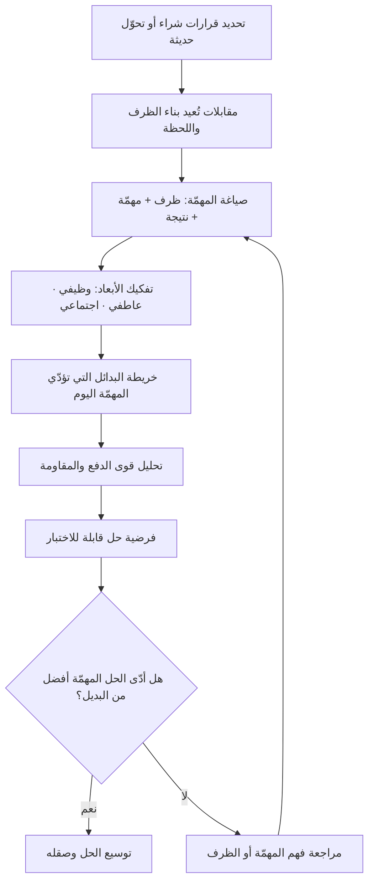

# المهام التي يُستأجَر المنتج لإنجازها (Jobs to be Done)

> [!info] تعريف مختصر
> إطار تفكير يقلب زاوية النظر إلى العميل: الناس لا يشترون المنتجات لذاتها، بل "يستأجرونها" (Hire) لإنجاز مهمّة (Job) تواجههم في ظرف محدّد من حياتهم. المنتج وسيلة، والمهمّة هي الثابت. ومن هذا المنطلق فإن المنافس الحقيقي لمنتجك ليس بالضرورة المنتج المشابه له في الشكل أو الفئة، بل **أي بديل يؤدّي المهمّة نفسها** — بما في ذلك حلول يدوية بدائية، أو منتج من قطاع مختلف تمامًا، أو حتى قرار العميل بألّا يفعل شيئًا.

## الشرح العلمي والاحترافي
- **الوحدة التحليلية هي المهمّة لا العميل**: أغلب أدوات البحث التقليدية تصنّف الطلب بحسب خصائص الشخص (العمر، الدخل، القطاع، حجم الشركة). إطار الـ JTBD يرى أن هذه الخصائص ارتباطات (Correlations) لا أسباب (Causes)؛ فشخصان متطابقان ديموغرافيًّا قد يتّخذان قرارين متعاكسين تمامًا لأن ظرفهما مختلف. السبب الحقيقي للشراء هو **الظرف + المهمّة**، لا الصفة الشخصية.
- **الظرف (Circumstance) هو المتغيّر الحاسم**: نفس الشخص يستأجر حلولًا مختلفة للمهمّة نفسها باختلاف الوقت والمكان والقيد. من يريد "قهوة سريعة" في طريقه إلى العمل صباحًا يستأجر شيئًا مختلفًا عمّا يستأجره لنفس الرغبة في أمسية هادئة مع صديق. لذلك تُكتب المهمّة عادة بصيغة تتضمّن الظرف: «حين أكون \_\_\_، أريد أن \_\_\_، حتى أستطيع \_\_\_».
- **الأبعاد الثلاثة لأي مهمّة**:
  1. **البعد الوظيفي (Functional)**: الغرض العملي المباشر — إنجاز المهمّة نفسها. مثال: نقل ملف كبير إلى زميل.
  2. **البعد العاطفي (Emotional)**: ما يريد الشخص أن يشعر به أو يتجنّب الشعور به — الطمأنينة، تقليل القلق، الإحساس بالسيطرة. مثال: الاطمئنان إلى أن الملف وصل فعلًا ولم يُفقد.
  3. **البعد الاجتماعي (Social)**: كيف يريد أن يُرى في أعين الآخرين. مثال: أن يبدو منظَّمًا ومحترفًا أمام فريقه.
  والخطأ الشائع أن تُختصر المهمّة في بعدها الوظيفي وحده؛ فكثير من قرارات الشراء التي تبدو "غير عقلانية" تُفسَّر تمامًا حين يُنظر إلى البعدين العاطفي والاجتماعي.
- **مفهوم "الاستئجار" و"الفصل" (Hire / Fire)**: العميل يستأجر حلًّا حين تظهر المهمّة، ويصرفه حين يجد حلًّا أفضل لأدائها. هذه الصياغة مفيدة عمليًّا لأنها تجعل الفريق يسأل: ما الذي كان يُستأجَر قبلنا؟ ولماذا صُرف؟ وما الذي قد يصرفنا نحن غدًا؟
- **قوى التحوّل الأربع (The Four Forces)**: يشرح الإطار قرار التبنّي كتوازن بين قوى تدفع نحو الحل الجديد (الإحباط من الوضع الحالي، وجاذبية الحل الجديد) وقوى تقاوم التحوّل (القلق من الجديد، والتعلّق بالعادة القائمة). كثير من المنتجات تفشل لا لأن جاذبيتها ضعيفة، بل لأن قوى المقاومة لم تُعالَج أصلًا.
- **النسبة الشائعة والتوضيح الشهير**: تُنسب شهرة الإطار في أدبيات الابتكار إلى الأكاديمي **كلايتون كريستنسن (Clayton Christensen)**، الذي روّج له عبر مثال توضيحي صار مشهورًا جدًّا: دراسة سلوك شراء مشروب الميلك‌شيك (Milkshake)، حيث تبيّن أن جزءًا كبيرًا من المبيعات كان يحدث في ساعات الصباح الباكر لسائقين وحدهم في طريقهم إلى العمل. فالمهمّة لم تكن "شرب مشروب لذيذ"، بل شغل رحلة طويلة مملّة بشيء يملأ المعدة، يُستهلك بيد واحدة، ولا يُتلِف المقعد. وحين تُفهم المهمّة على هذا النحو، يصبح المنافس هو الموز وقالب الحلوى وسندويتش الإفطار — لا مشروبات المنافسين. تُذكر هذه القصة هنا **بوصفها توضيحًا تعليميًّا شهيرًا للفكرة**، لا كدراسة يمكن الاستشهاد بأرقامها أو نسبتها إلى سلسلة مطاعم بعينها؛ فتفاصيلها تُروى بصيغ متعدّدة ومتباينة.
- **الأثر على تعريف السوق**: حين تُعرَّف الفئة بالمهمّة لا بالمنتج، يتّسع تعريف المنافسة ويتغيّر حجم السوق المُقدَّر جذريًّا. برنامج إدارة مشاريع لا ينافس فقط برامج إدارة المشاريع، بل ينافس جداول البيانات، والرسائل النصية، واللوح الأبيض، و"طريقتنا الحالية التي تعمل بشكل مقبول".

## أين ومتى يُستخدم
- **في مرحلة اكتشاف المنتج ([[Product Discovery]])**: لتحديد المشكلة الحقيقية قبل القفز إلى الحل، ولبناء فرضيات قابلة للاختبار حول سبب الشراء.
- **في تصميم مقابلات المستخدمين**: يغيّر الإطار صياغة الأسئلة جذريًّا. بدل «ما الميزات التي تتمنّاها؟» — وهو سؤال يدفع المستخدم لتأليف إجابة — تُبنى المقابلة حول **إعادة بناء لحظة القرار**: ما الذي كان يحدث في يومك حين بدأت تبحث عن حل؟ متى شعرت أول مرة أن هذا مشكلة؟ ما الذي كنت تفعله قبل؟ ما الذي جرّبته ولم ينجح؟ من كان معك حين قرّرت؟ الهدف استخراج **السرد السببي** للحدث، لا الرأي المجرّد.
- **في تحديد المنافسين وتحليل السوق ([[Customer and Market Validation]])**: لرسم خريطة "البدائل" الحقيقية بما فيها الحلول غير البرمجية والتعايش مع المشكلة.
- **في صياغة رسالة التسويق وقيمة المنتج ([[Value Proposition Canvas]])**: لأن الرسالة الأقوى هي التي تصف المهمّة والظرف بلغة العميل نفسه، لا التي تعدّد الخصائص التقنية.
- **في ترتيب أولويات الـ Backlog وخارطة الطريق**: لتمييز الميزات التي تُنجز مهمّة مركزية عن تلك التي تحسّن مهمّة هامشية.
- **عند تحديد نطاق [[MVP]]**: الحد الأدنى الصالح هو أقل ما يؤدّي المهمّة كاملة بشكل أفضل من البديل الحالي — لا أقل ما يمكن برمجته.

## مثال وسيناريو تطبيقي
> [!example] فريق يطوّر تطبيقًا لتتبّع المصاريف الشخصية. الفرضية الأولى للفريق كانت أن المستخدمين يريدون «تقارير وتحليلات مفصّلة»، فبنى لوحة رسوم بيانية غنيّة تضم 12 نوعًا من التقارير. بعد 3 أشهر: عدد التسجيلات 4,000 مستخدم، لكن نسبة من يفتحون التطبيق بعد الأسبوع الأول لم تتجاوز 9%.
> أجرى الفريق 14 مقابلة بمنهج JTBD، لم يسأل فيها عن الميزات إطلاقًا، بل عن الظرف: «صف لي اليوم الذي قرّرت فيه تحميل تطبيق كهذا». تكرّر نمط واضح في 11 مقابلة من 14: لحظة القرار لم تكن رغبة في التحليل، بل **موقف محرج محدّد** — بطاقة مرفوضة، أو اكتشاف نهاية الشهر أن المبلغ المتبقّي أقل من المتوقّع. المهمّة الوظيفية كانت «أن أعرف كم يمكنني أن أنفق اليوم بأمان»، والمهمّة العاطفية «أن أتوقّف عن الشعور بالقلق كلما دفعت»، والاجتماعية «ألّا أُحرَج أمام عائلتي بعجز في آخر الشهر».
> البديل الذي كان يُستأجر قبلهم لم يكن تطبيقًا منافسًا، بل **فحص رصيد الحساب في تطبيق البنك عدة مرات يوميًّا** — وهو حل مجاني وسريع لكنه يزيد القلق ولا يعطي إجابة عن "كم أستطيع أن أنفق".
> أعاد الفريق تعريف المنتج حول رقم واحد يظهر عند فتح التطبيق: «المتاح للإنفاق اليوم»، وأزاح لوحة التقارير إلى شاشة ثانوية. النتيجة التي رصدها الفريق داخليًّا بعد ربع كامل: ارتفاع الاحتفاظ بعد الأسبوع الأول من 9% إلى 31%، دون إضافة أي ميزة تحليلية جديدة — بل بحذف ما كان يحجب المهمّة الحقيقية.

## خطوات أو مخطّط
1. تحديد الفئة المستهدفة مبدئيًّا، مع الانتباه إلى أنها نقطة انطلاق للبحث لا نتيجة نهائية.
2. إجراء مقابلات مع مستخدمين **اتّخذوا قرارًا فعليًّا حديثًا** (اشتروا، أو تحوّلوا، أو تخلّوا عن حل) — لا مع مستخدمين محتملين يتخيّلون.
3. إعادة بناء الخط الزمني للقرار: متى ظهرت المشكلة أول مرة؟ ما الذي دفع للبحث؟ ما الذي جُرِّب؟ ماذا حدث في لحظة الاختيار؟
4. استخلاص صياغة المهمّة بالبنية: «حين أكون في [ظرف]، أريد [مهمّة]، حتى أستطيع [نتيجة مرجوّة]».
5. تفكيك المهمّة إلى أبعادها الثلاثة: وظيفية، عاطفية، اجتماعية.
6. رسم خريطة البدائل الحقيقية التي تُنجز المهمّة اليوم، بما فيها الحلول اليدوية و«لا شيء».
7. تحليل قوى التحوّل الأربع: ما الذي يدفع نحونا؟ وما الذي يمنع؟
8. تحويل المهمّة إلى فرضية منتج قابلة للاختبار، ثم اختبارها عبر [[MVP]] وقياس الأثر لا النشاط ([[Outcome vs Output]]).

## ⚠️ مفاهيم خاطئة شائعة
> [!warning]
> - **الخلط بين المهمّة والميزة**: «يريد المستخدم زرًّا للتصدير» ليست مهمّة، بل حل مقترح. المهمّة هي ما يريد إنجازه بعد التصدير (مثلًا: مشاركة النتائج مع مديره في اجتماع أسبوعي).
> - **الظنّ بأن JTBD بديل عن الشخصيات النمطية (Personas) في كل حالة**: الإطار يُصحّح خللًا في الاعتماد المفرط على الديموغرافيا، لكنه لا يلغي الحاجة إلى فهم القدرات التقنية أو السياق التنظيمي للمستخدم.
> - **افتراض أن لكل منتج مهمّة واحدة**: المنتجات الناضجة تخدم عدة مهام متمايزة، وقد تتنافس هذه المهام على موارد الفريق. تحديد المهمّة الأساسية قرار استراتيجي لا اكتشاف بحثي فقط.
> - **اعتبار المهمّة ثابتة أبديًّا**: المهمّة أثبت من المنتج، لكنها ليست خالدة؛ فالتغيّرات في التقنية والسياق الاجتماعي قد تُنشئ مهامّ جديدة أو تُلغي أخرى.
> - **اعتبار الإطار متّفقًا عليه**: للـ JTBD **مدرستان متنافستان** لا مدرسة واحدة. الأولى أقرب إلى التسويق وسلوك المستهلك، وتركّز على السرد والظرف واللحظة السببية للتحوّل. والثانية أقرب إلى تصميم المنتج والهندسة، وتنزع إلى تفكيك المهمّة إلى خطوات ومقاييس نتائج قابلة للقياس الكمّي. الاختلاف بينهما حقيقي في المنهج والمفردات وحتى في تعريف كلمة "Job" نفسها، وقد جرى بينهما جدل علني. لذلك حين يقول شخصان «نحن نستخدم JTBD» فقد لا يقصدان الشيء نفسه إطلاقًا — والأسلم الاتفاق على المنهج والمخرجات المتوقّعة قبل البدء.
> - **الاستخدام الفضفاض للمصطلح**: انتشر الإطار حتى صار في كثير من الفرق مرادفًا فضفاضًا لأي بحث مستخدم أو أي جملة تبدأ بـ«المستخدم يريد أن…». هذا الاستعمال يُفرغ الإطار من مساهمته المميّزة (السببية والظرف) ويُبقي منه الشعار فقط.

## ❌ ممارسات خاطئة في المشاريع
> [!failure]
> - **سؤال المستخدمين مباشرة عن المهمّة التي يستأجرون المنتج لأجلها**: المستخدم ليس محلّلًا لسلوكه، وسيمنحك تبريرًا لاحقًا مصقولًا لا السبب الحقيقي. الحل: اسأل عن الأحداث والوقائع («ماذا فعلت؟ ومتى؟ ومن كان معك؟») واستخلص أنت المهمّة من السرد.
> - **إجراء المقابلات مع من لم يتّخذ قرارًا بعد**: الحديث عن نية مستقبلية يولّد إجابات مجاملة لا تتحقّق سلوكيًّا. الحل: استهدف من مرّ فعلًا بقرار خلال فترة قريبة (مثلًا آخر 60 يومًا) ليكون السرد قابلًا للاسترجاع.
> - **تجاهل من صرف المنتج (Churned Users)**: الفرق تحبّ مقابلة المتحمّسين، بينما أغنى الدروس عند من جرّب ثم انصرف. الحل: اجعل مقابلة المنسحبين جزءًا ثابتًا من دورة البحث.
> - **قصر تعريف المنافسة على المنتجات المشابهة في الفئة**: يقود إلى تحليل تنافسي مضلّل وتقدير خاطئ لحجم السوق. الحل: ابنِ خريطة البدائل حول المهمّة، وضمّن فيها الحلول اليدوية وخيار «لا شيء».
> - **تحويل مخرجات البحث إلى شرائح عرض تُؤرشَف**: الجهد يُبذل ثم لا يغيّر قرارًا واحدًا في الـ Backlog. الحل: اربط كل بند أولوية بالمهمّة التي يخدمها صراحةً، واجعل غياب المهمّة سببًا كافيًا لتأجيل البند.
> - **استخدام JTBD كغطاء لقرار مُتّخذ سلفًا**: تُصاغ "مهمّة" بأثر رجعي لتبرير ميزة قرّرتها الإدارة. الحل: اكتب الفرضيات وصياغات المهام **قبل** بدء البحث، وسجّل ما نقضته المقابلات لا ما أكّدته فقط.
> - **إهمال البعدين العاطفي والاجتماعي في التصميم والرسالة**: ينتج منتجًا صحيحًا وظيفيًّا لكنه لا يُتبنّى. الحل: اشترط في مراجعة التصميم الإجابة عن: ماذا نريد أن يشعر المستخدم؟ وكيف يريد أن يُرى؟

## 🔗 مصطلحات ومفاهيم ذات صلة
[[Pain Point]] | [[Value Proposition Canvas]] | [[Customer and Market Validation]] | [[Product Discovery]] | [[User Journey Map]] | [[Outcome vs Output]] | [[MVP]]
