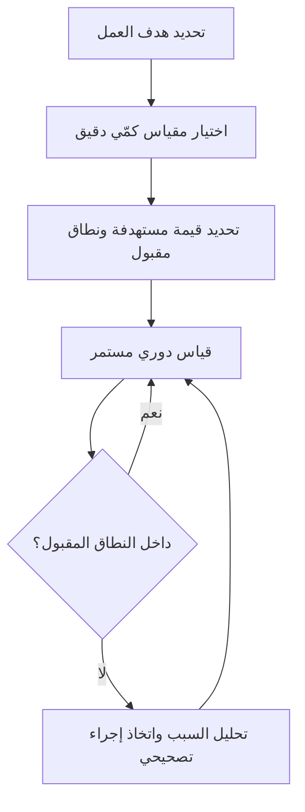

# مؤشّر الأداء الرئيسي (KPI)

> [!info] تعريف مختصر
> مؤشّر الأداء الرئيسي (Key Performance Indicator أو KPI) هو مقياس كمّي محدد يُستخدم لمتابعة مدى نجاح فريق أو منظمة أو عملية في تحقيق أهداف تشغيلية أو استراتيجية مهمة، بشكل مستمر عبر الزمن.

## الشرح العلمي والاحترافي
- الـ KPI مقياس رقمي محدد سلفًا (مثل النسبة المئوية، العدد، أو الزمن) يُربط بهدف واضح، ويُقاس بشكل دوري ومستمر لمعرفة "هل نحن بصحة جيدة الآن؟" وليس فقط "هل تحقق هدف بعينه مرة واحدة؟".
- خصائص المؤشّر الجيد: قابل للقياس بدقة، مرتبط مباشرة بهدف عمل حقيقي، له مالك واضح (شخص أو فريق مسؤول عنه)، وله قيمة مستهدفة أو نطاق مقبول (Threshold) يوضّح متى يُعتبر الأداء جيدًا أو سيئًا.
- تختلف مؤشرات الأداء الرئيسية عن الأهداف والنتائج الرئيسية ([[OKR]]) في طبيعتها الزمنية: KPI يراقب صحة عملية مستمرة بلا نهاية محددة (كمعدل ضربات القلب للمنظمة)، بينما OKR يقيس تقدّمًا نحو طموح أو تغيير محدد خلال فترة زمنية معينة، وينتهي وقتها.
- تُصنَّف KPIs عادة إلى: مؤشرات رائدة (Leading Indicators) تتنبأ بالنتيجة قبل حدوثها (مثل عدد العروض التجريبية المُجدولة)، ومؤشرات متأخرة (Lagging Indicators) تقيس نتيجة قد حدثت بالفعل (مثل الإيرادات الشهرية).
- في سياق المنتجات الرقمية والفرق التقنية، تُستخدم أمثلة شائعة مثل: زمن التسليم ([[Lead Time]])، معدل الأعطال المُكتَشفة بعد الإطلاق ([[Escaped Defect Rate]])، صافي نقاط الترويج ([[NPS]])، ووقت التعطّل المتوسط للإصلاح ([[MTTR]]).

## أين ومتى يُستخدم
- تُستخدم في كل أنواع المشاريع والمنظمات تقريبًا، بغض النظر عن المنهجية (Agile أو Waterfall أو Hybrid)، لأنها أداة مراقبة صحة عامة وليست خاصة بإطار عمل واحد.
- شائعة في تقارير الإدارة الشهرية أو الربع سنوية، ولوحات المتابعة (Dashboards) التشغيلية اليومية لفرق العمليات وخدمة العملاء.
- تُستخدم عند تصميم عقود مستوى الخدمة ([[SLO]] و[[SLI]]) لتحديد ما هو مقبول تشغيليًا.
- تُراجَع دوريًا في اجتماعات القيادة لتقييم الاتجاه العام (هل يتحسن أم يتدهور؟) واتخاذ قرارات تصحيحية مبكرة قبل أن تتحول المشكلة إلى أزمة.

## مثال وسيناريو تطبيقي
> [!example] شركة "سِفر" لتطوير تطبيقات المحاسبة السحابية حددت لفريق الدعم الفني ثلاثة مؤشرات أداء رئيسية شهرية:
> 1. زمن الاستجابة الأول (First Response Time): الهدف أقل من 4 ساعات.
> 2. صافي نقاط الترويج (NPS): الهدف 40 فأعلى.
> 3. معدل حل التذاكر من أول تواصل (First Contact Resolution): الهدف 70% فأعلى.
> في شهر يونيو، سجّل الفريق زمن استجابة 3.2 ساعة (جيد)، لكن NPS انخفض إلى 28 ومعدل الحل من أول تواصل انخفض إلى 55%. مدير خدمة العملاء ([[Service Delivery Manager]]) حلّل السبب الجذري ([[Root Cause Analysis]]) ووجد أن تحديثًا أخيرًا في المنتج زاد تعقيد واجهة الفوترة، مما رفع عدد التذاكر المتكررة. استُخدمت هذه المؤشرات كإنذار مبكر لإطلاق تحسين على واجهة الفوترة قبل أن يتراجع رضا العملاء أكثر.

## خطوات أو مخطّط
1. تحديد الهدف أو العملية الجوهرية التي نريد مراقبة صحتها.
2. اختيار مقياس كمّي دقيق يعكس ذلك الهدف مباشرة (تجنّب مقاييس الغرور Vanity Metrics).
3. تحديد قيمة مستهدفة أو نطاق مقبول، وتعيين مالك واضح للمؤشر.
4. جمع البيانات وقياس المؤشّر بشكل دوري ومنتظم.
5. عرضه في لوحة متابعة (Dashboard) مرئية للفريق وأصحاب المصلحة.
6. مراجعة الاتجاه الزمني (Trend) بانتظام واتخاذ إجراء عند الخروج عن النطاق المقبول.

## ⚠️ مفاهيم خاطئة شائعة
> [!warning]
> - الخلط بين KPI وOKR: KPI يراقب صحة مستمرة بلا نهاية زمنية، أما OKR فيقيس تقدّمًا نحو هدف محدد بفترة زمنية معينة.
> - الاعتقاد بأن كثرة المؤشرات تعني رقابة أفضل: كثرة المؤشرات دون أولوية تشتت الانتباه وتُضعف التركيز على ما يهم فعلًا.
> - الظن بأن أي رقم يمكن قياسه هو KPI جيد: مقاييس الغرور (مثل عدد زيارات الموقع بلا ربط بالتحويل الفعلي) قد تكون مضللة إن لم ترتبط بهدف عمل حقيقي.

## ❌ ممارسات خاطئة في المشاريع
> [!failure]
> - **اختيار مؤشرات يسهل التلاعب بها دون تحسين حقيقي**: مثل قياس "عدد التذاكر المُغلقة" فقط دون قياس رضا العميل، فيغلق الفريق تذاكر دون حلّها فعليًا. الحل: موازنة كل مؤشّر كمّي بمؤشّر جودة مقابل.
> - **عدم مراجعة المؤشرات دوريًا وتركها "معلّقة" في تقرير لا يقرأه أحد**: يفقدها قيمتها كأداة قرار. الحل: تخصيص وقت ثابت في اجتماعات الإدارة لمناقشة الانحرافات الجوهرية فقط.
> - **معاقبة الفريق فوريًا عند أي انحراف بسيط في مؤشّر واحد**: يدفع الفريق لإخفاء البيانات الحقيقية أو التركيز على الرقم بدل الجودة الفعلية. الحل: النظر إلى الاتجاه العام عبر الزمن، لا إلى قراءة واحدة معزولة.

## 🔗 مصطلحات ومفاهيم ذات صلة
[[OKR]] | [[SLO]] | [[SLI]] | [[NPS]] | [[MTTR]] | [[Lead Time]] | [[Escaped Defect Rate]] | [[Root Cause Analysis]] | [[SMART Goals]] | [[Service Delivery Manager]]
