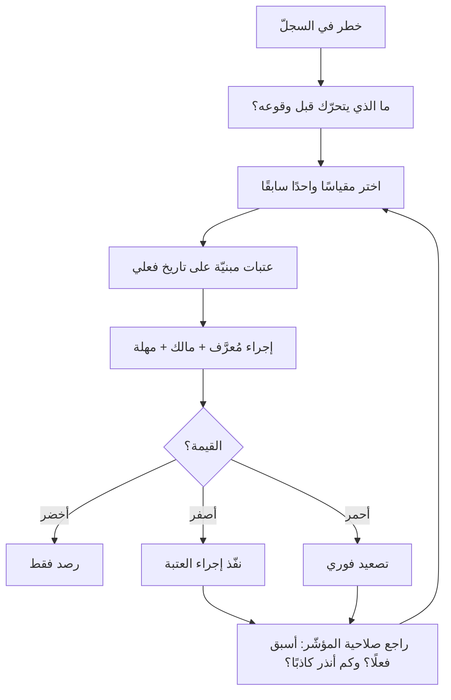

# مؤشّر الخطر الرئيسي (KRI)

> [!info] تعريف مختصر
> **مؤشّر الخطر الرئيسي (Key Risk Indicator)** مقياسٌ يُرصد لأنه **ينذر بازدياد احتمال خطر بعينه أو شدّته قبل وقوعه**، لا لأنه يصف أداءً تحقّق. فبينما يقول [[KPI|مؤشّر الأداء]] «كيف كان أداؤنا؟»، يقول مؤشّر الخطر «ما الذي يوشك أن يقع؟». وشرطه الذي يفصله عن أي رقم آخر ثلاثة أمور مجتمعة: أن يكون **مربوطًا بخطر مُعرَّف** في [[Risk Register|سجلّ المخاطر]]، وأن يكون **سابقًا** لوقوعه لا لاحقًا له، وأن يكون له **عتبةٌ وإجراءٌ ومالك** — فالمؤشّر الذي لا يترتّب على تجاوزه فعلٌ ليس مؤشّر خطر بل رقمًا في لوحة.

## الشرح العلمي والاحترافي

### 1. لماذا لا يكفي سجلّ المخاطر وحده؟

- سجلّ المخاطر يرصد الخطر ويقدّر احتماله وأثره **بتقدير بشريّ يُراجَع دوريًّا**. ومشكلته أن التقدير يتجمّد: يُكتب «متوسّط الاحتمال» في الشهر الأوّل، ويُنسخ كما هو في المراجعات التالية بلا أن يتغيّر شيء في الواقع أو خارجه.
- **ومؤشّر الخطر يعالج هذا بأن يربط تقدير الاحتمال بقياس يتحرّك من تلقائه.** فبدل أن يُسأل الفريق شهريًّا «هل ارتفع احتمال هذا الخطر؟»، يُرصد رقمٌ يجيب عن السؤال بلا رأي.
- **وهذه هي وظيفته الحقيقية: أن يحوّل السجلّ من وثيقة تُراجَع إلى نظام يُنبّه.**

### 2. شروط المؤشّر الصالح

1. **مربوط بخطر واحد مُعرَّف.** المؤشّر الذي لا يُعرف أيّ خطرٍ ينذر به يصير رقمًا معروضًا لا إشارة.
2. **سابق لا لاحق.** فعدد الحوادث التي وقعت مؤشّر أداء لا خطر؛ أمّا نسبة التغييرات التي تُنشر بلا مراجعة فسابقة له.
3. **له عتبة معلنة.** «مرتفع» ليست عتبة؛ العتبة رقم يُعرف عنده أن الحالة تغيّرت.
4. **له إجراء مُعرَّف عند التجاوز**، ومالكٌ مسمّى يملك تنفيذه. **وهذا الشرط هو الذي يسقط أكثر المؤشّرات المعروضة اليوم.**
5. **قابل للقياس بلا كلفة باهظة**، وإلا تُرك بعد شهرين.
6. **لا يُتلاعب به بسهولة**، وإلا فسد بمجرّد أن يُقاس به أحد — وهذا موضع [[Goodhart's Law|قانون غودهارت]].

### 3. أمثلة عملية في المشاريع البرمجية

| الخطر في السجلّ | مؤشّر الخطر الذي ينذر به |
|---|---|
| تسليم متأخّر في نهاية المشروع | نسبة العمل الجاري المتقادم فوق حدّ معلوم ([[WIP Aging]]) |
| انهيار جودة الإصدار القادم | نسبة إعادة الفتح ([[Reopen]]) واتّجاهها ثلاثة أسابيع |
| فقد المعرفة برحيل الأفراد | عدد الوحدات التي يعرفها شخص واحد فقط |
| تعثّر التكامل مع مورّد | زمن ردّ المورّد على الاستفسارات التقنية واتّجاهه |
| تجاوز الميزانية | نسبة الاستهلاك مقابل نسبة الإنجاز ([[CPI and SPI]]) |
| مخالفة نظامية في البيانات | عدد الصلاحيات الممنوحة فوق الحاجة ([[Least Privilege]]) |

**ولاحظ أن كلًّا منها يتحرّك قبل أن يقع الخطر بمدّة كافية للتصرّف** — وهذا هو المحكّ العملي: **مؤشّرٌ ينذر قبل الوقوع بأقلّ من مدّة التصرّف ليس إنذارًا بل تعليقًا على ما فات.**

### 4. مواضعه من نظام القياس

نظام القياس المكتمل فيه أربعة أنواع تُخلط كثيرًا، وأوجهها:

| النوع | يجيب عن سؤال | اتّجاهه في الزمن | ما هو أصلًا |
|---|---|---|---|
| **[[CSF\|عامل النجاح الحرج]]** | ما الذي بدونه نفشل حتمًا؟ | شرطٌ لا زمن له | **مجال أو شرط**، لا رقم |
| **[[KPI\|مؤشّر الأداء]]** | كيف كان أداؤنا؟ | لاحق غالبًا | مقياس نتيجة |
| **مؤشّر الخطر (KRI)** | ما الذي يوشك أن يقع؟ | سابق | مقياس إنذار |
| **الحرج للجودة (CTQ)** | ما الذي يراه العميل جودةً؟ | شرط مواصفة | خاصّية قابلة للقياس بحدود |

> **السؤال الفارق:** عامل النجاح الحرج **شرطٌ**، ومؤشّر الأداء يقيس **ما تحقّق**، ومؤشّر الخطر يقيس **ما يُنذر**، والحرج للجودة يحدّد **ما يقبله العميل**. وأشيع الخلط بين الأوّلين والثاني، لأن الشرط يُصاغ أحيانًا رقمًا فيبدو مؤشّرًا.

## أين ومتى يُستخدم

- عند إنشاء [[Risk Register|سجلّ المخاطر]]، بأن يُسأل عن كل خطر: **بأي رقم سنعرف أنه اقترب؟**
- في المشاريع الطويلة التي تفصل بين المراجعات فيها مدد طويلة، فتصير المراجعة الدورية وحدها أبطأ من الأحداث.
- في تشغيل الخدمات الحيّة، حيث تسبق مؤشّرات الخطر الحوادثَ بمدّة تكفي للتدخّل.
- في حوكمة المورّدين، لرصد تدهور الأداء قبل أن يبلغ حدّ الإخلال التعاقدي.
- في [[Early Warning Dashboard|لوحات الإنذار المبكر]]، وهي موضعه الطبيعي.

## مثال وسيناريو تطبيقي

> [!example] سيناريو ملموس
> مشروع ترحيل نظام مالي، وفي سجلّ مخاطره خطر مكتوب: **«قد لا تكتمل جاهزية بيانات العميل قبل موعد الترحيل.»** واحتماله «متوسّط»، وخطّة استجابته «متابعة أسبوعية مع العميل».
> بقي هذا التقدير كما هو أربعة أشهر: كل مراجعة تنسخ سابقتها، لأن «المتابعة الأسبوعية» كانت تجري فعلًا ولا تُنتج معلومة.
> فاستُبدل بذلك **مؤشّر خطر واحد**: *نسبة السجلّات المُرحَّلة بنجاح في التجربة الجافّة الشهرية* — بعتبات معلنة: **أخضر فوق 95% · أصفر 85–95% · أحمر دون 85%**، ومالكُه مدير المشروع، وإجراؤه عند الأصفر: جلسة تصعيد مع مالك البيانات لدى العميل خلال ثلاثة أيام.
> في التجربة الأولى كانت النسبة **91%** — أصفر. فعُقدت الجلسة، وتبيّن أن حقل الرقم الضريبي مفقود في فرعين. وفي الثانية **صارت 97%**.
> **ولاحظ الفرق:** الخطر كان مكتوبًا من اليوم الأوّل ولم ينفع، لأن ما كان ينقصه ليس الرصد بل **رقمًا يتحرّك، وعتبةً، وإجراءً، ومالكًا**. وهذه الأربعة هي مؤشّر الخطر.

## خطوات أو مخطّط

1. **ابدأ من الخطر لا من الرقم**: خذ أخطارك الأعلى شدّةً من السجلّ، ولا تبحث عمّا يمكن قياسه ثم تسمّيه مؤشّر خطر.
2. **اسأل عن السبيل إليه**: ما الذي يتغيّر **قبل** أن يقع هذا الخطر؟
3. **اختر مقياسًا واحدًا** لكل خطر، وقدّم القابل للقياس آليًّا على الأدقّ الذي لا يُقاس.
4. **حدّد العتبات بالتاريخ لا بالتقدير**: انظر ما كانت عليه القيمة في المشاريع التي وقع فيها الخطر فعلًا.
5. **اكتب الإجراء عند كل عتبة، وسمِّ مالكه ومهلته.** **وبلا هذه الخطوة يبقى ما عندك رقمًا معروضًا.**
6. **راجع صلاحية المؤشّر دوريًّا**: هل سبق الخطر فعلًا حين وقع؟ وهل أنذر إنذارات كاذبة كثيرة؟ **فكثرة الإنذار الكاذب تُبطل المؤشّر بالتجاهل، وهي أشدّ من قلّة الحساسية.**
7. **اقصر عددها**: خمسة مؤشّرات تُتابَع خير من عشرين تُعرَض.

## ⚠️ مفاهيم خاطئة شائعة

> [!warning]
> - **الظنّ أن كل مؤشّر في لوحة المخاطر مؤشّر خطر**: عدد المخاطر المفتوحة، وعدد الحوادث الشهرية — هذه مؤشّرات أداء **لاحقة**. **والمحكّ: أيسبق الخطرَ أم يصفه بعد وقوعه؟**
> - **الظنّ أنه بديل عن سجلّ المخاطر**: هو **مُلحق** به لا بديل عنه؛ فالسجلّ يعرّف الخطر وخطّة استجابته، والمؤشّر يقيس اقترابه.
> - **إغفال الإجراء والمالك**: المؤشّر بلا إجراء يتحوّل إلى معلومة تُقرأ ولا تُغيّر شيئًا، ثم يُهمَل. **وهذا أشيع صور فشله.**
> - **الإكثار من المؤشّرات**: عشرون مؤشّرًا تعني ألّا أحد يتابعها، وأن الأحمر فيها يصير حالة معتادة. **والقاعدة: ما لا تُتابعه أسبوعيًّا لا تعرضه.**
> - **الخلط بينه وبين [[Leading and Lagging Indicators|المؤشّرات السابقة واللاحقة]]**: ذلك تصنيف **عامّ لكل المقاييس**، ومؤشّر الخطر **حالة خاصّة**: مؤشّر سابق مربوط بخطر مُعرَّف في السجلّ وله عتبة وإجراء.

## ❌ ممارسات خاطئة في المشاريع

> [!failure]
> - **تحويل كل رقم متاح إلى مؤشّر خطر لأن استخراجه سهل**: تمتلئ اللوحة بأرقام لا تنذر بشيء، فتُقرأ عادةً ثم لا تُقرأ. **التجنّب:** ابدأ من الخطر دائمًا، لا من البيانات المتاحة.
> - **ضبط العتبات بالتقدير لا بالتاريخ**: عتبة عالية جدًّا لا تُنذر إلا بعد فوات الأوان، ومنخفضة جدًّا تُنذر كل أسبوع فتُتجاهل. **التجنّب:** عايرها بقيَم المشاريع التي وقع فيها الخطر فعلًا عندك.
> - **عرض الأحمر في التقارير بلا تصعيد**: يتعلّم الجميع أن الأحمر حالة مقبولة، فتُفقد الإشارة قيمتها كلّها. **التجنّب:** اربط كل عتبة بإجراء ومهلة، وسجّل ما نُفّذ عند كل تجاوز.
> - **إسناد المؤشّر إلى من لا يملك التصرّف**: فيبقى الإنذار عند من يراه ولا يستطيع شيئًا. **التجنّب:** مالك المؤشّر هو من يملك تنفيذ إجراء العتبة، لا من يستخرج الرقم.
> - **إبقاء المؤشّر بعد أن ثبت أنه لا يسبق الخطر**: يُنفَق عليه ويُطمأنّ إليه بلا وجه. **التجنّب:** بعد كل حادثة، اسأل: أيّ المؤشّرات تحرّك قبلها؟ وأيّها لم يتحرّك؟ واحذف الثاني.

## 🔗 مصطلحات ومفاهيم ذات صلة

[[KPI]] | [[CSF]] | [[Risk Register]] | [[RAID Log]] | [[Leading and Lagging Indicators]] | [[Early Warning Dashboard]] | [[Probability and Impact Matrix]] | [[Goodhart's Law]] | [[WIP Aging]] | [[19 - Risk Management]]
