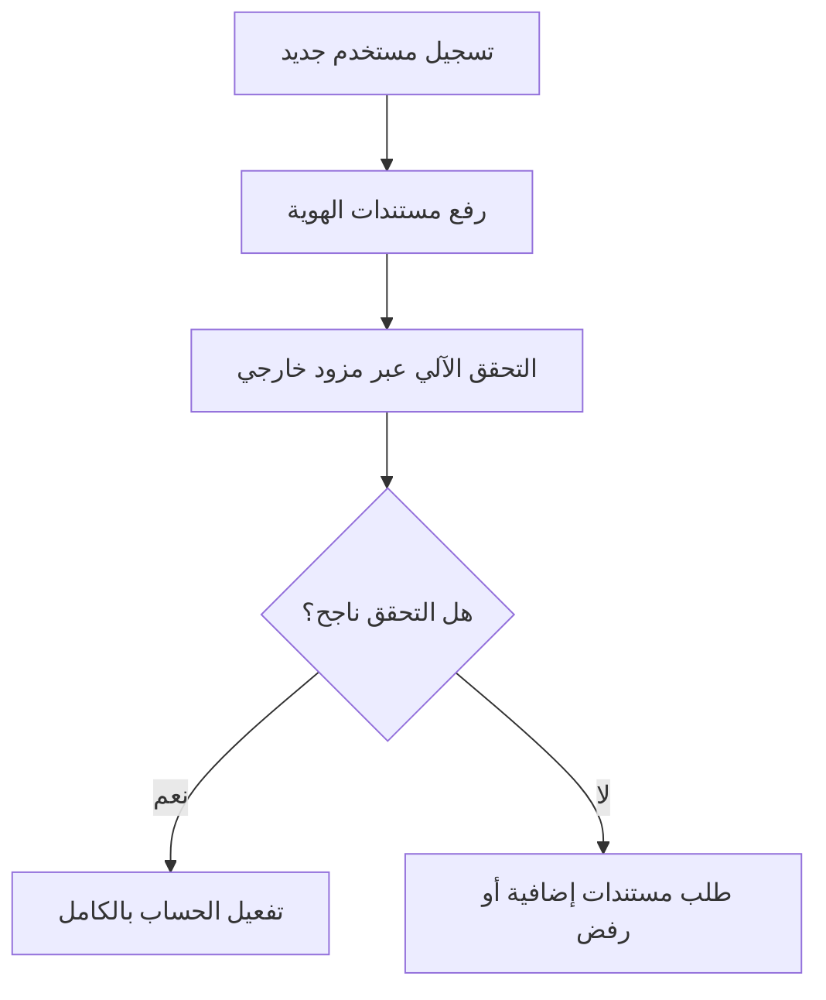

# اعرف عميلك (KYC)
> [!info] تعريف مختصر
> "اعرف عميلك" (Know Your Customer - KYC) هي عملية التحقق من هوية العميل وفهم طبيعة نشاطه قبل بدء التعامل معه، وتُستخدم غالبًا في القطاع المالي والمشاريع التي تتطلب امتثالًا قانونيًا.

## الشرح العلمي والاحترافي
- KYC هي مجموعة إجراءات تهدف إلى التحقق من هوية العميل (فرد أو شركة) ومنع الاستخدام غير المشروع للخدمات، مثل غسل الأموال أو الاحتيال.
- تشمل عادة: جمع مستندات الهوية، التحقق من العنوان، فهم طبيعة النشاط أو مصدر الأموال، وتقييم مستوى المخاطر المرتبط بالعميل.
- في سياق إدارة المشاريع، يظهر مصطلح KYC غالبًا عند بناء منتجات مالية (Fintech) أو أنظمة تتطلب تسجيل مستخدمين تجاريين، حيث يصبح KYC متطلبًا وظيفيًا (functional requirement) يجب تصميمه واختباره ضمن المنتج.
- يرتبط KYC بمتطلبات قانونية وتنظيمية (Compliance) تفرضها جهات رقابية، لذا فإن أي تأخير أو خطأ في تصميمه قد يعرّض المشروع لمخاطر قانونية جسيمة.
- غالبًا يتطلب تكاملًا مع أطراف ثالثة (third-party) للتحقق من الهوية، مثل خدمات التحقق البيومتري أو قواعد بيانات العقوبات الدولية.

## أين ومتى يُستخدم
- يُستخدم بشكل أساسي في مشاريع القطاع المصرفي، والتأمين، والعملات الرقمية، ومنصات الدفع الإلكتروني.
- يظهر كمتطلب في مرحلة جمع المتطلبات (requirements) لأي مشروع تقني يتعامل مع أموال العملاء أو بياناتهم الحساسة.
- يُدمج غالبًا كجزء من عملية التسجيل (onboarding) في التطبيقات المالية، ويحتاج مدير المشروع إلى التنسيق بين فريق التطوير وفريق الامتثال القانوني (Compliance).

## مثال وسيناريو تطبيقي
> [!example]
> شركة ناشئة تبني تطبيق محفظة رقمية اسمه "محفظتي". ضمن نطاق المشروع (Scope Statement)، يطلب فريق الامتثال إضافة وحدة KYC إلزامية قبل السماح لأي مستخدم بإيداع أكثر من 1000 دولار.
> يعمل مدير المشروع مع محلل الأعمال لتحديد متطلبات KYC: رفع صورة الهوية، التقاط صورة شخصية حية (selfie) للمطابقة، والتحقق من العنوان عبر فاتورة خدمات.
> يتم التكامل مع مزود خارجي متخصص في التحقق من الهوية، ويُختبر التدفق كاملًا في بيئة الاختبار (UAT) قبل الإطلاق.
> بعد الإطلاق، يُراقب الفريق نسبة العملاء الذين يفشلون في التحقق (rejection rate) لتحسين تجربة المستخدم دون التنازل عن متطلبات الامتثال.

## خطوات أو مخطّط
1. تحديد متطلبات KYC القانونية المطلوبة حسب البلد والقطاع.
2. تصميم تدفق تسجيل المستخدم شاملًا خطوات التحقق.
3. اختيار مزود خدمة تحقق الهوية والتكامل معه تقنيًا.
4. اختبار التدفق (بما فيه الحالات الحدّية Edge Cases) قبل الإطلاق.
5. مراقبة الأداء بعد الإطلاق وتحسين تجربة المستخدم.

## ⚠️ مفاهيم خاطئة شائعة
> [!warning]
> - الاعتقاد أن KYC مسؤولية الفريق القانوني فقط وليست جزءًا من متطلبات المنتج؛ في الواقع تحتاج تصميمًا تقنيًا دقيقًا.
> - الخلط بين KYC وAML (مكافحة غسل الأموال)؛ KYC هي جزء من عملية AML الأشمل، وليست مرادفة لها بالكامل.
> - الاعتقاد أن تنفيذ KYC مرة واحدة يكفي؛ غالبًا تتطلب اللوائح إعادة التحقق الدوري من العملاء الحاليين.

## ❌ ممارسات خاطئة في المشاريع
> [!failure]
> - تأجيل تصميم متطلبات KYC إلى مراحل متأخرة من المشروع، مما يسبب تأخيرًا كبيرًا في الإطلاق. الحل: إشراك فريق الامتثال منذ مرحلة جمع المتطلبات.
> - تصميم تدفق KYC معقد جدًا يُنفّر المستخدمين ويرفع معدل التخلي (drop-off rate). الحل: موازنة متطلبات الامتثال مع تجربة المستخدم عبر الاختبار المستمر.
> - عدم توثيق بيانات العملاء ومعالجتها وفق قوانين حماية البيانات المحلية. الحل: التنسيق مع فريق حماية البيانات (PDPL) عند تصميم تخزين بيانات KYC.

## 🔗 مصطلحات ومفاهيم ذات صلة
[[PDPL]] | [[ROPA]] | [[Controller vs Processor]] | [[Software Requirements Specification]] | [[Edge Cases]] | [[UAT]] | [[Stakeholder Map]]
