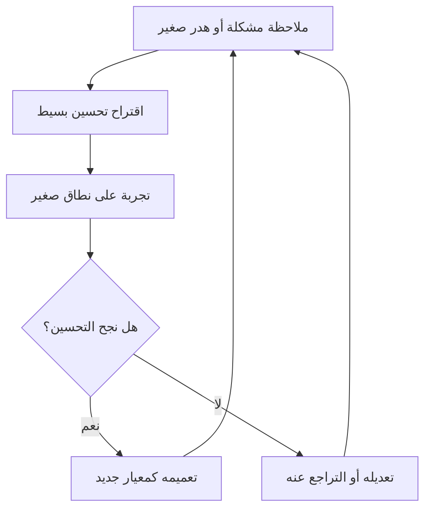

# كايزن (Kaizen)

> [!info] تعريف مختصر
> كايزن كلمة يابانية تعني "التغيير نحو الأفضل"، وتُستخدم في إدارة المشاريع للدلالة على فلسفة التحسين المستمر: إجراء تحسينات صغيرة ومتكررة ومستمرة في العمليات، بدلاً من انتظار تحولات كبيرة ونادرة.

## الشرح العلمي والاحترافي
- كايزن جزء أساسي من نظام إنتاج تويوتا (راجع [[Toyota Production System]]) ومن الفكر الرشيق (Lean) عموماً.
- المبدأ الجوهري: التحسينات الصغيرة المتراكمة عبر الزمن، والتي يشارك فيها كل فرد في الفريق (وليس فقط الإدارة)، تُنتج تحسناً كبيراً وثابتاً على المدى الطويل، مع مخاطرة أقل من التغييرات الجذرية الكبيرة.
- يرتبط كايزن ارتباطاً وثيقاً بدورة PDCA (خطّط، نفّذ، تحقّق، تصرّف) (راجع [[PDCA]])، حيث تُجرَّب التحسينات على شكل دورات صغيرة قابلة للقياس.
- في تطوير البرمجيات الرشيقة (Agile)، يتجلّى كايزن بوضوح في اجتماع الاستعادة (راجع [[10 - Sprint Retrospective]])، حيث يراجع الفريق أداءه بعد كل دورة (Sprint) ويقترح تحسينات صغيرة قابلة للتطبيق فوراً.
- يفرّق الفكر الرشيق بين كايزن (تحسين تدريجي مستمر) و"التغيير التطوري" الأكبر حجماً (راجع [[Evolutionary Change]])؛ كلاهما مكمّل للآخر، لكن كايزن يركّز على خطوات صغيرة يومية.
- كايزن ليس مسؤولية الإدارة فقط، بل ثقافة يتبناها كل عضو في الفريق، وهذا مرتبط بمفهوم "القيادة على مستوى كل فرد" (راجع [[Leadership at Every Level]]) والتمكين (راجع [[Empowerment]]).

## أين ومتى يُستخدم
- يُستخدم في اجتماعات الاستعادة الدورية بعد كل Sprint أو Iteration.
- يُستخدم كثقافة عمل مستمرة، وليس حدثاً لمرة واحدة، في أي فريق يتبنى المنهجيات الرشيقة (راجع [[01 - Agile]]).
- مناسب بشكل خاص عندما يريد الفريق تحسين جودة العمليات، تقليل الهدر (راجع [[Muda, Mura, Muri]])، أو رفع الإنتاجية دون تعطيل سير العمل بتغييرات كبيرة مفاجئة.

## مثال وسيناريو تطبيقي
> [!example] فريق تطوير تطبيق جوّال في شركة "أورورا تِك" ينهي كل Sprint باجتماع استعادة مدته 45 دقيقة.
> في نهاية Sprint رقم 14، يلاحظ الفريق أن اختبار كل ميزة جديدة يستغرق وقتاً طويلاً بسبب تكرار خطوات يدوية متشابهة. بدلاً من تأجيل الحل لمشروع ضخم مستقبلي، يقترح المطوّر عمر تحسيناً صغيراً: كتابة سكربت آلي بسيط يُشغّل الاختبارات الأساسية تلقائياً بعد كل تحديث للشيفرة (راجع [[CI and CD]]).
> يُطبَّق السكربت في اليوم التالي، فينخفض وقت الاختبار اليدوي من ساعتين إلى 20 دقيقة لكل ميزة. في Sprint التالي، يقترح عضو آخر تحسيناً إضافياً بناءً على هذا الأساس. هكذا تتراكم تحسينات صغيرة أسبوعياً لتشكّل تحولاً كبيراً خلال بضعة أشهر.

## خطوات أو مخطّط
1. لاحظ الفريق نقطة ضعف صغيرة أو مصدر هدر في العملية الحالية.
2. اقترح تحسيناً بسيطاً وقابلاً للتطبيق فوراً (لا يتطلب موافقات معقدة).
3. جرّب التحسين على نطاق صغير (خطّط ونفّذ من PDCA).
4. تحقّق من الأثر الفعلي بعد فترة قصيرة.
5. إذا نجح: عمّمه واجعله جزءاً من العملية القياسية. إذا لم ينجح: عدّله أو تراجع عنه بسرعة.
6. كرّر هذه الدورة باستمرار كجزء من ثقافة الفريق.

## ⚠️ مفاهيم خاطئة شائعة
> [!warning]
> - الاعتقاد أن كايزن يعني مشاريع تحسين كبيرة ونادرة؛ في الحقيقة جوهره خطوات صغيرة يومية متراكمة.
> - الظن أن كايزن مسؤولية فريق أو إدارة "تحسين العمليات" فقط؛ في الواقع هو مسؤولية جماعية يشارك فيها كل عضو في الفريق.
> - الخلط بين كايزن والتغييرات الجذرية الكبيرة (مثل إعادة هيكلة كاملة للمنتج)؛ كايزن يركّز على التحسين التدريجي المستمر منخفض المخاطر.

## ❌ ممارسات خاطئة في المشاريع
> [!failure]
> - عقد اجتماع استعادة يجمع فيه الفريق ملاحظات كثيرة، لكن دون تحويل أي منها إلى إجراء فعلي مُتابَع. الحل: اختيار تحسين واحد أو اثنين قابلين للتنفيذ فوراً بدل قائمة طويلة غير منجزة.
> - انتظار "الوقت المناسب" أو الموافقة الرسمية لتطبيق تحسين بسيط، فيتأخر التنفيذ لأشهر. الحل: تمكين الفريق من تجربة تحسينات صغيرة دون بيروقراطية زائدة.
> - معاملة كايزن كحدث سنوي أو ربع سنوي فقط بدل عادة مستمرة، مما يفقده قيمته التراكمية. الحل: ربط كايزن بدورة العمل المنتظمة (كل Sprint) لا بمناسبات نادرة.

## 🔗 مصطلحات ومفاهيم ذات صلة
[[PDCA]] | [[Toyota Production System]] | [[Muda, Mura, Muri]] | [[5S]] | [[Gemba Walk]] | [[Evolutionary Change]] | [[Leadership at Every Level]] | [[Empowerment]] | [[10 - Sprint Retrospective]] | [[Value Stream Mapping]]
