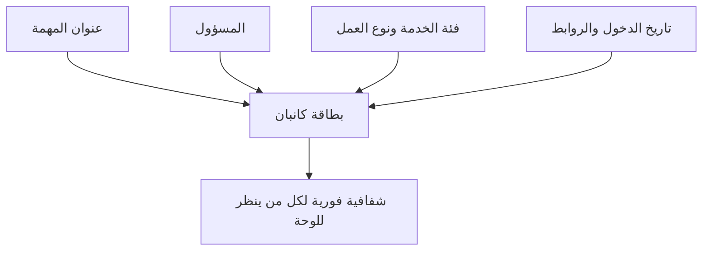

# هيكل بطاقة كانبان (Kanban Card Structure)

> [!info] تعريف مختصر
> هيكل بطاقة كانبان (Kanban Card Structure) هو مجموعة الحقول والمعلومات الموحدة التي تظهر على كل بطاقة عمل في لوحة كانبان (Kanban)، بحيث تنقل صورة كاملة وسريعة عن حالة المهمة لأي شخص ينظر إليها.

## الشرح العلمي والاحترافي
- البطاقة هي الوحدة الأساسية لتمثيل عنصر عمل واحد (مهمة، قصة مستخدم، عيب) على لوحة المهام (Task Boards).
- الهيكل النموذجي للبطاقة يتضمن عادة: عنوان مختصر للمهمة، معرّف فريد (ID)، الشخص المسؤول (Assignee)، تاريخ الدخول للعمود الحالي، فئة الخدمة (مثل عادي أو Expedite Class)، حجم أو تقدير العمل، والروابط أو التبعيات (Dependency) مع مهام أخرى.
- بعض الفرق تضيف مؤشرات بصرية: لون يمثل نوع العمل (ميزة، عيب، مهمة تقنية)، أو ملصق أحمر صغير يشير إلى عائق (Blocker).
- الهدف من توحيد الهيكل هو تحقيق الشفافية الجذرية (Radical Transparency): أي عضو في الفريق أو صاحب مصلحة يمر أمام اللوحة يفهم حالة أي مهمة خلال ثوانٍ دون سؤال أحد.
- كلما زادت المعلومات الضرورية الظاهرة على البطاقة (دون إثقالها)، قلّ الحاجة لاجتماعات توضيحية إضافية، وتحسّن تتبع زمن الدورة (Cycle Time) وعمر العمل قيد التنفيذ (WIP Aging).
- في الأدوات الرقمية (مثل Jira أو Trello)، يقابل هذا الهيكل "قالب البطاقة" (Card Template) الذي يمكن تخصيصه ليشمل حقولاً كالأولوية، الرابط لمتطلبات القبول، ورقم السبرنت.

## أين ومتى يُستخدم
- أساسي في أي لوحة كانبان ([[03 - Kanban]]) سواء مادية (لاصقات على جدار) أو رقمية.
- يُصمَّم الهيكل عند إنشاء اللوحة لأول مرة، ويُراجَع كلما احتاج الفريق حقلاً جديداً (مثل رابط طلب سحب الكود Pull Request).
- يُستخدم أيضاً في هجين سكرمبان (Scrum-ban) لربط البطاقات بقصص المستخدم ونقاط القصة (Story Points).

## مثال وسيناريو تطبيقي
> [!example] فريق تطوير تطبيق جوال في شركة "مسار الرقمية" كان يستخدم بطاقات بعنوان فقط دون أي تفاصيل، فكان أعضاء الفريق يفتحون أداة تتبع منفصلة لمعرفة من المسؤول عن كل مهمة، مما يهدر وقتاً يومياً. أعاد الفريق تصميم هيكل البطاقة ليشمل: العنوان، الشخص المسؤول (صورة رمزية صغيرة)، تاريخ دخول العمود الحالي، لون يمثل النوع (أزرق لميزة، أحمر لعيب)، وملصق "معلّق" عند وجود عائق. بعد التطبيق، أصبح الاجتماع اليومي أسرع بمقدار 10 دقائق لأن كل المعلومات كانت مرئية مباشرة على اللوحة.

## خطوات أو مخطّط
1. حدِّد الحقول الضرورية فعلاً (العنوان، المسؤول، النوع، الحجم، التاريخ) وتجنّب الإفراط في التفاصيل.
2. اختر ترميزاً بصرياً موحداً (ألوان، أيقونات) لكل نوع عمل أو حالة عائق.
3. طبِّق نفس الهيكل على كل بطاقة في اللوحة دون استثناء لضمان الاتساق.
4. درِّب الفريق على تحديث حقول البطاقة فور تغيّر حالتها (لا بأثر رجعي).
5. راجع الهيكل دورياً واحذف أي حقل لا يُستخدَم فعلياً.

## ⚠️ مفاهيم خاطئة شائعة
> [!warning]
> - الاعتقاد أن إضافة أكبر عدد من الحقول يجعل البطاقة "أفضل"؛ في الواقع كثرة الحقول تُشتت الانتباه وتُبطئ التحديث.
> - الظن أن هيكل البطاقة ثابت في كل الفرق؛ الصحيح أنه يُخصَّص حسب طبيعة عمل كل فريق ونوع المشروع.
> - نسيان تحديث حقول البطاقة (كالمسؤول أو الحالة) فتصبح اللوحة مضللة رغم امتلاء الحقول شكلياً.

## ❌ ممارسات خاطئة في المشاريع
> [!failure]
> - استخدام بطاقات بعنوان فقط دون أي سياق، مما يجبر الفريق على البحث في أدوات أخرى لفهم المهمة؛ التجنب: تضمين الحد الأدنى الضروري من المعلومات مباشرة على البطاقة.
> - ترك بطاقات قديمة دون تحديث تاريخ الدخول أو حالة العائق، فتصبح مؤشرات مثل عمر العمل (WIP Aging) غير دقيقة؛ التجنب: تحديث البطاقة فور أي تغيير فعلي.
> - عدم توحيد الترميز اللوني بين الفرق المختلفة في نفس المؤسسة، مما يربك من ينتقل بين لوحات مختلفة؛ التجنب: الاتفاق على معيار مؤسسي أساسي مع سماح بمرونة محدودة لكل فريق.

## 🔗 مصطلحات ومفاهيم ذات صلة
[[03 - Kanban]] | [[16 - Task Boards]] | [[Explicit Policies]] | [[Expedite Class]] | [[WIP Aging]] | [[Blocker]] | [[Radical Transparency]] | [[Cycle Time]] | [[Dependency]]
