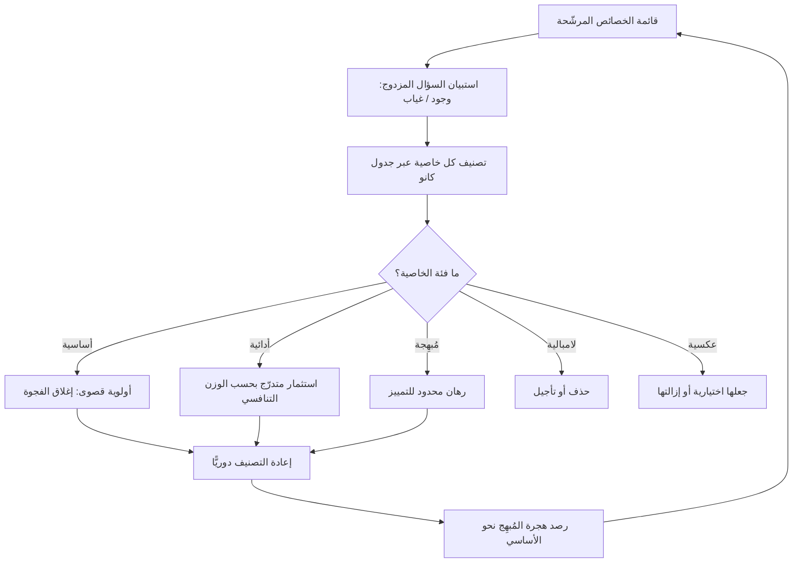

# نموذج كانو (Kano Model)

> [!info] تعريف مختصر
> نموذج لتصنيف خصائص المنتج بحسب **العلاقة بين مستوى تنفيذ الخاصية ومستوى رضا المستخدم عنها**. جوهر النموذج أن هذه العلاقة ليست خطّية دائمًا: بعض الخصائص كلما حسّنتها زاد الرضا بالتناسب، وبعضها لا يزيد الرضا مهما أتقنته لكن غيابه يُسقط المنتج، وبعضها يُسعِد المستخدم دون أن يطلبه أصلًا. يُنسب النموذج إلى الأكاديمي الياباني **نورياكي كانو (Noriaki Kano)** في سياق أدبيات إدارة الجودة، وقد انتقل لاحقًا إلى إدارة المنتجات الرقمية.

## الشرح العلمي والاحترافي
يُرسم النموذج عادة على محورين: المحور الأفقي يمثّل **مستوى التنفيذ أو وجود الخاصية** (من غائبة تمامًا إلى مُتقنة تمامًا)، والمحور الرأسي يمثّل **رضا المستخدم** (من استياء شديد إلى إعجاب شديد). ورسم كل نوع من الخصائص على هذين المحورين يعطي منحنى مختلف الشكل:

- **الخصائص الأساسية / الضرورية (Must-be / Basic)**: منحنى يصعد بسرعة من قاع الاستياء ثم يستوي عند خط الحياد ولا يتجاوزه أبدًا. وجودها لا يُلاحَظ ولا يُشكَر، وغيابها كارثة. أمثلة: أن يفتح التطبيق دون أن ينهار، أن تُحفظ البيانات، أن تصل رسالة إعادة تعيين كلمة المرور، أن تكون الفواتير صحيحة حسابيًّا. هذه الخصائص **لا يذكرها المستخدمون في البحث** لأنها مفترضة ضمنًا؛ لا تُكتشف بالسؤال بل بالانهيار.
- **الخصائص الأدائية / الخطّية (Performance / One-dimensional)**: منحنى مستقيم صاعد يمرّ بنقطة الحياد. كلما زاد مستوى التنفيذ زاد الرضا وبالعكس. أمثلة: سرعة تحميل الصفحة، مساحة التخزين، دقّة نتائج البحث، عدد صيغ التصدير المدعومة. هذه هي الخصائص التي يذكرها المستخدم صراحة حين تسأله، وهي الميدان الطبيعي للمنافسة المباشرة والمقارنات.
- **الخصائص المُبهِجة (Attractive / Delighters / Excitement)**: منحنى يبدأ من خط الحياد ويصعد بقوّة. غيابها لا يُغضب أحدًا لأنها غير متوقّعة أصلًا، ووجودها يرفع الرضا بشكل غير متناسب. أمثلة تاريخية: الإكمال التلقائي الذكي حين ظهر أول مرة، أو الاستعادة الفورية لملف محذوف. لا يمكن استخلاصها من طلبات المستخدمين مباشرة، لأنها بطبيعتها ما لا يعرف المستخدم أن يطلبه.
- **الخصائص اللامبالية (Indifferent)**: خط أفقي عند الحياد. لا يهتم المستخدم بوجودها أو غيابها. وهي أخطر فئة اقتصاديًّا لأنها تستهلك جهد التطوير دون أي عائد في الرضا — وكثير من الميزات التي تُبنى إرضاءً لجهة داخلية تقع هنا.
- **الخصائص العكسية (Reverse)**: منحنى هابط — كلما زاد تنفيذها انخفض الرضا. أمثلة: كثرة الإشعارات، إجبار المستخدم على إنشاء حساب قبل تجربة المنتج، جولة تعريفية طويلة إلزامية. من المهم الانتباه إلى أن الخاصية قد تكون مُبهِجة لشريحة وعكسية لشريحة أخرى، وهو مؤشّر على وجوب التقسيم لا على وجوب الحذف.

### البُعد الزمني: تآكل الإبهاج
أهم فكرة في النموذج — وأكثرها إهمالًا في التطبيق — أن **التصنيف ليس ثابتًا، بل يهاجر عبر الزمن في اتجاه واحد**: ما هو **مُبهِج** اليوم يصير **أدائيًّا** بعد فترة (يقارن المستخدمون جودته)، ثم يصير **أساسيًّا** (لا يُلاحَظ وجوده ويُستنكر غيابه). أمثلة يعرفها كل مستخدم: المزامنة التلقائية بين الأجهزة، والحفظ التلقائي للمستندات، والبحث الفوري داخل التطبيق — كلها كانت مصدر دهشة في وقتها وصارت الحد الأدنى المفترض اليوم.

ولهذه الهجرة نتائج عملية مباشرة:
- **لا يوجد "إتقان نهائي" للأساسيات**: قائمة الأساسيات تطول كل عام تلقائيًّا، بفعل ما يفعله السوق لا بفعل ما تقرّره أنت. جزء من طاقة الفريق يجب أن يُخصَّص دائمًا لمجرّد البقاء عند خط الحد الأدنى المتحرّك.
- **الإبهاج ميزة تنافسية مؤقّتة بطبيعتها**: بناء الاستراتيجية على ميزة مُبهِجة واحدة رهان قصير الأجل، لأن التقليد سيحوّلها إلى معيار قطاعي.
- **خارطة الطريق ([[15 - Roadmap]]) يجب أن تُقرأ زمنيًّا**: خارطة مليئة بالمُبهِجات فقط تعني تراكم دين في الأساسيات؛ وخارطة خالية من أي إبهاج تعني منتجًا يلحق بالسوق ولا يقوده أبدًا.

### كيف يُقاس عمليًّا
يُقاس النموذج عبر استبيان بنية **السؤال المزدوج (Functional / Dysfunctional)**، حيث تُطرح كل خاصية بصيغتين:
1. **الصيغة الإيجابية**: «لو كانت هذه الخاصية موجودة، كيف تشعر؟»
2. **الصيغة السلبية**: «لو كانت هذه الخاصية غير موجودة، كيف تشعر؟»

ويجيب المستخدم على كل سؤال باختيار من سلّم ثابت من خمسة خيارات: (تعجبني / أتوقّعها وهي مفترضة / محايد / يمكنني تحمّلها / لا تعجبني). ثم يُقاطَع الجوابان في جدول تصنيف قياسي يُخرج التصنيف النهائي للخاصية. مثال على القراءة: من يجيب «أتوقّعها» عند الوجود و«لا تعجبني» عند الغياب فهو يصنّفها **أساسية**؛ ومن يجيب «تعجبني» عند الوجود و«محايد» عند الغياب فهو يصنّفها **مُبهِجة**؛ ومن يجيب «تعجبني» عند الوجود و«لا تعجبني» عند الغياب فهو يصنّفها **أدائية**.

نقاط منهجية مهمّة عند القياس: يُوصف كل خاصية بلغة الفائدة للمستخدم لا بلغة تقنية؛ ويُحلَّل التوزيع لكل شريحة على حدة لأن دمج الشرائح قد يخفي تصنيفات متعاكسة؛ ويُقرأ النموذج بوصفه توزيعًا لا حكمًا قاطعًا — فالخاصية نادرًا ما تكون 100% في فئة واحدة. كما يُستحسن اقتران السؤال بسؤال عن **أهمية الخاصية** للمستخدم، للتمييز بين خاصية أساسية جوهرية وأخرى أساسية هامشية.

## أين ومتى يُستخدم
- **عند تحديد نطاق [[MVP]]**: الحد الأدنى الصالح يجب أن يغطّي **كل الأساسيات** الخاصة بمهمّته، وأن يتفوّق في **خاصية أدائية واحدة على الأقل**، وقد يحتمل مُبهِجًا واحدًا فقط للتمييز — لا أكثر.
- **في ترتيب أولويات الـ Backlog**: يُستخدم بجوار أطر أخرى مثل [[MoSCoW Prioritization]]؛ إذ يوفّر كانو الحجّة النوعية لتصنيف بند ما بوصفه «إلزاميًّا» بدل الاعتماد على قناعة صاحب المصلحة الأعلى صوتًا.
- **في تخطيط خارطة الطريق على مدى سنة أو أكثر**: لموازنة الاستثمار بين صيانة الأساسيات، والتنافس في الأدائيات، والمراهنة على الإبهاج.
- **في تفسير تناقض المؤشّرات**: حين يكون [[NPS]] منخفضًا رغم ثراء الميزات، غالبًا ما يكشف كانو خللًا في الأساسيات لا نقصًا في المُبهِجات.
- **في تحليل شكاوى الدعم الفني**: الشكاوى المتكرّرة مؤشّر شبه مباشر على خصائص أساسية مكسورة، لأن المستخدم لا يشتكي مما لم يتوقّعه.
- **في قرارات التقليم (Feature Pruning)**: لتحديد الخصائص اللامبالية والعكسية المرشّحة للحذف أو الإخفاء خلف إعداد اختياري.

## مثال وسيناريو تطبيقي
> [!example] منصّة حجز مواعيد لعيادات صغيرة. الفريق أعدّ خارطة طريق للربع القادم تضم ثلاث مبادرات: (١) مساعد ذكي يقترح أفضل موعد، (٢) إصلاح تعارض الحجوزات المزدوجة، (٣) تخصيص ألوان واجهة العيادة.
> أجرى الفريق استبيان كانو على 180 مستخدمًا من العيادات، بالسؤال المزدوج لكل خاصية. جاءت النتائج على النحو التالي:
> - **منع الحجز المزدوج**: 78% صنّفوها **أساسية** (يتوقّعونها عند الوجود، ولا تعجبهم عند الغياب) — وهي مطابقة تمامًا لأكثر تذاكر الدعم تكرارًا في الربع السابق.
> - **المساعد الذكي للمواعيد**: 46% **مُبهِجة**، و29% **لامبالية**، و11% **عكسية** (مستخدمون لا يريدون نظامًا يقترح نيابة عنهم في قرار طبي).
> - **تخصيص الألوان**: 71% **لامبالية**.
>
> القرار الذي كان الفريق سيتّخذه حدسيًّا هو البدء بالمساعد الذكي لأنه الأكثر إبهارًا في العروض التقديمية. لكن قراءة كانو قلبت الترتيب: أي إبهاج يُبنى فوق أساس مكسور يُهدَر، لأن مستخدمًا خسر موعد مريض بسبب حجز مزدوج لن يلتفت إلى ذكاء الاقتراحات. فأُعطي إصلاح التعارض أولوية مطلقة، وأُجّل المساعد الذكي إلى الربع التالي **كخيار قابل للتعطيل** احترامًا لشريحة الـ 11% العكسية، وحُذف تخصيص الألوان من الخارطة نهائيًّا لتوفير جهده لصالح الأساسيات.

## خطوات أو مخطّط
1. جمع قائمة الخصائص المرشّحة ووصف كل واحدة بلغة الفائدة للمستخدم لا بلغة التنفيذ.
2. بناء استبيان السؤال المزدوج (وجود / غياب) بسلّم الخيارات الخمسة الموحّد.
3. توزيع الاستبيان على عيّنة كافية من مستخدمين حقيقيين، مع تسجيل الشريحة التي ينتمي إليها كل مجيب.
4. تقاطع الإجابتين لكل خاصية عبر جدول التصنيف لاستخراج فئتها.
5. تحليل التوزيع لكل شريحة على حدة، ورصد الخصائص التي تختلف فئتها بين الشرائح.
6. ترتيب العمل: إغلاق فجوات الأساسيات أولًا، ثم الاستثمار في الخصائص الأدائية ذات الوزن التنافسي، ثم اختيار مُبهِج واحد أو اثنين كحد أقصى.
7. حذف أو إخفاء الخصائص اللامبالية، وجعل الخصائص العكسية اختيارية قابلة للإيقاف.
8. إعادة إجراء التصنيف دوريًّا (سنويًّا مثلًا) لرصد هجرة الخصائص من الإبهاج نحو الأساسية.

## ⚠️ مفاهيم خاطئة شائعة
> [!warning]
> - **اعتبار التصنيف ثابتًا**: نتيجة كانو صالحة للحظتها وسوقها فقط. تصنيف عمره ثلاث سنوات قد يكون مضلّلًا تمامًا بعد أن هاجرت خصائصه نحو الأساسية.
> - **الظنّ بأن المُبهِج هو مصدر النجاح الأساسي**: الإبهاج يرفع الرضا فوق الحياد، لكنه لا يعوّض أبدًا عن أساسيات مكسورة، لأن أثر الغياب في الأساسيات أشدّ بكثير من أثر الوجود في المُبهِجات.
> - **الخلط بين "لامبالية" و"غير مهمّة للعمل"**: خاصية قد تكون لامبالية للمستخدم النهائي وضرورية لالتزام تنظيمي أو أمني. كانو يقيس الرضا، لا الالتزام القانوني ولا الجدوى الاقتصادية.
> - **قراءة النتيجة كحكم مطلق للخاصية**: النتيجة توزيع نِسَب لا تصنيف قاطع؛ وخاصية بنسبة 40% مُبهِجة و35% لامبالية تعني انقسام الجمهور، وهو قرار تقسيم شرائح لا قرار بناء أو حذف.
> - **افتراض أن المستخدمين سيذكرون الأساسيات إن سُئلوا مفتوحًا**: لن يفعلوا، لأنها مفترضة ضمنًا. تُستخرج الأساسيات من الأعطال والشكاوى وسلوك الانسحاب، لا من قوائم الأمنيات.
> - **استخدام النموذج بلا استبيان أصلًا**: تصنيف الخصائص في اجتماع داخلي بالتصويت يُنتج انطباع الفريق عن نفسه، لا رضا المستخدم. تسمية ذلك «تحليل كانو» تمنح انحيازًا داخليًّا مظهرًا منهجيًّا.

## ❌ ممارسات خاطئة في المشاريع
> [!failure]
> - **الاستثمار في المُبهِج قبل إتقان الأساسي**: أشهر أخطاء النموذج على الإطلاق — تُبنى ميزة لامعة تُعرض في الاجتماعات بينما تنهار وظيفة جوهرية يوميًّا. الحل: اجعل اجتياز قائمة الأساسيات شرطًا مسبقًا (Gate) لدخول أي مبادرة إبهاج إلى الـ [[13 - Backlog]].
> - **صياغة أسئلة الاستبيان بلغة تقنية**: «هل تريد مزامنة عبر WebSocket؟» سؤال لا يستطيع المستخدم تقييمه فيجيب عشوائيًّا. الحل: صِغ الخاصية كفائدة ملموسة: «أن ترى تعديلات زميلك فورًا دون تحديث الصفحة».
> - **دمج كل الشرائح في تحليل واحد**: يخفي التعاكس بين مستخدم مبتدئ ومستخدم خبير، فتظهر خاصية "محايدة" وهي في الواقع مُبهِجة لنصف الجمهور وعكسية للنصف الآخر. الحل: حلّل مقسّمًا حسب الشريحة دائمًا، وقرّر بناءً على الشريحة المستهدفة.
> - **إجراء التحليل مرة واحدة واعتماده لسنوات**: يُنتج خارطة طريق تلاحق إبهاجًا انتهت صلاحيته. الحل: أعد التصنيف على فترات منتظمة، وراقب ما صار معيارًا لدى المنافسين.
> - **معاملة كل الأساسيات كأنها متساوية الأهمية**: يبدّد الفريق طاقته على أساسيات هامشية بينما تنتظر أساسيات جوهرية. الحل: اقرن كل خاصية بسؤال أهمية مستقل، ورتّب الأساسيات فيما بينها بأثر الغياب.
> - **حذف كل خاصية صُنّفت عكسية**: قد تكون عكسية لشريحة ومُبهِجة لأخرى، فيخسر المنتج قيمة حقيقية. الحل: اجعلها إعدادًا اختياريًّا معطّلًا افتراضيًّا بدل إلغائها.
> - **استخدام النموذج لتبرير قرار متّخذ سلفًا**: تُصمَّم قائمة الخصائص بحيث تحتوي فقط ما تريد الإدارة بناءه. الحل: ضمّن في الاستبيان بدائل حقيقية منافسة للخيار المفضّل، ووثّق النتائج المخالفة للتوقّع صراحةً.

## 🔗 مصطلحات ومفاهيم ذات صلة
[[Pain Point]] | [[MoSCoW Prioritization]] | [[NPS]] | [[Adoption]] | [[MVP]] | [[Jobs to be Done]] | [[15 - Roadmap]]
