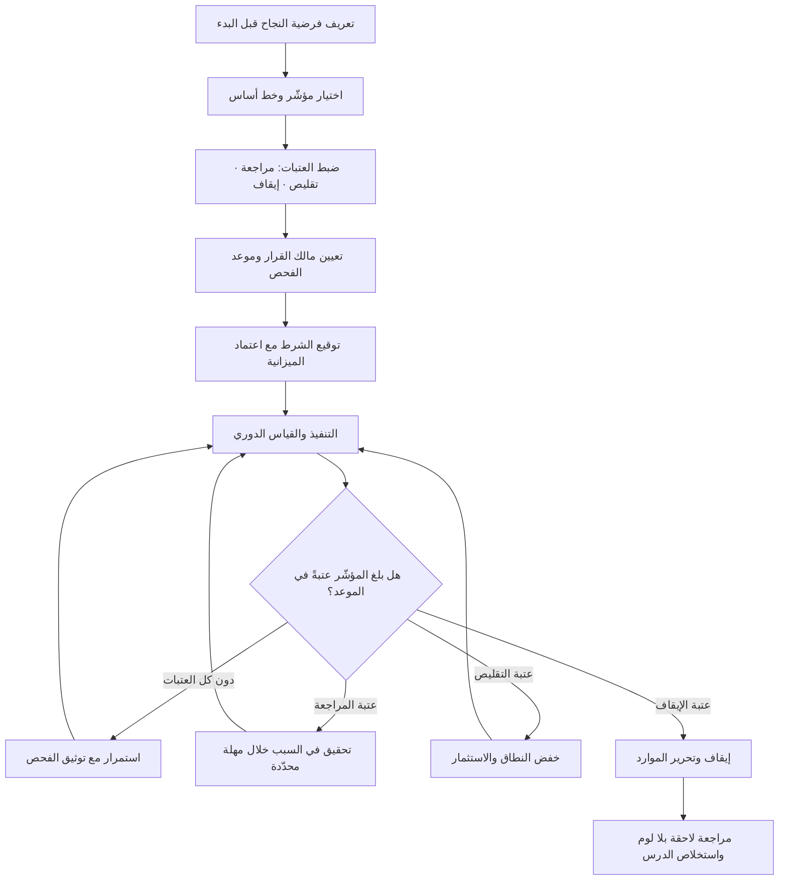

# شروط الإيقاف (Kill Criteria)

> [!info] تعريف مختصر
> شروط مكتوبة ومحدّدة سلفًا — بمؤشّر وعتبة رقمية وموعد فحص ومالك قرار — يُتّفق عليها **قبل** بدء المبادرة، وتعني: إن تحقّق هذا الشرط فإننا نوقف أو نعيد التقييم إجباريًّا، بغضّ النظر عن شعورنا حينها. جوهرها ليس التشاؤم ولا الحدّ من الطموح، بل نقل قرار الاستمرار من لحظة يكون فيها الحكم مشوّشًا بالالتزام والاستثمار المُنفَق وضغط الوجوه الحاضرة، إلى لحظة سابقة يكون فيها العقل باردًا والمصلحة الشخصية غير متورّطة. هي بهذا المعنى **عقد يوقّعه فريق اليوم لحماية فريق الغد من نفسه**.

## الشرح العلمي والاحترافي
- **المشكلة التي تحلّها: تكلفة غارقة وتصعيد التزام**: حين يكون قد صُرف على المبادرة وقت ومال وسمعة، يصبح قرار الإيقاف مؤلمًا نفسيًّا لأن الإيقاف يُقرأ اعترافًا بخطأ سابق. فيميل الفريق إلى ضخّ موارد إضافية لتبرير ما أُنفق — وهو نمط موثّق في أدبيات علم النفس الاقتصادي باسم مغالطة التكلفة الغارقة وتصعيد الالتزام. شرط الإيقاف المكتوب سلفًا يفصل قرار «هل نستمر؟» عن سؤال «هل كنّا مخطئين؟».
- **لماذا كتابته لاحقًا لا تُجدي — وهذه هي النقطة المركزية**: بعد بدء العمل تتغيّر البيئة الإدراكية للقرار تغيّرًا يجعل أي معيار يُصاغ حينها مصابًا في أصله:
  ① **تلوّث المعيار بالنتيجة المعروفة**: من يكتب الشرط وهو يرى الأرقام الحالية سيختار — بلا سوء نيّة — عتبة تقع أسفل ما تحقّق فعلًا، فيولد المعيار وقد استوفي مسبقًا.
  ② **تكلفة اجتماعية غير متماثلة**: اقتراح شرط إيقاف قبل البدء نضج مهني، واقتراحه بعد ستة أشهر من العمل يُقرأ اتّهامًا لمن قاد الجهد. فتُصاغ الشروط مخفَّفة حتى لا تجرح أحدًا.
  ③ **قابلية التبرير اللانهائية**: كل رقم سيّئ يجد تفسيرًا ظرفيًّا مقنعًا في حينه (كان موسمًا، تغيّر الفريق، الحملة تأخّرت). المعيار الذي كُتب قبل معرفة الظروف يقاوم هذه التبريرات لأنه لم يُصمَّم لتفاديها.
  ④ **غياب المرجع المحايد**: قبل البدء يكون النقاش عن «ماذا سيعني النجاح؟»، وبعد البدء يصبح عن «هل نلغي عمل فلان؟». وهما نقاشان مختلفان تمامًا وإن استُعملت فيهما الكلمات نفسها.
  والخلاصة العملية: شرط إيقاف يُكتب بعد رؤية النتائج ليس شرط إيقاف، بل **تسويغ متأخّر لقرار اتُّخذ سلفًا**.
- **بنية الشرط الصالح**: أي شرط يفتقد أحد هذه العناصر الأربعة يسهل الالتفاف عليه — مؤشّر واحد لا لبس في قياسه، عتبة رقمية صريحة، موعد فحص محدّد بالتاريخ، ومالك يملك صلاحية الإيقاف فعلًا. صياغة «إن لم يتحسّن التبنّي بشكل كافٍ» ليست شرطًا؛ صياغة «إن لم يتجاوز التفعيل الأسبوعي 200 حساب نشط بحلول 15 نوفمبر، يوقف مالك المنتج المسار ويعرض على اللجنة» شرط.
- **الإيقاف ليس النتيجة الوحيدة**: يُفضَّل تعريف ثلاثة مستويات بدل ثنائية استمرار/إلغاء — عتبة **مراجعة** تُطلق تحقيقًا، وعتبة **تقليص** تخفض الاستثمار إلى الحد الأدنى، وعتبة **إيقاف** تُنهي المسار. هذا التدرّج يجعل تبنّي الأداة مقبولًا سياسيًّا ويمنع تحويلها إلى مقصلة يخافها الجميع فيتجنّبونها.
- **علاقتها بالتجريب المنضبط**: في منطق [[Lean Startup]] و[[Hypothesis]]، لا معنى لتجربة بلا معيار فشل مسبق؛ فالتجربة التي «تنجح دائمًا» ليست تجربة بل عرض ترويجي. لهذا تُكتب شروط الإيقاف مقترنة بكل [[Proof of Concept]] و[[Pilot Launch]] و[[Fake Door Test]].
- **أثرها على تخصيص الموارد**: القيمة الحقيقية لشرط الإيقاف ليست في المبادرة التي أُوقفت، بل في **الموارد المحرَّرة** التي انتقلت إلى فرصة أعلى عائدًا. المؤسسات التي لا توقف شيئًا تُراكم محفظة من المشاريع نصف الحيّة تستهلك [[Capacity]] وتخنق كل جديد.
- **الإيقاف الصحيح ليس فشلًا بل حصاد معلومة**: حين يُفعَّل الشرط في وقته، تكون المؤسسة قد اشترت معرفة يقينية بثمن محدود بدل ثمن مفتوح. وهذا يربط المصطلح مباشرة بمنطق [[Intelligent Failure]] وبـ[[Cost of Experimentation]].
- **شرط بقائها فعّالة: أمان نفسي حقيقي**: إن كان تفعيل شرط الإيقاف يعني في الواقع الثقافي للمؤسسة أن يُوصم صاحب المبادرة بالفشل، فستُدفن الشروط أو تُصاغ بحيث لا تُفعَّل أبدًا. لذلك تُقرأ هذه الأداة دائمًا بجوار [[Psychological Safety]].

## أين ومتى يُستخدم
- **مع كل إثبات مفهوم أو تجربة**: تُكتب في وثيقة [[Proof of Concept]] نفسها، فلا تُعتمد التجربة إن لم تتضمّن تعريفًا صريحًا لما يعني فشلها.
- **في بوابات القرار المرحلية**: كمعيار موضوعي يُحتكم إليه في [[Go or No-Go Decision]] بدل الانطباع العام والحماس اللحظي.
- **في الإطلاقات التدريجية**: مع [[Pilot Launch]] و[[Staging vs Production Environment]]، حيث تُربط شروط الإيقاف بمؤشّرات تشغيلية مثل [[MTTR]] و[[Escaped Defect Rate]] وتُقرن بخطة [[Rollback]] جاهزة.
- **في إدارة المخاطر النشطة**: تُسجَّل الشروط في [[Risk Register]] و[[RAID Log]] كاستجابة محدّدة سلفًا للمخاطر عالية الأثر، لا كملاحظة عامة.
- **في العلاقات التعاقدية**: كنقاط خروج مرتبطة بـ[[Milestone-based Payment]] و[[SLA]]، تحمي الطرفين من استمرار ارتباط ميّت.
- **في مخرجات جلسة [[Pre-mortem]]**: أسباب الفشل التي لا يمكن منعها مسبقًا تُحوَّل إلى شروط إيقاف ومؤشّرات إنذار مبكّر ([[Guard Rails]]).

## مثال وسيناريو تطبيقي
> [!example] بنك رقمي في الخليج قرّر إطلاق مساعد محادثة لخدمة العملاء، بميزانية مرحلة أولى 850 ألف ريال ومدّة 4 أشهر. قبل البدء أصرّت لجنة الاستثمار على ثلاثة شروط مكتوبة في وثيقة الاعتماد، وُقّعت مع الميزانية في اليوم نفسه:
> ① **شرط الجودة**: إن تجاوزت نسبة الإجابات الخاطئة التي يرصدها فريق المراجعة البشرية 4% من العيّنة الأسبوعية (200 محادثة) في ثلاثة أسابيع متتالية بعد نهاية الشهر الثاني — إيقاف فوري للتوسّع.
> ② **شرط القيمة**: إن لم تنخفض نسبة المحادثات المُصعَّدة إلى موظف بشري إلى ما دون 55% بحلول نهاية الشهر الرابع (خط الأساس 78%) — تقليص المشروع إلى نطاق الاستفسارات البسيطة فقط.
> ③ **شرط الكلفة**: إن تجاوزت كلفة الاستدلال 2.1 ريال لكل محادثة مكتملة بعد جولتَي تحسين — مراجعة إلزامية للجدوى الاقتصادية ([[Inference Cost]]).
> في الأسبوع الحادي عشر بلغت نسبة الخطأ 6.3% ثم 5.8% ثم 6.1%. الفريق كان قد صرف بالفعل 61% من الميزانية، وكان لدى الجميع رواية مقنعة: «البيانات المرجعية لم تكتمل بعد»، «المراجعون متشدّدون»، «الأسبوع الأخير كان فيه تحديث». وهي روايات ليست كاذبة بالضرورة.
> لكن الشرط كان مكتوبًا قبل أن يعرف أحد هذه الظروف، وموقّعًا من نفس اللجنة. فتوقّف التوسّع، وأُعيد تحجيم النطاق إلى ثلاث فئات استفسارات محدّدة ذات إجابات قاطعة (رصيد، فروع، حالة بطاقة) بدل 19 فئة. أُنفقت بقية الميزانية على هذا النطاق الضيّق، فبلغت نسبة الخطأ 1.2% وانخفض التصعيد في هذه الفئات وحدها من 78% إلى 34%.
> الملاحظة التي سجّلها مدير المشروع في [[Decision Log]]: لو لم يكن الشرط مكتوبًا سلفًا، لكان النقاش في الأسبوع الحادي عشر عن «هل المراجعون متشدّدون؟» بدل «هل نلتزم بما اتّفقنا عليه؟» — ولكان الأرجح أن يستمر التوسّع ستة أسابيع إضافية على أمل تحسّن لم يكن قادمًا.

## خطوات أو مخطّط
1. **حدّد فرضية النجاح أولًا**: لا يمكن تعريف الإيقاف قبل تعريف ما تحاول إثباته. اكتب: نعتقد أن [كذا] سيحدث، وسنعرف ذلك عبر [مؤشّر].
2. **اختر مؤشّرًا واحدًا مقاومًا للتلاعب**: يُفضَّل مؤشّر نتيجة لا مؤشّر نشاط ([[Outcome vs Output]])، ويُتحقّق من أن مصدر بياناته موجود فعلًا اليوم لا «سنبنيه لاحقًا».
3. **حدّد خط الأساس الحالي**: بلا خط أساس تصبح كل عتبة اعتباطية وقابلة للجدل عند أول خلاف.
4. **اضبط العتبة الرقمية والمدّة**: اذكر الرقم وعدد الفترات المتتالية اللازمة لاعتباره إشارة لا ضجيجًا؛ فترة واحدة سيّئة قد تكون تقلّبًا طبيعيًّا.
5. **عرّف ثلاثة مستويات**: مراجعة، تقليص، إيقاف — بعتبات متدرّجة، حتى لا يكون القرار ثنائيًّا قاسيًا.
6. **عيّن مالك القرار وموعد الفحص**: اسم شخص بعينه وتاريخ في التقويم، لا «اللجنة عند الحاجة». الشرط بلا موعد فحص لا يُفحص أبدًا.
7. **وثّق الشرط في مستند الاعتماد نفسه**: يُوقَّع مع الميزانية لا في ملف جانبي، ويُنسخ إلى [[Risk Register]] و[[Decision Log]].
8. **اتّفق مسبقًا على ما يحدث عند التفعيل**: أين تذهب الموارد؟ من يبلّغ من؟ ما مصير ما بُني؟ الغموض هنا هو ما يجعل الإيقاف مؤلمًا لاحقًا.
9. **افحص في الموعد ولو بدت المؤشّرات جيدة**: الفحص الملتزم به في الحالات الجيدة هو ما يمنح الأداة مصداقيتها في الحالات السيّئة.
10. **عند التفعيل، نفّذ ثم حلّل**: أوقف أولًا وفق المتّفق عليه، ثم أدر [[Blameless Postmortem]] لاستخلاص الدرس — لا العكس، لأن التحليل قبل التنفيذ يتحوّل غالبًا إلى تفاوض على المعيار.

## ⚠️ مفاهيم خاطئة شائعة
> [!warning]
> - **الظنّ أنها إعلان نيّة للفشل**: كتابة شرط الإيقاف لا تعني توقّع الفشل، بل تعني الاعتراف بأن المستقبل غير معروف وأن قرار الاستمرار يجب أن يُبنى على دليل لا على استمرارية الجهد. الفرق الناضجة تكتبها لأكثر مبادراتها ثقةً أيضًا.
> - **اعتبار «سنراجع الوضع بعد ثلاثة أشهر» شرط إيقاف**: هذه مواعدة لا معيار. المراجعة بلا عتبة محدّدة سلفًا تنتهي غالبًا إلى استمرار، لأن الافتراض الضمني في أي مراجعة مفتوحة هو أن الأصل هو المضيّ قدمًا.
> - **الخلط بينها وبين حدود المخاطرة أو تجاوز الميزانية**: تجاوز الميزانية عرض مالي قد يُعالَج بتمويل إضافي. شرط الإيقاف يتعلّق بـ**بطلان الفرضية** التي قام عليها المشروع — وهذا لا يُعالَج بالمال.
> - **الاعتقاد بأن الشرط يُلزم دائمًا بالإلغاء عند تحقّقه**: القاعدة العملية الأسلم أن تحقّق الشرط **يُلزم بإيقاف الإنفاق وعقد قرار واعٍ موثّق**، لا أن ينفّذ الإلغاء آليًّا. ما يُمنع هو الانزلاق الصامت بلا قرار، لا التفكير عند نقطة القرار.
> - **افتراض أن مؤشّرًا واحدًا يكفي دائمًا**: مؤشّر وحيد قابل للتحسين المصطنع؛ والحل ليس عشرة مؤشّرات (فتُشلّ الأداة) بل مؤشّر رئيسي واحد مع مؤشّر حارس يمنع تحسينه على حساب شيء آخر.
> - **الظنّ أن تعديل الشرط ممنوع مطلقًا**: التعديل جائز إذا تغيّرت المعطيات الجوهرية، لكن بشرطين: أن يُوثَّق التعديل بسببه وتاريخه في [[Decision Log]]، وأن يوافق عليه من اعتمده أصلًا. ما يُفسد الأداة هو التعديل الصامت لحظة اقتراب العتبة.

## ❌ ممارسات خاطئة في المشاريع
> [!failure]
> - **الخطأ: كتابة شروط الإيقاف بعد ظهور النتائج الأولى**. لماذا يضرّ: تُصاغ العتبة تحت ما تحقّق فعلًا فتُستوفى لحظة كتابتها، ويتحوّل المعيار إلى تسويغ لقرار مُتّخذ سلفًا لا إلى ضابط له. الحل: اجعل وجود شروط إيقاف مكتوبة شرطًا شكليًّا لاعتماد أي ميزانية، ووقّعها في وثيقة الاعتماد نفسها.
> - **الخطأ: صياغة الشرط بألفاظ نوعية فضفاضة («إن لم يلقَ قبولًا جيدًا»)**. لماذا يضرّ: كل طرف يفسّره بما يخدم موقفه عند الخلاف، فيسقط الشرط في أول اجتماع متوتّر. الحل: اشترط في كل معيار مؤشّرًا وعتبة رقمية وموعدًا ومالكًا، وارفض أي صياغة تفتقد أحدها.
> - **الخطأ: تعليق صلاحية الإيقاف بيد من يقود المبادرة وحده**. لماذا يضرّ: تضارب مصالح بنيوي — الشخص نفسه يُقيَّم بنجاح المبادرة ويُطلب منه إعلان موتها. الحل: اجعل مالك قرار الإيقاف جهة راعية أعلى ([[Sponsor]] أو [[Steering Committee]])، مع بقاء رصد المؤشّر مسؤولية الفريق.
> - **الخطأ: تفعيل الشرط ثم معاقبة الفريق**. لماذا يضرّ: أول مرّة يُعاقَب فيها فريق على إيقاف ملتزم بالقواعد، تتعلّم المؤسسة كلها أن الشروط فخّ يجب تجنّبه، فتُصاغ بعدها شروط لا تُفعَّل أبدًا. الحل: افصل تقييم **جودة القرار والالتزام بالمنهج** عن تقييم **النتيجة**، واحتفِ علنًا بأول إيقاف منضبط.
> - **الخطأ: ترك الشرط في محضر اجتماع دون موعد فحص في التقويم**. لماذا يضرّ: لا أحد يتذكّر فحصه، ويستمر الإنفاق بالقصور الذاتي حتى تنفد الميزانية بدل أن ينتهي المشروع بقرار. الحل: احجز موعد الفحص في التقويم لحظة اعتماد الشرط، واجعله بندًا ثابتًا في تقرير حالة المشروع ([[Project Health Report]]).
> - **الخطأ: عدم تحديد مصير الموارد والأصول عند الإيقاف**. لماذا يضرّ: يقاوم الفريق الإيقاف خوفًا على وظائفه ومكانته لا اقتناعًا بجدوى المشروع، فيتحوّل النقاش الفنّي إلى صراع بقاء. الحل: اكتب مسبقًا إلى أين ينتقل الفريق وما الذي يُعاد استخدامه من المخرجات، واجعل ذلك جزءًا من نص الشرط.
> - **الخطأ: اعتبار الاستمرار خيارًا افتراضيًّا لا يحتاج إلى دليل**. لماذا يضرّ: يقلب عبء الإثبات، فيصبح على المعترض أن يبرهن وجوب الإيقاف بدل أن يبرهن المستمرّ استحقاق التمويل التالي. الحل: اعتمد منطق التمويل على مراحل — كل شريحة تمويل تُصرف مقابل دليل جديد، لا مقابل استمرار النشاط.

## 🔗 مصطلحات ومفاهيم ذات صلة
[[Pre-mortem]] | [[Intelligent Failure]] | [[Blameless Postmortem]] | [[Go or No-Go Decision]] | [[Decision Log]] | [[Hypothesis]] | [[Proof of Concept]] | [[Pilot Launch]] | [[Lean Startup]] | [[Cost of Experimentation]] | [[Risk Register]] | [[Guard Rails]] | [[Sponsor]] | [[Steering Committee]] | [[Outcome vs Output]]
