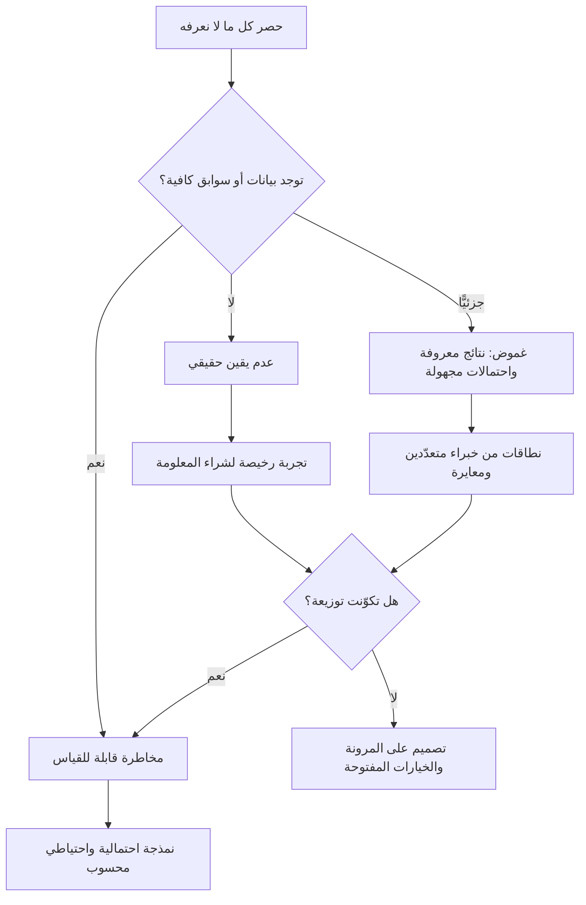

# عدم اليقين النايتي (Knightian Uncertainty)

> [!info] تعريف مختصر
> تمييز اقتصادي كلاسيكي بين حالتين تُخلطان عادة تحت كلمة واحدة: **المخاطرة (Risk)** حيث النتائج المحتملة معروفة ويمكن نسبة احتمالات إليها فتُحسب وتُسعَّر وتُؤمَّن؛ و**عدم اليقين (Uncertainty)** حيث لا توجد توزيعة احتمالية معلومة أصلًا — قد تجهل الاحتمالات، بل قد تجهل قائمة النتائج الممكنة نفسها. المصطلح يُنسب إلى الاقتصادي الأمريكي **فرانك نايت (Frank Knight)** في أطروحته المنشورة سنة 1921 بعنوان *Risk, Uncertainty and Profit*. وأثره العملي حاسم في إدارة المشاريع: أدوات الحساب الاحتمالي مشروعة في نطاق المخاطرة، أما في نطاق عدم اليقين فالأدوات المناسبة مختلفة كليًّا — التجريب الرخيص، والخيارات المفتوحة، والقرارات القابلة للتراجع، والاحتياطي.

## الشرح العلمي والاحترافي
- **الأصل والسياق**: طرح فرانك نايت التمييز في سياق سؤال اقتصادي محدّد: لماذا يوجد ربح لرائد الأعمال أصلًا إذا كانت المنافسة تُفني الأرباح؟ وكانت إجابته أن ما يمكن حسابه احتماليًّا يمكن التأمين عليه وتسعيره، فيتحوّل إلى بند تكلفة عادي لا مصدر ربح. أما الربح الحقيقي فمقابل تحمّل ما **لا يمكن حسابه** — أي عدم اليقين بالمعنى الدقيق. هذه الملاحظة تفسّر لماذا تُدفع علاوات كبيرة لمن يقود مبادرات غامضة، ولا تُدفع لمن يدير عملية معلومة الاحتمالات.
- **الفرق التشغيلي بدقّة**: في حالة المخاطرة تعرف **فضاء النتائج** و**احتمال كل نتيجة** (رمي نرد، معدّل أعطال تاريخي، انحراف زمني لمهمة تكرّرت مئة مرة). في حالة عدم اليقين قد تعرف النتائج ولا تعرف احتمالاتها، أو — وهي الحالة الأصعب — لا تعرف قائمة النتائج أصلًا؛ وهذه الأخيرة تُسمّى أحيانًا «المجهول غير المعروف» (Unknown Unknowns).
- **ثلاث درجات لا درجتان**: من المفيد عمليًّا التمييز بين ثلاث حالات: (١) **مخاطرة قابلة للقياس** لها بيانات تاريخية كافية؛ (٢) **غموض (Ambiguity)** حيث فضاء النتائج معروف لكن الاحتمالات مجهولة أو محل خلاف بين الخبراء؛ (٣) **عدم يقين حقيقي** حيث حتى فضاء النتائج غير مكتمل. كل درجة تستدعي أدوات مختلفة، والخطأ الإداري الشائع هو معاملة الثلاث بأداة واحدة.
- **لماذا يخطئ الفريق التصنيف**: لأن الأدوات الاحتمالية مريحة نفسيًّا وتُنتج أرقامًا تبدو دقيقة. حين يُطلب من فريق «احتمال» لحدث لم يقع من قبل، فإنه يمنح رقمًا لأن النموذج يطلب خانة، لا لأن الرقم مُستحق. النتيجة أرقام في [[Risk Register]] و[[Probability and Impact Matrix]] تحمل دقّة زائفة، وتُبنى عليها قرارات كأنها محسوبة.
- **الأدوات الصالحة لكل نطاق**: في نطاق المخاطرة تعمل [[Monte Carlo Simulation]] و[[Estimation Variance]] و[[Contingency Reserve]] المحسوب و[[Percentiles and Median vs Average]] عملًا مشروعًا لأنها تفترض توزيعة. أما في نطاق عدم اليقين فالمنطق ينقلب من «احسب ثم التزم» إلى **«اشترِ معلومة وأبقِ خياراتك مفتوحة»**: تجارب صغيرة رخيصة، ونماذج أوّلية ([[Proof of Concept]] و[[Prototype]])، وتقسيم المسار إلى قرارات قابلة للتراجع ([[Reversible vs Irreversible Decisions]])، واحتياطي إداري يقرّه الراعي لا يُشتقّ من معادلة.
- **الرافعة العملية: تحويل عدم اليقين إلى مخاطرة**: الغاية ليست البقاء في الغموض بل تقليصه. كل تجربة أو نموذج أوّلي أو إطلاق تجريبي ([[Pilot Launch]]) هو في جوهره **شراء بيانات** تُنشئ توزيعة حيث لم تكن. هكذا يُصاغ سؤال التخطيط الأنفع: ما أرخص تجربة تنقل هذا البند من خانة «لا نعرف» إلى خانة «نعرف بتقريب مقبول»؟
- **عدم اليقين المعرفي مقابل الأصيل**: بعض الجهل قابل للإزالة بمزيد من الدراسة (لا نعرف سعة الخادم لأننا لم نختبر بعد)، وبعضه أصيل في النظام ولن يزول بأي دراسة (سلوك السوق بعد سنتين، قرار جهة تنظيمية لم تُصدره بعد، مخرجات نموذج غير حتمي كما في [[Non-determinism]]). صرف ميزانية بحث على النوع الثاني هدر؛ ما يناسبه هو التصميم على المرونة والاحتياطي.
- **الأثر على العقود والتسعير**: العمل عالي عدم اليقين يُسعَّر بشكل رديء في عقود السعر الثابت، لأن الطرف المنفّذ يضيف علاوة عمياء أو يقبل خسارة محتملة. لذلك تميل الممارسة الناضجة إلى ربط نمط العقد بدرجة عدم اليقين: مراحل استكشاف بأجر زمني ثم مراحل تنفيذ بسعر ثابت بعد أن تنكشف المجاهيل — وهو ما يتّصل مباشرة بـ[[Milestone-based Payment]] و[[SOW]].

## أين ومتى يُستخدم
- **عند بناء [[Risk Register]] و[[RAID Log]]**: لتصنيف كل بند بحسب ما إذا كان قابلًا للتقدير الاحتمالي أم لا، وعدم إجبار البنود الغامضة على خانة رقمية.
- **عند تحديد حجم [[Contingency Reserve]] واحتياطي الإدارة**: الاحتياطي المحسوب يُشتقّ من توزيعة، أما احتياطي الإدارة فوجوده مبرَّر تحديدًا بعدم اليقين غير القابل للحساب.
- **في قرارات دخول سوق أو منتج جديد** ([[Product-Market Fit]], [[Go-to-Market]], [[Market Entry Modes]]): حيث لا توجد بيانات تاريخية أصلًا، فتكون التجربة المحدودة أرخص من الدراسة الطويلة.
- **في المبادرات القائمة على نماذج توليدية** ([[Hallucination]], [[Evals]], [[Inference Cost]]): مخرجات النموذج وتكاليفه وسلوك المستخدم معها كلها مناطق عدم يقين مبكّرة، تُقلَّص بالتقييم المنهجي لا بالتقدير.
- **عند التخطيط الزمني لمشروع بلا سوابق**: يُستعاض عن رقم واحد بنطاق صريح ومراجعة دورية، وتُوسَّع نافذة إعادة التخطيط عند كل كشف جديد.
- **في مراجعات [[Go or No-Go Decision]]**: لطرح سؤال «هل ما زلنا في نطاق عدم اليقين؟» — فإن كنّا كذلك، فالقرار الصحيح غالبًا ليس «نعم/لا» بل «تجربة أخرى محدودة».

## مثال وسيناريو تطبيقي
> [!example] شركة تقنية سعودية تطلق منصّة اشتراك جديدة موجّهة للمنشآت الصغيرة. جدول المشروع 9 أشهر، والميزانية 4.5 مليون ريال. وضع مدير المشروع 18 بندًا في سجل المخاطر، وأعطى كل بند احتمالًا ونسبة أثر، وحسب احتياطيًّا قدره 12% من الميزانية.
> في مراجعة الربع الأول، أعاد الفريق تصنيف البنود بمنطق نايت فظهرت صورتان مختلفتان تمامًا:
> — **بنود مخاطرة حقيقية (11 بندًا)**: تأخّر تسليم مورّد سبق التعامل معه في 6 مشاريع، وأعطال بيئة الاختبار، وانحراف تقديرات التطوير. لهذه بيانات تاريخية داخلية، فحُسبت لها نطاقات عبر [[Monte Carlo Simulation]] وخرج احتياطي زمني موثّق قدره 5 أسابيع عند المئين الثمانين.
> — **بنود عدم يقين (7 بنود)**: هل تقبل المنشآت الصغيرة نموذج الاشتراك الشهري أصلًا؟ ما تكلفة الاستدلال الفعلية لميزة المساعد الذكي عند 10 آلاف مستخدم؟ هل ستصدر الجهة التنظيمية اشتراطًا جديدًا لتوطين البيانات؟ لهذه البنود كانت الأرقام في السجل مُختلقة فعليًّا؛ لم يكن خلفها أي بيانات.
> القرار: أُلغيت الأرقام الوهمية واستُبدلت بخطة شراء معلومات. اختُبر قبول نموذج الاشتراك عبر [[Fake Door Test]] على 400 منشأة خلال 3 أسابيع بتكلفة 60 ألف ريال، فتبيّن أن التسعير الشهري المقترح يرفضه أغلب المستهدفين لصالح دفع سنوي مخفَّض. وقُيست تكلفة الاستدلال بتجربة حمل محدودة كشفت أن التقدير الأول كان أقل من الواقع بمقدار الضعف. أما البند التنظيمي فبقي غير قابل للقياس، فعولج بتصميم معماري يسمح بترحيل البيانات إلى مركز محلي دون إعادة بناء — أي بشراء **خيار** لا بشراء يقين.
> الأثر: تغيّر نموذج التسعير قبل كتابة سطر واحد من كود الفوترة، وتفادت الشركة إعادة بناء تُقدَّر بأربعة أشهر لو اكتُشف الأمر بعد الإطلاق.

## خطوات أو مخطّط
1. اجمع كل بنود عدم المعرفة في المشروع في قائمة واحدة، بلا تصنيف مسبق.
2. اسأل عن كل بند سؤالًا واحدًا: **هل لديّ بيانات أو سوابق كافية لبناء توزيعة؟**
3. صنّف البند: مخاطرة قابلة للقياس · غموض (نتائج معروفة واحتمالات مجهولة) · عدم يقين حقيقي.
4. للمخاطرة: احسب النطاق واشتقّ الاحتياطي، وسجّله في [[Risk Register]] بمصدر بياناته.
5. للغموض: استشر خبراء متعدّدين واحصل على نطاقات متباينة، وعامل التباين نفسه كإشارة لا كإزعاج.
6. لعدم اليقين: صمّم أرخص تجربة تكشف المجهول، وحدّد لها ميزانية وسقفًا زمنيًّا مسبقًا.
7. أعد التصنيف بعد كل تجربة؛ البند الذي انتقل إلى خانة المخاطرة يدخل الحساب الاحتمالي.
8. لما يبقى غير قابل للتقليص: صمّم على المرونة (خيارات معمارية، عقود مرنة، احتياطي إداري) لا على الدقّة.

## ⚠️ مفاهيم خاطئة شائعة
> [!warning]
> - **اعتبار عدم اليقين مجرّد مخاطرة كبيرة**: الفرق ليس في الحجم بل في **الطبيعة**. مخاطرة ضخمة تظلّ قابلة للحساب والتأمين، وعدم يقين صغير قد يستعصي على أي معادلة. الخلط بينهما يقود إلى استعمال المسطرة الخطأ.
> - **الظنّ بأن الرقم يجعل البند مخاطرة**: كتابة «احتمال 30%» أمام حدث لم يقع من قبل لا تُنشئ توزيعة، بل تُنشئ وهم دقّة. القاعدة: كل احتمال في السجل يجب أن يكون له مصدر — بيانات تاريخية، أو تقدير خبير مُعاير صراحةً ([[Calibration]])، ويُكتب المصدر بجانبه.
> - **افتراض أن عدم اليقين يعني الشلل**: النتيجة العملية لعدم اليقين ليست التوقّف بل تغيير نوع الحركة: خطوات أصغر، والتزامات أقصر، وقرارات أكثر قابلية للتراجع.
> - **الخلط بينه وبين تقلّب البيانات (Volatility)**: التقلّب صفة لتوزيعة معروفة عالية الانتشار، وهو مخاطرة لا عدم يقين. سلسلة بيانات متذبذبة لكن مقيسة تُدار بالإحصاء، لا بالتجريب الاستكشافي.
> - **اعتقاد أن جمع مزيد من البيانات يُزيل كل عدم يقين**: بعض عدم اليقين أصيل ولن يزول بأي بحث (قرار جهة تنظيمية لم يُتّخذ بعد، سلوك سوق مستقبلي). صرف الوقت عليه هدر، وعلاجه المرونة لا المعرفة.
> - **حصر المفهوم في السلبيات**: عدم اليقين يشمل نتائج أفضل من المتوقّع أيضًا. المشاريع التي تُغلق فضاء المفاجآت بالكامل تُلغي معه فرص الاكتشاف التي تبرّر المبادرة أصلًا.

## ❌ ممارسات خاطئة في المشاريع
> [!failure]
> - **إجبار كل بند في سجل المخاطر على رقم احتمالي**: يُنتج مصفوفة ملوّنة بلا قيمة معرفية، وقرارات مبنية على أرقام مُختلقة. الحل: أضف إلى السجل عمودًا لمصدر التقدير، واسمح صراحةً بقيمة «غير قابل للتقدير — يُعالج بتجربة».
> - **الالتزام بسعر ثابت وجدول ثابت في مرحلة استكشافية**: يحوّل عدم اليقين إلى نزاع تعاقدي حتمي عند أول انكشاف. الحل: افصل مرحلة الاستكشاف عن مرحلة التنفيذ في [[SOW]]، وسعّرها بنمط مختلف، واربط الانتقال بمعيار انكشاف معلن.
> - **صرف أشهر على دراسة سوق لحدث لا سوابق له**: تُنتج تقريرًا سميكًا بثقة عالية ودقّة منخفضة. الحل: استبدل جزءًا من الدراسة بتجربة ميدانية محدودة تشتري سلوكًا حقيقيًّا لا آراء.
> - **حرق كل الاحتياطي في الثلث الأول من المشروع**: يترك المشروع بلا وسادة تحديدًا حين تنكشف المجاهيل الكبرى. الحل: اربط صرف [[Contingency Reserve]] بنسبة الإنجاز وبموافقة معلنة، وراجع كفايته في كل مراجعة مرحلية.
> - **معاملة تباين آراء الخبراء بوصفه فوضى تُحسم بالمتوسّط**: أخذ متوسّط تقديرين متباعدين يُخفي أهمّ إشارة في الغرفة — أن النموذج الذهني نفسه محلّ خلاف. الحل: اعرض التباين كما هو، واستخرج مصدره، وصمّم تجربة تفصل بين النموذجين المتنافسين.
> - **إلغاء المبادرة عند أول اصطدام بعدم اليقين**: تُقتل الفرص عالية العائد لأنها لا تُقدَّم على شكل جدول محسوب. الحل: قدّم المبادرة كسلسلة رهانات صغيرة ذات سقف خسارة معلوم، لا كالتزام واحد كبير.
> - **إهمال إعادة التصنيف بمرور الوقت**: يبقى بند مصنّفًا «غير قابل للقياس» بعد أن صارت لدينا بيانات ستة أشهر. الحل: اجعل إعادة تصنيف بنود عدم اليقين بندًا ثابتًا في مراجعة كل مرحلة، ووثّق التحوّل في [[Decision Log]].

## 🔗 مصطلحات ومفاهيم ذات صلة
[[Base Rate]] | [[Calibration]] | [[Reversible vs Irreversible Decisions]] | [[First Principles Thinking]] | [[Data Informed vs Data Driven]] | [[Risk Register]] | [[Monte Carlo Simulation]] | [[Contingency Reserve]] | [[Estimation Variance]] | [[Probability and Impact Matrix]] | [[Non-determinism]]
