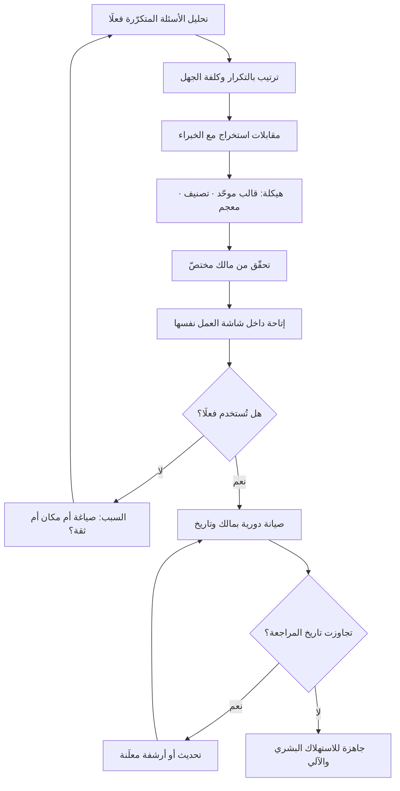

# إدارة المعرفة (Knowledge Management)

> [!info] تعريف مختصر
> الممارسة المنهجية التي تُحوِّل بها المؤسّسة ما تعرفه من حالة **ضمنية موزّعة في رؤوس أفرادها ومحادثاتهم** إلى حالة **صريحة مهيكلة مملوكة ومحدَّثة داخل النظام**، بحيث يستطيع من يحتاج المعرفة أن يجدها في لحظة حاجته إليها ويثق بأنها صحيحة اليوم. وقد أضاف صعود الوكلاء الذكيّة شرطًا ثانيًا لم يكن قائمًا من قبل: أن تكون المعرفة صالحة **للبشر وللنماذج معًا** — أي مكتوبة بلغة يفهمها الإنسان، ومهيكلة بصيغة يستطيع النظام استرجاعها والاستشهاد بها. المعرفة التي لا يجدها أحد ليست معرفة مؤسّسية، بل أرشيف.

## الشرح العلمي والاحترافي
- **الأصل النظري — التمييز بين الضمني والصريح**: يستند الحقل إلى تمييز فلسفي صاغه الكيميائي والفيلسوف **مايكل بولاني (Michael Polanyi)** في ستينيات القرن العشرين بعبارته المشهورة: «نحن نعرف أكثر ممّا نستطيع أن نقول». المعرفة الضمنية هي المهارة والحدس والسياق المكتسب بالممارسة، وهي تقاوم التدوين بطبيعتها. وقد بنى الباحثان اليابانيان **إيكوجيرو نوناكا (Ikujiro Nonaka)** و**هيروتاكا تاكيوتشي (Hirotaka Takeuchi)** على هذا التمييز في التسعينيات نموذجًا لخلق المعرفة التنظيمية يصف دورة تحوّل المعرفة بين حالتيها عبر أربعة أنماط: التشارك بالممارسة، والإخراج إلى صيغة صريحة، والدمج مع معرفة صريحة أخرى، ثم الاستبطان بالممارسة مجدّدًا. الفكرة المحورية: المعرفة المؤسّسية لا تُجمع، بل **تُخلق في دورة متكرّرة**.
- **هرم البيانات والمعلومات والمعرفة**: تُميَّز أربع طبقات: **بيانات** (وقائع خام: 47 بلاغًا)، و**معلومات** (بيانات في سياق: البلاغات ارتفعت 40% بعد الإصدار الأخير)، و**معرفة** (فهم قابل للتصرّف: هذا النمط يظهر عادةً حين نتخطّى اختبار التكامل، وعلاجه كذا)، و**حكمة** (حكم على ما ينبغي فعله في هذا السياق تحديدًا). أغلب ما تسمّيه المؤسّسات إدارة معرفة هو في الحقيقة إدارة وثائق عند الطبقة الثانية. الفارق العملي: الوثيقة تجيب عن «ماذا حدث»، أمّا المعرفة فتجيب عن «ماذا نفعل ولماذا، وما الذي جرّبناه وفشل».
- **دورة حياة المعرفة**: لكل قطعة معرفة دورة كاملة: **التقاط** (عند اللحظة لا بعد سنة)، ثم **هيكلة** (وضعها في قالب ثابت قابل للبحث)، ثم **تحقّق** (من مالك مختصّ)، ثم **إتاحة** (في مكان يصل إليه المحتاج في لحظة عمله)، ثم **صيانة** (مراجعة دورية)، ثم **إحالة إلى التقاعد** (وهي أكثر الخطوات إهمالًا). المعرفة القديمة غير الموسومة بتاريخ صلاحيتها أخطر من غياب المعرفة، لأنها تُتَّبع بثقة.
- **دور مهندس المعرفة (Knowledge Engineer)**: مصطلح قديم نشأ في أدبيات **الأنظمة الخبيرة (Expert Systems)** في سبعينيات وثمانينيات القرن العشرين، وكان يصف من يستخرج قواعد الخبراء البشريين ويصوغها في صورة قواعد رسمية يشغّلها النظام. وقد عاد المصطلح بقوّة مع أنظمة الذكاء الاصطناعي التوليدي بمعنى قريب لكنه أوسع: **الشخص المسؤول عن تحويل خبرة المؤسّسة الضمنية إلى بنية معرفية يستطيع البشر والوكلاء الاعتماد عليها**. وعمله عمليًّا أربعة أشياء: ① إجراء مقابلات استخراج مع الخبراء لانتزاع ما لا يكتبونه تلقائيًّا (خصوصًا الاستثناءات وقواعد الحكم)؛ ② تصميم **التصنيف والوسوم (Taxonomy)** وبنية الوثيقة الموحّدة حتى تكون المعرفة قابلة للاسترجاع الدقيق لا للبحث النصّي الأعمى؛ ③ ضبط الجودة والاتّساق وحلّ التعارض بين مصادر تقول أشياء مختلفة؛ ④ تهيئة المعرفة للاستهلاك الآلي: تقطيعها إلى وحدات ذات معنى، ووسمها بالبيانات الوصفية، وربطها بالمصدر ليكون الاستشهاد ممكنًا. الدور هجين بطبعه — نصفه تحرير ومقابلات، ونصفه تصميم معلومات وهندسة. وقد صار في الفرق التي تبني أنظمة [[AI-Native]] موقعًا مستقلًّا لا مهمّة جانبية، لأن جودة الإجابة تسقف عند جودة المعرفة المتاحة لا عند قدرة النموذج.
- **المعرفة للوكلاء تختلف في شكلها لا في مضمونها**: النص الذي يفهمه الموظّف الجديد قد يفشل مع نظام الاسترجاع لأسباب شكلية: وثيقة طويلة تخلط عشرة مواضيع تُقطَّع تقطيعًا يفسد المعنى؛ وضمائر تشير إلى فقرات بعيدة تفقد مرجعها عند التقطيع؛ وجداول بلا عناوين واضحة تُقرأ خطأً؛ ومصطلح واحد بأربع تسميات مختلفة يمنع المطابقة. لذلك تشترط الممارسة الحديثة: وثيقة واحدة لموضوع واحد، وعناوين وصفية، ومعجم موحّد للمصطلحات، وبيانات وصفية للتاريخ والمالك والنطاق. وهذا هو الجسر المباشر إلى [[Retrieval-Augmented Generation]] وإلى [[Context Engineering]].
- **المصدر الواحد للحقيقة شرط لا رفاهية**: حين توجد ثلاث نسخ متعارضة من سياسة واحدة، لا يخسر النظام الدقّة فحسب، بل يخسر الثقة — ومتى فقد المستخدمون الثقة عادوا إلى سؤال الزميل، فتموت المنظومة. لذلك يُعدّ [[Single Source of Truth]] الشرط البنيوي الأول، ويسبق أي استثمار في أدوات البحث أو النماذج.
- **العوائق الحقيقية سلوكية لا تقنية**: أكثر أسباب فشل مبادرات إدارة المعرفة شيوعًا ليست الأداة، بل: انعدام الحافز (المعرفة سلطة، ومشاركتها تُضعف موقع صاحبها المتصوَّر)، وغياب الوقت المخصّص (يُطلب التوثيق «إن تبقّى وقت» ولا يتبقّى)، وغياب الملكية (وثيقة بلا مالك تتقادم بلا مسؤول)، وانفصال مكان المعرفة عن مكان العمل (معرفة في نظام لا يفتحه أحد أثناء التنفيذ). ولذلك فإن أي علاج لا يمسّ الحوافز والسياسات علاجٌ للعرَض — وهي قراءة [[Systems Thinking]] المباشرة للمسألة.
- **المعرفة السلبية أثمن ما يُفقد**: تحتفظ المؤسّسات عادةً بما نجح، وتُهمل ما جُرِّب وفشل ولماذا. وهذه «المعرفة السلبية» هي التي تمنع إعادة ارتكاب الأخطاء المكلفة، وغيابها يجعل كل فريق جديد يدفع ثمن الدرس نفسه. ولهذا فإن [[Decision Log]] الذي يسجّل **البدائل المرفوضة وسبب رفضها** أثمن كثيرًا من محضر يسجّل القرار وحده.

## أين ومتى يُستخدم
- **عند تسليم المشروع للتشغيل**: إذ يقوم [[Closure vs Handover]] و[[Hypercare]] على انتقال المعرفة لا انتقال الملفات؛ وتسليم بلا معرفة تشغيلية موثّقة يُنتج اعتمادًا دائمًا على فريق المشروع بعد إغلاقه.
- **في مواجهة مخاطر تركّز المعرفة في أفراد**: حين يكون شخص واحد هو المرجع الوحيد لنظام أو عميل، تصبح المعرفة خطرًا يُسجَّل في [[Risk Register]] لا أصلًا يُفتخر به.
- **في بناء أنظمة الذكاء الاصطناعي المؤسّسية**: لأن أي [[AI Agent]] لا يتفوّق على المعرفة المتاحة له؛ والاستثمار في تهيئة المعرفة عادةً أعلى مردودًا من تبديل النموذج.
- **في تسريع تأهيل الموظّفين الجدد**: بقياس مباشر هو الزمن حتى أول مساهمة مستقلّة، وهو من أوضح مؤشّرات صحّة المنظومة المعرفية.
- **في توحيد الممارسة عبر الفرق**: عبر [[Organizational Process Assets]] و[[SOP]] و[[Docs as Code]] التي تُخضع الوثيقة لدورة مراجعة وإصدار كالكود تمامًا.
- **في المشاريع متعدّدة اللغات والأسواق**: حيث تتضاعف كلفة تشتّت المعرفة، وتظهر الحاجة إلى معجم موحّد وذاكرة موحّدة ([[Translation Memory]]) لضمان اتّساق المصطلح عبر النسخ.
- **في التعلّم من الحوادث**: إذ لا قيمة لمراجعة ما بعد الحادث إن لم تنتهِ إلى تعديل معرفة قابلة للاسترجاع في اللحظة التي يتكرّر فيها الموقف.

## مثال وسيناريو تطبيقي
> [!example] شركة تقنية في الرياض تدير منصّة اشتراكات، فريق دعمها 18 موظّفًا يتعاملون مع نحو 2,400 تذكرة شهريًّا. المشكلة: 34% من التذاكر تُصعَّد إلى مستوى ثانٍ، ومتوسّط زمن الحل 19 ساعة، وتأهيل الموظّف الجديد يستغرق 11 أسبوعًا حتى يعمل مستقلًّا. وعند تحليل التصعيدات تبيّن أن 71% منها ليست حالات معقّدة تقنيًّا، بل حالات **يعرف جوابها ثلاثة أشخاص فقط في الشركة**.
> **المحاولة الأولى**: اشترت الشركة منصّة قاعدة معرفة، وطلبت من الفريق «توثيق ما يعرفه». بعد ستة أشهر: 340 مقالة، ومعدّل فتح 0.4 مقالة لكل تذكرة، ونسبة التصعيد كما هي. أسباب الفشل عند المراجعة: المقالات كُتبت من ذاكرة الكتّاب لا من التذاكر الفعلية فعالجت أسئلة لا تُطرح؛ وعناوينها بلغة داخلية بينما يبحث الموظّف بلغة العميل؛ ولا مالك لأي مقالة فتقادم 40% منها بعد تغييرين في المنتج؛ والمنصّة منفصلة عن نظام التذاكر فتتطلّب مغادرة شاشة العمل.
> **إعادة البناء بمنهج هندسة المعرفة**: عُيِّن مهندس معرفة متفرّغ، وبدأ من الطلب لا من العرض. ① استخرج أكثر 60 نمط سؤال تكرارًا من تذاكر ستّة أشهر — فتبيّن أن 62% من الحجم يتركّز في 23 نمطًا فقط. ② أجرى مقابلات استخراج مع الخبراء الثلاثة، بمنهج يسأل عن الحالات الحدّية والاستثناءات وقواعد الحكم لا عن الخطوات المعتادة، لأن الخطوات المعتادة كانت موثّقة أصلًا والاستثناءات هي ما يُصعَّد. ③ صمّم قالبًا موحّدًا: العَرَض كما يصفه العميل / التحقّق السريع / الحل / متى لا ينطبق هذا الحل / إلى من يُصعَّد. ④ وسم كل وثيقة بمالك وتاريخ مراجعة إلزامي كل 90 يومًا، مع إشعار تلقائي وأرشفة ما لا يُراجَع. ⑤ ربط المعرفة بشاشة التذكرة نفسها بحيث تُقترح الوثائق المرشّحة عند فتح التذكرة، مع رابط المصدر ظاهرًا ليتحقّق الموظّف.
> **النتيجة بعد خمسة أشهر**: التصعيد 12%، ومتوسّط زمن الحل 6 ساعات، وزمن التأهيل 4 أسابيع. والمكسب غير المتوقّع: حين شغّلت الشركة لاحقًا مساعدًا ذكيًّا للدعم، لم يحتج المشروع إلى مرحلة تجهيز محتوى إطلاقًا — لأن المعرفة كانت أصلًا مهيكلة ومقطّعة وموسومة ومنسوبة إلى مصدر. مشروع كان مقدَّرًا له خمسة أشهر أُنجز في سبعة أسابيع.

## خطوات أو مخطّط
1. ابدأ من الطلب لا من العرض: حلّل الأسئلة التي تُطرح فعلًا (تذاكر، محادثات، تصعيدات) ورتّبها بالتكرار وبكلفة عدم المعرفة.
2. حدّد أين تتركّز المعرفة في أفراد بعينهم، وسجّل ذلك خطرًا صريحًا لا ملاحظة.
3. اختر نطاقًا أوّليًّا صغيرًا وعالي الأثر، ولا تحاول توثيق كل شيء دفعة واحدة.
4. أجرِ مقابلات استخراج تستهدف الاستثناءات وقواعد الحكم و«ما الذي جرّبتموه وفشل»، لا الخطوات المعتادة.
5. صمّم بنية موحّدة: قالب ثابت، وتصنيف ووسوم، ومعجم مصطلحات يمنع تعدّد التسميات للشيء الواحد.
6. اكتب لوحدة معنى واحدة في كل وثيقة، وتجنّب الإحالات الضمنية التي تفقد مرجعها عند التقطيع.
7. عيّن مالكًا لكل وثيقة وتاريخ مراجعة إلزاميًّا، مع سلوك تلقائي عند التقادم.
8. ضع المعرفة في مكان العمل نفسه لا في نظام منفصل يتطلّب قرارًا واعيًا بالذهاب إليه.
9. أدرج التقاط المعرفة داخل سير العمل ([[Workflow]]) كخطوة لها وقت مخصّص، لا كمهمّة تُؤجَّل.
10. قِس المنظومة بمؤشّرات استخدام وأثر: نسبة الأسئلة المجابة ذاتيًّا، وزمن التأهيل، ونسبة التصعيد، ونسبة الوثائق المتقادمة.

## ⚠️ مفاهيم خاطئة شائعة
> [!warning]
> - **اعتبارها مسألة أداة**: يُظنّ أن شراء منصّة توثيق يحلّ المشكلة. الأداة تحلّ مشكلة التخزين وحدها، بينما المشكلة الفعلية في الحوافز والملكية والصيانة وموضع المعرفة من سير العمل.
> - **الخلط بينها وبين إدارة الوثائق**: حفظ الملفات وترتيبها مسألة أرشيفية. إدارة المعرفة تُعنى بجاهزية المعرفة للاستخدام في لحظة القرار: هل تصل إلى المحتاج بلا بحث طويل؟ وهل يثق بأنها صحيحة اليوم؟
> - **افتراض إمكان تدوين كل معرفة**: جزء أصيل من الخبرة ضمني لا يُختزل إلى نص، ويُنقل بالممارسة والمرافقة والمراجعة المشتركة. الهدف تقليل الاعتماد على الضمني، لا ادّعاء إلغائه.
> - **الظنّ بأن الكمّ دليل صحّة**: عدد المقالات مقياس مضلّل تمامًا؛ ألف وثيقة نصفها متقادم أسوأ من مئة موثوقة، لأن التقادم يُفسد الثقة في المنظومة كلها لا في الوثيقة المتقادمة وحدها.
> - **اعتبار الوكلاء الذكيّة بديلًا عن إدارة المعرفة**: النموذج لا يُنشئ معرفة مؤسّسية غير موجودة؛ وإذا وُجّه إلى مصادر متعارضة ومتقادمة أنتج إجابات واثقة وخاطئة، فضاعف المشكلة بدل حلّها ([[Hallucination]]).
> - **الخلط بين مهندس المعرفة وكاتب المحتوى التقني**: الكاتب التقني يوثّق ما هو معروف بصياغة واضحة، ومهندس المعرفة **يستخرج** ما ليس مكتوبًا أصلًا ويصمّم البنية التي تجعله قابلًا للاسترجاع الدقيق آليًّا. الدوران متجاوران ومتكاملان، لكنهما ليسا واحدًا.
> - **الظنّ بأن المعرفة تُدار مركزيًّا فقط**: النموذج المركزي البحت يخلق طابورًا عند فريق التوثيق، والنموذج اللامركزي البحت يُنتج فوضى تسميات. الشائع نجاحه نموذج مختلط: مركز يملك البنية والمعايير والمعجم، وفرق تملك محتوى مجالها.

## ❌ ممارسات خاطئة في المشاريع
> [!failure]
> - **تأجيل التوثيق إلى نهاية المشروع**: يُخطَّط لمرحلة توثيق قبل الإغلاق. لماذا يضرّ: عند تلك اللحظة تكون الأسباب قد نُسيت وبقيت النتائج، فيُوثَّق «ماذا» بلا «لماذا» — وهو أضعف أنواع المعرفة وأسرعها تقادمًا. الحل: اجعل التقاط القرار وسببه جزءًا من الخطوة نفسها عبر [[Decision Log]].
> - **إنشاء وثائق بلا مالك ولا تاريخ صلاحية**: تُكتب المعرفة وتُنشر ثم تُترك. لماذا يضرّ: التقادم الصامت يُنتج قرارات خاطئة مبنية على سياسات ملغاة، وهو أخطر من غياب الوثيقة لأنه يحمل ثقة زائفة. الحل: لكل وثيقة مالك وتاريخ مراجعة إلزامي وسلوك أرشفة تلقائي عند التجاوز.
> - **قياس النجاح بعدد الوثائق أو ساعات التوثيق**: تُعرض لوحات بعدد المقالات المنشورة. لماذا يضرّ: يحفّز إنتاج محتوى بلا طلب ويزيد الضجيج فيصعب العثور على الصحيح. الحل: قِس الاستخدام والأثر — نسبة الأسئلة المجابة ذاتيًّا، وزمن التأهيل، ونسبة التصعيد.
> - **فصل مكان المعرفة عن مكان العمل**: تُوضع المعرفة في منصّة مستقلّة لا تُفتح إلا بقصد. لماذا يضرّ: الاحتكاك ولو كان نقرتين يكفي ليعود الموظّف إلى سؤال زميله، فتبقى المعرفة ضمنية رغم وجودها مكتوبة. الحل: أحضر المعرفة إلى شاشة التنفيذ عبر التكامل والاقتراح السياقي.
> - **توثيق المسار الناجح وإهمال الفشل والبدائل المرفوضة**: يُسجَّل القرار دون ما رُفض ولماذا. لماذا يضرّ: يعيد الفريق التالي تجربة الخيار نفسه ويدفع ثمنه من جديد. الحل: اشترط في كل قرار مهم تسجيل البدائل المرفوضة وسبب الرفض والافتراض الذي قد يقلبه.
> - **تعيين مهندس معرفة بلا صلاحية ولا وصول إلى الخبراء**: يُسنَد الدور لشخص يُطلب منه «تنظيم الوثائق» دون سلطة على المعايير ولا وقت مخصّص من الخبراء. لماذا يضرّ: يتحوّل الدور إلى تنسيق شكلي بينما تبقى المعرفة الحرجة حبيسة رؤوس المشغولين. الحل: امنح الدور ملكية المعايير والمعجم، واحجز وقت الخبراء صراحةً في خططهم.
> - **تشغيل نظام استرجاع فوق محتوى غير مهيّأ**: يُوجَّه النظام إلى مجلّدات مشتركة فيها نسخ متعدّدة ومسودّات. لماذا يضرّ: يستشهد بمسودّة أو بسياسة ملغاة بثقة كاملة، فيهدم ثقة المستخدمين في المشروع كله من أوّل خطأ. الحل: نظّف وحدّد المصادر المعتمدة وأرشف المسودّات قبل التشغيل، واجعل الاستشهاد بالمصدر إلزاميًّا وظاهرًا.
> - **معاملة مشاركة المعرفة كواجب أخلاقي بلا حوافز**: يُطلب من الخبراء التوثيق «من أجل الفريق» بينما التقييم والترقية يقيسان الإنجاز الفردي وحده. لماذا يضرّ: النظام يكافئ الاحتفاظ بالمعرفة ضمنيًّا فيستمرّ السلوك مهما تكرّرت المناشدات. الحل: أدرج مساهمة المعرفة وجودتها في معايير التقييم صراحةً، واحسبها ضمن سعة الفريق لا خارجها.

## 🔗 مصطلحات ومفاهيم ذات صلة
[[Context Engineering]] | [[AI-Native]] | [[Workflow]] | [[Systems Thinking]] | [[Single Source of Truth]] | [[Retrieval-Augmented Generation]] | [[Organizational Process Assets]] | [[Decision Log]] | [[Docs as Code]] | [[SOP]] | [[AI Agent]] | [[Hallucination]] | [[Hub and Spoke Content Model]]
