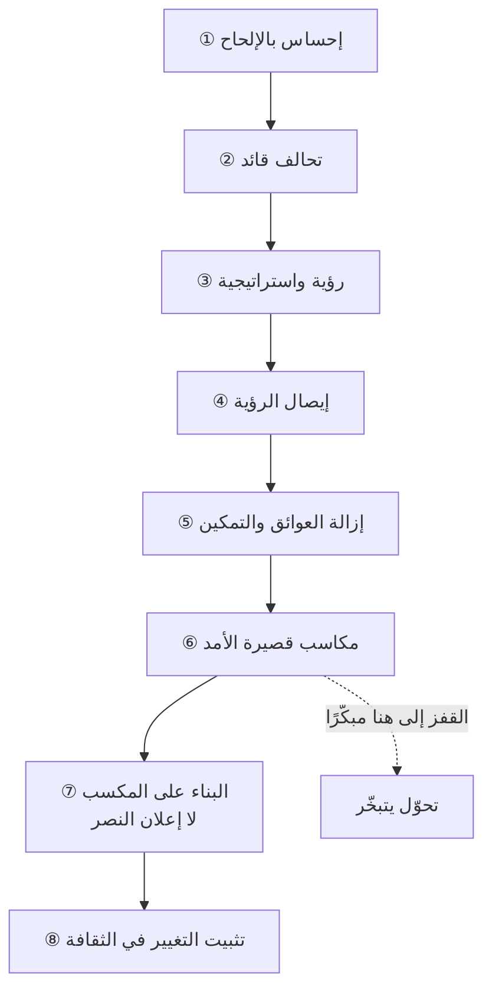

# نموذج كوتر للتغيير (Kotter's 8-Step Model)

> [!info] تعريف مختصر
> نموذج من ثماني خطوات لقيادة التغيير المؤسسي، وضعه **جون كوتر** (أستاذ بكلية هارفارد للأعمال) في مقاله *Leading Change: Why Transformation Efforts Fail* بمجلّة هارفارد بزنس ريفيو عام 1995 ثم في كتابه *Leading Change* عام 1996. وجوهره أنّ التغيير **لا يُفرض بقرار بل يُقاد بتحالف**: خطواته الأولى كلّها عن **بناء الشرعية والجيوش** قبل أن تُذكر أيّ خطّة تنفيذ.

## الشرح العلمي والاحترافي
- **الخطوات الثماني**: ① خلق **إحساس بالإلحاح** · ② بناء **تحالف قائد** · ③ صياغة **رؤية للتغيير** واستراتيجيّتها · ④ **إيصال الرؤية** على نطاق واسع · ⑤ **إزالة العوائق** وتمكين الناس على التصرّف · ⑥ توليد **مكاسب قصيرة الأمد** · ⑦ **البناء على المكسب** لا إعلان النصر مبكّرًا · ⑧ **تثبيت التغيير في الثقافة**.
- **مركز ثقل النموذج في الخطوة الثانية.** «التحالف القائد» يعني أنّ في كلّ إدارة أفرادًا مستعدّين لبذل جهد ووقت من أجل التغيير — ومهمّة قائد التغيير أن **يجدهم ويقودهم كأوركسترا**، لا أن يصدر أوامر. ومن هنا تشبيه **مايسترو التغيير**: قائد التغيير لا يعزف، بل ينسّق من يعزفون.
- **الترتيب ليس زخرفة.** أشيع سبب للفشل عند كوتر هو **القفز إلى الخطوة السادسة** (المكاسب السريعة) قبل بناء التحالف والرؤية — فتُنسب المكاسب إلى شخص واحد، وتتبخّر بمجرّد انشغاله أو رحيله.
- **الخطوة السابعة تُخالف الحدس**: إعلان النصر بعد أوّل نجاح ظاهر هو ما يُجهض التحوّل، لأنّ الضغط يزول قبل أن ترسخ الممارسة الجديدة.
- **مقارنةً بـ[[ADKAR Model|ADKAR]]**: كوتر نموذج **مؤسسي من أعلى إلى أسفل** يصف ما تفعله القيادة؛ وADKAR نموذج **فردي** يصف ما يمرّ به كلّ شخص (وعي ← رغبة ← معرفة ← قدرة ← تعزيز). وهما متكاملان لا متنافسان: كوتر يخطّط الحملة، وADKAR يشخّص لماذا يقاوم فلان بعينه.
- **حدوده**: النموذج خطّي المظهر بينما التحوّلات تتكرّر وتتراجع؛ وهو يفترض قيادةً راغبةً في التغيير أصلًا — وهو الافتراض الذي ينهار في أكثر الحالات الميدانية، حيث يكون **غياب رعاية الإدارة العليا** هو المشكلة الأولى لا الخطوة الأولى.

## أين ومتى يُستخدم
- في **التحوّل الرشيق** على مستوى مؤسسة لا فريق.
- عند **تغيير يتجاوز دائرة سيطرتك** ويحتاج إدارات أخرى (مبيعات، تسويق، مالية).
- في **بناء خطّة اتصال** للتحوّل: الخطوات ③ و④ هي جوهر الخطّة.
- عند **تحليل تحوّل متعثّر**: أيّ خطوة قُفزت؟

## مثال وسيناريو تطبيقي
> [!example] تحوّل توقّف عند الخطوة السادسة.
> **الوضع:** شركة بدأت التحوّل الرشيق بفريق واحد نجح نجاحًا لافتًا، فانخفض زمن التسليم إلى الثلث.
> **ما حدث:** أُعلن النجاح، وصُوِّر قائد التحوّل بطلًا منفردًا؛ ولم يُبنَ تحالف في المبيعات وما قبل البيع، فظلّت الطلبات تصل في آخر لحظة.
> **النتيجة:** بعد ستّة أشهر عاد الفريق إلى وضعه، وصار موقع قائد التحوّل موضع طمع بدل أن يكون موضع سند.
> **التصحيح:** العودة إلى الخطوة ② — بناء تحالف بممثّل من كلّ إدارة، ونقل الفضل إلى الفرق صراحةً، وربط مؤشّرات المديرين الوسطاء بتطوير الناس لا بمراقبتهم.

## خطوات أو مخطّط

## ⚠️ مفاهيم خاطئة شائعة
> [!warning]
> - **قراءته قائمةَ مهامّ تُنجَز بالترتيب مرّةً واحدة**: الخطوات تتداخل وتتكرّر.
> - **الظنّ بأنّ «الإلحاح» يعني التخويف**: الإلحاح المصطنع يُنتج مقاومة؛ المطلوب سبب حقيقي مفهوم.
> - **اعتبار التحالف اجتماعًا رسميًّا**: التحالف أشخاص لهم نفوذ فعلي واستعداد لبذل وقتهم.
> - **افتراض أنّه بديل عن [[ADKAR Model|ADKAR]]**: أحدهما مؤسسي والآخر فردي.

## ❌ ممارسات خاطئة في المشاريع
> [!failure]
> - **إطلاق التحوّل بلا [[Sponsor|راعٍ]] ثقيل**: كوتر نفسه يجعل الشرعية شرطًا لا خطوة. الحلّ: أمّن الرعاية أو أجّل.
> - **تجاهل الإدارة الوسطى**: هي أصعب طبقة، ومن أهملها اصطدم بها لاحقًا. الحلّ: أعد كتابة مؤشّراتها لتكافئ التطوير لا المراقبة.
> - **احتكار الفضل**: يقتل التحالف من داخله. الحلّ: امنح الفضل لغيرك حتى لو كنتَ سببه.
> - **إعلان النصر عند أوّل مكسب**: يُنهي الضغط قبل الترسيخ.

## 🔗 مصطلحات ومفاهيم ذات صلة
[[ADKAR Model]] | [[Evolutionary Change]] | [[Sponsor]] | [[Alignment]] | [[Empowerment]] | [[Psychological Reactance]] | [[14.2 امنح الفضل لغيرك ومقاومة التغيير]] | [[9.2 إدارة التغيير - نموذج ADKAR وتضخم النطاق]]
