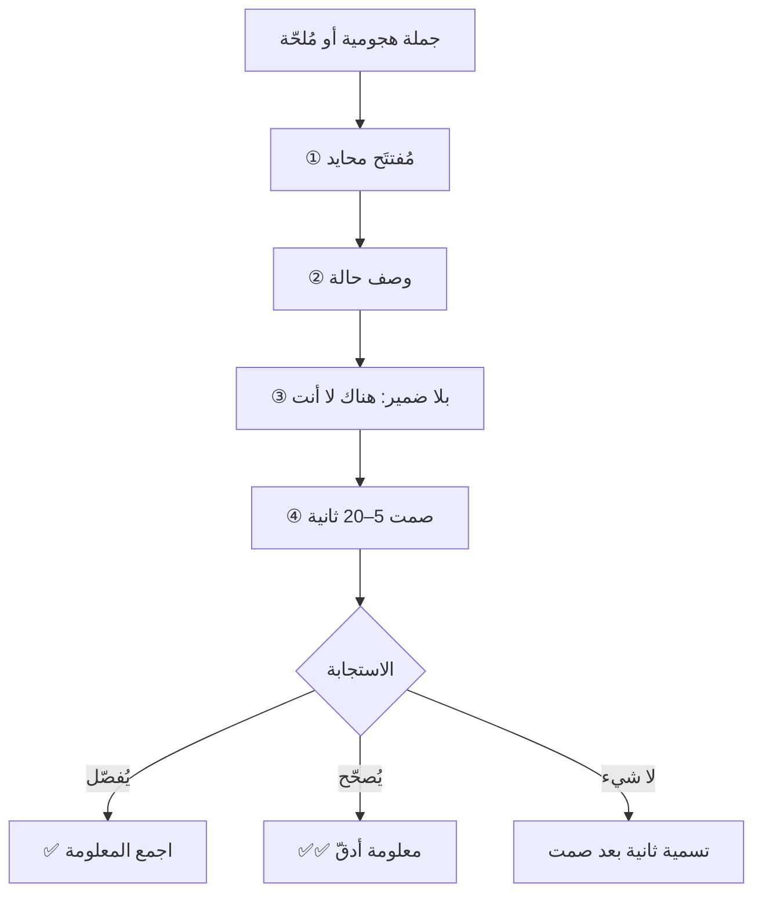

# التسمية (Labeling)
> [!info] تعريف مختصر
> التسمية هي جملة محايدة قصيرة تصف الحالة الشعورية للطرف الآخر بلا نسبتها إليه بضمير، تُقال ثم يُصمَت بعدها — غرضها خفض استثارته وانتزاع دافعه الحقيقي بلا سؤال مباشر.

## الشرح العلمي والاحترافي
طوّر التقنية **كريس فوس (Chris Voss)**، كبير مفاوضي الرهائن الدوليين في مكتب التحقيقات الفدرالي، وعرضها في كتابه *Never Split the Difference* (2016). وبنيتها أربعة أجزاء لا يصحّ سقوط أيّ منها:

| الجزء | الصياغة | إن غاب |
|---|---|---|
| مُفتتَح محايد | «يبدو أنّ…» · «على ما يبدو…» | تصير تقريرًا يدّعي معرفة ما في داخله فيُقاوَم |
| وصف **حالة** لا سلوك | ضغط · خوف · قلق · جهد مبذول | يصير اتّهامًا («يبدو أنّك لا تتعاون») |
| **بلا ضمير** | «هناك خوف» لا «أنتَ خائف» | يُنكَر فورًا — وهذا أخطر الأجزاء |
| **صمت 5–20 ثانية** | لا شيء بعدها | لا يُولَّد ضغط الفراغ، فتُهدَر الأداة |

ولها **سند تجريبي مباشر**: أظهرت دراسة **ليبرمان وزملائه (Lieberman et al., 2007)** بالرنين المغناطيسي الوظيفي أنّ **تسمية الانفعال لفظيًّا** ترتبط بانخفاض نشاط اللوزة الدماغية وزيادة نشاط القشرة الجبهية البطنية الجانبية — أي انتقال المعالجة من التقييم السريع إلى المعالجة اللغوية. *(تنبيه: الدراسة أُجريت على تسمية المرء لانفعاله هو، والنقل إلى تسمية شخص لانفعال آخر معقول ومدعوم جزئيًّا، لا مُثبَت حرفيًّا.)*

والتسمية تُؤدّي **ثلاث وظائف** في جملة واحدة: التهدئة · **الاستخراج** (أهمّها وأكثرها إهمالًا) · نزع الشخصنة عن الحوار.

## أين ومتى يُستخدم
- اجتماع يدخله صاحب مصلحة مُشتعِلًا فلا يستقبل أرقامًا ولا منطقًا.
- تعامل مع صامت أو منسحب في السكرم اليومي أو الاجتماع الاستعادي.
- هجوم على أداة أو عملية تُديرها (جيرا، سكرم) — لانتزاع الاتّهام من الأداة.
- كلّ موقف تحتاج فيه معرفة **الدافع** قبل أن تُقرّر الموافقة أو الرفض.

## مثال وسيناريو تطبيقي
> [!example] يدخل صاحب الشركة اجتماعًا قائلًا: «منذ طبّقنا سكرم لم يعد هناك أيّ التزام، والجميع يختبئ وراء الباك-لوغ والسرعة.» الردّ الغريزي أن يُدافع مدير سكرم عن الإطار بعرض السرعة وزمن الدورة — فيرتفع الاتّهام لأنّ الرجل يقرأ البيانات تكذيبًا. أمّا الردّ بالتسمية فهو: **«يبدو يا سيّدي أنّ هناك فقدانًا للسيطرة على الفريق.»** ثم صمت. لاحظ أنّ الجملة **لا علاقة لها بسكرم إطلاقًا** — انتُزع الاتّهام من الإطار ووُصف الشعور الفعلي. وبعد الصمت بدأ الرجل يشرح أنّ أعضاء الفريق صاروا يردّون عليه بمصطلحات لا يفهمها، وأنّ همّه الحقيقي هو أنّه لم يعد يعرف ما يجري. وهذه معلومة لم تكن ستظهر بأيّ عرض بيانات.

## خطوات أو مخطّط
1. اسأل نفسك: **ما الذي يخافه؟** — لا: ما الذي يطلبه؟
2. صُغ الخوف بجملة تبدأ بـ«يبدو أنّ» وتصف حالة لا سلوكًا.
3. طبّق **اختبار «مَن؟»**: إن كان جواب «مَن؟» في جملتك هو «هو»، أعِد الصياغة.
4. احذف أيّ نصيحة ولو مُضمَرة — «اهدأ» تعني «أنت غير هادئ».
5. قلها بنبرة مستوية ووضعية مفتوحة، ثم **اصمت** حتى يتكلّم.
6. إن **صحّح** تسميتك فقد نجحتَ أكثر — حصلتَ على المعلومة الأدقّ.

## ⚠️ مفاهيم خاطئة شائعة
> [!warning]
> - **ليست تعاطفًا شعوريًّا ولا موافقة.** أن تصف ضغط الطرف الآخر لا يعني أنّك وافقت على طلبه؛ النطاق والعملية لا يتغيّران بحرف. انظر [[Tactical Empathy]].
> - **ليست تخمينًا.** التسمية بلا قرينة (جملة قالها · نبرة · سياق تعرفه) تخمين مُلبَّس بثقة؛ وإن أخطأتَ خسرتَ مصداقيتك. وحين لا تملك قرينة استخدم [[Mirroring]] لأنّها لا تفترض شيئًا.
> - **الصمت بعدها ليس اختياريًّا** — إنّه نصف الأداة، وأشيع خطأ فيها أن يُتبعها قائلها بكلام يملأ به فراغًا لا يُطيقه هو.

## ❌ ممارسات خاطئة في المشاريع
> [!failure]
> - **إلحاق نصيحة بالتسمية** («يبدو أنّك تحت ضغط — أقترح أن تهدأ») — تُغضِب أكثر لأنّها اتّهام مُضمَر وإعلان تفوّق. الحل: النصيحة والخطّة في **نهاية** الحوار لا أوّله.
> - **استخدامها في كلّ تفاعل** — بنية لغوية لافتة، وتكرارها يجعلها تُقرأ بروتوكولًا فيقول الفريق «دعك من هذا الكلام». الحل: للمواقف عالية الاستثارة فقط.
> - **استخدامها كتابةً** في بريد أو رسالة — الصمت لا يُقرأ في النصّ، والنبرة تُقرأ بحالة القارئ فتُفهَم تعالمًا. الحل: حوِّل إلى مكالمة وادخل بـ[[Accusation Audit]].
> - **وصف شعور لا تراه** — وهي الحالة الوحيدة التي تسقط فيها الأداة أخلاقيًّا بلا لبس، لأنّها تُنشئ اعتقادًا كاذبًا لا يمكن للطرف الآخر التحقّق منه. انظر [[Transparency Test]].

## 🔗 مصطلحات ومفاهيم ذات صلة
[[Mirroring]] | [[Tactical Empathy]] | [[Accusation Audit]] | [[Tactical Silence]] | [[Calibrated Questions]] | [[Amygdala Hijack]] | [[Fundamental Attribution Error]] | [[Active Listening]] | [[Psychological Safety]]

> [!tip] 💡 إثراء عملي — كورس لعبة العقل
> البنية الرباعية بالتفصيل، وقاعدة «هناك لا أنت»، وتسع حالات محلولة: [[04 - التسمية - صناعة الجملة المحايدة]]. والصياغات الجاهزة في [[ملحق ج - بطاقة الجيب]].
