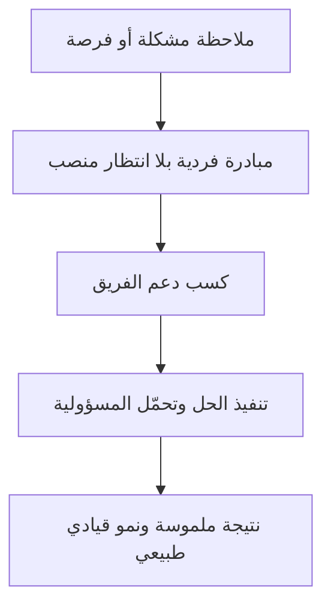

# القيادة في كل مستوى (Leadership at Every Level)
> [!info] تعريف مختصر
> القيادة في كل مستوى (Leadership at Every Level) مبدأ يقول إن القيادة ليست حكرًا على المناصب الإدارية العليا، بل يمكن — بل يجب — أن يمارسها أي فرد في الفريق، بغض النظر عن مسماه الوظيفي، حين يتحمّل مسؤولية نتيجة أو يبادر بحل مشكلة.

## الشرح العلمي والاحترافي
هذا المفهوم يقلب الفكرة التقليدية عن القيادة كـ"هرم" تنازلي (القرارات تنزل من الأعلى للأسفل فقط). في المؤسسات الرشيقة والتقنية الحديثة، القيادة تُعرَّف كسلوك (راجع [[Behavioral Leadership]]) لا كمنصب.
- أي مطوّر يلاحظ خللًا تقنيًا ويبادر بإصلاحه دون انتظار توجيه، يمارس "قيادة" في تلك اللحظة، حتى لو لم يكن "مديرًا" رسميًا.
- هذا المبدأ ضروري في الفرق الكبيرة والموزّعة (Distributed Teams) حيث يستحيل على قائد واحد اتخاذ كل القرار في الوقت المناسب؛ لذلك يجب أن تُوزَّع القيادة على مستويات متعددة.
- يرتبط ارتباطًا وثيقًا بمفهوم [[Empowerment]]: لا يمكن أن تُمارَس القيادة في كل مستوى ما لم تُمنح الصلاحية والثقة لكل فرد لاتخاذ قرارات ضمن نطاق عمله.
- يظهر هذا المبدأ بوضوح في [[Self-Organizing Team]]، حيث يتقاسم أعضاء الفريق مسؤوليات القيادة (تنظيم الاجتماع، متابعة الجودة، التواصل مع أصحاب المصلحة) بدل الاعتماد على شخص واحد فقط.
- الفكرة الجوهرية: القيادة هي فعل استلام المسؤولية والمبادرة، وليست خانة في الهيكل التنظيمي.

## أين ومتى يُستخدم
- في الفرق الرشيقة ذاتية التنظيم ([[Self-Organizing Team]])، حيث يتناوب أعضاء الفريق على قيادة مبادرات مختلفة (تحسين الأداء، تبسيط الكود، تحسين التوثيق).
- عند نمو الشركة وتوسّع عدد الفرق، بحيث يصبح الاعتماد على قيادة مركزية واحدة عنق زجاجة (Bottleneck).
- في ثقافات الشركات التقنية الحديثة التي تشجع المبادرة الفردية (مثل "أيام هاكاثون داخلية" أو "وقت المشاريع الجانبية").
- عند تدريب موظفين مبتدئين على تحمّل مسؤوليات قيادية صغيرة تدريجيًا قبل ترقيتهم رسميًا لمنصب قيادي.

## مثال وسيناريو تطبيقي
> [!example] في شركة "أُفق التقنية"، لاحظت هبة، وهي مهندسة برمجيات مبتدئة (بلا منصب إداري)، أن فريقها يقضي وقتًا طويلًا كل أسبوع في نشر التحديثات يدويًا، مما يسبب أخطاء متكررة. بدل انتظار موافقة المدير، جمعت هبة زميلين، واقترحت بناء خط أتمتة نشر بسيط (Pipeline) خلال وقتها الحر لمدة أسبوعين. عرضت الفكرة على الفريق، وقادت التنفيذ بنفسها رغم أنها لم تكن "قائدة" رسميًا. بعد شهر، انخفض وقت النشر من ساعتين إلى 10 دقائق، وأخطاء الإنتاج تراجعت بنسبة كبيرة. لاحظت الإدارة مبادرتها ومنحتها لاحقًا دورًا أكبر في قيادة تحسينات البنية التقنية — مثال حي على أن القيادة بدأت بالسلوك والمبادرة، لا بالمنصب.

## خطوات أو مخطّط
1. لاحظ فرصة تحسين أو مشكلة تؤثر على الفريق أو المشروع.
2. بادر باقتراح حل، حتى لو لم تكن الشخص "المسؤول رسميًا" عن هذا المجال.
3. اطلب دعم من يحتاج الأمر (فريقك، مديرك) بدل الانتظار السلبي للتفويض.
4. تحمّل مسؤولية التنفيذ والمتابعة حتى النتيجة.
5. شارك النتائج والدروس المستفادة مع بقية الفريق أو المؤسسة.

## ⚠️ مفاهيم خاطئة شائعة
> [!warning]
> - الاعتقاد أن "القيادة" تعني منصبًا إداريًا فقط، وأن غير المدير لا يمكنه أن "يقود"؛ في الحقيقة القيادة سلوك مبادرة يمكن لأي فرد ممارسته.
> - الخلط بين "القيادة في كل مستوى" والفوضى التنظيمية؛ هذا المبدأ يحتاج حدودًا وتنسيقًا واضحين حتى لا تتضارب المبادرات الفردية.
> - افتراض أن هذا المفهوم يُلغي الحاجة لقيادة رسمية؛ في الواقع القادة الرسميون (مثل [[06 - Scrum Master]] أو مدير المشروع) ما زالوا ضروريين لتنسيق وتوجيه هذه المبادرات المتعددة.

## ❌ ممارسات خاطئة في المشاريع
> [!failure]
> - مدير يشجّع شعار "الجميع قائد" لفظيًا فقط، لكنه يعاقب أو يتجاهل أي مبادرة فردية لم يطلبها هو شخصيًا — الحل: مكافأة المبادرة الفعلية والاعتراف بها علنًا، لا مجرد الحديث عنها.
> - السماح لمبادرات فردية متعددة بالتضارب دون تنسيق، مما يخلق ازدواجية في الجهد أو قرارات متضاربة — الحل: وجود قناة تواصل واضحة (مثل اجتماع أسبوعي قصير) لمشاركة المبادرات قبل تنفيذها.
> - معاملة الموظف المبتدئ الذي يبادر بقيادة تحسين كأنه "يتجاوز صلاحياته" — الحل: تبني ثقافة تشجّع المبادرة طالما ضمن حدود واضحة ومتفق عليها.

## 🔗 مصطلحات ومفاهيم ذات صلة
- [[Behavioral Leadership]]
- [[Empowerment]]
- [[Self-Organizing Team]]
- [[Servant Leadership]]
- [[Emotional Intelligence]]
- [[06 - Scrum Master]]
- [[Cross-functional Team]]
