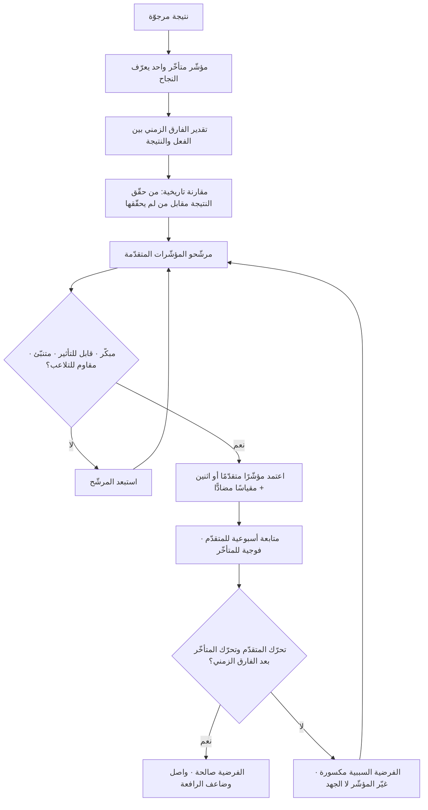

# المؤشّرات المتقدّمة والمتأخّرة (Leading and Lagging Indicators)

> [!info] تعريف مختصر
> تصنيف للمقاييس بحسب موقعها من النتيجة على محور الزمن والسببية. **المؤشّر المتأخّر (Lagging)** يقيس النتيجة نفسها بعد وقوعها: الإيراد، معدّل الانسحاب، رضا العميل، تأخّر التسليم. هو دقيق ونهائي لكنه لا يقبل التصحيح — حين يظهر يكون الفعل قد انقضى. و**المؤشّر المتقدّم (Leading)** يقيس سلوكًا أو حالة **تسبق** النتيجة ويُفترض أنها تسبّبها جزئيًّا: عدد المقابلات مع العملاء هذا الأسبوع، نسبة من أتمّوا أول مهمّة قيمة، عمر العمل الجاري ([[WIP Aging]])، تغطية الاختبارات. المؤشّر المتقدّم قابل للتأثير الآن لكنه أقل يقينًا. والإدارة السليمة لا تختار بينهما، بل تُدير **بزوج** من كليهما لكل هدف: مؤشّر متأخّر يعرّف النجاح، ومؤشّر متقدّم واحد أو اثنان يمكن التحرّك عليهما هذا الأسبوع.

## الشرح العلمي والاحترافي
- **المحور ليس الزمن وحده بل قابلية التأثير.** الفرق الجوهري بين النوعين يُختصر في ثنائية: المتأخّر **مهم لكن يصعب التأثير فيه مباشرة**، والمتقدّم **يمكن التأثير فيه مباشرة لكن أهمّيته مشروطة بصحّة الفرضية السببية**. تقول القاعدة العملية: لا يمكنك أن «تفعل» الإيراد؛ الإيراد نتيجة. لكن يمكنك أن تفعل عدد العروض التوضيحية المُجراة، وسرعة الردّ على الطلب، ونسبة إتمام الإعداد.
- **الأصل والانتقال بين الحقول.** الثنائية مستقرّة منذ عقود في الاقتصاد الكلّي (مؤشّرات اقتصادية سابقة ولاحقة للدورة الاقتصادية)، ثم انتقلت إلى إدارة الأداء المؤسّسي، حيث شاع منطقها في أطر مثل **بطاقة الأداء المتوازن (Balanced Scorecard)** التي ربطت المقاييس المالية المتأخّرة بمقاييس العمليات والتعلّم المتقدّمة عبر سلسلة سببية. كما رسّخت أدبيات السلامة المهنية التمييز نفسه: عدد الإصابات مؤشّر متأخّر، بينما عدد الملاحظات الوقائية المرفوعة وعدد التدقيقات الميدانية مؤشّرات متقدّمة. والفكرة الجامعة في كل هذه الحقول واحدة: **إدارة النتائج مستحيلة، وإدارة مسبّباتها ممكنة**.
- **العلاقة بين النوعين فرضية لا حقيقة.** أخطر ما في المؤشّر المتقدّم أنه يستند إلى ادّعاء سببي ضمني: «إن ارتفع هذا، سيرتفع ذاك». هذا الادّعاء **يجب أن يُكتب صراحةً ويُختبر دوريًّا**. كثير من الفرق تتعلّق بمؤشّر متقدّم لسنوات بعد أن انقطعت صلته بالنتيجة (تغيّر السوق، أو تشبّع القناة، أو تلاعب بالمقياس). القاعدة: كل مؤشّر متقدّم له **تاريخ مراجعة**، وسؤال المراجعة هو: هل ما زالت حركته تتنبّأ بحركة المؤشّر المتأخّر؟
- **كيف يُبنى الزوج عمليًّا — خمس خطوات مضغوطة.** ① صُغ النتيجة كمؤشّر متأخّر واحد لا أكثر (مثال: نسبة تجديد الاشتراك السنوي). ② اسأل: ما السلوك الذي، لو حدث أكثر، لجعل هذه النتيجة أرجح؟ واجمع مرشّحين من بيانات سابقة لا من التخمين (قارن سلوك من جدّدوا بمن لم يجدّدوا). ③ اختبر ارتباط المرشّح بالنتيجة على بيانات تاريخية، وفضّل ما يظهر مبكرًا وبقوّة. ④ تحقّق من **قابلية الفعل**: هل يملك الفريق رافعة أسبوعية تحرّكه فعلًا؟ ⑤ ألحق بالزوج **مقياسًا مضادًّا** ([[Counter Metric]]) يمنع تحسين المتقدّم بطريقة تُتلف النتيجة.
- **معايير المؤشّر المتقدّم الجيّد.** أربعة شروط مجتمعة: **مبكّر** بما يكفي ليترك مجالًا للتصحيح، **قابل للتأثير** بقرارات داخل سلطة الفريق، **متنبّئ** بعلاقة مُختبَرة لا مفترَضة، و**مقاوم للتلاعب** أو محروس بمقياس مضادّ. سقوط أي شرط يحوّله إلى نشاط بلا معنى، وهو الطريق المباشر إلى [[Vanity Metrics]].
- **سلسلة المؤشّرات لا ثنائيّتها.** التصنيف نسبي لا مطلق: المقياس نفسه متقدّم بالنسبة لما بعده ومتأخّر بالنسبة لما قبله. «نسبة إتمام الإعداد» متقدّمة بالنسبة للاحتفاظ، ومتأخّرة بالنسبة لـ«زمن تحميل الشاشة الأولى». لذلك الأدقّ تصوّر **سلسلة سببية** تمتدّ من أفعال الفريق إلى النتيجة التجارية، ثم اختيار نقطة أو نقطتين منها للمتابعة الأسبوعية.
- **الخطر المعاكس: الإفراط في المؤشّرات المتقدّمة.** لأنها سهلة الرفع، تميل الفرق إلى تكديسها حتى تصير لوحة نشاط: عدد الاجتماعات، عدد النماذج، عدد التذاكر. عندها يتحوّل الفريق إلى قياس الحركة بدل الوجهة ([[Outcome vs Output]]). العلاج قاعدة عددية صارمة: **مؤشّر متأخّر واحد + مؤشّرَان متقدّمان كحدّ أقصى لكل هدف**.
- **الفارق الزمني (Lag Time) يجب أن يُقدَّر رقميًّا.** لا يكفي القول «هذا يسبق ذاك»؛ يجب معرفة كم يسبقه: أسبوعان أم ربع سنة؟ الفارق يحدّد إيقاع المراجعة وحدود الحكم. تقييم أثر تغيير في الإعداد على تجديد سنوي بعد أسبوعين حكم سابق لأوانه، ولا يُقرأ إلا بمتابعة أفواج زمنية ([[Cohort Analysis]]).

## أين ومتى يُستخدم
- **في بناء [[OKR]]**: الهدف يُعبَّر عنه عادة بنتيجة متأخّرة، بينما تُصاغ النتائج الرئيسية بمزيج يضمن وجود ما يمكن تحريكه خلال الربع لا في نهايته فقط.
- **في اختيار [[North Star Metric]] والمقاييس المساندة**: النجم القطبي غالبًا مؤشّر متوسّط الموقع، وتُبنى تحته شجرة من المؤشّرات المتقدّمة يملك كل فريق واحدًا منها.
- **في إدارة تدفّق العمل والتسليم**: [[WIP Aging]] و[[Flow Efficiency]] مؤشّرات متقدّمة تنذر بتأخّر [[Lead Time]] و[[Cycle Time]] قبل وقوعه، بينما نسبة الالتزام بالمواعيد مؤشّر متأخّر.
- **في الجودة والموثوقية**: تغطية الاختبارات ونسبة المراجعات المبكّرة ([[Shift-Left and Shift-Right]]) مؤشّرات متقدّمة، بينما [[Escaped Defect Rate]] و[[MTTR]] و[[Uptime]] مؤشّرات متأخّرة.
- **في إدارة المخاطر**: بنود [[Risk Register]] تُترجم إلى مؤشّرات متقدّمة (إشارات إنذار مبكّر) بدل انتظار تحقّق الخطر، وهو ما يجعل [[RAG Status]] أقلّ اعتمادًا على الانطباع.
- **في تقارير [[Project Health Report]] واللجان التوجيهية**: التقرير المتوازن يعرض ما وقع (متأخّر) وما يُنذر بما سيقع (متقدّم)، فيسمح بالتدخّل بدل التوثيق.
- **في المبيعات وخط الأنبوب التجاري**: عدد الفرص المؤهَّلة وسرعة تقدّمها بين المراحل مؤشّرات متقدّمة للإيراد المتأخّر، ويُقرأ سقوطها عبر [[Funnel Analysis]].

## مثال وسيناريو تطبيقي
> [!example] شركة سعودية تبيع نظام إدارة مخزون بالاشتراك السنوي لمتاجر التجزئة الصغيرة. المؤشّر المتأخّر المعتمد: **نسبة تجديد الاشتراك السنوي**، وقيمتها 61% وهي دون الهدف (80%). المشكلة البنيوية أن هذا الرقم لا يُعرف إلا بعد اثني عشر شهرًا من الاشتراك — أي أن أي تصحيح يستغرق سنة كاملة ليظهر أثره.
> راجع الفريق بيانات 340 حسابًا من العام السابق، وقارن سلوك المجدِّدين بغير المجدِّدين في أول 30 يومًا. ظهر فارقان واضحان: من جدّدوا كانوا في الغالب قد **أدخلوا أكثر من 50 صنفًا إلى النظام خلال الأسبوعين الأولين**، و**أجروا أول جرد فعلي خلال 30 يومًا**. أما بقيّة المتغيّرات (حجم المتجر، المدينة، القناة التسويقية) فلم تفرّق كثيرًا.
> صار الزوج المُدار على النحو التالي:
> | النوع | المقياس | القيمة الحالية | الهدف |
> |---|---|---|---|
> | متأخّر | نسبة التجديد السنوي | 61% | 80% |
> | متقدّم ① | نسبة الحسابات التي أدخلت 50 صنفًا خلال 14 يومًا | 34% | 70% |
> | متقدّم ② | نسبة الحسابات التي أتمّت أول جرد خلال 30 يومًا | 22% | 55% |
> | مضادّ | عدد تذاكر الدعم لكل حساب جديد | 1.8 | ألّا يتجاوز 2.2 |
> الفارق الزمني المُقدَّر بين تحرّك المؤشّرين المتقدّمين وظهور أثرهما في التجديد: **أحد عشر شهرًا**؛ لذلك اعتُمدت متابعة أسبوعية للمتقدّمَين ومتابعة فوجية ربعية للمتأخّر، مع الاتفاق صراحةً على ألّا يُحكم على المبادرة بمؤشّر التجديد قبل مرور أربعة أرباع.
> التدخّلات كانت على المتقدّم لا على النتيجة: استيراد الأصناف من ملف Excel بضغطة واحدة بدل الإدخال اليدوي، ومكالمة تفعيل في اليوم الثالث، وقائمة مهام إرشادية داخل المنتج. بعد ستّة أشهر: المتقدّم ① ارتفع إلى 63%، والمتقدّم ② إلى 48%، وتذاكر الدعم بقيت عند 2.0 (ضمن الحدّ). وبعد اكتمال الفوج الأول: التجديد عند 74% — أقلّ من الهدف لكن الاتّجاه ثابت، والأهمّ أن الفريق عرف ذلك قبل عام من موعد المعرفة القديم.

## خطوات أو مخطّط
1. حدّد نتيجة واحدة تريد تحقيقها، وعبّر عنها بمؤشّر متأخّر واضح التعريف ومعلوم مصدر البيانات.
2. قدّر **الفارق الزمني** بين الفعل وظهور النتيجة، فهو ما يحدّد ضرورة وجود مؤشّر متقدّم أصلًا.
3. استخرج مرشّحي المؤشّرات المتقدّمة من **بيانات تاريخية** عبر مقارنة من حقّقوا النتيجة بمن لم يحقّقوها، لا من العصف الذهني وحده.
4. اختبر كل مرشّح على أربعة معايير: مبكّر، قابل للتأثير، متنبّئ، مقاوم للتلاعب.
5. اختر مؤشّرًا متقدّمًا أو اثنين على الأكثر، واكتب الفرضية السببية بصيغة صريحة: «نعتقد أن رفع (أ) إلى (س) سيرفع (ب) إلى (ص) خلال (ن) أسبوعًا».
6. ألحق بالزوج مقياسًا مضادًّا يحرس ما قد يتضرّر من التحسين.
7. حدّد إيقاعين للمراجعة: أسبوعي للمتقدّم، وفوجي أو ربعي للمتأخّر، مع منع الحكم المبكّر على المتأخّر.
8. راجع الفرضية كل ربع: إن تحرّك المتقدّم ولم يتحرّك المتأخّر بعد انقضاء الفارق الزمني، فالخلل في الفرضية لا في الجهد — استبدل المؤشّر ولا تضاعف الضغط عليه.

## ⚠️ مفاهيم خاطئة شائعة
> [!warning]
> - **«المؤشّر المتقدّم أفضل من المتأخّر»**: ليسا في تنافس. المتأخّر هو تعريف النجاح ولا غنى عنه؛ المتقدّم أداة قيادة وسط الطريق. إلغاء المتأخّر يُنتج فريقًا نشيطًا لا يعرف إن كان يفوز.
> - **«أي مقياس يظهر مبكّرًا مؤشّر متقدّم»**: السبق الزمني وحده لا يكفي؛ تُشترط علاقة تنبّؤية مُختبَرة. عدد الاجتماعات يسبق الإيراد زمنيًّا ولا يتنبّأ به.
> - **«الارتباط يكفي لاعتماد المؤشّر»**: الارتباط شرط ضروري لا كافٍ. قد يكون السلوك **نتيجة** للنجاح لا سببًا له؛ فمن ينوي البقاء أصلًا هو من يُدخل بياناته. لذلك تُختبر الفرضية بتدخّل يرفع المؤشّر عمدًا ويُراقَب أثره.
> - **«كل مؤشّر متأخّر مالي وكل متقدّم تشغيلي»**: التصنيف موقعي لا مجالي. رضا الموظف مؤشّر متأخّر لثقافة العمل ومتقدّم لدوران الموظفين.
> - **«ما دام المؤشّر المتقدّم يرتفع فنحن ننجح»**: هذا بالضبط ما تُحذّر منه [[Goodhart's Law]]؛ فالمؤشّرات المتقدّمة أسهل تلاعبًا لأنها أنشطة داخلية. رفع «عدد المقابلات» بمقابلات صورية يرفع الرقم ولا يرفع شيئًا آخر.
> - **«المؤشّر المتقدّم الجيّد يبقى جيّدًا»**: العلاقات السببية تتآكل مع تغيّر السوق والمنتج والقناة. كل مؤشّر متقدّم بضاعة لها تاريخ صلاحية، ومراجعته الربعية جزء من تعريفه لا إضافة عليه.

## ❌ ممارسات خاطئة في المشاريع
> [!failure]
> - **الخطأ: الاكتفاء بمؤشّرات متأخّرة في تقارير المشروع.** لماذا يضرّ: يتحوّل التقرير إلى تشريح لما وقع، ويصل الخبر بعد فوات وقت التصحيح. الحل: اشترط في نموذج التقرير عمودًا للمؤشّرات المتقدّمة مع إشارة إنذار مبكّر لكل خطر مسجَّل.
> - **الخطأ: اختراع المؤشّر المتقدّم في جلسة عصف ذهني دون بيانات.** لماذا يضرّ: يُنتج مؤشّرًا يعكس اعتقاد الفريق عن نفسه لا سلوك المستخدم الحقيقي، فيرتفع بلا أثر. الحل: اشتقّه من مقارنة الأفواج الناجحة بالفاشلة في بياناتك أنت.
> - **الخطأ: تكديس ثمانية مؤشّرات متقدّمة لهدف واحد.** لماذا يضرّ: يُشتّت الرافعة ويجعل كل رقم مسؤولية أحد ولا أحد، ويحوّل اللوحة إلى سجلّ نشاط. الحل: التزم بحدّ أقصى مؤشّرَين متقدّمين لكل هدف، وسجّل البقيّة كسياق غير مُدار.
> - **الخطأ: الحكم على المؤشّر المتأخّر قبل انقضاء الفارق الزمني.** لماذا يضرّ: يُلغى تدخّل صحيح لأنه «لم يُظهر نتيجة»، ثم يُستبدل بآخر يُلغى بدوره — دوّامة تغيير بلا تعلّم. الحل: اكتب الفارق الزمني المتوقّع مسبقًا في وثيقة القرار، والتزم بعدم إصدار حكم قبله.
> - **الخطأ: ربط الحوافز بالمؤشّر المتقدّم وحده.** لماذا يضرّ: يفتح باب رفع النشاط شكليًّا (مكالمات قصيرة، تذاكر مغلقة سريعًا، حسابات مُفعَّلة صوريًّا). الحل: اجعل الحافز مركّبًا من متقدّم + متأخّر + مقياس مضادّ، ولا تكافئ أيًّا منها منفردًا.
> - **الخطأ: إهمال المقياس المضادّ في الزوج.** لماذا يضرّ: يُحسَّن المؤشّر المتقدّم على حساب الجودة أو التكلفة أو صحّة الفريق، فتظهر النتيجة كسبًا وهي إزاحة للضرر إلى مكان لا يُقاس. الحل: لا تعتمد زوجًا بلا [[Counter Metric]] مُعلَن معه في اليوم نفسه.
> - **الخطأ: قراءة المؤشّرين على المستوى الإجمالي فقط.** لماذا يضرّ: قد يتحسّن المتقدّم في شريحة ويتدهور في أخرى فيتعادلان في المجموع، وقد ينقلب الاتّجاه عند التجميع كما في [[Simpson's Paradox]]. الحل: افحص الزوج مقسّمًا على أهمّ شريحتين أو ثلاث قبل الاستنتاج.

## 🔗 مصطلحات ومفاهيم ذات صلة
[[KPI]] | [[North Star Metric]] | [[Outcome vs Output]] | [[Counter Metric]] | [[Vanity Metrics]] | [[Goodhart's Law]] | [[Cohort Analysis]] | [[Funnel Analysis]] | [[Simpson's Paradox]] | [[OKR]] | [[SMART Goals]] | [[WIP Aging]] | [[Risk Register]] | [[Project Health Report]]
