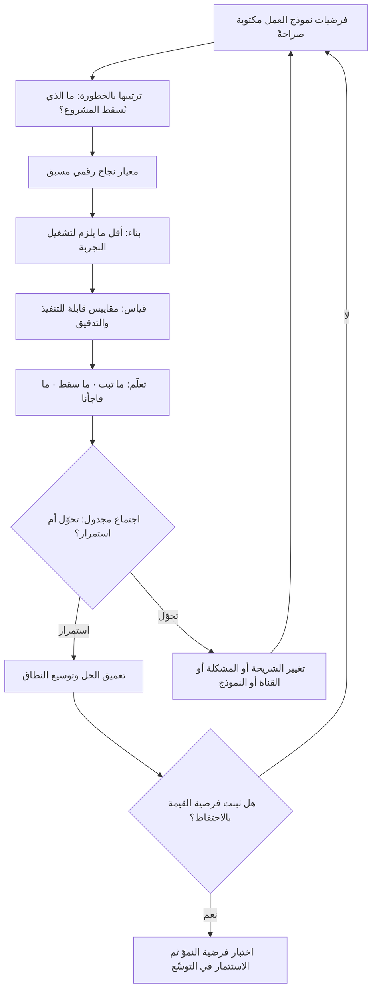

# ريادة الأعمال الرشيقة (Lean Startup)

> [!info] تعريف مختصر
> منهجية لإدارة المشاريع الجديدة **تحت ظروف عدم يقين شديد**، صاغها ونشرها رائد الأعمال الأمريكي **إريك ريس (Eric Ries)** في كتابه *The Lean Startup* الصادر عام 2011. جوهرها أن المشروع الجديد ليس نسخة مصغّرة من شركة قائمة، بل **مؤسسة قائمة على سلسلة فرضيات غير مثبتة** حول من هو العميل وما مشكلته وهل يدفع مقابل حلّها. ولذلك تكون مهمّة الفريق الأولى ليست التنفيذ بل **التعلّم المُتحقَّق منه (Validated Learning)**: تحويل الفرضيات إلى تجارب، وتشغيل حلقة **بناء ← قياس ← تعلّم** بأسرع دورة ممكنة، ثم اتخاذ قرار صريح عند كل دورة: **الاستمرار على المسار (Persevere) أم التحوّل (Pivot)**. المقياس الحقيقي للتقدّم في هذه المنهجية ليس ما بُني، بل كم من عدم اليقين أُزيل.

## الشرح العلمي والاحترافي
- **التعريف الدقيق لكلمة "ناشئ" في المنهجية**: يعرّفها ريس تعريفًا لا يرتبط بالحجم ولا بالتمويل ولا بعمر الشركة: هي مؤسسة تُنشأ لتقديم منتج أو خدمة **في ظروف عدم يقين شديد**. ويترتّب على هذا التعريف نتيجة مهمّة عمليًّا: فريقٌ داخل شركة كبيرة عمرها ثلاثون عامًا، يطلق خطًّا جديدًا تمامًا، ينطبق عليه الوصف تمامًا. أي أن المنهجية ليست حكرًا على الشركات الصغيرة، ومجالها الحقيقي هو **درجة عدم اليقين** لا حجم المنظّمة.
- **التعلّم المُتحقَّق منه هو وحدة التقدّم**: في المشروع التقليدي يُقاس التقدّم بالخطة المُنفَّذة والميزات المُسلَّمة. في هذه المنهجية يُقاس بعدد **الفرضيات التي حُسمت بدليل**. وهذا يعني أن نتيجة "فرضيتنا الأساسية خاطئة" تُعدّ تقدّمًا حقيقيًّا، لأنها تمنع إنفاق أشهر في اتجاه ميّت. وهذا القلب في تعريف التقدّم هو أصعب ما يُطبَّق مؤسسيًّا، لأن أنظمة الحوافز تكافئ التسليم لا التعلّم.
- **فرضيتا القيمة والنموّ**: تُفرَز الفرضيات إلى نوعين حاسمين. **فرضية القيمة**: هل يجد المستخدم قيمة حقيقية في المنتج حين يستعمله؟ و**فرضية النموّ**: كيف سيصل المنتج إلى مستخدمين جدد بشكل مستدام؟ الخطأ الشائع محاولة إثبات النموّ قبل إثبات القيمة — أي ضخّ تسويق في منتج لا يحتفظ بمستخدميه، وهو إنفاق مضمون الخسارة.
- **المنتج الأدنى الصالح بالمعنى الأصلي**: [[MVP]] في هذه المنهجية هو **أقصر طريق لبدء حلقة التعلّم**، لا "نسخة مبكّرة رديئة" ولا "المرحلة الأولى من الخطة". قد يكون صفحة هبوط، أو خدمة تُشغَّل يدويًّا خلف واجهة تبدو آلية، أو فيديو توضيحي. المعيار الوحيد: هل يختبر أخطر فرضية بأقل جهد؟ ومن هنا فإن كثيرًا مما يُسمّى في الشركات "منتجًا أدنى صالحًا" ليس كذلك، بل مشروع كامل نُقص منه بعض الميزات.
- **التحوّل (Pivot) قرار منهجي لا انهيار**: التحوّل تغيير مُهيكل في أحد عناصر الفرضية مع الاحتفاظ بما ثبت صحّته. وقد عدّد ريس أنواعًا متعدّدة له، منها التحوّل في شريحة العملاء (المنتج صحيح والشريحة خاطئة)، والتحوّل في المشكلة (الشريحة صحيحة والمشكلة غير ملحّة)، والتحوّل من ميزة إلى منتج كامل أو العكس، والتحوّل في قناة التوزيع أو نموذج الإيراد. وأهم ما في الفكرة تنظيميًّا أنه يُتّخذ في **اجتماع دوري مُجدوَل مسبقًا** (Pivot-or-Persevere Meeting) لا عند اليأس؛ لأن الجدولة المسبقة تمنع التسويف العاطفي في مواجهة الأدلّة المخيّبة.
- **المحاسبة الابتكارية (Innovation Accounting)**: أحد أقل أجزاء المنهجية شهرة وأكثرها أهمية. المقاييس المالية التقليدية لا تصلح للحكم على مشروع لا إيراد له بعد، فتُستبدل بمقاييس تعلّم: هل تحسّن معدّل التفعيل بين تَرب وآخر؟ هل ارتفع الاحتفاظ؟ هل قلّت كلفة اكتساب العميل؟ ويشدّد ريس على مقاييس **قابلة للتنفيذ وقابلة للتدقيق وسهلة الفهم**، في مقابل **مقاييس الغرور (Vanity Metrics)** كالأرقام التراكمية التي ترتفع دائمًا ولا يترتّب على تغيّرها قرار. وهذا الجزء يُنفَّذ عمليًّا عبر [[Product Analytics]].
- **العلاقة بنظام إنتاج تويوتا — تشابه في الأصل واختلاف في المسألة**: استعارت المنهجية من [[Toyota Production System]] مفرداتها الأساسية: الهدر، الدفعات الصغيرة، التدفّق، إيقاف الخط عند الخلل، والسؤال المتكرّر عن السبب الجذري. لكن الاختلاف جوهري وليس في الدرجة: النظام الياباني وُلد في بيئة **معروفة الطلب ومعروف فيها ما هو "صحيح"**، فعرّف الهدر بأنه كل ما لا يضيف قيمة لمنتج **متّفق على مواصفاته**، وسعى إلى **تقليل التباين** والوصول إلى الاتساق. أما المنهجية الرشيقة للناشئين فتعمل حيث **لا أحد يعرف ما هو الصحيح أصلًا**، فعرّفت الهدر بأنه كل جهد لا يُنتج **تعلّمًا** عن العميل — بما في ذلك بناء ميزة مُتقنة تمامًا لا يريدها أحد. بل إن التباين والتجريب هنا **مطلوبان عمدًا** لأنهما مصدر المعرفة، بينما هما في المصنع عيب يُستأصل. وفارق ثالث: تويوتا تُحسّن عملية تتكرّر آلاف المرات يوميًّا، والناشئ يتّخذ قرارًا مصيريًّا مرة واحدة لا يتكرّر. لذلك فالاستعارة **مجازية في المفردات ومختلفة في المسألة**، ومن ينقل أدوات المصنع حرفيًّا إلى فريق منتج يقع في خطأ منهجي.
- **أشهر ما أُسيء فهمه: «أطلق بسرعة بلا تحقّق»**: انتشر عن المنهجية شعار مبتور مفاده «أطلق شيئًا ناقصًا بسرعة وسنُصلحه لاحقًا»، واستُخدم لتبرير إطلاق منتجات رديئة وغير مختبَرة. وهذا **عكس** ما تنصّ عليه المنهجية من وجوه عدّة: (١) السرعة المقصودة هي **سرعة دورة التعلّم** لا سرعة الإطلاق؛ إطلاق سريع بلا قياس ولا فرضية ولا قرار لاحق هو أبطأ أشكال العمل لأنه لا يُنتج معرفة. (٢) المنهجية تشترط تحديد **الفرضية ومقياس النجاح قبل** البناء، وهو انضباط أعلى لا أقل. (٣) ريس يشدّد على أن جودة ما يُطلق يجب ألّا تُخلّ بثقة المستخدم، وأن المنتج الأدنى الصالح قد يكون **أقلّ حجمًا** لا **أردأ صناعة**. (٤) اشتراط اتخاذ قرار "تحوّل أم استمرار" بأدلّة يجعلها منهجية تحقّق صارمة لا دعوة للعشوائية. وسوء الفهم هذا هو ما جعل تعبير "منتج أدنى صالح" في كثير من الفرق مرادفًا مهذّبًا لمنتج غير مكتمل أُطلق لضغط الجدول.
- **نقد مشروع للمنهجية**: تُوجَّه لها انتقادات جادّة يجدر معرفتها: أنها أنسب لمنتجات رقمية سريعة الدورة منها لمجالات كالأدوية والعتاد والبنية التحتية حيث التجريب السريع مكلف أو محظور نظاميًّا؛ وأن الإفراط في التجريب التدريجي قد يُنتج تحسينات صغيرة متتالية ويُعمي عن الرهانات الكبيرة التي لا تُختبر بحلقة قصيرة؛ وأن كثرة التحوّلات قد تكون تهرّبًا من الالتزام بمسار يحتاج وقتًا لينضج. المنهجية أداة تحت عدم اليقين، لا عقيدة كونية.

## أين ومتى يُستخدم
- **في إطلاق منتج أو خط عمل جديد**: حين تكون شريحة العميل والمشكلة نفسها غير محسومتين، لا مجرّد طريقة التنفيذ.
- **في التحقّق من السوق قبل الاستثمار الكبير**: كإطار حاكم لأنشطة [[Customer and Market Validation]] وتحديد نطاق [[MVP]].
- **في تصميم التجارب الرخيصة**: عبر أدوات مثل [[Fake Door Test]] و[[Pilot Launch]] لاختبار فرضية القيمة قبل البناء.
- **في تحديد لحظة الوصول إلى الملاءمة**: بوصفها الهدف الذي تسعى إليه الحلقة، أي [[Product-Market Fit]] المُثبت بمنحنى احتفاظ لا برأي.
- **داخل الشركات القائمة لإدارة الابتكار**: لتشغيل مبادرات جديدة بمقاييس تعلّم لا بمقاييس مالية سابقة لأوانها، مع ما يقتضيه ذلك من [[Governance]] مختلفة.
- **مقترنة بالاكتشاف المستمر**: إذ توفّر [[Continuous Discovery]] و[[Dual-Track Agile]] البنية التشغيلية التي تجري فيها الحلقة داخل فريق منتج ناضج.
- **في تعزيز حلقة التغذية الراجعة**: بوصفها تطبيقًا مباشرًا لمنطق [[Feedback Loop]] و[[PDCA]] على مستوى نموذج العمل لا على مستوى العملية فقط.

## مثال وسيناريو تطبيقي
> [!example] فريق من ثلاثة مؤسّسين في الرياض يريد بناء منصّة تربط أصحاب المستودعات الصغيرة بشركات تحتاج مساحة تخزين مؤقّتة. التقدير الأولي: 7 أشهر تطوير وميزانية 900 ألف ريال لبناء المنصّة كاملة (تسجيل، بحث، حجز، دفع، عقود، تتبّع).
> **الفرضيات المكتوبة قبل أي بناء**: (١) أصحاب المستودعات لديهم مساحة شاغرة يريدون تأجيرها قصير الأمد. (٢) الشركات تعاني فعلًا من الحاجة إلى تخزين مؤقّت وتقبل مستودعًا غير معروف لها. (٣) الطرفان يقبلان وسيطًا رقميًّا بدل الوسيط التقليدي. (٤) العمولة 12% مقبولة.
> **ترتيب المخاطر**: أخطر فرضية كانت الثانية (طلب الشركات)، لأن انهيارها يُسقط المشروع كله.
> **الدورة الأولى (11 يومًا، كلفة تقارب 4,000 ريال)**: صفحة هبوط تصف الخدمة، وحملة إعلانية محدودة موجّهة لمسؤولي التشغيل. النتيجة: 1,900 زيارة، 74 طلب تواصل. مؤشّر مشجّع لكنه غير كافٍ.
> **الدورة الثانية (3 أسابيع، بلا أي برمجة)**: تشغيل الخدمة **يدويًّا بالكامل** — الفريق يستقبل الطلب هاتفيًّا، ويبحث عن المستودع بجدول بيانات و12 مالكًا تعاقد معهم يدويًّا، ويحرّر العقد بنموذج ورقي. أُنجزت 9 صفقات فعلية. التعلّم الحاسم لم يكن في الأرقام بل في ملاحظتين لم تكونا في أي فرضية: أن العائق الأول ليس السعر بل **الثقة والتأمين على البضاعة**، وأن 7 من 9 عملاء طلبوا **النقل من وإلى المستودع** لا التخزين وحده.
> **قرار التحوّل**: عُقد اجتماع "تحوّل أم استمرار" مجدول مسبقًا. القرار: تحوّل في **المشكلة** — من "منصّة حجز مساحات" إلى "خدمة تخزين ونقل مضمونة مع تغطية تأمينية"، مع الاحتفاظ بالشريحة نفسها التي ثبتت صحّتها.
> **الدورة الثالثة (6 أسابيع)**: بُني منتج أدنى صالح حقيقي لكن ضيّق النطاق: طلب واحد، تسعيرة تلقائية، عقد رقمي، وتأمين عبر شريك — دون بحث ولا حجز ذاتي ولا لوحات تحليلية. كلفة البناء 140 ألف ريال بدل 900 ألف.
> **بعد 4 أشهر من التشغيل**: 63 عميلًا، نسبة تكرار الطلب خلال 60 يومًا 44% — وهو مؤشّر احتفاظ يدعم فرضية القيمة. أما فرضية النموّ فلم تكن قد ثبتت بعد، فامتنع الفريق عمدًا عن ضخّ تسويق قبل حسمها.
> **الخلاصة العملية**: لم يكن مصدر التوفير هو "الإطلاق السريع"، بل **ترتيب الفرضيات بالخطورة واختبار الأخطر أولًا بأرخص وسيلة**. ولو أُطلق المنتج الكامل بسرعة بلا تحقّق — كما يقتضي سوء الفهم الشائع — لكان الفريق قد أنفق 900 ألف ريال على منصّة حجز لا يريدها أحد بصورتها الأولى.

## خطوات أو مخطّط
1. كتابة نموذج العمل كقائمة **فرضيات صريحة** لا كخطة، مع تسمية صاحب كل فرضية.
2. ترتيب الفرضيات حسب **الخطورة**: أيّها إن سقط أسقط المشروع كله؟ ابدأ به لا بالأسهل.
3. صياغة معيار نجاح رقمي ومسبق لكل فرضية، مع تحديد ما سيُفعل في حالتَي التجاوز وعدمه.
4. تصميم أرخص تجربة تختبر الفرضية الأخطر: صفحة هبوط، تشغيل يدوي، نموذج أوّلي، اختبار طلب.
5. **البناء**: تنفيذ أقل ما يلزم لتشغيل التجربة، لا أقل ما يمكن إطلاقه تجاريًّا.
6. **القياس**: باستخدام مقاييس قابلة للتنفيذ والتدقيق والفهم، وبقراءة الأتراب لا الأرقام التراكمية.
7. **التعلّم**: تحديد ما ثبت وما سقط صراحةً، وتسجيل ما فاجأ الفريق ولم يكن في أي فرضية.
8. اجتماع **تحوّل أم استمرار** مجدول مسبقًا بإيقاع ثابت، لا عند بلوغ اليأس.
9. عند التحوّل: تحديد نوعه بدقّة (شريحة، مشكلة، قناة، نموذج إيراد) والاحتفاظ بما ثبتت صحّته.
10. تقصير زمن الدورة القادمة، فسرعة التعلّم هي الميزة التنافسية الحقيقية لا سرعة الإطلاق.
11. الامتناع عن الاستثمار في النموّ قبل إثبات فرضية القيمة بمنحنى احتفاظ مستقرّ.

## ⚠️ مفاهيم خاطئة شائعة
> [!warning]
> - **«معناها: أطلق بسرعة بلا تحقّق»**: أشهر سوء فهم وأضرّه. المنهجية تشترط فرضية مكتوبة ومقياس نجاح **قبل** البناء، وقرارًا صريحًا بعده — وهذا انضباط أعلى من الطريقة التقليدية لا أدنى. المطلوب سرعة **دورة التعلّم**، وإطلاق سريع بلا قياس ولا قرار هو أبطأ الأساليب لأنه لا يراكم معرفة.
> - **«المنتج الأدنى الصالح يعني منتجًا رديئًا»**: الأدنى يعني **ضيق النطاق** لا **متهالك الصنع**. المنتج الذي يخذل ثقة المستخدم لا يعطي إشارة صحيحة عن القيمة أصلًا، فيفسد التجربة والنتيجة معًا.
> - **«هي نفسها منهجية تويوتا مطبَّقة على البرمجيات»**: [[Toyota Production System]] يُحسّن إنتاج منتج **معروف المواصفات** بتقليل التباين والهدر المادّي؛ والمنهجية الرشيقة للناشئين تعمل حيث **المواصفات نفسها مجهولة**، وتعرّف الهدر بأنه ما لا يُنتج تعلّمًا. بل إن التجريب والتباين هنا مقصودان لذاتهما. التشابه في المفردات لا في المسألة.
> - **«مخصّصة للشركات الصغيرة والناشئة»**: التعريف المنشور يربطها بـ**عدم اليقين** لا بالحجم؛ فريق داخل مؤسسة كبيرة يطلق خطًّا جديدًا ينطبق عليه الوصف تمامًا.
> - **«التحوّل اعتراف بالفشل»**: التحوّل قرار منهجي مبني على أدلّة، والتشبّث بفرضية سقطت هو الفشل الحقيقي. لهذا يُجدوَل الاجتماع مسبقًا كي لا يُؤجَّل عاطفيًّا.
> - **«الحلقة تعني التجريب العشوائي المستمر»**: لكل دورة فرضية واحدة محدّدة ومعيار حسم. تجارب بلا فرضية ليست منهجية بل تخبّط منظَّم المظهر.
> - **«تصلح لكل مجال»**: في المجالات عالية التنظيم أو المكلفة التجريب (الأدوية، العتاد، البنية التحتية، الأنظمة الحرجة) تحتاج الحلقة إلى تكييف جوهري، وقد تكون التجربة السريعة على مستخدمين حقيقيين محظورة نظاميًّا أصلًا.
> - **«كثرة التحوّلات دليل رشاقة»**: قد تكون العكس — هروبًا من الالتزام بمسار يحتاج زمنًا ليُثمر. التحوّل يحتاج مبرّرًا بدليل، لا مجرّد ملل أو نتيجة مخيّبة واحدة.

## ❌ ممارسات خاطئة في المشاريع
> [!failure]
> - **الخطأ: تسمية أي إصدار أول "منتجًا أدنى صالحًا" مهما كان حجمه** → **لماذا يضرّ**: يُنفَق 6 أشهر على ما يُفترض أن يختبر فرضية في أسبوعين، ويُفقد جوهر المنهجية مع الاحتفاظ بمصطلحها → **الحل**: اسأل قبل كل بناء: ما الفرضية الوحيدة التي يختبرها هذا؟ وما أرخص وسيلة لاختبارها؟
> - **الخطأ: البدء باختبار أسهل الفرضيات لا أخطرها** → **لماذا يضرّ**: يُراكم الفريق أدلّة مطمئنة على أمور هامشية بينما تبقى الفرضية القاتلة غير مختبَرة حتى يفوت الأوان → **الحل**: رتّب الفرضيات بمعيار "ما الذي يُسقط المشروع إن كان خاطئًا؟" واختبره أولًا.
> - **الخطأ: عدم كتابة معيار النجاح قبل التجربة** → **لماذا يضرّ**: تُفسَّر النتائج بعد وقوعها بما يوافق رغبة الفريق، فتتحوّل التجارب إلى طقس تبريري → **الحل**: اكتب العتبة والإجراء المترتّب على تجاوزها أو عدمه، ووثّقهما في [[Decision Log]] قبل التشغيل.
> - **الخطأ: قياس التقدّم بمقاييس الغرور (تسجيلات تراكمية، تحميلات، مشاهدات)** → **لماذا يضرّ**: أرقام ترتفع دائمًا ولا يترتّب على تغيّرها قرار، فتمنح إحساسًا زائفًا بالنجاح فوق منتج لا يحتفظ بأحد → **الحل**: استخدم مقاييس أتراب ونِسبًا قابلة للانخفاض عبر [[Product Analytics]]، وقِس الاحتفاظ قبل كل شيء.
> - **الخطأ: الاستثمار في النموّ والتسويق قبل إثبات فرضية القيمة** → **لماذا يضرّ**: ضخّ ميزانية اكتساب في منتج مثقوب يسرّع الخسارة ويُحرق السوق المستهدف مبكّرًا → **الحل**: اشترط منحنى احتفاظ يستقرّ عند مستوى معتبر قبل تحرير أي ميزانية نموّ.
> - **الخطأ: تأجيل اجتماع "تحوّل أم استمرار" كلما جاءت النتائج مخيّبة** → **لماذا يضرّ**: التعلّق العاطفي بالفكرة الأصلية يستهلك الأشهر والميزانية بلا قرار → **الحل**: ثبّت الاجتماع في التقويم بإيقاع دوري معلن، واعقده حتى لو كانت الأرقام سيّئة — خصوصًا حينها.
> - **الخطأ: تشغيل التجارب على مستخدمين حقيقيين دون مراعاة الالتزامات النظامية والأخلاقية** → **لماذا يضرّ**: يعرّض المؤسسة لمخالفات حماية بيانات ولخسارة ثقة يصعب تعويضها → **الحل**: راجع كل تجربة تمسّ بيانات شخصية وفق [[PDPL]]، واضبط شروط اختبارات الطلب كما في [[Fake Door Test]].
> - **الخطأ: تطبيق الحلقة على مشروع نطاقه محسوم ومتطلّباته واضحة** → **لماذا يضرّ**: يضيف طقوس تجريب بلا عائد حيث لا يوجد عدم يقين يُزال، ويؤخّر تسليمًا كان يمكن أن يمضي مباشرة → **الحل**: طبّقها بقدر عدم اليقين؛ وحيث يكون اليقين عاليًا انتقل إلى تنفيذ منضبط بأدوات التدفّق المعتادة.

## 🔗 مصطلحات ومفاهيم ذات صلة
[[MVP]] | [[Product-Market Fit]] | [[Customer and Market Validation]] | [[Toyota Production System]] | [[PDCA]] | [[Feedback Loop]] | [[Product Discovery]] | [[Continuous Discovery]] | [[Pilot Launch]] | [[Outcome vs Output]] | [[Fake Door Test]] | [[Dual-Track Agile]] | [[Product Analytics]] | [[Working Backwards]]
