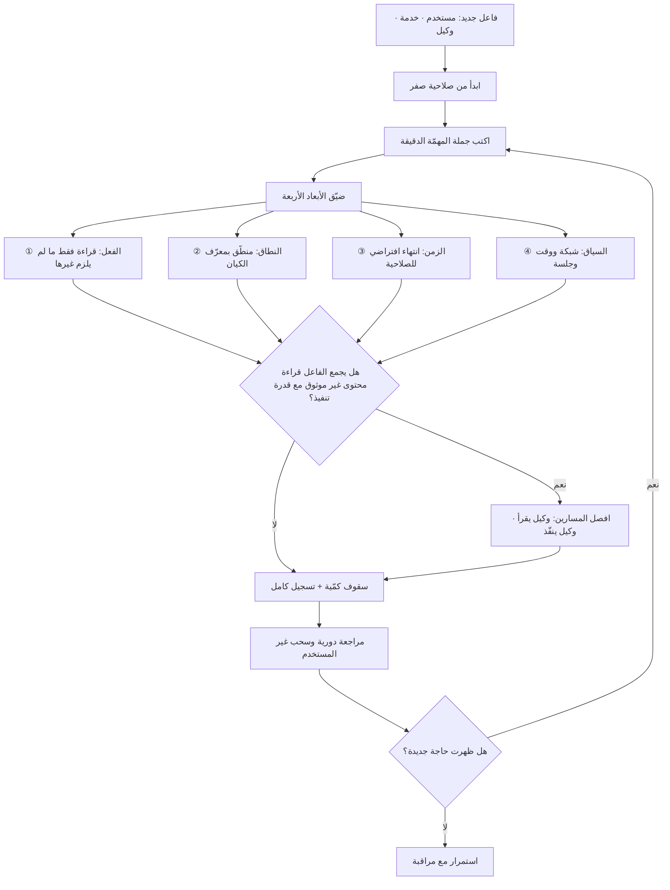

# مبدأ الحدّ الأدنى من الصلاحيات (Least Privilege)

> [!info] تعريف مختصر
> مبدأ تصميمي في أمن المعلومات ينصّ على أن يُمنح كل فاعل — إنسانًا كان أو خدمة أو وكيلًا برمجيًّا — **الصلاحيات اللازمة لأداء مهمّته تحديدًا، لأقصر مدّة ممكنة، وعلى أضيق نطاق بيانات ممكن، ولا شيء أكثر**. جوهره احتواء الضرر لا منع الخطأ: فهو لا يفترض حسن النيّة ولا سوءها، بل يسأل سؤالًا واحدًا — إذا اختُرق هذا الحساب أو أُسيء استخدامه أو أخطأ، **إلى أين يصل الضرر؟** وفي أنظمة الذكاء الاصطناعي يتحوّل هذا المبدأ من ممارسة إدارية روتينية إلى **خط الدفاع الأساسي**، لأن الوكيل يمكن إقناعه بالكلام بما لا يمكن إقناع نظام تقليدي به.

## الشرح العلمي والاحترافي
- **الأصل والصياغة الكلاسيكية**: المبدأ من أقدم مبادئ أمن الحوسبة وأرسخها، صيغ في أدبيات تصميم الأنظمة الآمنة في سبعينيات القرن الماضي ضمن مجموعة مبادئ حماية المعلومات في نظم الحاسوب، ومنذ ذلك الحين صار بندًا قياسيًّا في كل أطر الحوكمة والامتثال تقريبًا. صياغته الأصلية تركّز على أن كل برنامج وكل مستخدم يجب أن يعمل بأقل مجموعة امتيازات تكفي لإتمام العمل.
- **الأبعاد الأربعة للصلاحية** — والخطأ الشائع اختزالها في البعد الأول:
  ① **بُعد الفعل**: ماذا يُسمح بفعله؟ قراءة فقط، أم كتابة، أم حذف، أم منح صلاحيات لآخرين.
  ② **بُعد النطاق**: على أي بيانات؟ سجلّ واحد محدّد بمعرّفه، أم فئة، أم القاعدة كلها.
  ③ **بُعد الزمن**: إلى متى؟ صلاحية دائمة أم مُنحت للمهمّة وانتهت بانتهائها (Just-in-Time).
  ④ **بُعد السياق**: من أين ومتى؟ من شبكة المؤسّسة، في أوقات العمل، ضمن جلسة موثّقة.
  التصميم السليم يضيّق الأبعاد الأربعة معًا؛ وتضييق بُعد واحد وترك الباقي مفتوحًا يعطي شعورًا زائفًا بالانضباط.
- **التطبيق على الوكلاء لا على البشر فقط — وهذه النقطة المركزية**: نمت ثقافة الصلاحيات حول افتراض ضمني أن الفاعل إنسان تحكمه مسؤولية وظيفية وعقوبة تأديبية ووعي بالسياق. الوكيل البرمجي ([[AI Agent]]) لا تنطبق عليه هذه الافتراضات إطلاقًا: ينفّذ آلاف العمليات في الدقيقة، لا يشعر بالغرابة، ولا يتردّد أمام طلب شاذّ، و**يمكن توجيهه بنصّ يقرؤه** عبر [[Prompt Injection]]. ثلاثة فروق عملية تجعل تطبيق المبدأ عليه أشدّ إلحاحًا:
  • **سرعة الأثر**: خطأ الإنسان في حذف السجلّات محدود بسرعته اليدوية؛ خطأ الوكيل يمسح آلاف السجلّات قبل أن يُلاحَظ.
  • **قابلية التوجيه من الخارج**: الموظّف لا ينفّذ أمرًا مكتوبًا في ملف PDF وارد من عميل، والوكيل قد ينفّذه لأنه لا يميّز الأمر من البيان.
  • **غياب الحدس السياقي**: الموظّف يستغرب طلب تصدير قاعدة العملاء كاملة الساعة الثالثة فجرًا؛ الوكيل لا يستغرب شيئًا.
  الخلاصة: **صلاحيات الوكيل يجب أن تُشتقّ من المهمّة لا من هوية مشغّله**، وألّا ترث تلقائيًّا صلاحيات الحساب الذي أنشأه.
- **من الهوية إلى المهمّة (Task-Scoped Authority)**: النمط السليم هو أن تُصدَر للوكيل صلاحية مؤقّتة مقيّدة بمعرّف الكيان قيد المعالجة. مثال ملموس: بدل «صلاحية قراءة على جدول الطلبات»، تكون «قراءة الطلب رقم 88421 فقط، لمدّة عشر دقائق». هذا يجعل تسريب البيانات الجماعي **مستحيلًا تقنيًّا** لا مرفوضًا سلوكيًّا — وهو الفرق بين دفاع يعتمد على امتثال النموذج ودفاع لا يعتمد عليه.
- **الفصل بين القراءة والفعل**: أخطر ما في معماريات الوكلاء أن يجتمع في مسار واحد **قراءة محتوى غير موثوق** و**قدرة على تنفيذ فعل ذي أثر خارجي**. الحل المعماري المعروف هو فصل المسارين: وكيل يقرأ ولا يملك أدوات ذات أثر، ووكيل ينفّذ ولا يلمس محتوى خارجيًّا، والتواصل بينهما عبر مخطّط بيانات محدّد لا نصّ حرّ.
- **زحف الصلاحيات (Privilege Creep)**: أشيع أنماط الفشل ليس منح صلاحية واسعة عمدًا، بل تراكمها بمرور الوقت: صلاحية مُنحت لتشخيص عطل ولم تُسحب، ومفتاح للنموذج الأوّلي انتقل إلى الإنتاج، ووكيل جديد نُسخت إعداداته من وكيل قديم. العلاج إجرائي: مراجعة دورية موثّقة، وانتهاء افتراضي لكل صلاحية ما لم تُجدَّد صراحة.
- **الكلفة الحقيقية للمبدأ وسبب مقاومته**: تضييق الصلاحيات يبطئ التطوير ويزيد الاحتكاك ويولّد أعطالًا مزعجة أثناء البناء. ولهذا يُؤجَّل باستمرار بحجّة «نضبطه قبل الإطلاق»، ثم يمرّ الإطلاق بالإعدادات المفتوحة. الحل الواقعي هو **البدء من الصفر والإضافة بالطلب**، لأن العكس — البدء بالمفتوح ثم التضييق — لا يحدث عمليًّا إذ لا أحد يعرف ما الذي سينكسر إن سحبه.
- **علاقته بالخصوصية والامتثال**: المبدأ ليس أمنًا فحسب، بل تطبيق مباشر لمبدأ **تقليل البيانات** في [[PDPL]] و[[GDPR]]: لا يُتاح من البيانات إلا القدر اللازم للغرض. وهو أيضًا ما يجعل حادثة الاختراق **قابلة للاحتواء والوصف** عند الإبلاغ التنظيمي — إذ الفرق بين بلاغ يقول «تأثّر سجلّ واحد» وآخر يقول «لا نستطيع استبعاد وصول الوكيل إلى القاعدة كاملة» هو فرق في التصميم لا في الحظّ.

## أين ومتى يُستخدم
- **عند تصميم أي [[AI Agent]] يملك أدوات**: تُحدَّد صلاحية كل أداة على حدة قبل كتابة سطر واحد من منطق التنسيق ([[AI Orchestration]]).
- **عند ربط النماذج بأنظمة المؤسّسة عبر [[MCP]]**: كل خادم أدوات يُعامَل كحدود ثقة مستقلّة له حسابه ونطاقه ومدّة صلاحيته.
- **في تصميم أي نظام قائم على [[Retrieval-Augmented Generation]]**: تُطبَّق أذونات المستخدم على طبقة الاسترجاع نفسها، وإلا صار المساعد قناة تجاوز لكل ضوابط الوصول القائمة ([[Grounding]]).
- **في مراجعة الجاهزية للإطلاق ([[Go or No-Go Decision]])**: جرد الصلاحيات الفعلية للحسابات الخدمية بند إلزامي، ولا يُقبل فيه ما لا يُبرَّر ببند مهمّة محدّد.
- **في سياسات المؤسّسة المكتوبة ([[Explicit Policies]] و[[SOP]])**: يُوثَّق من يملك منح الصلاحيات، وما مدّتها الافتراضية، ومتى تُراجَع.
- **في إدارة الموردين ([[Vendor Management]])**: يُسأل كل مورّد عن أضيق صلاحية يحتاجها فعلًا، ويُرفض نمط «امنحنا وصولًا إداريًّا وسنستخدم ما نحتاجه».
- **في تخطيط التعافي واحتواء الحوادث ([[RTO and RPO]] و[[Risk Register]])**: نطاق الصلاحية هو ما يحدّد سلفًا الحدّ الأقصى لحجم أي حادثة.

## مثال وسيناريو تطبيقي
> [!example] شركة تجارة إلكترونية إماراتية بنت وكيلًا لأتمتة معالجة طلبات الاسترجاع. المنطق بسيط: يقرأ رسالة العميل، يستخرج رقم الطلب، يتحقّق من سياسة الاسترجاع، ثم ينفّذ الاسترداد إن انطبقت الشروط. حجم العمل 900 طلب استرجاع شهريًّا، والهدف خفض زمن المعالجة من 48 ساعة إلى أقلّ من ساعة.
> أثناء البناء، أُنشئ للوكيل حساب خدمي بصلاحيات المشرف على نظام الطلبات — «مؤقّتًا، لتسريع التطوير». وحين اقترب الإطلاق كان النظام يعمل بكفاءة، فمرّ بند «مراجعة الصلاحيات» في قائمة الجاهزية بعلامة صحّ لأن أحدًا لم يفتح لوحة الأذونات فعليًّا. الصلاحيات عند الإطلاق كانت: قراءة وكتابة على كامل جدول الطلبات، تنفيذ استرداد بأي مبلغ، وصلاحية إرسال بريد إلى أي عنوان.
> بعد شهرين اكتشف الفريق خللًا لم يكن اختراقًا خارجيًّا بل **خطأ منطقيًّا بسيطًا**: عميل كتب في رسالته رقم طلب صديق له بالخطأ إلى جانب رقم طلبه. لم يميّز الوكيل، فاسترجع الطلبين معًا وأرسل تأكيدًا يتضمّن تفاصيل الطلب الثاني — اسم صاحبه وعنوانه ومحتوياته — إلى العميل الأول. لم يكن الأمر بحاجة إلى مهاجم أصلًا؛ اتّساع الصلاحية وحده كان كافيًا لتحويل غلطة إدخال إلى تسريب بيانات شخصية.
> ما نُفِّذ في المعالجة: ① أُلغي الحساب المشرف واستُبدل بإصدار رمز مؤقّت لكل معاملة مقيّد برقم الطلب الوارد وبعشر دقائق. ② سُقِف مبلغ الاسترداد التلقائي عند 500 درهم، وما فوقه يذهب إلى مراجعة بشرية ([[Human in the Loop]]). ③ حُصرت وجهة البريد في العنوان المسجّل لصاحب الطلب حصرًا، فأي عنوان آخر يوقف العملية. ④ صار الوكيل يعالج طلبًا واحدًا في كل تنفيذ، فلا يمكنه بنيويًّا لمس طلبين معًا. ⑤ أُضيفت مراجعة صلاحيات ربع سنوية موثّقة لكل الحسابات الخدمية.
> الملاحظة التي سجّلها الفريق في [[Decision Log]]: التكلفة الهندسية للإجراءات الخمسة كانت أقلّ من أسبوعي عمل، بينما كلفة الحادثة — تحقيق داخلي، وإخطار المتضرّرين، وتعليق الأتمتة ثلاثة أسابيع — تجاوزت ذلك أضعافًا. ولو نُفّذت هذه الإجراءات في اليوم الأول لما كلّفت شيئًا يُذكَر، لأن الصعوبة كلها كانت في **سحب صلاحية قائمة** لا في عدم منحها ابتداءً.

## خطوات أو مخطّط
1. عدّد كل فاعل في النظام: مستخدمون، حسابات خدمية، وكلاء، أدوات، تكاملات خارجية.
2. اكتب لكل فاعل جملة المهمّة الدقيقة: ماذا يفعل بالضبط، وعلى أي بيانات، وبأي وتيرة.
3. ابدأ من صلاحية صفر، وأضف كل صلاحية بطلب موثّق يذكر المهمّة المبرِّرة لها.
4. ضيّق الأبعاد الأربعة معًا: الفعل، والنطاق (نطّق بالمعرّف)، والزمن (انتهاء افتراضي)، والسياق.
5. افصل مسار قراءة المحتوى غير الموثوق عن مسار تنفيذ الأفعال، واجعل التواصل بينهما بمخطّط بيانات محدّد.
6. ضع سقوفًا كمّية على الأفعال ذات الأثر المالي أو التشغيلي، وحوّل ما تجاوزها إلى مراجعة بشرية.
7. سجّل كل استخدام صلاحية مع الفاعل والسياق الذي أدّى إليه، بما يتيح التحقيق بعد الحادثة.
8. راجع الصلاحيات دوريًّا واسحب غير المستخدم منها خلال فترة محدّدة، ووثّق المراجعة.
9. اختبر الاحتواء عمليًّا: افترض اختراق كل حساب على حدة، واحسب أقصى ضرر ممكن؛ فإن كان غير مقبول، ضيّق أكثر.

## ⚠️ مفاهيم خاطئة شائعة
> [!warning]
> - **«المبدأ يخصّ حسابات الموظّفين وإدارة الهوية.»** هذا نصف تطبيقه فقط. في أنظمة الذكاء الاصطناعي، الفاعلون الأخطر هم الحسابات الخدمية والوكلاء الذين ينفّذون بلا حدس ولا تردّد وبسرعة تفوق أي رقابة يدوية. التصحيح: عامل كل وكيل كهوية مستقلّة لها سياستها الخاصة، لا كامتداد لهوية من أنشأه.
> - **«صلاحية القراءة غير خطرة.»** القراءة الواسعة هي بالضبط ما يحوّل حقنًا ناجحًا إلى تسريب جماعي، وما يجعل الخطأ البريء حادثة خصوصية. التصحيح: نطّق القراءة بمعرّف الكيان قيد المعالجة، فالخطر في النطاق لا في نوع الفعل وحده.
> - **«سنبدأ بصلاحيات واسعة للتطوير ونضيّقها قبل الإطلاق.»** التضييق اللاحق نادرًا ما يحدث لأن أحدًا لا يعرف ما الذي سينكسر إن سُحبت صلاحية، فيُفضَّل الإبقاء. التصحيح: ابدأ من الصفر وأضف بالطلب — فهذا هو الاتجاه الوحيد الذي يعمل عمليًّا.
> - **«الوكيل يعمل نيابة عن المستخدم فيرث صلاحياته كاملة.»** المستخدم يملك صلاحيات كثيرة لا تلزم المهمّة الحالية إطلاقًا، ووراثتها تلقائيًّا تعني أن أي توجيه خبيث يصل إلى الوكيل يملك مفاتيح المستخدم كلها. التصحيح: اشتقّ الصلاحية من المهمّة، واجعلها تقاطعًا بين ما يحتاجه العمل وما يملكه المستخدم — لا نسخة من الثاني.
> - **«لدينا تسجيل شامل، فالمخاطرة مغطّاة.»** التسجيل يوثّق الضرر ولا يمنعه، وهو رقابة كاشفة لا مانعة. التصحيح: التسجيل مكمّل لتضييق الصلاحية لا بديل عنه.
> - **«تضييق الصلاحيات يعطّل الإنتاجية.»** الاحتكاك حقيقي في البداية، لكن الكلفة الأكبر تقع دائمًا عند الحادثة: تعليق الخدمة، وتحقيق، وإخطار تنظيمي. التصحيح: قارن كلفة الاحتكاك بكلفة أسوأ سيناريو محتمل، لا بكلفة عدم فعل شيء.

## ❌ ممارسات خاطئة في المشاريع
> [!failure]
> - **إعادة استخدام مفتاح واحد لكل التكاملات.** الخطأ: مفتاح إداري واحد يستخدمه الوكيل والتقارير وسكربتات النقل. لماذا يضرّ: يستحيل معه تحديد مصدر أي عملية أو إبطال صلاحية جهة واحدة دون تعطيل الجميع. الحل: مفتاح مستقلّ لكل فاعل، بنطاق مستقلّ وقابلية إبطال منفردة.
> - **تمرير بند الصلاحيات في قائمة الجاهزية بلا تحقّق فعلي.** الخطأ: علامة صحّ أمام «تمّت مراجعة الأذونات» دون فتح لوحة الأذونات. لماذا يضرّ: يخلق سجلًّا رسميًّا يقول إن المراجعة تمّت، فيغلق باب المساءلة ويعطّل أي فحص لاحق. الحل: اشترط في [[Definition of Done]] إرفاق جرد فعلي للصلاحيات القائمة، لا تأكيدًا نصّيًّا.
> - **منح الوكيل صلاحية تنفيذ أفعال غير قابلة للتراجع بلا سقف ولا تأكيد.** الخطأ: حذف نهائي، أو تحويل مالي، أو إرسال بريد جماعي. لماذا يضرّ: يجعل خطأ واحدًا نهائيًّا وغير قابل للاسترداد، ويحوّل أي حقن ناجح إلى ضرر دائم. الحل: ضع سقوفًا كمّية، واشترط تأكيدًا بشريًّا فوقها، وفضّل الحذف المنطقي على النهائي مع إمكان [[Rollback]].
> - **إهمال سحب الصلاحيات المؤقّتة.** الخطأ: صلاحية مُنحت لتشخيص عطل وبقيت شهورًا. لماذا يضرّ: يتراكم زحف الصلاحيات حتى يعود النظام إلى حالة الوصول المفتوح دون قرار من أحد. الحل: اجعل كل صلاحية مؤقّتة بانتهاء تلقائي يتطلّب تجديدًا صريحًا، لا سحبًا يدويًّا يعتمد على التذكّر.
> - **نسخ إعدادات وكيل قائم عند إنشاء وكيل جديد.** الخطأ: استنساخ ملف التهيئة بما فيه من صلاحيات. لماذا يضرّ: ينتقل النطاق الواسع إلى مهمّة لا تحتاجه، وتتضاعف مساحة الخطر بلا قرار واعٍ. الحل: اشتقّ صلاحيات كل وكيل من جملة مهمّته من الصفر، واعتبر النسخ ممارسة محظورة.
> - **اعتبار الصلاحيات مسألة تقنية خالصة خارج نطاق إدارة المنتج.** الخطأ: غياب أي بند عن حدود الوكيل في [[PRD]]. لماذا يضرّ: القرارات المحدِّدة — ما الأفعال المسموحة، وما البيانات المتاحة، وما سقف الأثر — قرارات منتج وامتثال بالدرجة الأولى. الحل: وثّق حدود صلاحيات الوكيل في مستند المنتج، واعتبرها جزءًا من تعريف النطاق و[[Non-Goals]].
> - **الاعتماد على تعليمات النموذج بدل ضوابط الصلاحية.** الخطأ: «كتبنا في التوجيه ألّا يصل إلى بيانات عملاء آخرين». لماذا يضرّ: التوجيه نصّ احتمالي يمكن تجاوزه بالكلام، والصلاحية ضابط حتمي لا يُقنَع. الحل: اجعل ما لا يجوز فعله **مستحيلًا تقنيًّا** لا ممنوعًا نصّيًّا.

## 🔗 مصطلحات ومفاهيم ذات صلة
[[Prompt Injection]] | [[Shadow AI]] | [[Anonymization]] | [[Guard Rails]] | [[AI Agent]] | [[MCP]] | [[Human in the Loop]] | [[Governance]] | [[Explicit Policies]] | [[Risk Register]] | [[PDPL]] | [[GDPR]] | [[Data Residency]]
