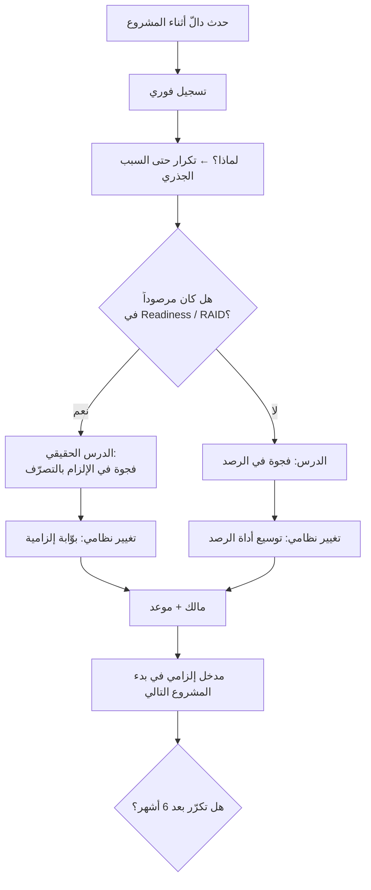

# الدروس المستفادة (Lessons Learned)

> [!info] تعريف مختصر
> **الدروس المستفادة** ممارسة تحوّل تجربة المشروع إلى **معرفة مؤسسية قابلة للتطبيق** — لا إلى محضر يُؤرشَف. وشرط صحّتها أن يصل كل درس إلى **السبب الجذري** لا إلى وصف العَرَض، وأن ينتهي إلى **تغيير في نظام العمل نفسه** (قالب، بوّابة، معيار، دور) لا إلى توصية عامة. والمعيار الحاسم لنضج المؤسسة: **المنظّمة الناضجة لا تكرّر نفس الخطأ مرّتين.**

## الشرح العلمي والاحترافي

- **البنية الرباعية الإلزامية**: الدرس الذي ينفع يُكتب في أربعة أعمدة لا في فقرة:
  | العمود | ما يحمله | الخطأ الشائع |
  |---|---|---|
  | **المجال** | البيانات · النطاق · الاختبار · التقارير | إغفاله فتضيع القابلية للتصنيف |
  | **المشكلة** | ما حدث فعلاً | الاكتفاء به وحده |
  | **السبب** | **لماذا حدث** | كتابة عَرَض آخر بدل سبب |
  | **التوصية** | **تغيير في النظام** | كتابة نصيحة عامة («نهتمّ بالبيانات») |

- **اختبار السبب الجذري**: إن كان بإمكانك سؤال «ولماذا؟» بعد السبب المكتوب وتحصل على جواب أعمق، فلم تصل بعد. مثال: «تكرار المنتجات» ← *لماذا؟* ← «ضعف حوكمة البيانات» ← *لماذا؟* ← «لا مالك لبيانات الأصناف». والتوصية تُبنى على آخر طبقة لا أولاها.

- **التوصية يجب أن تكون تغييراً في النظام**: الفرق بين توصيتين:
  | توصية عاجزة | توصية عاملة |
  |---|---|
  | «نهتمّ بالبيانات مبكّراً» | **بوّابة إلزامية: لا انتقال إلى البناء قبل 80% جاهزية بيانات** |
  | «نضبط النطاق» | **`Change Gate` — كل طلب يمرّ بتقييم قيمة وأثر قبل القبول** |
  | «نشرك المستخدمين» | **[[RACI]] يجعل العميل `Responsible` عن تنفيذ الاختبار** |
  | «نسرّع القرارات» | **[[SLA]] 48 ساعة ومالك قرار وحيد** |
  
  الأولى تعتمد على النيّة، والثانية على البنية. والنيّة لا تنتقل بين المشاريع؛ والبنية تنتقل.

- **الاكتشاف الأقسى — أغلب الدروس كانت معروفة مسبقاً**: حين تقارن سجلّ الدروس بـ[[Readiness Assessment|تقييم الجاهزية]] المُعدّ في الأسبوع الأول، تجد في الغالب أن ثلاثة من أربعة دروس **كانت مرصودة قبل بدء المشروع**. أي أن المشكلة ليست في الرصد بل في **التصرّف**. ومن هنا يأتي الدرس الذي لا يُكتب عادةً في السجلّ:
  > **الأداة التي تُملأ ولا تُنفَّذ أخطر من الأداة الغائبة — لأنها تمنح شعوراً زائفاً بالسيطرة.**

- **الفرق عن `Retrospective`**: الاستعادة (`Retrospective`) ممارسة **دورية داخل الفريق** تحسّن طريقة عمله في السبرنت التالي، مداها قصير وأثرها محلّي. أمّا الدروس المستفادة فممارسة **مؤسسية عند الإغلاق** تحسّن نظام التسليم كلّه، مداها بين المشاريع. والاثنتان لا تغنيان عن بعضهما.

- **لماذا تفشل معظم سجلّات الدروس؟** لثلاثة أسباب متراكبة: تُكتب في نهاية المشروع حين تكون الذاكرة باهتة والفريق منفضّاً؛ وتُصاغ بلغة دبلوماسية تتجنّب تسمية السبب؛ وتُخزَّن في مكان لا يمرّ به أحد عند بدء المشروع التالي. والعلاج الثلاثي: **اجمعها أثناء المشروع لا بعده · سمِّ السبب لا الشخص · اجعلها مدخلاً إلزامياً في قائمة بدء المشروع القادم.**

## أين ومتى يُستخدم
- **أثناء المشروع** عند كل حدث دالّ (تجاوز حدّ، إعادة عمل كبيرة، تصعيد) — لا عند الإغلاق وحده.
- في **إغلاق المشروع** لتجميع الدروس وتصنيفها واشتقاق التغييرات النظامية.
- في **بدء المشروع التالي** كمدخل إلزامي على [[Readiness Assessment]] و[[RAID Log]].
- في **تحديث القوالب المؤسسية**: كل درس ناضج يجب أن يُغيّر قالباً أو بوّابة أو معياراً.
- في **تدريب المنضمّين الجدد**: سجلّ الدروس المصنَّف أنفع من أي دليل نظري.

## مثال وسيناريو تطبيقي
> [!example] أربعة دروس — وخامس غير مكتوب
> | المجال | المشكلة | السبب | التوصية |
> |---|---|---|---|
> | البيانات | تكرار المنتجات | ضعف الحوكمة | تنظيف مبكّر |
> | النطاق | كثرة طلبات التغيير | ضعف تجميد النطاق | `Change Gate` |
> | الاختبار | ضعف المشاركة | ضعف الملكية | تدريب مبكّر |
> | التقارير | تأخّر الاعتماد | **تعدّد أصحاب القرار** | `SLA` للقرارات |
>
> **القراءة الأولى:** سجلّ جيد — أسباب مسمّاة وتوصيات محدّدة.
>
> **القراءة الثانية (بمقارنته بتقييم الجاهزية في الأسبوع الأول):**
> - «تكرار المنتجات» ← كان `Data Readiness = 🔴` من اليوم الأول.
> - «تعدّد أصحاب القرار» ← كان `Decision Governance = 🔴` من اليوم الأول.
> - «ضعف مشاركة الاختبار» ← كان `Key Users = 🟡` من اليوم الأول.
>
> **ثلاثة من أربعة كانت مرصودة قبل أن تحدث.**
>
> **الدرس الخامس — وهو الوحيد الذي يستحقّ أن يغيّر النظام:** المشكلة ليست في غياب الرصد بل في غياب **الإلزام بالتصرّف**. والتوصية النظامية المشتقّة منه: **لا يُغلق تقييم الجاهزية قبل أن يقابل كل بند أحمر بندٌ في [[RAID Log]] له مالك وموعد وإجراء** — وهذه بوّابة، لا نصيحة.

## خطوات أو مخطّط
1. سجّل الدروس **أثناء** المشروع في سجلّ مفتوح — لا في جلسة ختامية واحدة.
2. لكل درس: اكتب المجال والمشكلة، ثم اسأل «ولماذا؟» حتى تصل إلى سبب لا يقبل السؤال.
3. تحقّق: هل كان هذا السبب مرصوداً في تقييم الجاهزية أو `RAID`؟ إن نعم، **فالدرس الحقيقي في الإهمال لا في المشكلة**.
4. حوّل كل سبب إلى **تغيير نظامي**: قالب أو بوّابة أو معيار أو دور.
5. عيّن مالكاً لتنفيذ كل تغيير — الدرس بلا مالك لا يُطبَّق.
6. أدرج السجلّ في قائمة بدء المشروع التالي كمدخل إلزامي.
7. راجع بعد ستة أشهر: هل تكرّر أيّ من هذه الدروس؟ التكرار مقياس النضج الحقيقي.

## ⚠️ مفاهيم خاطئة شائعة
> [!warning]
> - **الخلط بينها وبين `Retrospective`**: الاستعادة دورية داخل الفريق، والدروس مؤسسية بين المشاريع.
> - **الاكتفاء بوصف المشكلة**: «تأخّرت البيانات» ليس درساً بل ملاحظة. الدرس يبدأ من السبب.
> - **صياغة توصيات عامة**: «نهتمّ أكثر» توصية تعتمد على النيّة ولا تنتقل بين المشاريع.
> - **الظنّ بأن جمعها في نهاية المشروع كافٍ**: الذاكرة تبهت والفريق ينفضّ؛ فتُكتب دروس مهذّبة بلا أسباب.
> - **اعتبارها ممارسة لوم**: الهدف تغيير النظام لا تسمية المقصّر؛ والصياغة يجب أن تسمّي **السبب لا الشخص**.
> - **افتراض أن تسجيلها = تعلّمها**: التعلّم يقاس بعدم التكرار لا بوجود الملف.

## ❌ ممارسات خاطئة في المشاريع
> [!failure]
> - **جلسة ختامية واحدة بعد انفضاض الفريق**: تُنتج سجلّاً باهتاً. الحلّ: سجلّ مفتوح يُغذَّى عند كل حدث دالّ.
> - **تخزين السجلّ حيث لا يمرّ به أحد**: يجعل التوثيق بلا أثر. الحلّ: اجعله مدخلاً إلزامياً في قائمة بدء المشروع.
> - **عدم مقارنة الدروس بتقييم الجاهزية الأوّلي**: يُفوّت أهمّ درس على الإطلاق. الحلّ: أضِف عموداً «هل كان مرصوداً مسبقاً؟».
> - **دروس بلا مالك تنفيذ**: توصيات معلّقة إلى الأبد. الحلّ: كل تغيير نظامي له مالك وموعد.
> - **صياغة تحمي الجميع فتقول لا شيء**: تُنتج سجلّاً مهذّباً عديم الفائدة. الحلّ: سمِّ السبب البنيوي صراحةً ولا تسمِّ الأشخاص.
> - **عدم مراجعة التكرار**: يحرمك من قياس النضج. الحلّ: مراجعة نصف سنوية تسأل: أي الدروس تكرّر؟

## 🔗 مصطلحات ومفاهيم ذات صلة
[[Readiness Assessment]] | [[RAID Log]] | [[Project Health Report]] | [[RACI]] | [[SLA]] | [[Scope Creep]] | [[Estimation Variance]] | [[24 - Value Tracking & Lessons Learned]]
