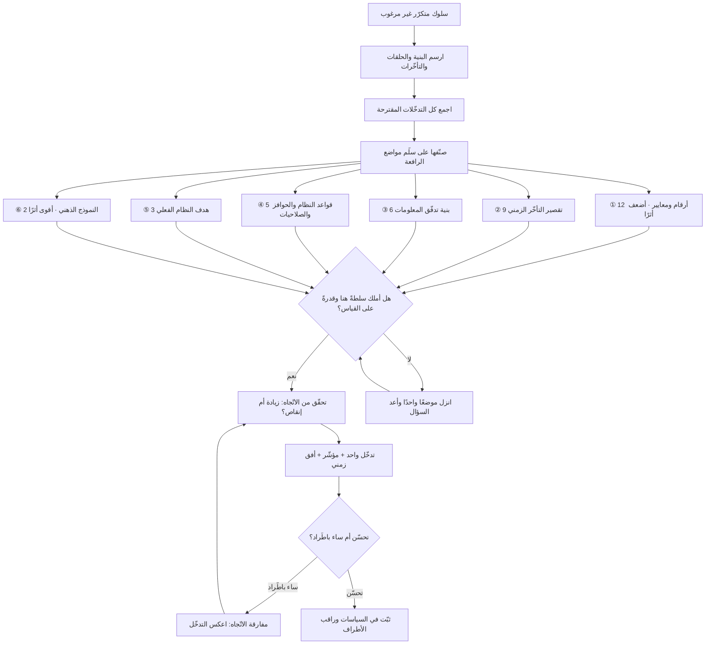

# مواضع الرافعة (Leverage Points)

> [!info] تعريف مختصر
> مواضع في بنية أي نظام يُحدث التدخّل فيها أثرًا يفوق حجم الجهد المبذول — وهي مرتّبة في سلّم معروف بحسب قوّة الأثر، صاغته عالمة الأنظمة **دونيلا ميدوز (Donella Meadows)**. والملاحظة المركزية في الصياغة أن الحدس الإداري ينجذب باستمرار إلى **أضعف المواضع أثرًا** — الأرقام والميزانيات والمعايير الرقمية — لأنها الأسهل رؤيةً والأسرع تنفيذًا وقياسًا، بينما تقع المواضع الأعلى أثرًا في **قواعد النظام، وتدفّق المعلومات، وأهدافه، والنموذج الذهني الذي وُلد منه**. وميدوز نفسها حذّرت من قراءة السلّم كوصفة، ونبّهت إلى أن التدخّل في المواضع العالية أصعب وأقلّ قابلية للتنبّؤ، وقد يأتي بعكس المقصود إن لم يُفهم النظام أولًا.

## الشرح العلمي والاحترافي
- **الأصل والنسبة**: نشرت **دونيلا ميدوز** المقالة المرجعية بعنوان **"Leverage Points: Places to Intervene in a System"** سنة 1999، وعادت فأدرجت الفكرة بصياغة مطوّرة في كتابها **"Thinking in Systems: A Primer"**. وميدوز امتداد لمدرسة **جاي فورستر (Jay Forrester)** في ديناميكا الأنظمة، وقد افتتحت المقالة بحكاية عن فورستر يصف بها أن الحدس يقود الناس عادةً إلى موضع الرافعة الصحيح، **لكن بالاتّجاه المعاكس** — فيدفعون حيث يجب أن يسحبوا.
- **السلّم من الأضعف إلى الأقوى (اثنا عشر موضعًا)**:
  1. **12 — الثوابت والمعايير والأرقام**: الرسوم، والميزانيات، ونسب المكافآت، وحدود الموافقة. أضعف المواضع أثرًا لأنها لا تغيّر بنية الحلقات، وهي مع ذلك موضع 90% من نقاشات الإدارة.
  2. **11 — أحجام المخزونات العازلة نسبةً إلى تدفّقاتها**: الاحتياطي الذي يمتصّ الصدمات. زيادته تعطي استقرارًا لكنها تبطئ الاستجابة وتُكلف، وهو منطق [[Contingency Reserve]] و[[Buffer]].
  3. **10 — بنية المخزونات والتدفّقات المادّية**: شبكة المسارات والعُقد نفسها. أثرها كبير لكن تغييرها بطيء ومكلف، فالأجدى غالبًا تصميمها صحيحةً من البداية.
  4. **9 — طول التأخّر الزمني نسبةً إلى سرعة تغيّر النظام**: تقصير الفجوة بين الفعل ومعرفة نتيجته. تدخّل قوي جدًّا في الأنظمة البطيئة الاستجابة، ومنه تنبع قيمة قِصر دورات التغذية الراجعة في العمل الرشيق.
  5. **8 — قوّة حلقات التوازن نسبةً إلى ما تصحّحه**: هل آلية التصحيح قادرة أصلًا على مجاراة حجم الانحراف؟ فريق جودة بشخصين أمام عشرين مطوّرًا حلقة توازن أضعف من أن تعمل، مهما اشتدّت التعليمات.
  6. **7 — قوّة حلقات التعزيز**: وهنا الرافعة في **إضعافها** لا تقويتها، لأن الحلقة المعزِّزة المنفلتة هي ما يُنتج التصاعد والانهيار. إبطاء حلقة تراكم [[Technical Debt]] أنفع من تسريع حلقة الإصلاح.
  7. **6 — بنية تدفّق المعلومات**: من يعلم ماذا ومتى. من أرخص التدخّلات وأقواها: مجرّد إيصال نتيجة قرارٍ إلى من يتّخذه — في الوقت المناسب وبلا وساطة — يغيّر السلوك دون أي أمر إداري.
  8. **5 — قواعد النظام**: الحوافز، والعقوبات، والقيود، وصلاحيات القرار. القواعد تصنع الحلقات نفسها، ولهذا يتنافس الأقوياء على كتابتها لا على تنفيذها. وفي المشاريع: من يملك حقّ قول «لا»، وما الذي يُكافأ عليه فعلًا.
  9. **4 — القدرة على تغيير البنية ذاتيًّا (التنظيم الذاتي)**: قدرة النظام على تعديل قواعده وبنيته بنفسه — أي التطوّر والتعلّم. وهو ما تسعى إليه فرق [[Self-Organizing Team]] وممارسات [[Kaizen]].
  10. **3 — هدف النظام**: الغرض الفعلي الذي يخدمه، لا المعلَن. تغيير الهدف يعيد ترتيب القواعد والحلقات والمعايير كلها تلقائيًّا؛ ونظام هدفه الحقيقي «شحن ميزات» يختلف كلّيًّا عن نظام هدفه «تحقيق أثر» ([[Outcome vs Output]]).
  11. **2 — النموذج الذهني (Paradigm) الذي وُلد منه النظام**: الافتراضات العميقة غير المفحوصة عن طبيعة العمل والقيمة والناس. من هذا النموذج تتفرّع الأهداف ثم القواعد ثم الأرقام، ولذلك أثره أعلى من كل ما تحته.
  12. **1 — القدرة على تجاوز النماذج الذهنية**: أن تدرك أن كل نموذج ذهني — بما فيه نموذجك — تمثيل ناقص لا حقيقة نهائية، فتحتفظ بالمرونة أمام تغيّر العالم.
- **قاعدة التصنيف الحاكمة**: كلّما ارتفع الموضع في السلّم، زاد أثره وقلّت كلفته المادّية وزادت **صعوبته السياسية والنفسية**، وقلّت قابلية أثره للتنبّؤ. تخفيض رسم أو رفع ميزانية قرار يُتّخذ في اجتماع؛ أمّا تغيير ما يُكافأ عليه الناس فعلًا، أو تغيير هدف المنظومة، فمواجهة مع مصالح راسخة وعادات ذهنية. ولهذا تتركّز الطاقة الإدارية عند القاع: لا لأنه مجدٍ، بل لأنه آمن وقابل للعرض في شريحة.
- **مفارقة الاتّجاه**: التحذير الأشهر في المقالة هو أن الناس يجدون موضع الرافعة الصحيح ثم يدفعون في الاتّجاه الخاطئ. أمثلته في المشاريع كثيرة: إضافة أفراد إلى مشروع متأخّر فيزداد تأخّرًا؛ وتشديد الرقابة على فريق متعثّر فتقلّ مبادرته ويسوء أداؤه؛ وزيادة المخزون العازل لامتصاص التقلّب فيُخفى مصدر التقلّب ويستمرّ. المؤشّر العملي على وقوعك في المفارقة: التدخّل صحيح المنطق ظاهريًّا، والنتيجة تسوء باطّراد كلّما زدت منه.
- **علاقة السلّم بالسياسات لا بالأشخاص**: أغلب التدخّلات عالية الأثر تقع في المستويات 6 و5 و3 — أي في **تدفّق المعلومات، والقواعد، والهدف** — وكلها سياسات لا أفراد. وهذا يفسّر لماذا يفشل استبدال الأشخاص في تغيير السلوك المتكرّر: العنصر تغيّر والبنية لم تتغيّر، فأعادت إنتاج السلوك نفسه بعنصر جديد. وهي الفكرة نفسها التي يقوم عليها [[Systems Thinking]].
- **حدود الاستعمال**: السلّم أداة **ترتيب أولويات وتفكير**، لا مقياسًا كمّيًّا ولا وصفة ترتيبية تُنفَّذ من الأعلى إلى الأسفل. ميدوز نفسها وصفته بأنه قائمة مؤقّتة قابلة للنقد. والتدخّل في المستويات العليا دون فهم كافٍ للنظام قد يُحدث اضطرابًا واسعًا يصعب التراجع عنه؛ ولهذا فإن التسلسل العملي الحكيم هو: افهم البنية أولًا، ثم تدخّل في أعلى موضع تملك فيه سلطةً حقيقية وقدرةً على قياس الأثر والتراجع.

## أين ومتى يُستخدم
- **بعد إتمام التحليل النُّظُمي**: لترتيب التدخّلات المرشّحة بحسب قوّة الأثر لا سهولة التنفيذ، وهو الاستعمال الأصلي للأداة.
- **في مراجعة استراتيجية المنتج**: للتمييز بين قرار يعدّل معيارًا رقميًّا (منخفض الأثر) وقرار يغيّر ما تقيسه المؤسّسة أو تكافئ عليه ([[North Star Metric]]، [[OKR]]) — وهو تدخّل عند مستوى الهدف.
- **في تشخيص مبادرة تحسين متعثّرة**: بسؤال واحد حاسم: عند أي مستوى تدخّلنا؟ فإن كان التدخّل كله عند مستوى الأرقام والميزانيات، فقد فُسِّر الفشل قبل أن يقع.
- **في تصميم الحوكمة وتوزيع الصلاحيات**: لأن قواعد من يقرّر ماذا (المستوى 5) أعلى أثرًا بكثير من أي إجراء تفصيلي، وهو ما يعالجه [[Governance]] و[[Steering Committee]].
- **في معالجة تكرار الحوادث والعيوب**: لتحويل النقاش من زيادة عدد المراجعين (مستوى 8 بصيغة ضعيفة) إلى تقصير حلقة التغذية الراجعة (مستوى 9) ونشر المعلومة لمن يقرّر (مستوى 6) — كما في منطق [[Shift-Left and Shift-Right]].
- **في التحوّل إلى نمط عمل [[AI-Native]]**: لأن أعلى الرافعات هناك ليست شراء أداة، بل تغيير قواعد الملكية والمراجعة وإتاحة المعرفة ([[Knowledge Management]]) وما تقيسه المؤسّسة.
- **في تحليل مقاومة التغيير**: إذ يفسّر السلّم لماذا تسهل الموافقة على تعديل ميزانية وتستحيل على تعديل صلاحية — فالثاني يمسّ قواعد السلطة لا الأرقام.

## مثال وسيناريو تطبيقي
> [!example] شركة تجارة إلكترونية في الدوحة، مشكلتها المزمنة: نسبة إرجاع الطلبات 23% (متوسّط قطاعها نحو 12%)، وكلفة الإرجاع السنوية تقارب 4.1 مليون ريال، وتقييم التطبيق 2.9 من 5.
> **جولة التدخّلات عند القاع (مستوى 12)**: خلال عامين جُرّب — رفع ميزانية خدمة العملاء 30%، ثم تشديد سياسة الإرجاع من 30 يومًا إلى 14، ثم خصم على الشحن، ثم مكافأة شهرية لفريق الدعم. النتيجة: الإرجاع 21% بعد كل ذلك، والتقييم انخفض إلى 2.6 لأن تشديد سياسة الإرجاع أغضب العملاء دون أن يمسّ سبب الإرجاع أصلًا.
> **التحليل ثم ترتيب المواضع**: بتحليل 3,000 حالة إرجاع تبيّن أن 68% منها سببها **عدم مطابقة المنتج للتوقّع** — مقاسات غير دقيقة، وصور مضلّلة، ووصف ناقص. ثم تبيّن السبب البنيوي: فريق المحتوى يُقاس بعدد المنتجات المنشورة أسبوعيًّا، وكلفة الإرجاع تُحمَّل بالكامل على مركز تكلفة العمليات، ولا يصل إلى فريق المحتوى أي بيانات عن أسباب الإرجاع. أي أن **من يصنع السبب لا يرى النتيجة ولا يتحمّل كلفتها ويُكافأ على ما يزيدها**.
> **التدخّلات المرتّبة بالسلّم**: ① **مستوى 6 — تدفّق المعلومات**: لوحة أسبوعية تُظهر لكل محرّر محتوى أسباب إرجاع منتجاته بالاسم. تكلفتها شبه معدومة، وأثرها بعد ستّة أسابيع وحدها: انخفاض الإرجاع إلى 18% دون أي أمر إداري — فقط لأن الفاعل صار يرى نتيجة فعله. ② **مستوى 9 — تقصير التأخّر**: كان الإرجاع يظهر في تقرير ربعي، فصار يظهر خلال 72 ساعة، فقصرت المسافة بين الخطأ واكتشافه. ③ **مستوى 5 — القواعد**: تحميل نسبة من كلفة الإرجاع على مركز تكلفة المحتوى، وربط تقييم الفريق بجودة الوصف لا بعدده، ومنح المحرّر صلاحية تعليق نشر منتج ناقص البيانات. ④ **مستوى 3 — الهدف**: إعادة تعريف هدف فريق المحتوى من «تغطية الكتالوج» إلى «مطابقة التوقّع».
> **النتيجة بعد ثلاثة أرباع**: الإرجاع 9.4%، وكلفته السنوية أقل من 1.8 مليون ريال، والتقييم 4.1. وقد أُعيدت سياسة الإرجاع إلى 30 يومًا (بل صارت ميزة تسويقية) — أي أن التدخّل الوحيد من مستوى 12 لم يُلغَ فقط، بل انعكس اتّجاهه بعد إصلاح البنية.

## خطوات أو مخطّط
1. صف السلوك المزعج عبر الزمن، وتأكّد أنه نمط متكرّر لا حادث مفرد.
2. ارسم البنية المنتِجة له: العناصر، والحلقات المسيطرة، والتأخّرات ([[Systems Thinking]]).
3. اجمع كل التدخّلات المقترحة من الفريق دون فرز أوّلي.
4. صنّف كل مقترح على مستواه في السلّم — وستجد غالبًا أن أغلبها عند المستوى 12.
5. اسأل عن كل موضع أعلى: هل يمكن التدخّل فيه؟ من يملك القرار؟ وما كلفته السياسية؟
6. تحقّق من الاتّجاه صراحةً: هل نحتاج إلى **زيادة** هذا المتغيّر أم **إنقاصه**؟ واختبر السيناريو المعاكس قبل التنفيذ.
7. اختر أعلى موضع تملك فيه سلطة حقيقية وقدرة على القياس والتراجع — لا أعلى موضع في السلّم مطلقًا.
8. ابدأ بتدخّلات تدفّق المعلومات (المستوى 6) حين تكون متاحة، فهي الأرخص والأسرع أثرًا والأقلّ مخاطرة.
9. حدّد سلفًا المؤشّر المتوقّع تغيّره والأفق الزمني، وسجّله في [[Decision Log]].
10. راقب أطراف النظام بحثًا عن آثار غير مقصودة، وراجع الترتيب دوريًّا فمواضع الرافعة تتغيّر بتغيّر حالة النظام.

## ⚠️ مفاهيم خاطئة شائعة
> [!warning]
> - **قراءة السلّم كوصفة تُنفَّذ من الأعلى**: التدخّل في مستوى الهدف أو النموذج الذهني دون فهم كافٍ للنظام قد يُحدث اضطرابًا واسعًا بلا قدرة على التراجع. القاعدة العملية: أعلى موضع **تملك فيه سلطةً وقدرةً على القياس**، لا أعلى موضع في القائمة.
> - **الظنّ بأن التدخّلات الضعيفة عديمة الجدوى**: تعديل معيار رقمي قد يكون صحيحًا وضروريًّا وسريعًا. الخطأ ليس في استعماله، بل في **الاكتفاء به** وتوقّع أن يحلّ مشكلة بنيوية.
> - **الخلط بين قوّة الأثر وسهولة التنفيذ**: يُفترض أن الأقوى أثرًا هو الأصعب دائمًا، لكن تدخّلات تدفّق المعلومات (المستوى 6) كثيرًا ما تكون من الأرخص والأسرع تنفيذًا وأعلاها مردودًا في الوقت نفسه.
> - **إهمال مفارقة الاتّجاه**: يُختار الموضع الصحيح ثم يُدفَع في الاتّجاه العكسي — كزيادة الرقابة حيث تلزم الاستقلالية، أو زيادة المخزون العازل حيث يلزم كشف مصدر التقلّب. المؤشّر: كلّما زدت من التدخّل ساءت النتيجة.
> - **افتراض ثبات مواضع الرافعة**: الموضع الأعلى أثرًا في نظام ما وفي لحظة ما ليس كذلك بالضرورة بعد سنة أو في نظام آخر. السلّم يوجّه السؤال ولا يعطي الجواب جاهزًا.
> - **الاعتقاد بأن الأداة تخصّ القيادة العليا وحدها**: كل مستوى تنظيمي يملك مواضع رافعة ضمن نطاقه — ما يقيسه الفريق لنفسه، وما يُتاح من معلومات داخله، وقواعد عمله المكتوبة ([[Team Working Agreement]]).
> - **نسبة السلّم إلى «التفكير النُّظُمي» عمومًا بلا تحديد**: السلّم صياغة محدّدة لميدوز داخل تقليد ديناميكيا الأنظمة، وليس إجماعًا عامًّا؛ وهي نفسها عرضته باعتباره قائمة قابلة للمراجعة والنقد.

## ❌ ممارسات خاطئة في المشاريع
> [!failure]
> - **حصر النقاش في الميزانيات والمعايير الرقمية**: كل اجتماع تحسين ينتهي بتعديل رقم أو إضافة موارد. لماذا يضرّ: يستهلك الموازنة والزخم السياسي في أضعف المواضع أثرًا، ثم يُنتج قناعة بأن «المشكلة مستعصية» بينما لم تُمَسّ بنيتها أصلًا. الحل: افرض في كل مراجعة أن يُصنَّف كل مقترح على مستواه، وأن يُطرح مقترح واحد على الأقل من مستوى القواعد أو تدفّق المعلومات.
> - **حجب النتائج عمّن يتّخذ القرار المسبّب لها**: تصل بيانات الأثر إلى الإدارة والتقارير ولا تصل إلى الفاعل نفسه. لماذا يضرّ: يعطّل أقوى حلقة تصحيح ذاتي وأرخصها، فيُستبدَل بها إشراف إداري مكلف وأقلّ فاعلية. الحل: أوصل نتيجة كل قرار إلى صاحبه بأسرع ما يمكن وبأقلّ وساطة.
> - **الإبقاء على حوافز تكافئ ما تشكو منه**: تُطلب الجودة بينما التقييم يقيس الكم وحده. لماذا يضرّ: القواعد (المستوى 5) تهزم الخطابة دائمًا، ويقرأ الفريق ما يُكافأ عليه لا ما يُقال له. الحل: راجع الحوافز أولًا في أي مبادرة تحسين، واعتبر أي تعارض بينها وبين الهدف المعلَن سببًا كافيًا لفشل المبادرة.
> - **الاستمرار في تدخّل تسوء نتائجه باطّراد**: يُضاعف التدخّل كلّما ساءت النتيجة بافتراض أن الجرعة غير كافية. لماذا يضرّ: هذا هو العَرَض الكلاسيكي لمفارقة الاتّجاه، والمضاعفة تعمّق الضرر. الحل: عند تدهور مطّرد مع زيادة الجرعة، جرّب عكس الاتّجاه على نطاق محدود قبل أي تصعيد.
> - **تغيير الأشخاص بدل تغيير القواعد**: يُستبدَل مدير أو فريق عند تكرار المشكلة. لماذا يضرّ: تغيير العناصر أضعف أنواع التدخّل، والبنية تعيد إنتاج السلوك نفسه بالعنصر الجديد خلال أشهر — مع خسارة المعرفة المتراكمة. الحل: عالج القواعد والصلاحيات وتدفّق المعلومات قبل الحكم على الأشخاص.
> - **التدخّل في مواضع متعدّدة دفعةً واحدة**: تُطلق حزمة إصلاحات شاملة معًا. لماذا يضرّ: يستحيل عزل ما نفع ممّا ضرّ، وتتشوّش القراءة بالتأخّرات الزمنية المتفاوتة، فيُنسب النجاح والفشل عشوائيًّا. الحل: تدخّل واحد عالي الأثر في كل مرّة، بمؤشّر معلَن وأفق زمني كافٍ.
> - **تجاهل الكلفة السياسية للتدخّلات العالية**: يُقرَّر تغيير قاعدة صلاحية أو هدف إدارة في اجتماع فنّي. لماذا يضرّ: تُقاوَم التغييرات العليا بحلقات توازن تنظيمية خفيّة تعيد النظام إلى حاله بهدوء، فيبدو التدخّل «مطبَّقًا» وهو مفرَّغ. الحل: عامل التدخّل العالي كمبادرة تغيير كاملة لها راعٍ ([[Sponsor]]) وخطة تواصل ومنهج مثل [[ADKAR Model]].

## 🔗 مصطلحات ومفاهيم ذات صلة
[[Systems Thinking]] | [[Workflow]] | [[AI-Native]] | [[Knowledge Management]] | [[Theory of Constraints]] | [[Feedback Loop]] | [[Outcome vs Output]] | [[North Star Metric]] | [[Governance]] | [[Root Cause Analysis]] | [[Technical Debt]] | [[Self-Organizing Team]] | [[Decision Log]]
