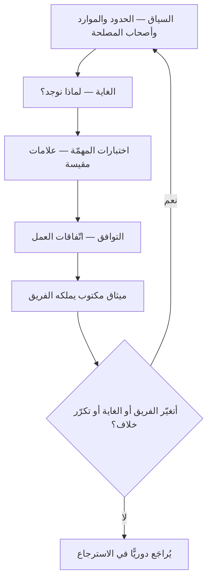

# الانطلاق وميثاق أجايل (Liftoff)

> [!info] تعريف مختصر
> **الانطلاق (Liftoff)** حدثٌ مقصود في بداية عمل الفريق — أو عند تغيّر جوهريّ فيه — غايته أن يخرج الفريق منه بـ**ميثاق (Charter)** يجيب عن ثلاثة أسئلة: **الغاية (Purpose)** لماذا نوجد ومتى نعرف أننا نجحنا؛ **التوافق (Alignment)** كيف نعمل معًا؛ **السياق (Context)** ما حدودنا ومن حولنا وما المتاح لنا. صاغه بهذه الصورة **ديانا لارسن (Diana Larsen)** و**أينزلي نيس (Ainsley Nies)** في كتاب *Liftoff*. **وفرقه عن اجتماع البدء المعتاد** أن ذاك يُعلن الخطة، وهذا **يُنتج اتّفاقًا**: مخرَجُه وثيقةٌ يملكها الفريق ويراجعها، لا عرضٌ يُقدَّم إليه.

## الشرح العلمي والاحترافي

### 1. أركان الميثاق الثلاثة

| الركن | يجيب عن | ما يُكتب فيه |
|---|---|---|
| **الغاية** | لماذا يوجد هذا الفريق؟ | رؤية موجزة · مهمّة · **اختبارات المهمّة**: علامات مقيسة نعرف بها أننا نبلغها |
| **التوافق** | كيف نعمل معًا؟ | اتّفاقات العمل · من في الفريق الأساسي · قواعد بسيطة يلتزمها الجميع |
| **السياق** | ماذا حولنا؟ | الحدود والصلاحيات · الموارد الملتزَم بها · من يؤثّر فينا ونؤثّر فيه · ما نتوقّعه من عقبات |

**وأثقل ما في الثلاثة هو «اختبارات المهمّة».** فالغاية بلا علامة مقيسة عبارةٌ تُعلَّق على الجدار؛ والعلامة تحوّلها إلى شيء يمكن أن يُقال بعد ستّة أشهر: بلغناه أو لم نبلغه.

### 2. لماذا حدثٌ مستقلّ ولا يكفي أوّل سبرنت؟

لأن الأسئلة الثلاثة **لا تُطرح أبدًا** إن لم يُفرَد لها وقت. فالفريق الذي يبدأ بأوّل مهمّة يبدأ العمل بافتراضات لم يقلها أحد: أن الجميع يفهم الهدف نفسه، وأن الصلاحيات معروفة، وأن أصحاب المصلحة متّفقون. وهذه الافتراضات لا تظهر خطؤها في الأسبوع الأوّل، بل في الشهر الثالث حين يتّضح أن نصف الفريق كان يبني شيئًا وأصحاب المصلحة ينتظرون آخر.

**والانطلاق ليس بالضرورة يومًا كاملًا.** فمقداره بمقدار ما هو مجهول: فريقٌ يعرف بعضه ويعمل على منتج قائم قد يكفيه نصف يوم؛ وفريقٌ جديد على منتج جديد بأصحاب مصلحة متعدّدين يحتاج يومين.

### 3. موضعه من المواثيق الأخرى في المستودع

هذه أكثر ما يُخلط في هذا الباب، والفرق بينها فرق **صاحب الوثيقة** لا فرق شكل:

| الوثيقة | من يملكها | تجيب عن |
|---|---|---|
| **ميثاق المشروع** (Project Charter) | الراعي — ويُصدره لتفويض المشروع وتسمية مديره | أهذا المشروع مأذون به؟ ومن يقوده؟ |
| [[Delivery Charter\|وثيقة التسليم]] | طبقة التسليم | كيف تُحقَّق القيمة وتُحمى أثناء التنفيذ؟ |
| **ميثاق أجايل** (Liftoff Charter) | **الفريق نفسه** | لماذا نوجد؟ وكيف نعمل معًا؟ وما حدودنا؟ |

> **السؤال الفارق:** ميثاق المشروع **يأذن**، ووثيقة التسليم **تحمي القيمة**، وميثاق أجايل **يوائم الناس**. ولهذا لا يُغني أحدها عن الآخر، ولا يُكتب ميثاق أجايل نيابةً عن الفريق — فوثيقةٌ كُتبت عنه وسُلّمت إليه فقدت وظيفتها كلّها، إذ قيمتها في الحوار الذي أنتجها لا في نصّها.

### 4. الميثاق وثيقة حيّة

الميثاق الذي يُكتب مرّة ويُعلَّق يصير زينة. وهو يُراجَع عند ثلاثة: **تغيّر في تركيبة الفريق** (فمن انضمّ لم يشارك في الحوار الذي أنتجه)، و**تغيّر في الغاية أو أصحاب المصلحة**، وعند **تكرار خلاف يعود إلى أحد أركانه الثلاثة**.

**وأنفع موضع لمراجعته هو [[10 - Sprint Retrospective|الاسترجاع]]** — فمتى كان أصل الخلاف المتكرّر في اتّفاقات العمل، فالإصلاح في الميثاق لا في السلوك.

## أين ومتى يُستخدم

- عند تكوين فريق جديد، أو عند إسناد منتج جديد إلى فريق قائم.
- بعد إعادة هيكلة تنظيمية غيّرت من في الفريق أو من فوقه.
- عند بدء برنامج يشترك فيه أكثر من فريق، فيلزم كلًّا منها ميثاق ويلزم بينها توافق.
- حين يتكرّر السؤال داخل الفريق: «ولماذا نفعل هذا أصلًا؟» — فهو عَرَض غياب الركن الأوّل.
- في الفرق الموزّعة، إذ يعوّض الميثاق المكتوب ما تعطيه الغرفة الواحدة تلقائيًّا.

## مثال وسيناريو تطبيقي

> [!example] سيناريو ملموس
> فريق من سبعة كُوِّن لبناء تطبيق حجز مواعيد لعيادات. وعُقد له انطلاق في يوم واحد.
>
> **الغاية:** «نجعل حجز الموعد أسهل من الاتّصال الهاتفي.» **واختبارات المهمّة** — وهي التي أخذت أطول نقاش في اليوم: أن يبلغ الحجز الذاتيّ 40% من المواعيد خلال ستّة أشهر، وأن تنخفض المواعيد الفائتة بغير إشعار من 18% إلى أقلّ من 10%.
>
> **التوافق:** اتّفاقات عمل مكتوبة، منها: «لا يُدمج عمل بلا مراجعة»، و«العائق يُعلن يوم ظهوره لا في الاجتماع التالي»، و«ساعات التداخل من 10 إلى 2 لاختلاف مواقعنا».
>
> **السياق:** ما يقرّره الفريق وحده وما يُرفع؛ والموارد الملتزَم بها — وهنا ظهر الأهمّ: أن مصمّم الواجهة **مشترك مع فريقين آخرين بنسبة الثلث**، وهو ما لم يكن أحد يعلمه صراحةً وإن كان الجميع يفترضه بخلافه.
>
> **وأثر ذلك اليوم كلّه ظهر في الشهر الرابع:** حين طُلبت من الفريق ميزة «التقييمات والمراجعات» على أنها أولوية. فعُرضت على اختبارات المهمّة، فلم تخدم أيًّا منهما، فأُجّلت بجملة واحدة بدل نقاش ثلاثة أسابيع. **والفارق أن الرفض استند إلى وثيقة اتّفق عليها الجميع سلفًا** — لا إلى رأي مالك المنتج في مواجهة رأي غيره.

## خطوات أو مخطّط

1. حدّد من يحضر: الفريق كلّه، ومالك المنتج، ومن يملك تفويضه من أصحاب المصلحة — لا من يمثّلهم بلا صلاحية.
2. ابدأ بالسياق لا بالغاية: من نحن؟ وما حدودنا؟ وما المتاح فعلًا؟ فالغاية المصوغة بلا معرفة الحدود أمنية.
3. صُغ الغاية، ثم **لا تتركها حتى تُكتب لها اختبارات مقيسة**.
4. اكتب اتّفاقات العمل بصيغة سلوك يُرى، لا بصيغة قيمة يُؤمَن بها.
5. سجّل الافتراضات التي لم يُحسم أمرها، ومن يتحقّق منها ومتى.
6. أعلن الميثاق حيث يراه الفريق كل يوم، وحدّد موعد أوّل مراجعة له.

## ⚠️ مفاهيم خاطئة شائعة

> [!warning]
> - **حسبانه اجتماع بدء (Kickoff).** اجتماع البدء يُعلن الخطة ويُبلِّغ، والانطلاق **يُنتج اتّفاقًا** مخرَجه وثيقة يملكها الفريق.
> - **الظنّ أنه ميثاق المشروع بلفظ آخر.** ميثاق المشروع يصدر عن الراعي ليأذن بالمشروع؛ وميثاق أجايل يصدر عن الفريق ليوائم بين أعضائه. انظر جدول البند الثالث.
> - **كتابته نيابةً عن الفريق.** فالوثيقة أثرٌ للحوار لا بديل عنه؛ ومن تسلّم ميثاقًا لم يشارك في صنعه تسلّم ورقة.
> - **الظنّ أنه يلزم يومًا كاملًا دائمًا.** مقداره بمقدار المجهول، وقد يكفي نصف يوم لفريق يعرف بعضه على منتج قائم.
> - **حسبانه حدثًا يقع مرّة.** بل يُعاد عند تغيّر التركيبة أو الغاية، وإلا صار وثيقةً تصف فريقًا لم يعد موجودًا.

## ❌ ممارسات خاطئة في المشاريع

> [!failure]
> - **صياغة غاية بلا اختبارات مقيسة**، فتصير جملة تُقرأ ولا تُحتكم إليها — وهي أشيع أعطال المواثيق على الإطلاق.
> - **دعوة أصحاب المصلحة بلا تفويض**، فيُتّفق على حدود يُنقضها لاحقًا من يملك نقضها ولم يحضر.
> - **كتابة اتّفاقات عمل بصيغة قيم** («نحترم بعضنا» · «نتواصل بشفافية») لا يمكن الاحتكام إليها عند الخلاف، بدل سلوك يُرى («العائق يُعلن يوم ظهوره»).
> - **إغفال الموارد المشتركة في ركن السياق**، فيُبنى الجدول على طاقة كاملة والواقع ثلثها.
> - **إبقاء الميثاق بلا مراجعة بعد انضمام نصف الفريق الجديد**، فيصير اتّفاقًا بين غائبين.

## 🔗 مصطلحات ومفاهيم ذات صلة

[[Delivery Charter]] | [[Team Working Agreement]] | [[10 - Sprint Retrospective]] | [[Psychological Safety]] | [[Self-Organizing Team]] | [[Chain of Command]] | [[Stakeholder Map]] | [[Product Vision]] | [[OKR]] | [[Alignment]] | [[Cross-functional Team]] | [[Community of Practice]] | [[Definition of Done]]
