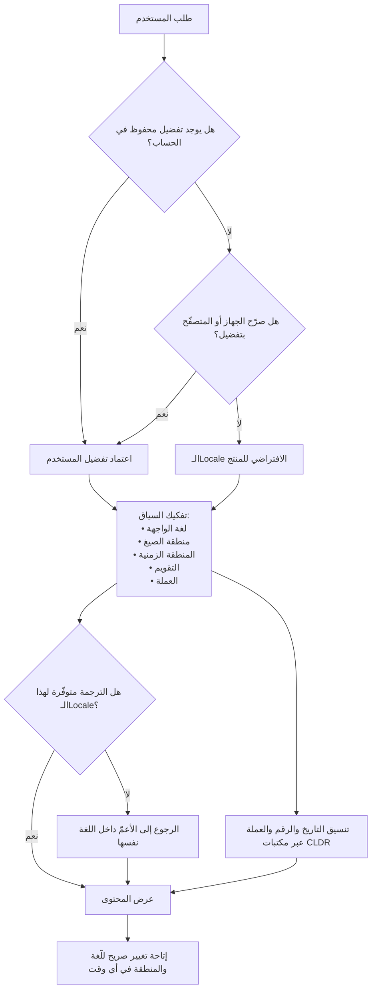

# إعدادات اللغة والمنطقة (Locale)

> [!info] تعريف مختصر
> معرّف مركّب يجمع **اللغة + المنطقة الجغرافية** (وأحيانًا نظام الكتابة وتفضيلات إضافية) ويحكم كل ما يتعلّق بعرض المعلومة للمستخدم: أي نصّ يُعرض، وبأي اتجاه، وبأي صيغة يُكتب التاريخ والوقت، وأي تقويم يُستخدم (ميلادي أم هجري)، وكيف تُكتب الأرقام وفواصلها العشرية والألفية، وأي رمز عملة وأين يوضع، وكيف تُرتَّب القوائم أبجديًّا، وكيف يُقاس ويُوزن. المفتاح الذهني: **الـLocale ليس اللغة**. «عربي» ليست Locale؛ أما `ar-SA` و`ar-EG` و`ar-MA` فثلاث Locales تتّفق في اللغة وتختلف في العملة والتقويم والمصطلح وأحيانًا في شكل الأرقام. وهو الوحدة الصحيحة للتخطيط في أي مشروع [[Localization|توطين]]، ولذلك يخطئ من يعدّ الأسواق باللغات.

## الشرح العلمي والاحترافي

- **البنية المعيارية للمعرّف**: يُكتب الـLocale وفق معيار وسوم اللغة المعروف بـ **BCP 47**، بترتيب تنازلي من العام إلى الخاص: `language-Script-REGION-variant`. فـ`ar` لغة فقط، و`ar-SA` عربي السعودية، و`zh-Hans-CN` صيني بالنظام المبسّط في الصين مقابل `zh-Hant-TW` بالنظام التقليدي في تايوان. ويمكن أن تُلحق به **امتدادات** تحدّد تفضيلات دقيقة مثل التقويم أو نظام الأرقام — وهذا ما يسمح مثلًا بطلب «عربي السعودية بالتقويم الهجري وأرقام هندية» كمعرّف واحد بدل إعدادات متفرّقة. أهمية المعيار عملية: كل المكتبات وقواعد البيانات وخدمات الترجمة تفهمه، فاختراع صيغة داخلية خاصة («SA_AR_1») يقطع المنتج عن المنظومة كلّها.

- **الـLocale ليس قيمة واحدة بل حزمة قرارات مستقلّة**: من الأخطاء المعمارية الشائعة معاملة الـLocale كمفتاح واحد يحدّد كل شيء دفعةً واحدة. في الواقع يفضّل المستخدمون تركيبات مختلطة: مقيم يريد واجهة إنجليزية بتاريخ هجري وعملة بالريال؛ أو مستخدم يريد واجهة عربية بأرقام لاتينية. لذلك التصميم الناضج يفصل بين **لغة الواجهة**، و**منطقة الصيغ**، و**المنطقة الزمنية**، و**التقويم**، و**العملة** — ويجعل الـLocale قيمة افتراضية ذكية لهذه الحقول، لا قيدًا يمنع تعديلها.

- **مصدر البيانات: CLDR لا الاجتهاد**: الصيغ الصحيحة لكل Locale (ترتيب عناصر التاريخ، أسماء الشهور والأيام، رمز العملة وموضعه، الفاصل العشري، فئات الجمع، قواعد الفرز) منشورة ومحدَّثة في مستودع **CLDR** التابع لاتحاد Unicode، وتعتمد عليه المتصفّحات وأنظمة التشغيل والمكتبات القياسية. القاعدة العملية: لا تكتب جدول صيغ يدويًّا أبدًا — ليس فقط لأنه ناقص، بل لأن هذه البيانات **تتغيّر** (تتبدّل رموز عملات، وتُعدَّل قواعد، وتُنشأ Locales جديدة)، وصيانة جدول يدوي عبء دائم بلا مقابل.

- **العربية حالة غنيّة بالتباينات داخل اللغة الواحدة**: الفروق بين `ar-SA` و`ar-EG` و`ar-MA` ليست تجميلية. تشمل: العملة (ريال/جنيه/درهم)، والتقويم (اعتماد الهجري رسميًّا في السعودية مقابل غلبة الميلادي في غيرها)، وأسماء الشهور الميلادية (يناير/فبراير في الخليج ومصر مقابل كانون الثاني/شباط في الشام)، وأول أيام الأسبوع، وشكل الأرقام (الأرقام العربية-الهندية ٠١٢٣ مقابل اللاتينية 0123)، وطبقة كاملة من المصطلحات الإدارية والتقنية. اختصار العالم العربي في «ar» واحدة قرار **تجاري** لا تقني، وله ثمن يظهر في [[Adoption|التبنّي]] وفي تذاكر الدعم.

- **التقويم الهجري بُعد أول لا تفصيل ثانوي في السياق الخليجي**: كثير من الوثائق الرسمية والعقود والمواعيد النظامية والإجازات تُؤرَّخ هجريًّا وفق تقويم أُمّ القرى. وهذا يفرض ثلاثة اشتراطات هندسية: أن يُخزَّن الوقت دائمًا بمرجع مطلق (توقيت عالمي موحّد) لا بنصّ التاريخ المعروض؛ وأن يجري التحويل عبر مكتبات معيارية لا بحساب تقريبي بمعادلة (لأن الشهر الهجري 29 أو 30 يومًا وفق تقويم معتمد لا معادلة رياضية بسيطة)؛ وأن تُعرض التواريخ الحسّاسة بالتقويمين معًا في المستندات الرسمية لتفادي الالتباس.

- **الأرقام والفواصل مصدر أخطاء مالية صامتة**: الفاصل العشري وفاصل الآلاف يتبادلان الدورين بين الـLocales؛ فما يُقرأ في Locale ما بوصفه ألفًا ومئتين وخمسين، قد يُقرأ في آخر بوصفه واحدًا وربعًا تقريبًا. الخطر هنا أن الخطأ **لا يرمي استثناء** بل يُنتج رقمًا صحيح الشكل خاطئ القيمة. لذلك القاعدة: تبادُل البيانات بين الأنظمة يتمّ بصيغة محايدة وثابتة (نقطة عشرية، بلا فواصل آلاف، وحدة عملة صريحة)، والتنسيق حسب الـLocale يحدث **عند العرض فقط**. وكذلك عند إدخال المستخدم: يُحلَّل الرقم وفق Locale الإدخال لا وفق افتراض ثابت.

- **الفرز والبحث يتبعان الـLocale**: ترتيب القائمة أبجديًّا يختلف بين اللغات، وفي العربية تظهر مسائل عملية: أشكال الهمزة والألف، والتاء المربوطة، والتشكيل، و«ال» التعريف — كلها تجعل الفرز الحرفي والبحث الحرفي يخالفان توقّع المستخدم. الحل معياري: استخدام قواعد المقارنة اللغوية (Collation) الخاصة بالـLocale، وتطبيع النصّ قبل الفهرسة والبحث.

- **آلية الاختيار والرجوع (Negotiation & Fallback)**: يحتاج النظام قاعدة صريحة لاختيار الـLocale: تفضيل محفوظ في حساب المستخدم أولًا، ثم إعداد المتصفّح أو الجهاز، ثم افتراض المنتج. ويحتاج كذلك **سلسلة رجوع** حين لا تتوفّر ترجمة: من `ar-EG` إلى `ar` ثم إلى لغة أساسية. الخطأ الشائع أن يكون الرجوع فوريًّا إلى الإنجليزية بدل المستوى الأعمّ من اللغة نفسها، فيرى المستخدم واجهة عربية تتخلّلها جمل إنجليزية مفاجئة. وخطأ آخر أن يُشتقّ الـLocale من **عنوان الشبكة الجغرافي**: مسافر أو مستخدم خلف شبكة خاصة سيجد لغة لا يقرأها، وقد لا يجد كيف يغيّرها لأن قائمة التغيير نفسها صارت بلغة مجهولة.

- **الـLocale يمسّ المنطق التجاري لا العرض فقط**: قد تختلف بحسب الـLocale أمور جوهرية: الضريبة المطبَّقة، وشكل الفاتورة النظامية، وطرق الدفع المتاحة، والوثائق المطلوبة للتحقّق ضمن [[KYC]]، وسياسة الاحتفاظ بالبيانات ونقلها عبر الحدود بموجب [[PDPL]] وما يماثلها. لذلك يجب أن يكون الـLocale متاحًا كسياق في طبقة الأعمال لا محصورًا في طبقة العرض — وإلا صار كل اشتراط محلّي شرطًا مبعثرًا في الكود.

## أين ومتى يُستخدم

- **في تعريف نطاق أي مشروع [[Localization|توطين]]**: تُعدّ الأسواق بالـLocales لا باللغات، وتُبنى التقديرات والجدولة على هذا الأساس لتفادي مفاجآت [[Estimation Variance]].
- **في تصميم نموذج بيانات المستخدم**: حقول اللغة والمنطقة والمنطقة الزمنية والتقويم والعملة تُخزَّن بمعرّفات معيارية، لا كنصوص حرّة يكتبها المستخدم أو يخمّنها النظام.
- **في تكامل الأنظمة وتبادل الملفات**: تحديد صيغة محايدة للتواريخ والأرقام في عقود التكامل، وهو أحد أكثر بنود [[Data Dry Run]] كشفًا للأخطاء قبل التشغيل الفعلي.
- **في التقارير والفواتير والمستندات الرسمية**: لتحديد التقويم والعملة وصيغة الأرقام المطلوبة نظاميًّا في كل سوق.
- **في تصميم الاختبارات**: يجب أن تُشغَّل مجموعة اختبارات على أكثر من Locale، لأن أخطاء الصيغ والفرز والجمع **لا تظهر إطلاقًا** في الـLocale الافتراضي — وهي حالة نموذجية من [[Edge Cases]].
- **في تحديد بيئات النشر**: يجب أن تتطابق إعدادات الـLocale بين [[Staging vs Production Environment|بيئة الاختبار والإنتاج]]، لأن خادمًا بإعداد نظام مختلف قد يُنسّق التواريخ والأرقام بصورة مغايرة فينتج خلل يظهر في الإنتاج وحده.
- **في تحليل بيانات الاستخدام**: تقسيم المؤشّرات حسب الـLocale يكشف فجوات حقيقية (انخفاض [[Adoption]] في سوق بعينه، أو ارتفاع الأخطاء في لغة واحدة) يخفيها المتوسّط العام — وهو تطبيق مباشر لمنطق [[Percentiles and Median vs Average]].

## مثال وسيناريو تطبيقي

> [!example] شركة تقنية سعودية تشغّل منصّة لإدارة العقود، وتخدم عملاء في السعودية والإمارات ومصر والأردن. المنصّة كانت تدعم «العربية» و«الإنجليزية» فقط كخيارين، بلا مفهوم منطقة إطلاقًا.
> تجمّعت خلال ربع واحد ثلاث حوادث تشغيلية كشفت الثمن. **الأولى**: عقد إيجار حكومي في السعودية كان تاريخ انتهائه مسجَّلًا هجريًّا في الوثيقة الأصلية، وأدخله الموظّف في النظام بعد تحويله يدويًّا بمعادلة تقريبية، فانحرف التاريخ بيومين، وأُرسل تنبيه التجديد بعد انقضاء مهلة الإشعار النظامية. **الثانية**: عميل مصري رأى مبالغ عقوده معروضة بالريال لأن رمز العملة كان مثبَّتًا في طبقة العرض بقيمة واحدة، فظنّ أن قيمة العقد أكبر بأضعاف وفتح نزاعًا استغرق حلّه أسبوعين. **الثالثة وأخطرها**: ملف تصدير يُرسل شهريًّا إلى نظام محاسبي لدى عميل إماراتي كان يُولَّد بصيغة أرقام تعتمد الفاصلة كفاصل آلاف، بينما يقرأها النظام المستقبل بوصفها فاصلًا عشريًّا. لم يفشل الاستيراد ولم يظهر أي خطأ — بل سُجّلت مبالغ مقسومة على ألف تقريبًا، ومرّ ذلك شهرين قبل أن يكتشفه محاسب في مطابقة ربعية.
> أعاد الفريق البناء على أساس الـLocale: أصبح لكل حساب مستخدم خمسة حقول مستقلّة (لغة الواجهة، منطقة الصيغ، المنطقة الزمنية، التقويم المفضّل، عملة العرض)، تُملأ افتراضيًّا من Locale واحد معياري ويمكن تعديل كل منها. خُزّنت كل التواريخ بتوقيت عالمي موحّد، ووُلّد التقويم الهجري عبر مكتبة معيارية لا معادلة، وعُرضت التواريخ النظامية بالتقويمين معًا. وأُعيدت كتابة كل ملفات التبادل بصيغة محايدة ثابتة مع توثيقها في عقد التكامل.
> ما رصده الفريق بعد ربعين: اختفت فئة كاملة من تذاكر الدعم كانت تُصنَّف سابقًا «شكوى غير مفهومة حول الأرقام أو التواريخ» وكانت تشكّل جزءًا معتبرًا من التذاكر مرتفعة الجدل. والأهم أن الأخطاء التي كانت **صامتة** — لا ترمي استثناءً ولا تظهر في السجلّات — صارت مستحيلة بنيويًّا.

## خطوات أو مخطّط

1. حصر الـLocales المستهدفة بمعرّفات معيارية (مثل `ar-SA`، `ar-EG`، `en-AE`) واعتمادها رسميًّا في وثيقة النطاق.
2. تفكيك الـLocale إلى حقوله المستقلّة في نموذج البيانات: لغة واجهة، منطقة صيغ، منطقة زمنية، تقويم، عملة عرض.
3. تعريف قاعدة الاختيار: تفضيل المستخدم المحفوظ ← إعداد الجهاز أو المتصفّح ← الافتراض؛ مع إتاحة تغيير صريح ودائم الظهور.
4. تعريف سلسلة الرجوع عند غياب الترجمة: من الأخصّ إلى الأعمّ داخل اللغة نفسها قبل اللجوء إلى لغة أخرى.
5. تخزين كل الأزمنة بمرجع مطلق مع معرّف المنطقة الزمنية، وكل المبالغ كقيمة عددية + رمز عملة منفصل.
6. توجيه كل تنسيق وتحليل وفرز إلى مكتبات معيارية تعتمد بيانات CLDR، ومنع أي تنسيق يدوي بقاعدة فحص آلي.
7. توحيد صيغة محايدة لتبادل البيانات مع الأنظمة الخارجية، وتوثيقها صراحةً في عقد التكامل.
8. تمكين طبقة الأعمال من قراءة سياق الـLocale لتطبيق القواعد المحلّية (الضريبة، وثائق التحقّق، متطلّبات الفوترة).
9. تشغيل مجموعة الاختبارات على أكثر من Locale، مع تضمين حالات حديّة: انقلاب المنطقة الزمنية، عملة بلا كسور، تاريخ هجري عند حدود الشهر، أرقام عربية-هندية.
10. مراقبة الأخطاء والاستخدام مقسّمة حسب الـLocale، لأن العطل المحصور في Locale واحد يختفي داخل المتوسّط العام.

## ⚠️ مفاهيم خاطئة شائعة

> [!warning]
> - **«اللغة = الـLocale»**: أشهر الأخطاء وأغلاها. «العربية» ليست وحدة تخطيط صالحة؛ `ar-SA` و`ar-EG` يختلفان في العملة والتقويم والمصطلح وأسماء الشهور وشكل الأرقام. التخطيط باللغة يُنتج تقديرًا يبدو منخفضًا ثم ينكشف عند الإطلاق.
> - **«الـLocale يخصّ العرض فقط»**: هو سياق أعمال أيضًا: الضريبة، ومتطلّبات الفوترة النظامية، ووثائق [[KYC]]، وطرق الدفع، وقيود نقل البيانات. حصره في طبقة الواجهة يدفع القواعد المحلّية إلى الظهور كشروط متناثرة في الكود يصعب تتبّعها.
> - **«نستنتج الـLocale من الموقع الجغرافي»**: الموقع لا يدلّ على اللغة المفضّلة. مسافر أو مقيم أو مستخدم خلف شبكة خاصة سيجد واجهة لا يقرأها، وربما لا يستدلّ على مكان تغييرها. الموقع تلميح ضعيف على الأكثر، ولا يصلح قرارًا نهائيًّا بلا تأكيد.
> - **«التحويل بين الهجري والميلادي معادلة حسابية»**: التقويم الهجري المعتمد إداريًّا (أُمّ القرى) ليس ناتج معادلة بسيطة، والانحراف بيوم أو يومين ليس تفصيلًا تجميليًّا حين يتعلّق بمهلة نظامية أو تاريخ انتهاء عقد. استخدم مكتبات معيارية دائمًا.
> - **«الأرقام تُقرأ بالطريقة نفسها في كل مكان»**: الفاصل العشري وفاصل الآلاف يتبادلان الدورين، والخطأ الناتج **لا يُصدر أي استثناء** — يُنتج رقمًا معقولًا خاطئًا. لذلك يجب أن يكون التبادل بصيغة محايدة موثّقة، والتنسيق عند العرض فقط.
> - **«يكفي ضبط الـLocale على الخادم»**: إعداد نظام التشغيل على الخادم قد يجعل التنسيق يختلف بين بيئتين متطابقتين ظاهريًّا. الصحيح تمرير الـLocale صراحةً في كل عملية تنسيق أو تحليل بدل الاعتماد على الافتراض الضمني للبيئة.
> - **«الفرز الأبجدي مسألة محسومة»**: الترتيب الصحيح يتبع قواعد لغوية لكل Locale لا قيم الترميز، ولا يصلح فيه المقارنة الحرفية. تجاهل ذلك يُنتج قوائم تبدو للمستخدم غير مرتّبة أصلًا، وبحثًا يفشل في إيجاد نتائج موجودة فعلًا.

## ❌ ممارسات خاطئة في المشاريع

> [!failure]
> - **اختزال كل الأسواق العربية في Locale واحد**: الخطأ — يُدعم «ar» فقط لكل العالم العربي. لماذا يضرّ — تُعرض عملة واحدة وتقويم واحد ومصطلحات سوق بعينه على كل الأسواق، فيشعر المستخدمون خارج السوق الأصلي أن المنتج ليس لهم، وينخفض [[Adoption|التبنّي]] لسبب لا يظهر في أي سجلّ أخطاء. الحل — عرّف Locales منفصلة ولو تشاركت أغلب ملف الترجمة، مع فروق محدودة في المصطلح والعملة والتقويم.
> - **تخزين التاريخ كنصّ معروض**: الخطأ — يُحفظ في قاعدة البيانات هكذا «١٥ رمضان ١٤٤٦». لماذا يضرّ — يستحيل الفرز والحساب والمقارنة والتحويل، وتصير أي إعادة عرض بتقويم آخر عملية تحليل نصّي هشّة. الحل — خزّن مرجعًا زمنيًّا مطلقًا مع المنطقة الزمنية، واعتبر التقويم خاصية عرض لا خاصية تخزين.
> - **الاعتماد على الـLocale الافتراضي للبيئة في الكود**: الخطأ — تُستدعى دوال التنسيق والتحليل بلا تمرير Locale صريح. لماذا يضرّ — يتغيّر السلوك بتغيّر إعداد الخادم، فتظهر أخطاء في الإنتاج لا يمكن إعادة إنتاجها في بيئة الاختبار، وتُهدر أيام في تشخيصها. الحل — مرّر الـLocale صراحةً في كل استدعاء، وثبّت إعداد البيئات في أنبوب [[CI and CD]].
> - **إخفاء مبدّل اللغة أو ربطه بحساب المستخدم فقط**: الخطأ — لا يمكن تغيير اللغة إلا بعد تسجيل الدخول من داخل الإعدادات. لماذا يضرّ — من هبط على واجهة بلغة لا يقرأها لا يستطيع حتى الوصول إلى شاشة الدخول، فيغادر فورًا. الحل — ضع مبدّلًا ظاهرًا قبل تسجيل الدخول، واعرض أسماء اللغات **بلغتها الأصلية** لا مترجمة.
> - **اختبار كل شيء على Locale واحد**: الخطأ — تُشغَّل كل الاختبارات على الافتراضي. لماذا يضرّ — أخطاء الصيغ والفرز والجمع والاتجاه لا تظهر أصلًا في الـLocale الأصلي، فتتسرّب إلى المستخدم وترفع [[Escaped Defect Rate|معدّل العيوب المتسرّبة]]. الحل — شغّل مجموعة أساسية من الاختبارات على ثلاثة Locales على الأقل: الافتراضي، وواحد معاكس الاتجاه، وواحد بصيغ أرقام وتواريخ مختلفة.
> - **تجاهل الـLocale في عقود التكامل**: الخطأ — يُتفق على تبادل ملفات دون تحديد صيغة التاريخ والرقم والترميز. لماذا يضرّ — ينتج تلف بيانات صامت لا يرفع أي إنذار وقد يمرّ أشهرًا قبل اكتشافه في مطابقة مالية. الحل — انصّ في عقد التكامل على صيغة محايدة موحّدة، واختبرها في [[Data Dry Run]] ببيانات حقيقية قبل التشغيل.
> - **إهمال تحليل المؤشّرات حسب الـLocale**: الخطأ — تُقرأ مؤشّرات الاستخدام والأخطاء إجماليًّا. لماذا يضرّ — عطل يخصّ سوقًا واحدًا يذوب في المتوسّط العام ويستمرّ شهورًا بلا اكتشاف. الحل — اجعل الـLocale بُعدًا أساسيًّا في لوحات المتابعة وفي تصنيف الأخطاء وتذاكر الدعم.

## 🔗 مصطلحات ومفاهيم ذات صلة
[[Internationalization]] | [[Localization]] | [[RTL]] | [[ICU Message Format]] | [[Pseudo-localization]] | [[Data Dry Run]] | [[Edge Cases]] | [[Staging vs Production Environment]] | [[PDPL]] | [[KYC]]
