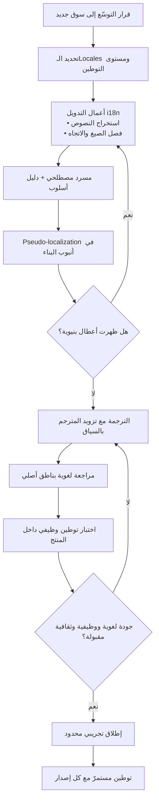

# التوطين (Localization)

> [!info] تعريف مختصر
> عملية تكييف منتج رقمي — واجهته ومحتواه وتجربته وقواعده وأحيانًا نموذج عمله — ليبدو ويتصرّف كأنه صُنع أصلًا لسوق بعينه، لا كأنه استُورد وتُرجم. الترجمة مكوّن واحد فقط من التوطين، وربما ليس أصعبها؛ فالتوطين يشمل صيغة التاريخ والتقويم، ووحدات القياس والعملة، وترتيب الاسم الشخصي، وشكل العنوان البريدي ورقم الهاتف، وطرق الدفع المقبولة، والمتطلّبات التنظيمية والقانونية، والصور والألوان والرموز، واتجاه التخطيط، وحتى أي الميزات تُعرض وأيها تُخفى. يُختصر المصطلح في الصناعة بـ **l10n** (حرف L، ثم 10 حروف بين L وN، ثم N) — وهي عائلة اختصارات رقمية نفسها التي أنتجت i18n للتدويل وa11y لإتاحة الوصول. والقاعدة الهندسية الحاكمة: **التوطين لا يبدأ إلا بعد أن يكون [[Internationalization|التدويل]] قد أُنجز**؛ فمن دون بنية تقنية قابلة للتوطين، يتحوّل كل سوق جديد إلى نسخة كود منفصلة.

## الشرح العلمي والاحترافي

- **التوطين تكييف لا ترجمة، والفرق ليس لغويًّا بل هندسيًّا وتجاريًّا**: الترجمة تنقل معنى نصّ من لغة إلى لغة. التوطين يسأل سؤالًا أوسع: ما الذي يجب أن يتغيّر ليعمل هذا المنتج في هذا السوق؟ قد تكون الإجابة نصًّا، وقد تكون طريقة دفع (تحويل بنكي بدل بطاقة ائتمان)، أو حقلًا إضافيًّا في نموذج التسجيل (رقم هوية وطنية)، أو حذف ميزة كاملة لأنها غير قانونية هناك، أو تغيير خوارزمية ترتيب لأن سلوك المستخدم مختلف. لذلك التوطين مسؤولية فريق منتج وهندسة، لا مسؤولية مورّد ترجمة.

- **التسلسل المفاهيمي الصحيح: Globalization ⊃ (Internationalization + Localization)**: في أدبيات الصناعة (وأبرزها ما استقرّ عليه العمل في هيئات ومعايير التوطين مثل Unicode CLDR وممارسات صناعة اللغة) تُرتَّب المفاهيم هكذا: **Globalization (g11n)** هو المظلّة الاستراتيجية الشاملة لجعل المنتج والشركة قادرَين على العمل عالميًّا — ويشمل قرارات السوق والتسعير والدعم والامتثال. تحته يقع **Internationalization (i18n)** وهو العمل الهندسي المسبق الذي يجعل المنتج قابلًا للتكييف. ثم **Localization (l10n)** وهو التنفيذ الفعلي لسوق محدّد. الترتيب مهم عمليًّا: كل ما لم يُحسم في i18n سيظهر كدين تقني في كل عملية l10n لاحقة، ومضروبًا في عدد الأسواق.

- **الفروق الأربعة في جدول واحد**:

| المفهوم | السؤال الذي يجيب عنه | من ينفّذه غالبًا | المخرَج | المخاطرة عند إهماله |
|---|---|---|---|---|
| **Translation (الترجمة)** | ما مقابل هذا النصّ في اللغة الأخرى؟ | مترجم لغوي | نصّ مكافئ في المعنى | نصّ صحيح لغويًّا لكنه غريب على السوق |
| **Localization (التوطين / l10n)** | ما الذي يجب تغييره ليعمل المنتج في هذا السوق؟ | فريق منتج + هندسة + لغويون + قانوني | نسخة سوقية كاملة: نصّ، صيغ، دفع، امتثال، محتوى | منتج يبدو مستوردًا؛ ضعف [[Adoption\|التبنّي]] رغم صحّة الترجمة |
| **Transcreation (إعادة الإبداع)** | كيف أُنتج **الأثر العاطفي نفسه** بنصّ مختلف تمامًا؟ | كاتب إبداعي في اللغة الهدف | نصّ جديد قد لا يشبه الأصل حرفيًّا | شعارات وحملات تُترجم حرفيًّا فتفقد أثرها أو تصير مضحكة |
| **Globalization (العولمة / g11n)** | هل الشركة والمنتج جاهزان أصلًا للعمل في أسواق متعدّدة؟ | قيادة المنتج والاستراتيجية | استراتيجية أسواق + بنية i18n + تشغيل ودعم | التوسّع عشوائي، وكل سوق مشروع منفصل بلا وفورات |

  والخلاصة العملية: الترجمة **جزء** من التوطين، والـTranscreation **درجة قصوى** من التوطين تُطبَّق على المحتوى التسويقي والوجداني (الشعارات، أسماء الحملات، نصوص الإعلانات، صوت العلامة في [[Brand Guidelines]])، بينما الـGlobalization هو **الإطار** الذي يحتضنهما جميعًا.

- **التوطين طيف لا حالة ثنائية**: الفرق الناضجة تعرّف **مستويات توطين** صريحة بدل «مُوطَّن / غير مُوطَّن». مستوى أول: الواجهة فقط. مستوى ثانٍ: الواجهة + المساعدة والدعم + رسائل البريد والإشعارات. مستوى ثالث: يضاف إليه المحتوى التسويقي والقانوني وطرق الدفع المحلية. مستوى رابع: توطين كامل يشمل فريق دعم بالتوقيت المحلي، وامتثالًا تنظيميًّا، وتسعيرًا بالعملة المحلية، وربما ميزات خاصة بالسوق. تحديد المستوى المستهدف مسبقًا يمنع أشهرًا من التسليم غير المكتمل، ويجعل [[Definition of Done]] قابلًا للتحقّق.

- **جودة التوطين لا تُقاس بجودة الترجمة وحدها**: الصناعة تفصل بين **الجودة اللغوية** (دقة، مصطلحية، أسلوب) و**الجودة الوظيفية** (هل انكسر التخطيط؟ هل قُصّ النصّ؟ هل ظهر مفتاح ترجمة خام؟ هل انعكس مخطّط بياني كان يجب ألّا ينعكس؟) و**الجودة الثقافية** (هل الصورة مناسبة؟ هل المثال مفهوم؟ هل التاريخ بالتقويم المتوقّع؟). ولذلك يوجد نوعان متمايزان من الاختبار: مراجعة لغوية يقوم بها ناطق أصلي، و**اختبار توطين وظيفي** يقوم به مختبِر داخل المنتج الحيّ — ويسبقهما زمنيًّا اختبار [[Pseudo-localization|الترجمة الزائفة]] الذي يكشف أعطال البنية قبل وجود أي ترجمة.

- **التوطين عملية مستمرّة لا مشروع ينتهي**: كل إصدار جديد يضيف نصوصًا، وكل نصّ جديد يفتح فجوة في كل لغة مدعومة. لذلك تتبنّى الفرق الناضجة نمط **Continuous Localization**: استخراج النصوص آليًّا من المستودع، ودفعها إلى نظام إدارة ترجمة، وإعادة سحب الترجمات في نفس أنبوب [[CI and CD]]. بدون هذا، يتراكم «دَين لغوي» مشابه في طبيعته لـ[[Technical Debt|الدَّين التقني]]: نصوص إنجليزية تظهر فجأة داخل واجهة عربية.

- **الأثر على الهيكلة التنظيمية وحوكمة المصطلح**: التوطين الجادّ يحتاج **مسردًا مصطلحيًّا (Glossary)** و**دليل أسلوب (Style Guide)** لكل لغة، ويحتاج **ذاكرة ترجمة (Translation Memory)** تعيد استخدام ما تُرجم سابقًا. غياب المسرد يُنتج ثلاث ترجمات مختلفة لكلمة واحدة داخل المنتج نفسه — وهي مشكلة [[Single Source of Truth]] بلبوس لغوي، وتُربك المستخدم وتضاعف تكلفة الدعم.

- **حدود التوطين: متى لا نوطّن؟** ليس كل شيء يجب أن يُترجم. أسماء العلامات التجارية، ورموز الأكواد، ومصطلحات تقنية استقرّ استعمالها الإنجليزي بين الجمهور المستهدف (مثل «API» أو «Backend» لدى جمهور مطوّرين) قد تُترك كما هي عمدًا. القرار هنا منتَجي لا لغوي، ويُوثَّق في دليل الأسلوب حتى لا يجتهد كل مترجم على حدة.

## أين ومتى يُستخدم

- **عند اتخاذ قرار التوسّع إلى سوق جديد**: يُبنى [[Business Case]] للتوطين على تكلفة كاملة تشمل الهندسة والترجمة والاختبار والدعم المستمرّ، لا على سعر الكلمة وحده — وهو تطبيق مباشر لمنطق [[TCO]].
- **في كتابة [[PRD]] و[[Software Requirements Specification]]**: يجب أن يذكر المستند صراحة اللغات و[[Locale|الـLocales]] المستهدفة، ومستوى التوطين المطلوب، وسلوك المنتج عند غياب ترجمة (Fallback) — وإلا صارت هذه قرارات يتّخذها المطوّر ارتجالًا.
- **في تعريف [[Definition of Done]] لكل قصّة تحتوي نصًّا ظاهرًا**: «لا نصوص مكتوبة داخل الكود» و«المفاتيح مُصدَّرة» و«اجتازت [[Pseudo-localization]]» شروط قبول لا نصائح.
- **في اختبار القبول [[UAT]]**: يُشترط وجود مختبِرين ناطقين بلغة السوق الهدف، لأن عيوب التوطين غالبًا **غير مرئية** لمن لا يقرأ اللغة — فمختبِر لا يقرأ العربية لن يلاحظ نصًّا مقلوبًا أو تاريخًا هجريًّا خاطئًا.
- **في الامتثال التنظيمي وحماية البيانات**: نصوص الموافقة والخصوصية وسياسات الاحتفاظ تختلف بين الأسواق، وقد تفرض [[PDPL]] أو ما يماثلها صياغات ومواقع عرض محدّدة — وهذه ترجمتها الحرفية قد تكون مخالفة قانونية لا مجرّد ركاكة.
- **عند إطلاق تدريجي في سوق جديد**: يُستخدم [[Pilot Launch]] بسوق واحد ولغة واحدة لاختبار سلسلة التوطين كاملة قبل تعميمها، ثم تُرصد مؤشّرات مثل [[Time to Value]] و[[Adoption]] مقارنةً بالسوق الأصلي.
- **في إدارة المورّدين اللغويين**: [[Vendor Management]] لشركات الترجمة، مع الانتباه إلى خطر [[Vendor Lock-in]] حين تُحتجز ذاكرة الترجمة والمسرد لدى المورّد بصيغة مغلقة.

## مثال وسيناريو تطبيقي

> [!example] منصّة سعودية لإدارة الاشتراكات الرقمية (B2B) تعمل بالعربية فقط، قرّرت التوسّع إلى ثلاثة أسواق: الإمارات (عربي + إنجليزي)، ومصر (عربي)، وتركيا (تركي). قدّرت الإدارة المشروع مبدئيًّا بـ«ترجمة 4,300 نصّ واجهة» وحدّدت له ميزانية على أساس سعر الكلمة، ومدّة 6 أسابيع.
> في الأسبوع الثالث اصطدم الفريق بواقع مختلف تمامًا. أول ما ظهر أن 1,100 نصًّا من أصل 4,300 كانت **مكتوبة داخل الكود مباشرة** ولم تُستخرج أصلًا، فلم تكن ضمن التقدير. ثانيًا: التسعير كان مثبَّتًا بالريال داخل منطق الفوترة، وإضافة الليرة التركية تطلّبت تعديل نموذج البيانات ونظام الفواتير — أي عملًا هندسيًّا لا لغويًّا. ثالثًا: نموذج التسجيل يطلب «رقم السجل التجاري» بصيغة تحقّق سعودية صارمة، وهي غير صالحة للسوقين الآخرين. رابعًا: الفواتير المصريّة تخضع لمتطلّبات فوترة إلكترونية مختلفة. خامسًا وهو الأهمّ: السوق التركي احتاج تخطيطًا من اليسار إلى اليمين، بينما كان المنتج كلّه مبنيًّا بافتراض [[RTL]] ثابت — فظهر أن الافتراض المعاكس (أن الإنجليزية هي الأصل) لم يكن الخطأ الوحيد الممكن؛ أي افتراض اتجاه ثابت هو الخطأ.
> أوقف الفريق المسار وأعاد ترتيبه: 5 أسابيع عمل تدويل خالص (استخراج النصوص، فصل الاتجاه عن اللغة، تجريد العملة والتحقّقات إلى إعدادات [[Locale]])، ثم أدخل [[Pseudo-localization]] في أنبوب البناء فكشفت 213 موضع قصّ أو تجاوز في التخطيط قبل أن تُترجم كلمة واحدة. بعدها فقط بدأت الترجمة.
> النتيجة كما وثّقها الفريق داخليًّا: السوق الأول (الإمارات) استغرق 9 أسابيع إجمالًا — أطول من التقدير الأصلي بكثير. لكن السوق الثاني (مصر) أُنجز في 11 يومًا، والثالث (تركيا) في 16 يومًا رغم اختلاف الاتجاه واللغة. الاستثمار في التدويل لم يوفّر شيئًا في السوق الأول، ووفّر كل شيء فيما بعده — وهذا هو **الشكل الاقتصادي المميّز للتوطين**: تكلفة أولى مرتفعة، ثم تكلفة حدّية منخفضة لكل سوق إضافي، بشرط ألّا يُختصر التدويل.

## خطوات أو مخطّط

1. تحديد الأسواق المستهدفة و[[Locale|الـLocales]] المطلوبة صراحةً، والتمييز بين اللغة والمنطقة (عربي-السعودية ليس كعربي-المغرب).
2. تحديد **مستوى التوطين** المطلوب لكل سوق (واجهة فقط؟ أم واجهة + دعم + تسويق + امتثال؟) وتوثيقه في نطاق العمل لتفادي [[Scope Creep]].
3. تنفيذ أعمال [[Internationalization]] أولًا: استخراج كل النصوص، فصل الصيغ عن الكود، دعم الاتجاهين، تجريد العملة والتقويم والتحقّقات.
4. بناء **المسرد المصطلحي ودليل الأسلوب** لكل لغة، واعتمادهما من صاحب المنتج قبل بدء الترجمة.
5. إدخال [[Pseudo-localization]] في أنبوب البناء وإصلاح كل ما تكشفه من أعطال بنيوية.
6. تجهيز ملفات المصادر بصيغة [[ICU Message Format]] لكل رسالة تحتوي عددًا أو جنسًا أو متغيّرًا.
7. إرسال الحزمة إلى الترجمة، مع تزويد المترجم بـ**سياق** كل نصّ (لقطة شاشة، وصف الموضع، حدّ أقصى للطول) — الترجمة بلا سياق أكبر مصدر منفرد لأخطاء الجودة.
8. تنفيذ مراجعة لغوية بناطق أصلي، ثم **اختبار توطين وظيفي** داخل المنتج الحيّ على أجهزة حقيقية.
9. توطين ما هو خارج الواجهة: البريد والإشعارات، مركز المساعدة، الشروط والخصوصية، صفحات الخطأ، رسائل الدعم.
10. الإطلاق عبر [[Pilot Launch]] محدود، ثم [[Hypercare]] برصد خاص لتذاكر الدعم ذات الطابع اللغوي.
11. تثبيت **التوطين المستمرّ**: كل نصّ جديد يمرّ بنفس الأنبوب آليًّا، مع مؤشّر «نسبة تغطية الترجمة» معروض على الفريق باستمرار.

## ⚠️ مفاهيم خاطئة شائعة

> [!warning]
> - **«التوطين = الترجمة»**: هذا أكثر سوء فهم كلفةً في المجال. الترجمة بند واحد ضمن التوطين، وغالبًا ليس البند الحرج. التصحيح: عامل التوطين كمسار منتج كامل له متطلّبات هندسية وقانونية وتشغيلية، وضع سعر الكلمة في مكانه الصحيح — سطر صغير في جدول تكلفة أوسع.
> - **«لغة واحدة = سوق واحد»**: العربية لغة واحدة، لكن السعودية والمغرب ومصر أسواق مختلفة في المصطلح والعملة والتقويم وطرق الدفع والامتثال. الوحدة الصحيحة للتخطيط ليست اللغة بل [[Locale|الـLocale]]. والعكس صحيح أيضًا: سوق واحد قد يحتاج لغتين (الإمارات).
> - **«Transcreation مجرّد ترجمة أفضل»**: لا. الـTranscreation قد تُنتج نصًّا **مختلفًا جوهريًّا** عن الأصل لأنها تستهدف الأثر لا الكلمات، وقياس جودتها لا يكون بالمطابقة بل بردّ فعل الجمهور. الخلط بينهما يجعل الفريق يرفض عملًا إبداعيًّا جيدًا بحجّة «هذا ليس ما يقوله النصّ الإنجليزي».
> - **«الترجمة الآلية ألغت الحاجة إلى التوطين»**: الترجمة الآلية حسّنت **إنتاجية الخطوة اللغوية** تحديدًا، ولم تمسّ بقية التوطين إطلاقًا: لن تصلح تخطيطًا مكسورًا، ولا صيغة تاريخ خاطئة، ولا طريقة دفع غير مدعومة، ولا امتثالًا ناقصًا. بل إن إنتاجيتها العالية قد تضخّم عيوبًا بنيوية بسرعة أكبر.
> - **«نوطّن لاحقًا، بعد أن يستقرّ المنتج»**: التأجيل ممكن للترجمة، لكنه مكلف جدًّا للتدويل. كل شهر تأخير يعني نصوصًا أكثر مدفونة في الكود وافتراضات أعمق عن الاتجاه والعملة — وهو تجسيد حرفي لمنطق [[Cost-of-Change Curve]].
> - **«الترجمة صحيحة إذًا التوطين ناجح»**: مستخدم يقرأ نصًّا سليمًا لغويًّا لكنه يرى تاريخًا ميلاديًّا حيث يتوقّع الهجري، وسعرًا بعملة أجنبية، وأمثلة أسماء غربية — سيشعر أن المنتج ليس له. الجودة اللغوية شرط لازم غير كافٍ.

## ❌ ممارسات خاطئة في المشاريع

> [!failure]
> - **تقدير مشروع التوطين على أساس عدد الكلمات فقط**: الخطأ — تُبنى الميزانية والجدول على سعر الترجمة. لماذا يضرّ — العمل الهندسي (استخراج النصوص، دعم الاتجاهين، تجريد العملة والتقويم) يشكّل عادة الجزء الأكبر والأصعب، فينفجر الجدول في منتصف المشروع وتظهر [[Estimation Variance]] هائلة. الحل — أنشئ تقديرًا مركّبًا بثلاثة بنود منفصلة: تدويل، ترجمة، اختبار وتشغيل؛ وأخضِع بند التدويل لتقدير هندسي لا لغوي.
> - **إرسال النصوص للترجمة بلا سياق**: الخطأ — تُصدَّر قائمة مفاتيح ونصوص مجرّدة إلى المترجم. لماذا يضرّ — كلمة مثل «Save» قد تكون فعلًا على زرّ أو اسمًا لقسم، و«Post» قد تكون منشورًا أو فعل نشر؛ فتخرج ترجمات صحيحة نحويًّا وخاطئة وظيفيًّا يكتشفها المستخدم لا الفريق. الحل — أرفق بكل مفتاح وصفًا للموضع ولقطة شاشة وحدًّا أقصى للطول، واجعل ذلك حقلًا إلزاميًّا في نظام إدارة الترجمة.
> - **الاكتفاء بمختبِرين لا يقرأون لغة السوق الهدف**: الخطأ — يُجرى [[UAT]] بفريق يتحدّث لغة المنتج الأصلية فقط. لماذا يضرّ — عيوب التوطين تكون **غير مرئية** لهم تمامًا؛ نصّ مقطوع أو مصطلح مهين أو تاريخ خاطئ سيمرّ بلا ملاحظة ويظهر عند المستخدم كـ[[Escaped Defect Rate|عيب متسرّب]]. الحل — اشترط ناطقًا أصليًّا في دورة الاختبار لكل لغة، واجعل غيابه سببًا لحجب [[Sign-off]].
> - **بناء «فرع كود» منفصل لكل سوق**: الخطأ — يُنسخ المستودع ويُعدَّل يدويًّا لكل بلد بحجّة السرعة. لماذا يضرّ — كل إصلاح خطأ يجب تكراره n مرّة، وتتباعد النسخ حتى يستحيل الدمج، فيتحوّل التوسّع إلى صيانة n منتجات. الحل — قاعدة كود واحدة مع طبقة إعدادات لكل [[Locale]]، وأي اختلاف سلوكي يُعبَّر عنه كإعداد أو مفتاح ميزة لا كفرع.
> - **إهمال ما هو خارج الواجهة**: الخطأ — تُوطَّن الشاشات وتُترك رسائل البريد والإشعارات وصفحات الخطأ وسندات الفوترة ومركز المساعدة بالإنجليزية. لماذا يضرّ — هذه تحديدًا هي نقاط التماسّ في اللحظات الحرجة (الدفع، الفشل، الاستفسار)، فتنهار الثقة أسرع مما تبنيها الواجهة، وترتفع تذاكر الدعم. الحل — ضع جردًا كاملًا لكل نقاط التماسّ النصّية في [[RTM|مصفوفة تتبّع]] قبل الإطلاق، لا بعده.
> - **ترك المسرد المصطلحي بلا مالك**: الخطأ — كل مترجم يجتهد في مقابل المصطلحات الأساسية. لماذا يضرّ — تظهر ثلاث تسميات مختلفة للكيان نفسه داخل المنتج والمساعدة والتسويق، فيرتبك المستخدم وتزداد كلفة الدعم، ويصير تصحيحها لاحقًا مشروعًا قائمًا بذاته. الحل — عيّن مالكًا للمسرد من فريق المنتج، واجعل اعتماد المصطلحات الجديدة خطوة ضمن [[Definition of Ready]] لأي ميزة تُدخل مفردات جديدة.
> - **معاملة التوطين كمشروع ينتهي بتاريخ**: الخطأ — يُعلن «اكتمل التوطين» وتُحلّ الفرقة. لماذا يضرّ — الإصدار التالي يضيف نصوصًا غير مترجمة تظهر بالإنجليزية داخل واجهة عربية، ويتراكم الفارق حتى يبدو المنتج نصف مترجم. الحل — ادمج التوطين في [[CI and CD]] كخطوة آلية، واعرض «نسبة التغطية اللغوية» كمؤشّر دائم على لوحة الفريق.

## 🔗 مصطلحات ومفاهيم ذات صلة
[[Internationalization]] | [[Locale]] | [[RTL]] | [[Outsourcing]] | [[Pseudo-localization]] | [[ICU Message Format]] | [[Brand Guidelines]] | [[Adoption]] | [[UAT]] | [[TCO]] | [[Vendor Management]]
