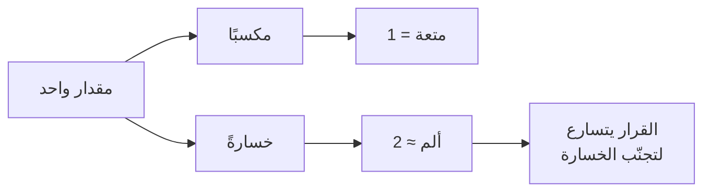

# نفور الخسارة (Loss Aversion)
> [!info] تعريف مختصر
> ميل بشري إلى أن يكون **ألم الخسارة أكبر من متعة كسب المقدار نفسه** — بمعامل تقريبي يقارب الضعفين. ومنه تُشتقّ نتيجة عملية: القرارات تتسارع حين تُعرَض بما يُفقَد أكثر ممّا تتسارع حين تُعرَض بما يُكسَب.

## الشرح العلمي والاحترافي
من **نظرية التوقّع (Prospect Theory)** لـ**كانمان وتفيرسكي** (Econometrica, 1979) — العمل الذي نال عنه كانمان نوبل في الاقتصاد عام 2002. ودالّة القيمة فيها **أشدّ انحدارًا في جانب الخسائر** منها في جانب المكاسب، والمعامل التقريبي **λ ≈ 2–2.5**.

**وثلاث نتائج مشتقّة تظهر يوميًّا في إدارة المشاريع:**

| النتيجة | مظهرها في العمل |
|---|---|
| **أثر الوقف (Endowment Effect)** | نُقدّر ما نملكه أعلى ممّا نُقدّر الحصول عليه — ولهذا يُقاوَم إلغاء ميزة قائمة أكثر ممّا تُقاوَم إضافة أخرى |
| **انحياز الوضع الراهن** | البقاء على الأداة الحالية رغم عيوبها لأنّ التغيير يُقرأ خسارة مؤكّدة مقابل مكسب محتمل |
| **المخاطرة لتجنّب الخسارة** | فريق متأخّر يُخاطر بقرارات تقنية سيّئة لتفادي الإقرار بالتأخير |

> [!warning] حدّ نقدي
> مراجعات حديثة (منها **Gal & Rucker, 2018**) تُشير إلى أنّ نفور الخسارة **أقلّ عمومية ممّا شاع**، وأنّ حجمه يعتمد على السياق وحجم الرهان والألفة بالمجال؛ وأنّ بعض النتائج المنسوبة إليه تُفسَّر بآليات أخرى. **فهو ميل قويّ لا قانون** — ويُستخدَم في التفسير والتصميم لا في التنبّؤ الدقيق.

## أين ومتى يُستخدم
- صياغة طلب إلى الإدارة — انظر [[Loss Framing]].
- تفسير مقاومة تغيير أداة أو عملية رغم وضوح فائدة البديل.
- تشخيص قرارات مخاطرة غير مبرَّرة في مشروع متأخّر.
- تصميم قرارات الإيقاف: لماذا يستمرّ الفريق في مشروع فاشل — مع [[Sunk Cost Fallacy]] و[[Kill Criteria]].

## مثال وسيناريو تطبيقي
> [!example] فريق يعمل بأداة إدارة عمل قديمة لا تُخرج أرقامًا، والانتقال إلى بديل سيستغرق أسبوعين. **العرض بالمكسب** — «الأداة الجديدة فيها تقارير ولوحات وتكامل» — يُقابَل بتأجيل مستمرّ، لأنّ الأسبوعين **خسارة مؤكّدة** والمكاسب **محتملة ومؤجّلة**. **والعرض بالخسارة** — «لا نستطيع إخراج [[Cycle Time|زمن الدورة]] اليوم، فنُقدّر المواعيد تخمينًا؛ وقد تأخّرنا في ثلاثة من آخر خمسة تسليمات بسبب توقّعات لم نستطع بناءها على أرقام» — **يقلب المعادلة**: صار الوضع الراهن هو مصدر الخسارة، والتغيير هو تجنّبها.

## خطوات أو مخطّط
1. عند طلب قرار، اسأل: **ماذا يخسر إن رفض؟** — وابحث عن **دليل**.
2. اعرض الخسارة القائمة أوّلًا، ثم المكسب.
3. **اربطها بزمن** لتسريع القرار.
4. **ثم اعرض الصورة كاملة** — التأطير أداة انتباه لا بديل عن الحجّة.
5. عند مقاومة تغيير، افحص: **ما الذي يخشى فقدانه؟** — غالبًا سيطرة أو مكانة أو ألفة لا وظيفة الأداة.

## ⚠️ مفاهيم خاطئة شائعة
> [!warning]
> - **ليس جبنًا ولا نقص عقلانية.** ميل عامّ في البشر بما فيهم الخبراء وصنّاع القرار.
> - **لا يعني أنّ الناس يكرهون المخاطرة دائمًا** — بل العكس أحيانًا: في مجال الخسائر يميل الناس إلى **المخاطرة** لتفادي خسارة مؤكّدة.
> - **أثره يضعف مع الخبرة والمرجع الكمّي** — من يقرأ الأرقام يوميًّا في مجاله أقلّ تأثّرًا بصياغة العرض.

## ❌ ممارسات خاطئة في المشاريع
> [!failure]
> - **اختراع خسائر لتسريع القرار** — يُكشَف مرّة واحدة، ويُبطل **كلّ** تأطير خسارة تُقدّمه بعدها ولو كان صادقًا. انظر [[Transparency Test]].
> - **الإفراط في تأطير الخسارة** حتى مع الصدق — يُنتج منظّمة **تُقرّر دفاعيًّا**: تتحرّك لتجنّب الخسائر ولا تتحرّك لاقتناص الفرص.
> - **استغلاله لتمرير قرار سيّئ** — استدعاء الخوف من الخسارة في قرار تعرف أنّه ضارّ بالمشروع.
> - **الخلط بينه وبين [[Sunk Cost Fallacy|التكلفة الغارقة]]** — ذكر **تكلفة استبدال قادمة** حجّة صحيحة؛ وذكر **إنفاق ماضٍ لا يُسترَدّ** استدعاء لمغالطة.

## 🔗 مصطلحات ومفاهيم ذات صلة
[[Loss Framing]] | [[Sunk Cost Fallacy]] | [[Anchoring]] | [[Cognitive Bias]] | [[Cost of Delay]] | [[Kill Criteria]] | [[Cost-Benefit Analysis]] | [[Reversible vs Irreversible Decisions]]

> [!tip] 💡 إثراء عملي — كورس لعبة العقل
> التطبيق العملي على طلبات الإدارة، وحماية الاستثمار القائم، والحدّ الأخلاقي: [[09 - التفاوض على القيمة - التثبيت والخسارة والمقايضة]].
