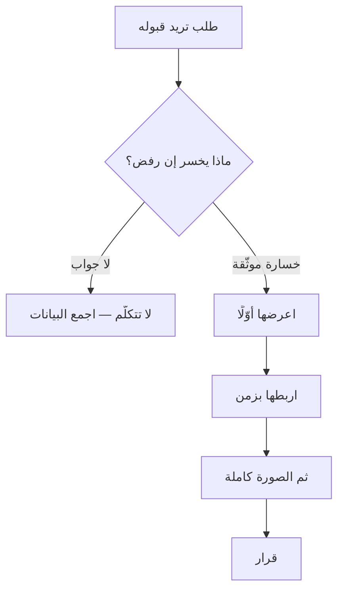

# تأطير الخسارة (Loss Framing)
> [!info] تعريف مختصر
> تأطير الخسارة هو عرض الطلب بما **يُفقَد إن رُفِض** بدل ما **يُكسَب إن قُبِل** — استنادًا إلى أنّ الدماغ يكره الخسارة أكثر ممّا يُحبّ الربح. وشرط مشروعيته أن تكون الخسارة **حقيقية وقابلة للتوثيق**.

## الشرح العلمي والاحترافي
يقوم على نتيجتين من عمل **كانمان وتفيرسكي**: **نفور الخسارة** ([[Loss Aversion]]) من *Prospect Theory* (1979)، و**أثر التأطير (Framing Effect)** من *The Framing of Decisions* (1981) — أنّ الوصف نفسه بصياغتين يُنتج قرارين مختلفين. والمثال الكلاسيكي «مشكلة المرض الآسيوي» أظهر انقلابًا كاملًا في التفضيلات حين صيغت النتائج نفسها بلغة «من سيعيش» بدل «من سيموت».

| الطلب | تأطير مكسب ❌ | تأطير خسارة ✅ |
|---|---|---|
| تفعيل دور سكرم | «سيُحسّن التنظيم» | «[[Cycle Time\|زمن دورتنا]] أربعة أيّام، ونستطيع جعله يومين» |
| الانتقال إلى جيرا | «فيها تقارير ولوحات» | «لا نستطيع إخراج زمن الدورة، فنُقدّر المواعيد تخمينًا» |
| توظيف مختبِر | «سيرفع الجودة» | «38% من سعة المطوّرين تذهب على عيوب كان يمكن كشفها قبل الإنتاج» |
| تثبيت الرواتب | «سيرفع الرضا» | «خروج مطوّر واحد يُكلّفنا شهرين لإعادة بناء الجاهزية» |

**وحدّان يجب أن يُقالا:** ① مراجعات حديثة (Gal & Rucker, 2018) تُشير إلى أنّ نفور الخسارة **أقلّ عمومية ممّا شاع**، وحجمه يعتمد على السياق وحجم الرهان — **فهو ميل قويّ لا قانون**. ② أثر التأطير **يضعف كثيرًا** حين يكون المتلقّي خبيرًا ولديه مرجع كمّي مستقلّ؛ **فقوّته تأتي من نقص معلومات الطرف الآخر** — وهذا في ذاته سبب لاستخدامه بحذر.

## أين ومتى يُستخدم
- طلب ميزانية أو مورد أو أداة من الإدارة.
- إقناع بقرار تقني له تكلفة ظاهرة وعائد غير مرئي ([[Technical Debt|الدَّين التقني]] · الاختبارات · المراقبة).
- التفاوض على ترقية أو صلاحية.
- تسريع قرار مؤجَّل — بربط الخسارة بزمن.

## مثال وسيناريو تطبيقي
> [!example] مدير سكرم مُهمَّش تمامًا في فريق يُديره مالك المنتج وحده، **وزمن الدورة أربعة أيّام**. الطلب بتأطير المكسب — «لا بدّ أن نُفعّل دور سكرم لأنّه يفعل كذا وكذا» — يُقرأ دفاعًا عن دور وظيفي فيُؤجَّل. أمّا بتأطير الخسارة: **«يا سيّدي، زمن دورتنا مُخرَّب — أربعة أيّام. وإن فعّلنا دور سكرم كما ينبغي أستطيع أن أجعله لك يومين.»** لاحظ أنّ الجملة تحوي الاثنين — الخسارة أوّلًا ثم المكسب — **والترتيب هو الأداة**. ولاحظ أنّ الخسارة **مقيسة**: لو سُئل «من أين جاءت الأربعة؟» لكان الجواب من لوح العمل، لا من انطباع.

## خطوات أو مخطّط
1. اسأل سؤالًا واحدًا: **ماذا يخسر إن رفض؟** — وإن لم تجد جوابًا، **لا تتكلّم**.
2. **ابحث عن الدليل** — رقم مقيس أو حادثة موثّقة.
3. صُغ الخسارة أوّلًا، ثم المكسب.
4. **اربطها بزمن** لتسريع القرار: «إن لم نُقرّر قبل الخميس، سنخسر [كذا] لأنّ [كذا].»
5. **ثم اعرض الصورة كاملة** قبل القرار — التأطير تكتيك انتباه، وإخفاء الجانب الآخر تضليل.

## ⚠️ مفاهيم خاطئة شائعة
> [!warning]
> - **ليست تخويفًا.** الخسارة المذكورة قائمة أو محتملة بدليل؛ والتهويل يُكشَف مرّة واحدة وينتهي.
> - **ليست بديلًا عن الحجّة الكاملة.** التأطير يفتح باب الانتباه؛ ومن يكتفي به يُنتج قرارًا مبنيًّا على نصف الصورة.
> - **ليست حكرًا على المال.** الخسارة قد تكون وقتًا أو ثقة أو فرصة سوقية أو قدرة على التنبّؤ.

## ❌ ممارسات خاطئة في المشاريع
> [!failure]
> - **الخسارة المُصطنَعة** — أخطر انزلاق في هذا الباب. «سنخسر السوق كلّه إن لم نفعل» بلا سند يُكشَف؛ **وثمنه غير متماثل**: المكسب إن نجحت قرار واحد، والخسارة إن انكشفت **كلّ تأطير خسارة تُقدّمه بعدها ولو كان صادقًا**.
> - **تقديم تقدير بصيغة قياس** — قل «تقديرنا الأوّلي 38% ونستطيع تدقيقه»؛ فالشفافية عن مصدر الرقم تُقوّي الحجّة لأنّها تُظهر أنّك تُفرّق بين المقيس والمُقدَّر.
> - **الإفراط حتى تُنتج منظّمة دفاعية** — من يستخدمه في كلّ طلب، **بصدق تامّ**، يُنتج مؤسّسة تتحرّك لتجنّب الخسائر ولا تتحرّك لاقتناص الفرص. وهذا أثر تراكمي قد يفوق ضرره مكسب القرارات المفردة.
> - **الخلط بينه وبين استغلال [[Sunk Cost Fallacy|التكلفة الغارقة]]** — «أنفقنا كثيرًا على هذا الفريق» استدعاء لمغالطة؛ أمّا «خروج مطوّر يُكلّفنا شهرين إعادة بناء» فذكر **تكلفة استبدال قادمة** وهي معطى صحيح في أيّ حساب عقلاني.

## 🔗 مصطلحات ومفاهيم ذات صلة
[[Loss Aversion]] | [[Anchoring]] | [[Sunk Cost Fallacy]] | [[Cost of Delay]] | [[Business Case]] | [[Cost-Benefit Analysis]] | [[Cognitive Bias]] | [[Transparency Test]] | [[Smart Bartering]]

> [!tip] 💡 إثراء عملي — كورس لعبة العقل
> جدول التحويل الكامل، وحماية الاستثمار القائم، والحدّ بين التأطير والتضليل: [[09 - التفاوض على القيمة - التثبيت والخسارة والمقايضة]].
