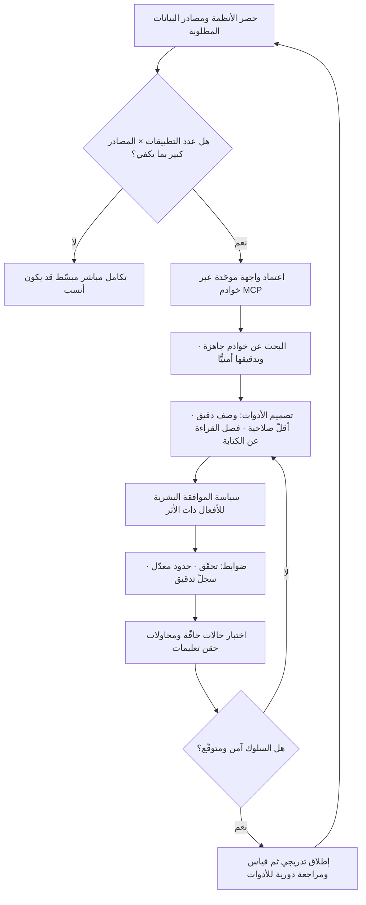

# بروتوكول سياق النموذج (MCP)

> [!info] تعريف مختصر
> بروتوكول مفتوح يوحّد الطريقة التي تتّصل بها نماذج اللغة والتطبيقات المبنيّة عليها بالأدوات ومصادر البيانات الخارجية: قواعد بيانات، وأنظمة ملفّات، وأنظمة إدارة المهام، وواجهات برمجية داخلية. أطلقته **Anthropic** أواخر عام 2024 بترخيص مفتوح، وتبنّته لاحقًا جهات وأدوات متعدّدة في المجال. فكرته المعمارية بسيطة وحاسمة: بدل أن يبني كل تطبيق تكاملًا خاصًّا مع كل مصدر بيانات، يُعرَّف المصدر **مرّة واحدة** كخادم MCP، فيستطيع أي تطبيق يتحدّث البروتوكول استخدامه دون كتابة تكامل جديد. وهو بذلك يحوّل مشكلة التكامل من ضرب مصفوفي (N×M) إلى جمع بسيط (N+M).

## الشرح العلمي والاحترافي
- **المشكلة التي يحلّها — انفجار التكاملات N×M**: إذا كان لديك 5 تطبيقات ذكاء اصطناعي و20 مصدر بيانات داخليًّا، فالربط المباشر يستلزم مبدئيًّا 100 تكامل، كلٌّ منها له مصادقة خاصّة، وتنسيق بيانات خاص، وصيانة خاصّة، وتوثيق خاص. وكل مصدر جديد يضيف 5 تكاملات، وكل تطبيق جديد يضيف 20. هذا النموّ الضربي هو ما يجعل مشاريع الذكاء الاصطناعي المؤسسية تتعثّر في التكامل لا في النموذج. البروتوكول الموحّد يقلب المعادلة: 5 عملاء + 20 خادمًا = 25 قطعة، ويصبح إضافة مصدر جديد عملًا يُنجَز مرّة ويستفيد منه الجميع.
- **السابقة التاريخية التي يُقاس عليها**: الفكرة نفسها التي حلّها بروتوكول خادم اللغة (Language Server Protocol) في عالم محرّرات الأكواد؛ فقد كان كل محرّر يحتاج دعمًا خاصًّا لكل لغة برمجة حتى وُحِّدت الواجهة فانفصل طرفا المعادلة عن بعضهما. والدرس المستفاد أن قيمة البروتوكول لا تكمن في براعته التقنية بل في **حجم التبنّي**: بروتوكول موحّد لا يستخدمه أحد لا يحلّ شيئًا.
- **البنية المعمارية**: ثلاثة أطراف — **المضيف** (التطبيق الذي يستخدمه الإنسان)، و**العميل** (طبقة داخل المضيف تتحدّث البروتوكول)، و**الخادم** (برنامج صغير يكشف قدرات مصدر معيّن). ويتواصل الطرفان عبر تبادل رسائل منظَّم يعمل محلّيًّا على الجهاز أو عبر الشبكة.
- **ما الذي يكشفه الخادم؟** ثلاثة أنواع أساسية: **الأدوات (Tools)** وهي أفعال قابلة للتنفيذ يستطيع النموذج استدعاؤها (أنشئ تذكرة، ابحث في قاعدة البيانات، أرسل رسالة)؛ و**الموارد (Resources)** وهي بيانات للقراءة يمكن ضمّها إلى السياق (ملف، سجلّ، وثيقة)؛ و**المطالبات (Prompts)** وهي قوالب جاهزة معدّة مسبقًا لسير عمل متكرّر.
- **الفارق بين «الاتصال» و«الفهم»**: البروتوكول يحلّ مشكلة **التوصيل الموحّد**، ولا يضمن أن يستخدم النموذج الأداة بحكمة. جودة وصف الأداة ووضوح معاملاتها وحدود صلاحياتها تبقى مسؤولية من يبنيها. وهذه نقطة يخطئ فيها كثيرون فيتوقّعون أن مجرّد إتاحة 40 أداة سيجعل النظام ذكيًّا، بينما كثرة الأدوات الغامضة قد تُربك النموذج وتزيد كلفة كل استدعاء ([[Inference Cost]]) لأن أوصافها تُحقن في السياق.
- **البُعد الأمني — أخطر ما يجب أن يعيه مدير المنتج**: ربط نموذج لغوي بأدوات تنفّذ أفعالًا حقيقية يحوّل مخرَجًا نصّيًّا إلى **فعل له أثر**. والمخاطر البارزة: حقن التعليمات غير المباشر (محتوى خبيث داخل وثيقة يقرأها النموذج فيُعامَل كأمر)، والصلاحيات الزائدة عن الحاجة، وخوادم من مصادر غير موثوقة، وتسرّب البيانات إلى وجهات لم تُقصد. لذلك تُبنى المنظومة على مبدأ أقلّ صلاحية، وموافقة بشرية صريحة على الأفعال ذات الأثر غير القابل للتراجع، وسجلّ تدقيق كامل، وحدود واضحة ([[Guard Rails]]).
- **الأثر المباشر على مدير المنتج** — وهذا لبّ أهمّية المصطلح إداريًّا لا تقنيًّا:
  1. **يغيّر تقدير جهد التكامل جذريًّا**: ما كان يُقدَّر بأسابيع لكل مصدر يصبح أقرب إلى أيام حين يتوفّر خادم جاهز، وهذا يقلب أولويات خارطة الطريق ويختصر [[Time to Value]].
  2. **يغيّر حدود المنتج نفسه**: حين تصبح قدرات المنتج قابلة للاستدعاء من مضيفات أخرى، يتحوّل السؤال من «ما الميزات التي نبنيها داخل واجهتنا؟» إلى «ما القدرات التي نكشفها لتُستهلك حيث يعمل المستخدم فعلًا؟».
  3. **يعيد صياغة نقاش [[Vendor Lock-in]]**: واجهة موحّدة تجعل استبدال النموذج أو المضيف أرخص، لكنها تنقل نقطة الارتباط إلى مكان آخر — إلى النظام البيئي للخوادم وإلى تصميم أدواتك.
  4. **يخلق فئة عمل جديدة في الـBacklog**: بناء خوادم داخلية للأنظمة المؤسسية، وصيانتها، وحوكمة من يُسمح له باستخدام أي أداة — وهذا عمل حقيقي يجب أن يُقدَّر ويُخطَّط له لا أن يُفترض مجّانيًّا.
  5. **يرفع سقف متطلبات الحوكمة**: كل أداة تكتب أو تحذف أو ترسل تحتاج سياسة موافقة وتدقيقًا، ويصبح ذلك جزءًا من [[Governance]] لا استثناءً تقنيًّا.

## أين ومتى يُستخدم
- **في بناء المساعدات الداخلية للمؤسسة**: حيث يحتاج المساعد الوصول إلى عدّة أنظمة داخلية دفعة واحدة، وبناء تكامل مخصّص لكل نظام هو ما يُفشل المشروع عادةً.
- **في تصميم معمارية منتج ذكاء اصطناعي جديد**: كقرار مبكّر يُتّخذ في مرحلة الاكتشاف ([[Product Discovery]]) وتُوثَّق تبعاته في [[PRD]]، لأن تغييره لاحقًا مكلف وفق [[Cost-of-Change Curve]].
- **إلى جانب أنظمة الاسترجاع ([[Retrieval-Augmented Generation]])**: فالاسترجاع يجلب معرفة نصّية للقراءة، بينما البروتوكول يتيح **الفعل** والاستعلام الحيّ من المصدر — والاثنان متكاملان لا بديلان.
- **في تقليل الدين التقني ([[Technical Debt]])**: باستبدال تكاملات متفرّقة كتبها أفراد بواجهة موحّدة موثّقة ومركزية.
- **في حوكمة الوصول والامتثال**: تركيز الاتصال في خوادم محدّدة يجعل تطبيق ضوابط الوصول وتسجيل التدقيق أسهل، ويخدم متطلبات [[PDPL]] و[[GDPR]] بجعل تدفّق البيانات مرئيًّا وقابلًا للتوثيق في [[ROPA]].
- **في تقدير جهد الفريق وسعة العمل ([[Capacity]])**: عند التخطيط لموجة تكاملات، يغيّر توفّر خوادم جاهزة تقديرات السباق بالكامل.

## مثال وسيناريو تطبيقي
> [!example] بنك خليجي متوسّط الحجم أراد بناء مساعد داخلي لفريق العمليات يجيب عن أسئلة مثل: «ما حالة طلب فتح الحساب رقم كذا؟» و«كم بلاغًا مفتوحًا لدى فريق الالتزام هذا الأسبوع؟» و«أنشئ تذكرة متابعة للحالة الفلانية». الأنظمة المطلوبة سبعة: نظام إدارة العلاقات، ونظام التذاكر، ومستودع البيانات، ونظام إدارة الوثائق، وبوابة الالتزام، ونظام الموارد البشرية، ومنصّة المراقبة.
> **المحاولة الأولى (تكاملات مخصّصة)**: قدّر الفريق 3 أسابيع لكل نظام. بعد 4 أشهر كان قد أنجز 4 أنظمة فقط، وكان كل تكامل يحمل منطق مصادقة خاصًّا وصيغة استجابة مختلفة. والأسوأ أن فريقًا آخر في البنك بدأ بناء مساعد لخدمة العملاء فوجد أنه مضطرّ لإعادة كتابة التكاملات نفسها من الصفر لأنها مدفونة داخل تطبيق الفريق الأول لا مستقلّة عنه.
> **إعادة التصميم**: تحوّل الفريق إلى بناء **خادم MCP لكل نظام** بدل تكامل داخل التطبيق، بحيث يكون كل خادم مكوّنًا مستقلًّا يكشف أدوات محدّدة الصلاحية. النتائج التي رصدها الفريق:
> - أصبح المساعد الثاني (خدمة العملاء) يستهلك الخوادم الأربعة الجاهزة **دون كتابة تكامل واحد**، فانطلق في 9 أيام بدل ربع سنة مقدّرة.
> - انخفض متوسّط زمن إضافة نظام جديد من 3 أسابيع إلى نحو 5 أيام عمل.
> - تركّزت الحوكمة: صار لدى فريق الأمن مكان واحد يفرض فيه الصلاحيات ويقرأ سجلّات من استدعى أي أداة ومتى وبأي معاملات، بدل تتبّع منطق متناثر في كل تطبيق.
> - **الدرس الأصعب** جاء من حادثة أمنية محتملة: أداة في خادم نظام التذاكر كانت تسمح بتغيير حالة أي تذكرة بلا قيد. وأثناء الاختبار، احتوى نصّ ملاحظة داخل تذكرة على عبارة تحاكي أمرًا موجَّهًا للمساعد بإغلاق مجموعة تذاكر. أوقف الفريق التنفيذ التلقائي فورًا، وطبّق ثلاث قواعد ثابتة: فصل أدوات القراءة عن أدوات الكتابة في خوادم منفصلة بصلاحيات مختلفة، واشتراط موافقة بشرية صريحة لكل فعل يغيّر حالة، ومعاملة كل محتوى مقروء من نظام خارجي كبيانات غير موثوقة لا كتعليمات.

## خطوات أو مخطّط
1. حصر مصادر البيانات والأنظمة التي يحتاجها المساعد فعلًا، وترتيبها بقيمتها لا بسهولة الوصول إليها.
2. تقدير حجم مشكلة N×M: كم تطبيقًا ذكيًّا متوقّعًا؟ وكم مصدرًا؟ — إن كان الناتج صغيرًا جدًّا فقد لا يستحقّ البروتوكول تعقيده الإضافي.
3. البحث عن خوادم جاهزة موثوقة قبل البناء، مع تدقيق أمني لأي خادم من طرف ثالث قبل اعتماده.
4. تصميم الأدوات لكل نظام: أفعال محدّدة وواضحة الوصف، بأقلّ صلاحية ممكنة، مع فصل القراءة عن الكتابة.
5. تحديد سياسة الموافقة: أي الأفعال تُنفَّذ تلقائيًّا، وأيّها يستوجب تأكيدًا بشريًّا، وأيّها ممنوع أصلًا.
6. بناء ضوابط الحماية: تحقّق من المدخلات، وحدود معدّل الاستدعاء، وسجلّ تدقيق كامل، ومعاملة المحتوى الخارجي كبيانات لا أوامر.
7. اختبار السلوك بحالات حافّة ومحاولات حقن تعليمات متعمّدة ([[Edge Cases]]) قبل الإطلاق.
8. القياس بعد الإطلاق: نسبة نجاح استدعاء الأدوات، والأخطاء، وكلفة السياق الناتجة عن أوصاف الأدوات.
9. حوكمة مستمرّة: مراجعة دورية لقائمة الأدوات وحذف ما لا يُستخدم، فكل أداة زائدة كلفة وسطح خطر.

## ⚠️ مفاهيم خاطئة شائعة
> [!warning]
> - **الظنّ بأن البروتوكول يجعل النموذج أذكى**: هو طبقة توصيل ومواصفة واجهة، لا تحسينًا لقدرة النموذج. النموذج الضعيف موصولًا بعشرين أداة يبقى ضعيفًا، وقد يصبح أخطر لأنه صار قادرًا على الفعل لا على الكلام فقط.
> - **الخلط بينه وبين استدعاء الأدوات عمومًا**: استدعاء الأدوات (Function Calling) قدرة موجودة في النماذج نفسها، وهي **آلية النموذج** لطلب تنفيذ فعل. البروتوكول طبقة أعلى تعالج سؤالًا مختلفًا: كيف تُكتشف الأدوات وتُوصَف وتُوصَل بطريقة موحّدة قابلة لإعادة الاستخدام عبر تطبيقات متعدّدة.
> - **اعتباره بديلًا عن الاسترجاع ([[Retrieval-Augmented Generation]])**: الاسترجاع يجلب معرفة نصّية ذات صلة من قاعدة معرفية، والبروتوكول يوفّر وصولًا حيًّا للأنظمة وقدرة على تنفيذ الأفعال. كثير من الأنظمة الجادّة تستخدم الاثنين معًا لأدوار مختلفة.
> - **الظنّ بأن أي خادم متاح للتحميل آمن للاستخدام المؤسسي**: الخادم برنامج ينفَّذ بصلاحيات، وقد يصل إلى بيانات حسّاسة أو يرسلها إلى الخارج. الانفتاح فرصة ومخاطرة معًا، والتدقيق قبل الاعتماد غير قابل للتفاوض.
> - **الاعتقاد بأن كثرة الأدوات المتاحة تحسّن الأداء**: أوصاف الأدوات تُحقن في سياق النموذج فترفع الكلفة، وتشابه الأدوات أو غموضها يزيد أخطاء الاختيار. أداة واحدة مصمَّمة جيّدًا أنفع من خمس متداخلة.
> - **افتراض أن التبنّي الواسع يجعل الهجرة بين المزوّدين مجّانية**: الواجهة الموحّدة تخفض كلفة التبديل ولا تلغيها؛ فسلوك النماذج مع الأدوات يختلف، وقد تحتاج إعادة ضبط وتقييم عند أي تبديل.

## ❌ ممارسات خاطئة في المشاريع
> [!failure]
> - **الخطأ**: منح خادم الأدوات حساب خدمة بصلاحيات إدارية كاملة «لتسهيل التطوير». **لماذا يضرّ**: أي خلل في تفسير النموذج أو أي محتوى خبيث مقروء قد يتحوّل إلى فعل مدمّر لا يمكن التراجع عنه. **الحل**: مبدأ أقلّ صلاحية بصرامة، وحساب منفصل لكل خادم، وفصل أدوات القراءة عن أدوات الكتابة.
> - **الخطأ**: معاملة محتوى الوثائق والتذاكر والرسائل التي يقرأها النموذج كتعليمات موثوقة. **لماذا يضرّ**: هذا هو باب حقن التعليمات غير المباشر، وأخطر ثغرات هذه المعمارية على الإطلاق. **الحل**: افصل بوضوح بين تعليمات النظام وبين البيانات المقروءة، ولا تسمح لمحتوى خارجي بتغيير الصلاحيات أو تشغيل أفعال دون موافقة.
> - **الخطأ**: تنفيذ الأفعال ذات الأثر الدائم (تحويل مالي، حذف، إرسال بريد لعميل) تلقائيًّا بلا مراجعة. **لماذا يضرّ**: الأخطاء هنا غير قابلة للتراجع وتصيب أطرافًا خارجية. **الحل**: صنّف الأفعال بأثرها، واشترط تأكيدًا بشريًّا لكل ما لا يمكن التراجع عنه، ووفّر مسار تراجع ([[Rollback]]) حيثما أمكن.
> - **الخطأ**: بناء خوادم داخلية دون توثيق ولا مالك واضح لكل منها. **لماذا يضرّ**: تتحوّل بعد أشهر إلى بنية تحتية يعتمد عليها الجميع ولا يصونها أحد، فتتراكم كـ[[Technical Debt]] في أخطر موضع. **الحل**: عيّن مالكًا لكل خادم، ووثّقه كما تُوثَّق واجهة برمجية عامّة ([[Docs as Code]])، وأدرجه في دورة الصيانة.
> - **الخطأ**: إغفال سجلّ التدقيق لاستدعاءات الأدوات. **لماذا يضرّ**: عند وقوع حادثة يستحيل معرفة ماذا استُدعي ولا بأي معاملات ولا بناءً على أي طلب مستخدم، وتفشل أي مراجعة امتثال. **الحل**: سجّل كل استدعاء بمعرّف المستخدم والأداة والمعاملات والنتيجة، واحفظه بمدّة تتوافق مع سياسة الاحتفاظ.
> - **الخطأ**: تجاهل أثر أوصاف الأدوات على كلفة السياق. **لماذا يضرّ**: عشرات الأدوات المحمّلة في كل طلب تعني رموز إدخال إضافية في **كل** استدعاء، فترتفع [[Inference Cost]] بلا مقابل. **الحل**: حمّل الأدوات ذات الصلة بالسياق فقط، وراجع القائمة دوريًّا واحذف غير المستخدم.
> - **الخطأ**: اعتماد البروتوكول لأنه رائج لا لأن مشكلة N×M قائمة فعلًا. **لماذا يضرّ**: يضيف طبقة تشغيل وصيانة وحوكمة لا يحتاجها منتج له تكاملان اثنان ولا خطّة للتوسّع. **الحل**: اربط القرار بحجم المشكلة المتوقّع خلال 12 شهرًا، ووثّق المبرّر في [[Decision Log]].

## 🔗 مصطلحات ومفاهيم ذات صلة
[[Retrieval-Augmented Generation]] | [[Inference Cost]] | [[Guard Rails]] | [[Governance]] | [[Technical Debt]] | [[Vendor Lock-in]] | [[Edge Cases]] | [[Decision Log]] | [[Data Residency]] | [[Time to Value]]
