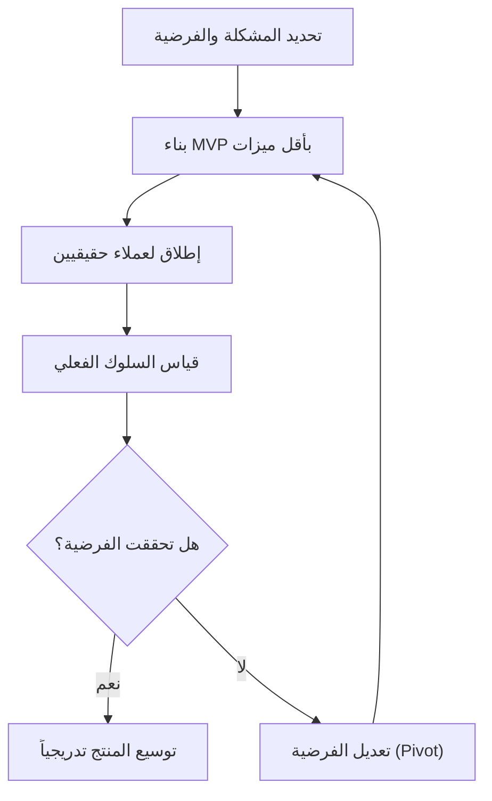

# المنتج الأولي القابل للتطبيق (MVP)

> [!info] تعريف مختصر
> المنتج الأولي القابل للتطبيق (Minimum Viable Product - MVP) هو أصغر نسخة ممكنة من المنتج تحتوي على الحد الأدنى من الميزات الكافية لحل مشكلة العميل الأساسية، بهدف اختبار الفكرة في السوق الحقيقي بأقل وقت وتكلفة قبل بناء نسخة كاملة.

## الشرح العلمي والاحترافي
- فكرة الـ MVP لا تعني "منتج ناقص الجودة"، بل تعني منتجاً كاملاً في نطاق ضيق جداً؛ أي أنه يعمل فعلياً ويحل مشكلة حقيقية، لكنه يفتقر إلى الميزات الإضافية غير الضرورية في البداية.
- الهدف الأساسي هو التعلّم بأسرع وقت: هل يريد الناس هذا المنتج فعلاً؟ هل نفهم المشكلة بشكل صحيح؟ بدلاً من افتراض الإجابة، يُطرح المنتج ويُقاس رد فعل المستخدمين الحقيقيين ([[Customer and Market Validation]]).
- يرتبط المفهوم بحلقة "ابنِ - قِس - تعلّم" (Build-Measure-Learn) من منهجية Lean Startup: تُبنى نسخة مصغّرة، يُقاس سلوك المستخدمين الفعلي (وليس آراءهم فقط)، ثم يُستخلص تعلّم يوجّه القرار التالي: الاستمرار، التعديل (Pivot)، أو التوقف.
- يقلل الـ MVP من هدر الوقت والموارد ([[Muda, Mura, Muri]])؛ فبدلاً من قضاء ستة أشهر في بناء منتج كامل قد يرفضه السوق، يُبنى إصدار في أسابيع قليلة لاختبار الفرضية الأخطر أولاً.
- يختلف MVP عن "النموذج الأولي" (Prototype) الذي قد لا يكون قابلاً للاستخدام الفعلي، وعن "الإصدار التجريبي" (Proof of Concept) الذي يثبت فقط أن الفكرة تقنياً ممكنة دون أن يستخدمه عملاء حقيقيون.

## أين ومتى يُستخدم
- يُستخدم غالباً في بداية حياة المنتج (Product Discovery)، وخصوصاً في الشركات الناشئة (Startups) وفرق المنتجات الرقمية التي تعمل بمنهجية أجايل ([[01 - Agile]]).
- يُلجأ إليه عندما يكون هناك شك كبير حول رغبة السوق في المنتج، أو عندما تكون الميزانية والوقت محدودين ويجب إثبات الجدوى قبل استثمار أكبر (مرتبط بـ [[Business Case]] و[[Go or No-Go Decision]]).
- يستخدمه مالك المنتج ([[05 - Product Owner]]) لتحديد أولويات الـ [[13 - Backlog]] بحيث تُبنى أولاً الميزات التي تُشكّل الـ MVP فقط.

## مثال وسيناريو تطبيقي
> [!example] سيناريو ملموس
> شركة ناشئة تريد إطلاق تطبيق لحجز مواعيد صالونات التجميل. بدلاً من بناء تطبيق كامل بخرائط، دفع إلكتروني، وتقييمات، يبني الفريق في 3 أسابيع فقط MVP يحتوي على: قائمة بسيطة بالصالونات، نموذج حجز عبر واتساب، وصفحة تأكيد.
> يُطلق المنتج لـ 5 صالونات فقط في حي واحد بمدينة الرياض. خلال شهر، يلاحظ الفريق أن 70% من طلبات الحجز تُلغى بسبب عدم وجود تذكير بالموعد.
> بناءً على هذا التعلّم، تصبح "التذكيرات التلقائية" أولوية الإصدار التالي، بدلاً من الميزات التي كان الفريق يظن أنها الأهم (مثل الدفع الإلكتروني)، والتي تبيّن أنها غير حرجة في هذه المرحلة.

## خطوات أو مخطّط
1. تحديد المشكلة الأساسية التي يريد المنتج حلّها، وتحديد شريحة عملاء ضيقة لاختبارها.
2. تحديد أقل مجموعة ميزات ممكن أن تحل هذه المشكلة (وليس كل الميزات المرغوبة).
3. بناء المنتج بسرعة، بجودة كافية للاستخدام الفعلي لكن دون إضافات غير ضرورية.
4. إطلاقه لعدد محدود من المستخدمين الحقيقيين وقياس السلوك الفعلي (ليس الآراء فقط).
5. تحليل النتائج واتخاذ قرار: الاستمرار بالتوسع، تعديل الفرضية (Pivot)، أو التوقف.

## ⚠️ مفاهيم خاطئة شائعة
> [!warning]
> - الظن أن MVP يعني "منتج رديء الجودة أو به أخطاء"؛ في الحقيقة يجب أن يعمل بشكل موثوق، فقط نطاق ميزاته أصغر.
> - الخلط بين MVP والنموذج الأولي (Prototype)؛ فالـ MVP يُستخدم فعلياً من عملاء حقيقيين، بينما النموذج الأولي غالباً للعرض فقط ولا يُستخدم إنتاجياً.
> - الاعتقاد أن بناء الـ MVP هو الخطوة الأخيرة؛ في الحقيقة هو بداية حلقة تعلّم مستمرة، لا حدث ينتهي بعد الإطلاق.

## ❌ ممارسات خاطئة في المشاريع
> [!failure]
> - إضافة "ميزة واحدة إضافية بسيطة" باستمرار حتى يتضخم الـ MVP ويفقد الغرض منه (يُعرف هذا بـ Scope Creep على مستوى المنتج، انظر [[Scope Creep]]). التجنب: الالتزام الصارم بقائمة ميزات محددة مسبقاً قبل البدء بالبناء.
> - إطلاق MVP دون تحديد مقاييس نجاح واضحة مسبقاً (KPI)، فلا يُعرف بعد الإطلاق هل نجحت الفرضية أم لا. التجنب: تحديد [[KPI]] أو معايير قبول واضحة قبل الإطلاق مثل "سنعتبر الفرضية صحيحة إذا استخدم 30% من المستخدمين الميزة أسبوعياً".
> - معاملة تعليقات عدد قليل من المستخدمين على أنها حقيقة مطلقة دون قياس كمّي كافٍ. التجنب: الجمع بين الملاحظات النوعية والبيانات الكمية قبل اتخاذ قرارات كبرى.

## 🔗 مصطلحات ومفاهيم ذات صلة
[[Customer and Market Validation]] | [[Business Case]] | [[Go or No-Go Decision]] | [[Scope Creep]] | [[Pilot Launch]] | [[Outcome vs Output]] | [[05 - Product Owner]] | [[13 - Backlog]] | [[Feedback Loop]] | [[01 - Agile]]
