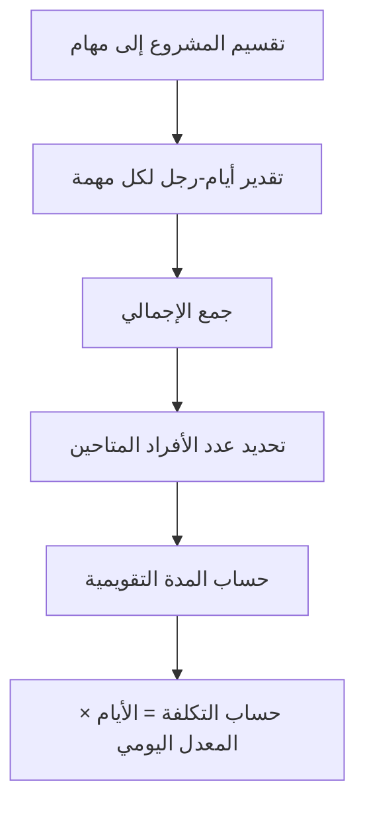

# يوم-رجل (Man-Day and Person-Day)
> [!info] تعريف مختصر
> يوم-رجل (Man-Day) هو وحدة قياس تمثّل كمية العمل التي يُنجزها شخص واحد في يوم عمل واحد (عادة 8 ساعات). يُستخدم لتقدير حجم الجهد المطلوب لإنجاز مهمة أو مشروع بأكمله.

## الشرح العلمي والاحترافي
- المصطلح "Person-Day" هو الصيغة المحايدة جندريًا الأكثر شيوعًا اليوم بدلًا من "Man-Day"، لكنهما يشيران لنفس المفهوم.
- الفكرة الأساسية: إذا احتاجت مهمة إلى شخصين للعمل يومين كاملين، فإن حجم الجهد يساوي 4 أيام-رجل (2 شخص × 2 يوم)، بغض النظر عن المدة الزمنية الفعلية (Duration) التي قد تكون أطول أو أقصر بسبب التوازي أو الانتظار.
- يجب التفريق بين "الجهد" (Effort) و"المدة" (Duration):
  - الجهد = مجموع أيام العمل المطلوبة من كل الأشخاص.
  - المدة = الزمن الفعلي على التقويم حتى انتهاء المهمة.
  - مثال: مهمة تحتاج 10 أيام-رجل يمكن إنجازها في 10 أيام بشخص واحد، أو في 5 أيام بشخصين، أو في يومين بخمسة أشخاص (نظريًا، مع تجاهل تكاليف التنسيق).
- يُستخدم يوم-رجل كوحدة أساسية لحساب التكلفة (Cost) عبر ضربه في معدل الأجر اليومي (Daily Rate)، وأيضًا لحساب الميزانية والقدرة الاستيعابية (Capacity) للفريق.
- من عيوبه المعروفة: لا يأخذ بعين الاعتبار فروق الإنتاجية بين الأفراد، ولا يعكس قانون "الشهر الرجل الأسطوري" (Mythical Man-Month) الذي يقول إن إضافة أشخاص لمشروع متأخر قد يزيده تأخرًا بسبب تكاليف التنسيق والتواصل الإضافية.

## أين ومتى يُستخدم
- في مشاريع Waterfall التقليدية وعقود الخدمات الاستشارية، لتقدير التكلفة والجدول الزمني في مرحلة التخطيط (Planning).
- في العقود القائمة على الوقت والمواد (Time & Material) لتحديد سعر العمل المتفق عليه.
- في إدارة الموارد (Resource Management) لحساب مدى استغلال الفريق وتوزيع المهام على الأشخاص المتاحين.
- أقل استخدامًا في الفرق الرشيقة (Agile) البحتة التي تفضّل نقاط القصة (Story Points) لتفادي ربط التقدير بالوقت الفعلي، لكنه يظل شائعًا في التقارير المالية وعقود العملاء حتى في المشاريع الرشيقة.

## مثال وسيناريو تطبيقي
> [!example] شركة برمجيات "تِرا سوفت" وقّعت عقدًا لتطوير موقع تجارة إلكترونية. قدّر مدير المشروع أن المشروع يحتاج 60 يوم-رجل إجمالًا: 20 يوم-رجل للواجهة الأمامية (Frontend)، 25 يوم-رجل للخلفية (Backend)، و15 يوم-رجل للاختبار (Testing).
> - إذا خصّص مدير المشروع مطورًا واحدًا للواجهة الأمامية بدوام كامل، ستستغرق تلك المهمة 20 يوم عمل تقويمي.
> - إذا خصّص اثنين، ستنخفض المدة إلى نحو 10 أيام عمل (بافتراض تعاون فعّال بلا تداخل).
> - معدل الأجر اليومي للمطور هو 150 دولارًا، فتكلفة المشروع الإجمالية من العمالة = 60 × 150 = 9000 دولار، وهو رقم يُستخدم مباشرة في عرض السعر (Quotation) المُرسل للعميل.

## خطوات أو مخطّط
1. تقسيم المشروع إلى مهام صغيرة قابلة للتقدير (راجع [[Task and Story Slicing]]).
2. تقدير عدد الأيام التي يحتاجها شخص واحد لإنجاز كل مهمة بمفرده.
3. جمع كل التقديرات للحصول على إجمالي أيام-رجل للمشروع.
4. تحديد عدد الأشخاص المتاحين (Capacity) وحساب المدة التقويمية المتوقعة.
5. ضرب إجمالي أيام-رجل في معدل الأجر اليومي لحساب التكلفة التقديرية.
6. مراجعة الرقم دوريًا مقابل التقدم الفعلي وتحديث تباين التقدير (راجع [[Estimation Variance]]).

## ⚠️ مفاهيم خاطئة شائعة
> [!warning]
> - الخلط بين "أيام-رجل" و"المدة الزمنية": 10 أيام-رجل لا تعني بالضرورة 10 أيام تقويمية، فقد تنجز أسرع أو أبطأ حسب عدد الأشخاص.
> - الاعتقاد أن مضاعفة عدد الأشخاص يُنصّف المدة دائمًا؛ في الواقع تنشأ تكاليف تنسيق وتواصل تقلل من هذا التسارع (خصوصًا في المهام المترابطة).
> - افتراض أن كل الأشخاص لديهم نفس الإنتاجية، بينما تختلف الخبرة والمهارة من شخص لآخر بشكل كبير.

## ❌ ممارسات خاطئة في المشاريع
> [!failure]
> - تقدير المشروع بأيام-رجل دون حساب [[Reserve Capacity]] أو احتياطي للمخاطر، مما يؤدي لتجاوز الميزانية عند أول عائق.
> - استخدام يوم-رجل كمقياس وحيد للأداء الفردي (كأن يُطلب من كل موظف "إنجاز يوم-رجل واحد يوميًا")، وهذا يشجّع على [[Micromanagement]] ويتجاهل جودة العمل.
> - عدم تحديث تقدير أيام-رجل بعد تغييرات النطاق (راجع [[Change Request]])، فيبقى العميل يتوقع تسليمًا بالجدول القديم رغم زيادة العمل الفعلي.

## 🔗 مصطلحات ومفاهيم ذات صلة
[[Original Estimate]] | [[Estimation Variance]] | [[Capacity]] | [[Reserve Capacity]] | [[Relative Estimation]] | [[Monte Carlo Simulation]] | [[SOW]] | [[TCO]] | [[12 - Story Points]]
