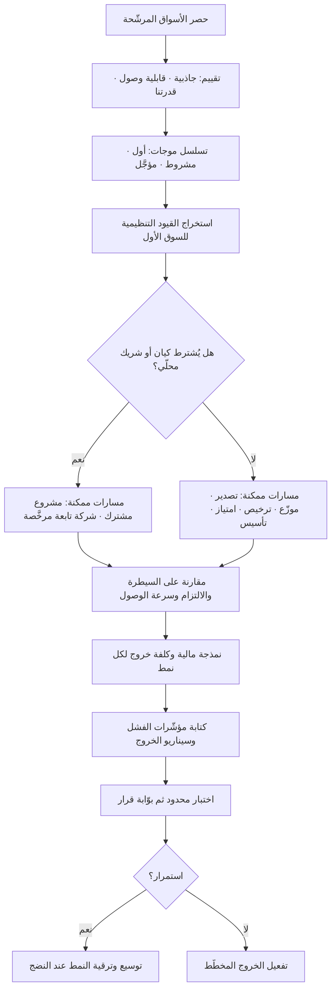

# أنماط دخول السوق (Market Entry Modes)

> [!info] تعريف مختصر
> الأشكال القانونية والتشغيلية التي تختارها المنشأة للعمل في سوق جديد، مرتّبةً على متّصل يبدأ من التصدير غير المباشر وينتهي بالتأسيس الكامل أو الاستحواذ. القاعدة الحاكمة لهذا المتّصل مقايضة واحدة: **كلما زاد الالتزام بالموارد ارتفعت السيطرة والعائد المحتمل، وارتفعت معه كلفة الخروج ودرجة المخاطرة**. ولأن اختيار النمط قرار مكلف ويصعب التراجع عنه، يسبقه منطقيًّا سؤال أسبق: **في أي سوق ندخل أصلًا وبأي ترتيب؟** — وهو ما يُعرف بترتيب محفظة الأسواق أو تحليل محفظة الدول (Country Portfolio Analysis)، وهو خطوة سابقة على اختيار النمط لا موازية له.

## الشرح العلمي والاحترافي
- **الخطوة السابقة: ترتيب محفظة الأسواق (Country Portfolio Analysis)**: قبل السؤال «كيف ندخل؟» يأتي «أين، وبأي ترتيب؟». الممارسة الشائعة تقارن الأسواق بحجم الطلب المطلق ونصيب الفرد من الدخل، وهذه مقارنة ناقصة لأنها تفترض أن كل سوق قابل للوصول بالدرجة نفسها. المقاربة الأنضج تُدخل ثلاثة مرشّحات إضافية: **الجاذبية** (حجم، نمو، هامش، مستوى المنافسة)، و**قابلية الوصول** (المسافة عن سوقك الأصلي بأبعادها الأربعة كما في [[CAGE Framework]]، والعوائق التنظيمية وقيود الملكية الأجنبية)، و**قدرتنا نحن** (هل لدينا مرجعية عملاء، لغة، شركاء، سيولة تحتمل دورة استرداد أطول؟). ناتج التحليل ليس «السوق الأفضل» بل **تسلسل موجات**: سوق أول، وأسواق موجة ثانية مشروطة بنتائج الأول، وأسواق مؤجَّلة صراحةً مع ذكر شرط إعادة النظر.
- **لماذا يسبق الترتيبُ اختيارَ النمط**: النمط المناسب يتغيّر بتغيّر السوق. الشركة التي تقرّر «سنعمل دائمًا عبر موزّع» قد تجد أن السوق الأهمّ في محفظتها لا يوجد فيه موزّع مؤهَّل أصلًا، أو أن التنظيم يشترط كيانًا محلّيًّا. القرار الصحيح هو: رتّب الأسواق أولًا، ثم اختر لكل سوق نمطًا يخدم دوره في التسلسل — فسوق الاختبار لا يُدخل بنمط ثقيل، وسوق يُراد أن يكون مركزًا إقليميًّا لا يُترك بيد وسيط.
- **المتّصل من الأخف إلى الأثقل**: (١) **التصدير غير المباشر** عبر وسيط تصدير دون علاقة مباشرة بالسوق — أقل التزامًا وأقل تعلّمًا؛ (٢) **التصدير المباشر** إلى موزّع أو وكيل محلّي؛ (٣) **الترخيص (Licensing)** لمنح حق استخدام الملكية الفكرية مقابل إتاوة؛ (٤) **الامتياز (Franchising)** وهو ترخيص موسّع يشمل النموذج التشغيلي والعلامة ومعايير التشغيل؛ (٥) **التحالف الاستراتيجي** بلا كيان مشترك؛ (٦) **المشروع المشترك (Joint Venture)** بكيان وملكية مشتركة؛ (٧) **الشركة التابعة المملوكة بالكامل (Wholly Owned Subsidiary)** إمّا بالتأسيس من الصفر (Greenfield) أو بالاستحواذ (Acquisition).
- **ثلاثة أبعاد للمفاضلة لا بعد واحد**: تُقارَن الأنماط عادةً بالكلفة فقط، والصواب مقارنتها على ثلاثة: **السيطرة** (على السعر، والعلامة، والعميل، وجودة الخدمة)، و**الالتزام** (رأس مال، أصول، عقود عمل، مدّة يصعب فكّها)، و**سرعة الوصول** (كم شهرًا حتى أول إيراد). لا يوجد نمط متفوّق على الثلاثة معًا؛ الاستحواذ أسرع وصولًا لكنه الأعلى التزامًا، والتصدير أخفّ التزامًا لكنه الأبطأ تعلّمًا والأقل سيطرة.
- **من يملك العلاقة بالعميل؟** هذا هو السؤال الاستراتيجي الخفي وراء الاختيار. في نمط الموزّع، بيانات العميل ودورة التجديد وتاريخ الشكاوى تبقى عند الوسيط؛ وحين تقرّر الشركة لاحقًا التحوّل إلى حضور مباشر تكتشف أنها تشتري سوقًا لا تعرف عنه شيئًا وأنها تدخل في نزاع مع شريك يملك العلاقات. لذلك تُصاغ عقود التوزيع الجادّة ببنود مشاركة بيانات وسقف مدّة وشروط إنهاء واضحة، تجنّبًا لصورة من صور [[Vendor Lock-in]] أشدّ كلفةً من ارتهان تقني.
- **القيود التنظيمية تحسم أحيانًا نيابةً عنك**: في قطاعات ودول عديدة يُشترط شريك محلّي، أو نسبة توطين وظائف، أو ترخيص قطاعي، أو استضافة بيانات داخل الحدود، أو تسجيل ضريبي قبل أول فاتورة. هذه القيود تحوّل «الاختيار» إلى مسار وحيد ممكن، ويجب استخراجها مبكرًا لأنها تغيّر الجدول الزمني بأشهر لا بأيام.
- **الترتيب ليس بالضرورة تصاعديًّا**: الافتراض الشائع أن الشركة تتدرّج من التصدير إلى التأسيس بالضرورة (وهو منطق «مراحل التدويل» التقليدي). لكن كثيرًا من الشركات الرقمية تولد عالمية منذ يومها الأول لأن كلفة التوزيع الحدّية قريبة من الصفر؛ وشركات أخرى تقفز مباشرة إلى الاستحواذ لأن الوقت هو المورد النادر لا المال. **التدرّج خيار لا قانون**، والاختيار يُبنى على طبيعة المنتج وسرعة إغلاق نافذة الفرصة.
- **كلفة الخروج جزء من قرار الدخول**: النمط الثقيل يعني أن الفشل يكلّف تصفية وتسريحًا والتزامات إيجار وربما مطالبات. لذلك يُكتب سيناريو الخروج مع خطّة الدخول: ما مؤشّرات الفشل؟ وما آلية التفكيك؟ وكم يستغرق؟ الشركات التي لا تكتب هذا مسبقًا تبقى في أسواق خاسرة سنوات لأن تكلفة الاعتراف أعلى نفسيًّا من كلفة الاستمرار المالية.

## أين ومتى يُستخدم
- **في دراسة الجدوى والتوسّع الإقليمي**: يُحدَّد النمط ضمن [[Business Case]] لأنه يغيّر جذريًّا احتياج رأس المال وزمن استرداده وحجم المخاطر المطلوب تحوّطها.
- **عند بناء خطّة الوصول إلى السوق**: النمط يُحدّد شكل القناة وهيكل الهامش وحدود التسعير، فلا يمكن إنجاز [[Go-to-Market]] قبل حسمه.
- **في تحليل السياق قبل التوسّع**: تُغذّي مخرجات [[PESTEL]] و[[CAGE Framework]] و[[Hofstede Cultural Dimensions]] ترتيب المحفظة، ثم يُشتقّ النمط من موقع كل سوق في الترتيب.
- **في التفاوض على عقود التوزيع والوكالة**: تُصاغ بنود الحصرية والمدّة وحدّ الأداء الأدنى ومصير العلاقات عند الإنهاء ضمن ممارسات [[Vendor Management]].
- **في إدارة مخاطر التوسّع**: يُسجَّل لكل نمط ملف مخاطر مختلف (مخاطر شريك، مخاطر امتثال، مخاطر عملة، مخاطر تشغيل) في [[Risk Register]] ويُقيَّم عبر [[Probability and Impact Matrix]].
- **عند التحوّل من نمط إلى آخر**: الانتقال من موزّع إلى حضور مباشر مشروع مستقلّ له نطاق ومخاطر وحوكمة، ويُدار عبر [[Change Request]] لا كقرار تجاري عابر.

## مثال وسيناريو تطبيقي
> [!example] شركة أردنية متخصّصة في أنظمة إدارة العيادات، لديها 340 عيادة عميلة في الأردن، تخطّط للتوسّع الخليجي بميزانية توسّع 4.5 مليون درهم.
> **ترتيب المحفظة أولًا:** بدل السؤال «كيف ندخل السعودية؟»، بدأ الفريق بتقييم ستّة أسواق (السعودية، الإمارات، الكويت، قطر، عُمان، البحرين) على ثلاثة مرشّحات. **الجاذبية**: السعودية الأكبر حجمًا بفارق واضح، الإمارات أعلى في متوسّط قيمة العقد، البحرين وعُمان أصغر بكثير. **قابلية الوصول**: تبيّن أن اشتراطات استضافة البيانات الصحّية داخل الحدود وترخيص القطاع الصحّي أثقل مما قُدّر في السعودية، وأخفّ نسبيًّا في الإمارات؛ كما أن للشركة ثلاثة عملاء إماراتيين وصلوها عبر الإحالة دون أي جهد بيعي. **قدرتنا**: الفريق ناطق بالعربية، لكن لا يملك خبرة تعامل مع جهات تنظيمية صحّية خليجية ولا سيولة تحتمل دورة استرداد تتجاوز 12 شهرًا.
> **الناتج:** الإمارات سوق الموجة الأولى رغم أنها ليست الأكبر — لوجود مرجعية عملاء وسرعة تأسيس أعلى؛ والسعودية موجة ثانية مشروطة بإنجاز الامتثال واستضافة البيانات؛ وقطر والكويت موجة ثالثة عبر شركاء؛ والبحرين وعُمان مؤجَّلتان صراحةً مع شرط مكتوب لإعادة النظر: «إن تجاوز الطلب الوارد غير المطلوب 15 استفسارًا مؤهَّلًا في الربع».
> **اختيار النمط لكل سوق:** في الإمارات اختير **تأسيس فرع بحدّ أدنى من الموظّفين** (مدير سوق + مهندس تطبيق + دعم) لأن السيطرة على العلاقة ضرورية في منتج طويل الدورة وعالي الالتزام؛ الكلفة التقديرية 1.9 مليون درهم سنويًّا. وفي السعودية اختير **مشروع مشترك** مع شركة تقنية صحّية محلّية تملك الترخيص القطاعي والبنية السحابية الممتثلة — نسبة 40/60 لصالح الشريك المحلّي، مقابل تقصير زمن الوصول من 14 شهرًا مقدَّرة إلى 5 أشهر. وفي قطر والكويت اختير **موزّع** بعقد سنتين وحدّ أداء أدنى (12 عقدًا سنويًّا) وشرط تسليم بيانات العملاء شهريًّا إلى الشركة الأمّ.
> **ما ظهر بعد 18 شهرًا:** الفرع الإماراتي حقّق 61 عقدًا وغطّى كلفته في الشهر الرابع عشر. المشروع المشترك السعودي أنجز الدخول سريعًا لكنه أنتج توتّرًا متوقّعًا حول أولويات خارطة الطريق (الشريك يريد تخصيصًا لعميل حكومي كبير، والشركة الأمّ تريد منتجًا موحّدًا) — وهو نزاع نمطي في هذا النمط، عولج بآلية تصعيد منصوص عليها في اتفاقية المساهمين. أما موزّع الكويت فلم يبلغ حدّ الأداء الأدنى (5 عقود فقط)، فجرى تفعيل بند الإنهاء في نهاية السنة الأولى — وكان ممكنًا فقط لأن بيانات العملاء كانت تُسلَّم شهريًّا، فانتقلت الحسابات الخمسة مباشرةً بلا انقطاع خدمة.

## خطوات أو مخطّط
1. حصر الأسواق المرشّحة كلّها أولًا، بما فيها ما تظنّه بديهيًّا وما تظنّه مستبعدًا — القائمة الطويلة تمنع التحيّز للسوق «الذي يتحدّث عنه الجميع».
2. تقييم كل سوق على ثلاثة مرشّحات: الجاذبية، قابلية الوصول، قدرتنا نحن — بأوزان معلنة ومكتوبة قبل التقييم لا بعده.
3. إنتاج تسلسل موجات لا ترتيبًا مسطّحًا: سوق أول، أسواق مشروطة، أسواق مؤجَّلة مع شرط إعادة النظر.
4. استخراج القيود التنظيمية الحاسمة لكل سوق في الموجة الأولى: الملكية الأجنبية، الترخيص القطاعي، توطين البيانات، المتطلّبات الضريبية.
5. لكل سوق، تقييم الأنماط الممكنة على السيطرة والالتزام وسرعة الوصول، بعد استبعاد ما تمنعه القيود.
6. نمذجة مالية لكل نمط مرشّح: احتياج رأس المال، نقطة التعادل، زمن الاسترداد، وكلفة الخروج.
7. كتابة سيناريو الخروج ومؤشّرات الفشل قبل التنفيذ، واعتمادها من مجلس الحوكمة.
8. تنفيذ اختبار محدود حيثما أمكن ([[Pilot Launch]]) قبل الالتزام الثقيل، وتحديد بوّابة قرار صريحة.
9. مراجعة النمط دوريًّا: النمط الصحيح للدخول قد يصبح خاطئًا بعد النضج، والانتقال يُدار كمشروع مستقلّ.

## ⚠️ مفاهيم خاطئة شائعة
> [!warning]
> - **«اختيار السوق واختيار النمط قرار واحد»**: دمجهما يجعل الشركة تبرّر سوقًا لأن النمط متاح، أو تفرض نمطًا موحّدًا على أسواق مختلفة. التصحيح: رتّب المحفظة أولًا بمعايير معلنة، ثم اختر لكل سوق نمطًا يخدم دوره في التسلسل.
> - **«السوق الأكبر هو السوق الأول»**: الحجم بلا قابلية وصول وهم. سوق ضخم تحرسه اشتراطات ترخيص وبيانات قد يستهلك سنتين قبل أول ريال، بينما سوق أصغر يمنح مرجعية وتعلّمًا وتدفّقًا نقديًّا يموّل ما بعده. التصحيح: قيّم الجاذبية وقابلية الوصول والقدرة معًا، لا الحجم وحده.
> - **«التوسّع يجب أن يتدرّج من التصدير إلى التأسيس»**: هذا نمط تاريخي شائع لا قانون. منتجات رقمية كثيرة تبدأ عالمية، وشركات تقفز إلى الاستحواذ حين يكون الوقت أندر من المال. التصحيح: اختر بحسب نافذة الفرصة وطبيعة المنتج، لا بحسب تسلسل نظري.
> - **«الموزّع يعني مخاطرة أقل»**: يقلّل مخاطر رأس المال ويزيد مخاطر أخطر: فقدان بيانات العميل، وتشويه العلامة، وضعف الخدمة، وبناء سوق يملكه غيرك. التصحيح: قِس المخاطرة على أبعاد متعدّدة لا على رأس المال وحده، واحمِ ملكية العلاقة تعاقديًّا.
> - **«المشروع المشترك حلّ وسط مريح»**: هو غالبًا الأصعب حوكمةً لأن فيه مالكَين لهما أفقان زمنيان وأولويات مختلفة، ونزاعات خارطة الطريق فيه القاعدة لا الاستثناء. التصحيح: احسم مسبقًا آلية اتّخاذ القرار، وحقوق الفيتو، وآلية فضّ الشراكة، وملكية الملكية الفكرية المشتركة.
> - **«الاستحواذ يشتري لنا السوق جاهزًا»**: يشتري عملاء وأصولًا، ولا يشتري اندماجًا ثقافيًّا ولا احتفاظًا بالكفاءات ولا توافق أنظمة. التصحيح: عامل ما بعد الاستحواذ كمشروع تكامل كامل الميزانية والمخاطر، لا كإجراء إداري لاحق.
> - **«قرار النمط نهائي»**: النمط الصحيح لمرحلة الدخول قد يصبح عائقًا بعد النضج. التصحيح: ضع منذ البداية شروط مراجعة وبنودًا تعاقدية تسمح بالترقية أو الفكّ بكلفة معلومة.

## ❌ ممارسات خاطئة في المشاريع
> [!failure]
> - **الخطأ: اختيار السوق بناءً على حماس تنفيذي أو علاقة شخصية، ثم بناء التحليل لتبريره.** لماذا يضرّ: يتحوّل التحليل إلى طقس شكلي، وتُخفى المخاطر الحقيقية حتى تنفجر بعد الإنفاق. الحل: اكتب معايير الترتيب وأوزانها واعتمدها **قبل** جمع البيانات، ووثّق الأسواق المستبعَدة وسببها في [[Decision Log]].
> - **الخطأ: توقيع عقد توزيع حصري طويل المدّة بلا حدّ أداء أدنى ولا بند إنهاء.** لماذا يضرّ: يُجمَّد سوق كامل بيد شريك غير فعّال لسنوات، ولا تملك الشركة حتى بيانات من يستخدم منتجها. الحل: حصرية مشروطة بأهداف كمّية سنوية، ومدّة قصيرة قابلة للتجديد، وتسليم دوري لبيانات العملاء بوصفه التزامًا تعاقديًّا.
> - **الخطأ: تأجيل فحص القيود التنظيمية إلى ما بعد إقرار الميزانية.** لماذا يضرّ: يُكتشف بعد الالتزام أن الملكية الأجنبية مقيّدة أو أن البيانات يجب أن تُستضاف محلّيًّا، فتنهار الجدولة وتُعاد هندسة الحل بكلفة مضاعفة. الحل: اجعل الفحص التنظيمي بوّابة إلزامية سابقة على اعتماد [[Business Case]]، بمشاركة مستشار محلّي لا اجتهاد داخلي.
> - **الخطأ: نقل هيكل التسعير والعقود كما هو إلى السوق الجديد.** لماذا يضرّ: تختلف حساسية السعر ودورات الدفع وتوقّعات الضمان والعملة، فتنشأ فجوة نقدية أو خسارة هامش صامتة عبر فروق العملة. الحل: أعد بناء التسعير والشروط محلّيًّا، واحسب أثر العملة والضرائب صراحةً في [[TCO]].
> - **الخطأ: عدم تعيين مالك واحد مسؤول عن السوق الجديد.** لماذا يضرّ: تتوزّع المسؤولية بين المبيعات والمنتج والعمليات فلا يملك أحد الصورة الكاملة، وتتأخّر القرارات الحاسمة أسابيع. الحل: عيّن مالكًا واضحًا بصلاحية قرار محدّدة، ووثّق حدودها ضمن [[Governance]].
> - **الخطأ: قياس نجاح الدخول بالإيراد وحده في السنة الأولى.** لماذا يضرّ: تُخفي أرقام الإيراد كلفة اكتساب غير مستدامة أو اعتمادًا على صفقة واحدة كبيرة، فتُتَّخذ قرارات توسّع على أساس مضلّل. الحل: قِس معه الاحتفاظ، وتنوّع قاعدة العملاء، وزمن استرداد الكلفة، ونسبة الإيراد المتكرّر، ضمن لوحة [[KPI]] معتمدة.
> - **الخطأ: عدم تعريف مؤشّرات الفشل وسيناريو الخروج قبل الدخول.** لماذا يضرّ: يستمرّ النزيف سنوات لأن إيقاف السوق يُقرأ داخليًّا كاعتراف بالفشل الشخصي. الحل: اكتب مؤشّرات الفشل وآلية الخروج ضمن الخطّة الأصلية، واجعل مراجعتها بندًا دوريًّا في [[Steering Committee]].

## 🔗 مصطلحات ومفاهيم ذات صلة
[[Go-to-Market]] | [[CAGE Framework]] | [[PESTEL]] | [[Hofstede Cultural Dimensions]] | [[Cash on Delivery]] | [[Translation Memory]] | [[Business Case]] | [[Vendor Management]] | [[Vendor Lock-in]] | [[Risk Register]] | [[Governance]]
